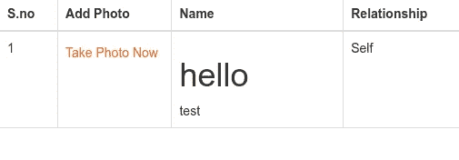

# 我是如何利用 XSS 的弱点成为一名医生的？

> 原文：<https://infosecwriteups.com/how-did-i-become-a-doctor-using-xss-vulnerability-bce190fc114a?source=collection_archive---------0----------------------->

嘿伙计们，我又一次带着新的报道回来了！！

对于所有不认识我的人，我是 Krishnadev P Melevila，网络安全研究员和谷歌认证的数字营销人员。你可以在谷歌上搜索我的名字。

[国家癌症研究所](https://unsplash.com/@nci?utm_source=unsplash&utm_medium=referral&utm_content=creditCopyText)在 [Unsplash](https://unsplash.com/s/photos/doctor?utm_source=unsplash&utm_medium=referral&utm_content=creditCopyText) 上拍摄的照片

在这里，我提到的目标是 example.com，因为我不能按照他们的政策透露目标的细节。

所以我们开始吧！！！

有一天我完全无聊了，然后我想到找一些 bug，每次我都会列举一些教育网站，比如 entri app，linways 等等。所以我想改变一下。所以我用谷歌搜索“医院管理系统”,来到了我的目标网站 example.com。

在该网站上，我们可以预约医院咨询和直接医生咨询。所以我去了个人资料部分，在那里我输入了“

# 你好

”而不是我的名字。呜哈！！是 HTML 注入！！！

但是等等！！！！既然 HTML 注入有机会，那么 XSS 也有机会！！！所以让我们好好利用它。我试着输入保存。它又被击中了！！XSS 引发了。！！

现在怎么办？是的 CSRF！！然后突然想预约。在 name 字段中，我输入了一个 csrf 脚本，它会窃取医生的会话 cookie，一旦医生看到我的预约，他/她的 cookie 就会被发送到我的远程服务器。

因此，如果我用这个 cookie 登录，我将作为一名医生登录，我可以看到其他患者的预约，并可以冒充医生参加咨询。

谢谢，阅读我的文章的朋友们，在 Instagram 上关注我的实时更新[https://instagram.com/krishnadev_p_melevila](https://instagram.com/krishnadev_p_melevila)

错误报告时间:2021 年 9 月 10 日

错误分类日期:2021 年 9 月 11 日

漏洞修补和赏金发布日期:2021 年 9 月 18 日