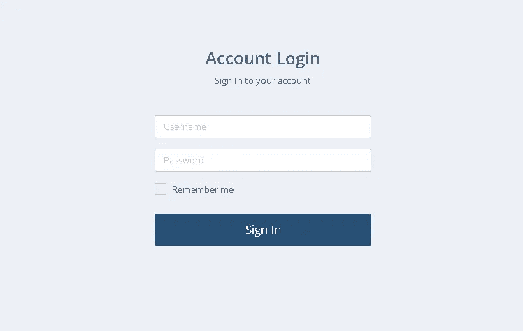
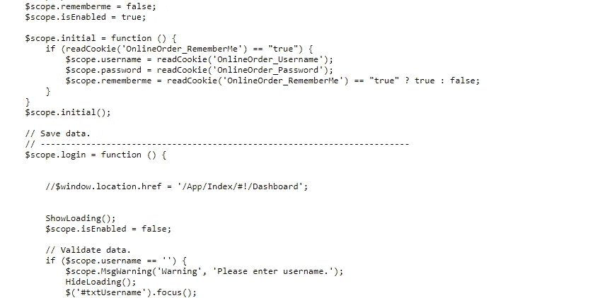
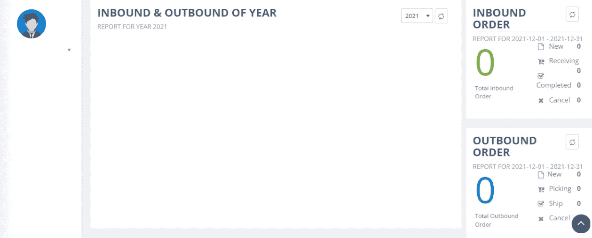
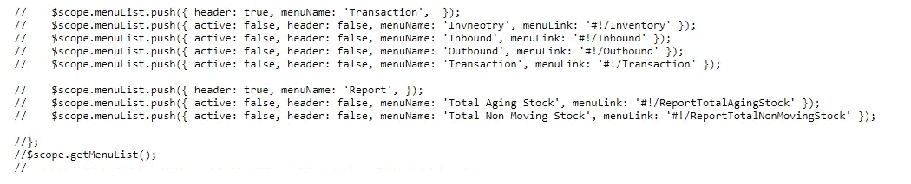
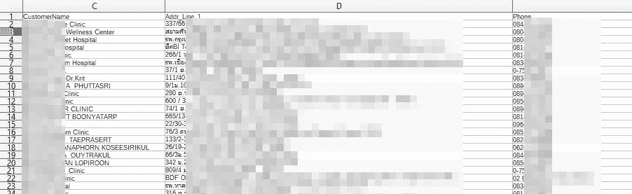
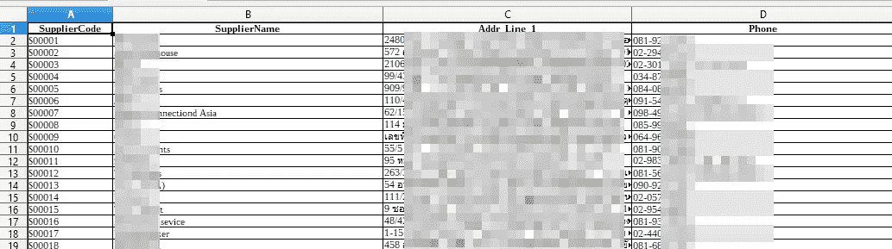

# 我是怎么泄露大公司 5.2k 客户资料的？(通过破坏访问控制)

> 原文：<https://infosecwriteups.com/how-did-i-leak-5-2k-customer-data-from-a-large-company-via-broken-access-control-709eb4027409?source=collection_archive---------1----------------------->

大家好！

今天我们来谈谈我几个月前发现的漏洞。该漏洞直接针对公司的客户和供应商，也是一家大型护肤品公司的子域。(此报告已解决，但我无法提供有关该公司的信息，因为它运行一个私人程序)我将尝试向您简要说明此漏洞。我希望我能为你的专有技术的发展做出贡献。所以让我们开始吧。

> **侦察兵没有死！**

首先，我在 crt.sh 上，在几次对其他子域名的黑客攻击失败后，我发现了这个子域名。子域只是一个员工面板，没有其他功能。它只介绍了登录面板。

(看起来挺直的。)

我在那个面板上运行 LinkFinder，从应用程序中找到了一些 JS 文件。其中一个 JS 文件赢得了我的优先权，因为文件名包含单词“login”。

href 部分很有意思。如果我们成功登录，它会将我们重定向到**的 App/Index/#！/仪表板'**。但是真的能控制吗？现在是测试被破坏的访问控制的时候了。

我没有登录就直接进入了 href 地址，并成功地访问了应用程序的仪表板！无需登录。

但这还不是全部。因为出了问题。应用程序仪表板未返回任何数据。我只能看到界面。一切都是零。

> **更多侦察得到结果&黑客时间到了！**

激动人心的部分来了。我需要更多的端点，因为 JS 文件不包含任何其他端点。我回到 Linkfinder，开始检查我找到的所有 JS 文件。不久，我到达了以下终点。

我尝试了几个端点，得到了一些“入站”和“出站”的结果。(这意味着客户和供应商。)

我碰到过这样的标签页，文件上传功能无效。但是,“下载模板”选项卡中的“客户”按钮是有效的。(同样，在 Inbound 中的“供应商”按钮)**答对了！**

我在应用程序中获得了所有(5200 多个)客户和供应商的 PII 信息。(两个 csv 文件都包含**客户代码、姓名、地址、电话**。)

我不得不下载并搜索以检查数据是否真实。我没有走得更远。

此报告被评定为高严重性，并在几个月前得到修复。这是我的推特:

[https://twitter.com/canmustdie/status/1471101658679681024](https://twitter.com/canmustdie/status/1471101658679681024)

目前就这些。感谢阅读。下次再见了！

你可以在推特上关注我:[https://twitter.com/canmustdie](https://twitter.com/canmustdie)