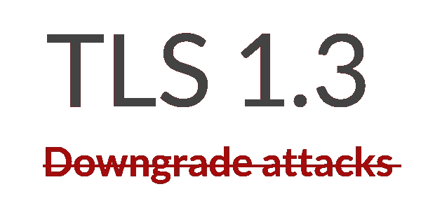

# TLS 1.3 如何防御降级攻击？

> 原文：<https://infosecwriteups.com/how-does-tls-1-3-protect-against-downgrade-attacks-e0e97ccc38d4?source=collection_archive---------0----------------------->

TLS 1.3 标准最终于 2018 年 8 月发布。作者试图解决 TLS 协议旧版本中不幸存在的问题。问题之一是缺乏对降级攻击的保护。

# 什么是针对 TLS 的降级攻击？

让我们假设 TLS 客户端和服务器都支持现代 TLS 协议版本(如 TLS 1.2)和具有强加密算法的密码套件。TLS 降级攻击的目标是欺骗客户端和服务器使用较旧的协议版本或 TLS 连接的不安全参数。在一次成功的降级攻击后，对手可能试图利用旧协议版本或弱加密算法中的已知(或未知)缺陷。降级攻击通常要求对手能够拦截和修改网络流量，这通常被称为中间人。这是一种非常强大的对手——普通人似乎不太可能实施这样的攻击。

有几个著名的降级攻击的例子，如狮子狗，怪胎和 Logjam。

通常，现代 TLS 客户端和服务器支持旧的协议版本和弱加密算法，以向后兼容旧的客户端和服务器。可以容易地应用于现代 TLS 实现的降级攻击的最简单和最可靠的缓解之一就是禁用不安全的协议版本和算法。但是尽管如此，由于兼容性问题，这种简单的缓解可能花费太多。

# TLS 1.3 提供了什么来防止降级攻击？

下面是 TLS 1.3 标准如何定义降级保护:

> *双方的加密参数应该相同，并且应该相同，就好像对等体在没有受到攻击的情况下一直在通信一样*

换句话说，一个好的降级保护机制确保客户端和服务器总是协商最安全的协议版本和加密参数，即使中间有坏人。

TLS 1.3 提供了两种防止降级攻击的措施。首先，它要求客户机和服务器都发送一个完成的消息，该消息包含一个覆盖所有先前握手消息的 MAC，因此客户机和服务器都确保协商的参数没有被攻击者中途修改。下面是 TLS 1.3 标准如何准确定义完成消息的内容:

```
finished_key =
       HKDF-Expand-Label(BaseKey, "finished", "", Hash.length)

   Structure of this message:

      struct {
          opaque verify_data[Hash.length];
      } Finished;

   The verify_data value is computed as follows:

      verify_data =
          HMAC(finished_key,
               Transcript-Hash(Handshake Context,
                               Certificate*, CertificateVerify*))

      * Only included if present.
```

`Certificate`和`CertificateVerify`消息仅在出现时包含在内。`finished_key`来源于一个协商好的握手秘密。

其次， [TLS 1.3 提供了降级保护机制，该机制嵌入在`ServerHello`消息中的服务器随机随机数](https://tools.ietf.org/html/rfc8446#section-4.1.3)中。如果 TLS 1.3 服务器发现只可能协商旧的协议版本，那么 TLS 1.3 要求将它们的`ServerHello.random`字段的最后 8 个字节设置为预定义的值之一:

*   如果协商 TLS 1.2，那么最后 8 个字节必须是`44 4F 57 4E 47 52 44 01`
*   如果协商 TLS 1.1 或更旧的协议版本，那么最后 8 个字节必须是`44 4F 57 4E 47 52 44 00`

然后，TLS 1.3 要求客户端必须检查接收到的`ServerHello.random`的最后 8 个字节是否不等于上面的任何一个值，如果是，则必须终止连接。

顺便说一下，上面字节序列的前 7 个字节表示“DOWNGRD”。换句话说，TLS 1.3 规范要求客户端和服务器的行为如下:

*   我是服务器，支持 TLS 1.3。我从一个客户那里得到一个连接，说它只支持 TLS 1.2 或更低版本。没关系，但我要把消息“DOWNGRD”放到我的`ServerHello.random`上。这将让客户知道我实际上支持较高的协议版本，但我被要求使用较低的版本。
*   我是客户端，我支持 TLS 1.3。在我的`ClientHello`消息中，我要求服务器使用 TLS 1.3。但是突然收到一条 ServerHello 消息，说服务器只支持 TLS 1.2 或更低版本。让我检查一下`ServerHello.random`是否包含“DOWNGRD”消息，如果是，中间有人试图对我们进行降级攻击，我们应该停止讨论。

如果中间的攻击者删除了来自`ServerHello.random`的“DOWNGRD”消息，这不会有多大帮助，因为客户端和服务器在密钥交换过程中使用`ServerHello.random`。服务器无论如何都将使用原始值，因此在这种情况下握手将会失败。

让我们希望 TLS 1.3 协议的所有实现都不会忘记实现那些针对降级攻击的措施。

附:这是给你的一个小作业。`ServerHello.random`包含 32 个字节。对于 TLS 1.3 连接，偶然随机选取“DOWNGRD + 00/01”的概率是多少？我们应该担心吗？

*原载于 2018 年 8 月 15 日*[*【blog.gypsyengineer.com】*](https://blog.gypsyengineer.com/en/security/how-does-tls-1-3-protect-against-downgrade-attacks.html)*。*

