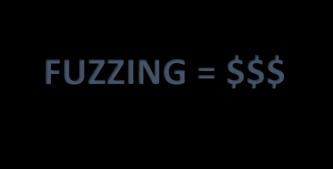
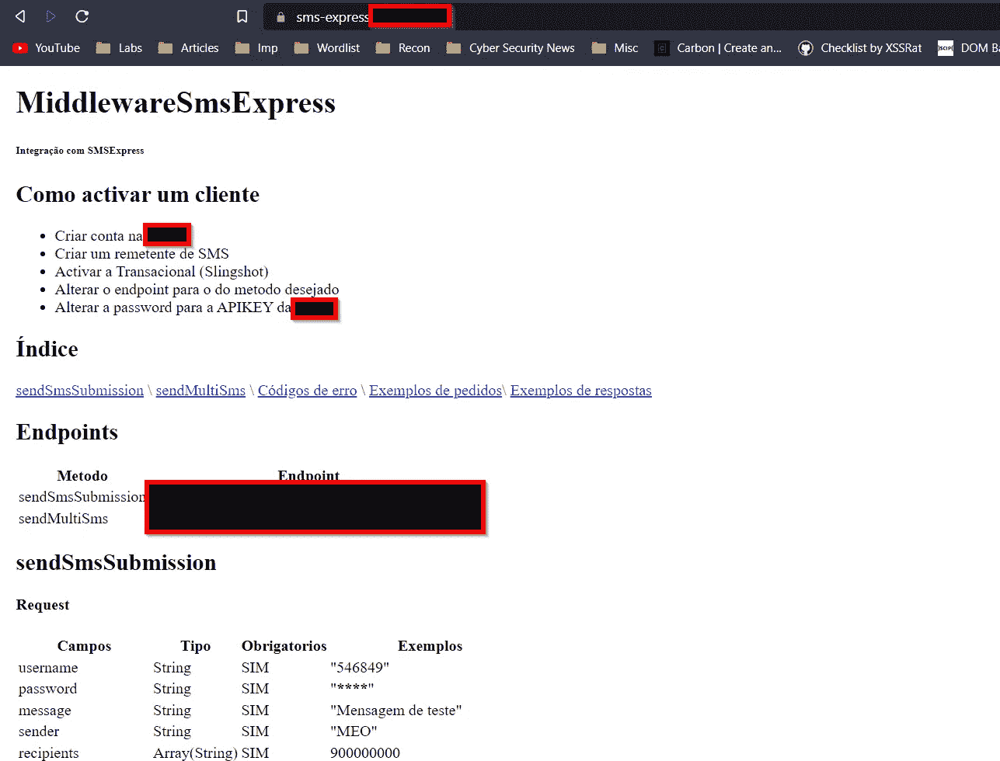
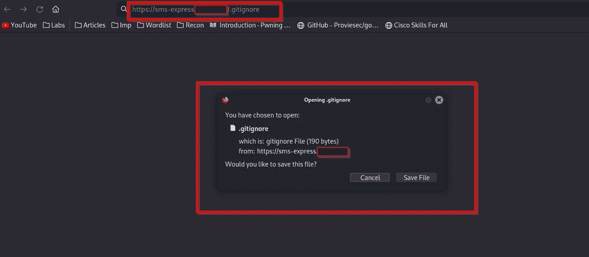
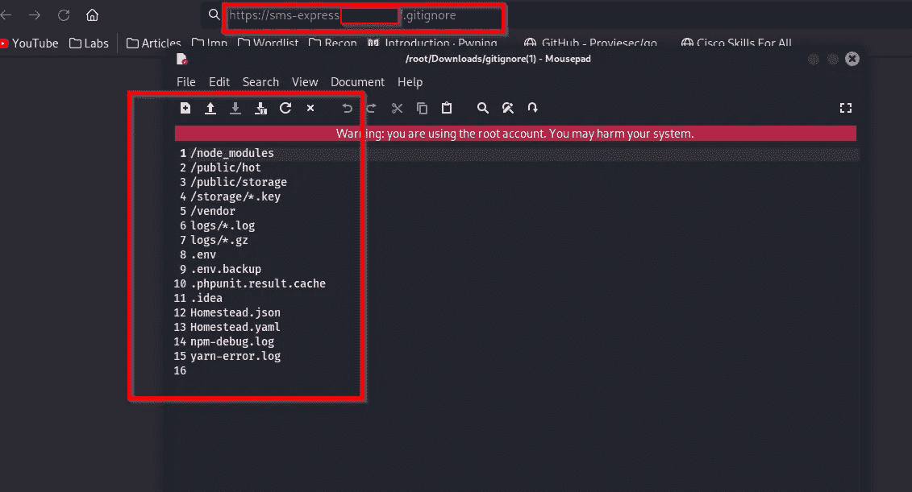
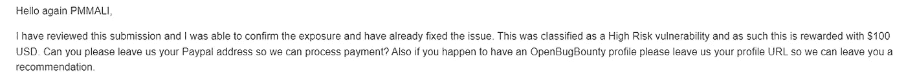

# Fuzzing 如何帮助我获得第一笔赏金？

> 原文：<https://infosecwriteups.com/how-fuzzing-helps-me-to-get-my-first-bounty-2c63eb864e08?source=collection_archive---------1----------------------->

大家好，

我是 [Praveen Mali](https://www.linkedin.com/in/praveen-mali/) (PMMALI)。这是我的第一篇文章，在这篇文章中，我将告诉你 fuzzing 是如何让我获得第一笔奖金的。

所以我测试了目标，比如说 target.com 和范围内的许多域和子域。在其中一个子域上，我看到了他们正在使用的默认短信服务页面。

突然，我的大脑触发我模糊的终点。
我用 [FFuF](https://github.com/ffuf/ffuf) 模糊了子域。
命令是:ffuf-w fuzz-bo0om . txt-u[https://sms-express.target.com/FUZZ](https://sms-express.target.com/FUZZ)-MC 200-AC-递归

我得到了一个端点的状态码 200，这个端点是. gitignore。

我用端点[https://sms-express.target.com/.gitignore](https://sms-express.target.com/.gitignore)在浏览器中打开 url，一个文件被下载。
有许多更敏感目录的路径。

我立刻报告了这个 bug，获得了 100 美元的赏金(我的第一笔赏金)。

我很高兴得到我的第一笔奖金。

特别感谢 [**Rohit Gautam**](https://www.linkedin.com/in/iamrohitg/) 先生和[**Shifa cycle wala**](https://www.linkedin.com/in/shifa/)女士。

非常感谢您的阅读🙏

我的 LinkedIn ID:[https://www.linkedin.com/in/praveen-mali/](https://www.linkedin.com/in/praveen-mali/)

我的推特 ID:https://twitter.com/pmmali_

## 来自 Infosec 的报道:Infosec 每天都有很多内容，很难跟上。[加入我们的每周简讯](https://weekly.infosecwriteups.com/)以 5 篇文章、4 个线程、3 个视频、2 个 GitHub Repos 和工具以及 1 个工作提醒的形式免费获取所有最新的 Infosec 趋势！