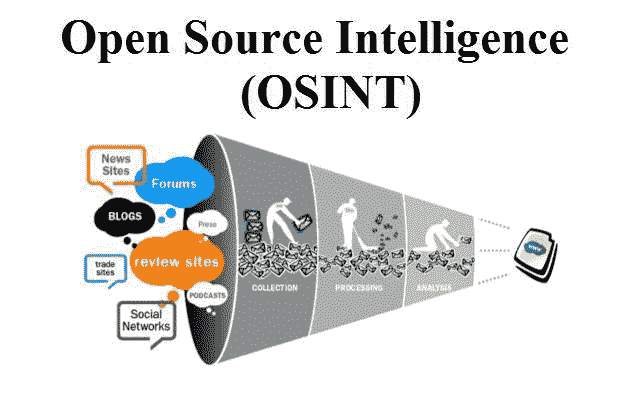
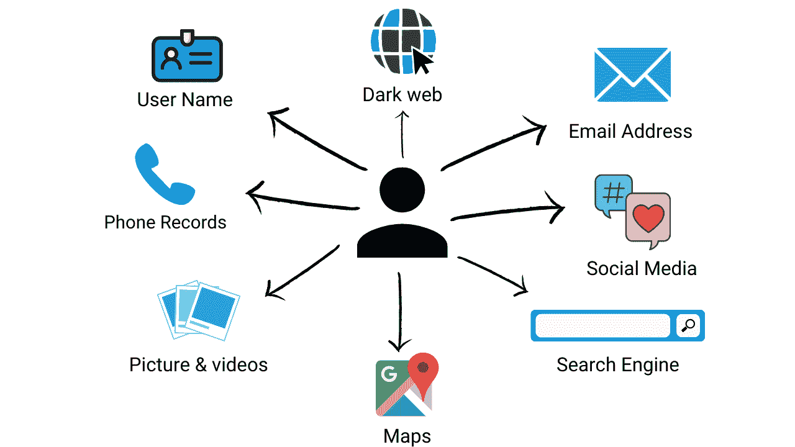

# 黑客如何改变生活

> 原文：<https://infosecwriteups.com/how-hackers-are-changing-lives-4659a834cb8b?source=collection_archive---------2----------------------->

这个问题流传很久了。黑客在世界上做的好吗？成千上万的黑客聚集在一起，把失踪的人带回家给他们所爱的人，而不是侵入医疗系统和政府办公室制造混乱！

"*黑客是思维不同的人；那些跳出框框思考的人，那些不被局限于条条框框的人*。

——罗伯特·塞尔，[痕迹实验室](https://www.tracelabs.org/)的创始人

# OSINT 的需求

不幸的是，随着每年世界各地成千上万的人失踪，一个令人悲伤的事实是，任何参与失踪个人案件的人都很快了解到，地球上失踪的人比可用于追踪他们的资产更多。

在这个需要的时刻，开源情报暗指从可自由访问和可用的来源收集数据。信息收集过程中收集的情报包括:

执法机构、网络专家，有时还有攻击者，使用 OSINT 程序来引导海量信息并追踪重要数据。

OSINT 对于寻找失踪人员来说是无价的。使用它的一个具体例子是，如果在社交媒体上发布的图片背景中发现了一个失踪的人。通过照片中包含的附加位置或附加信息，调查人员可以检查附近监控摄像机的镜头，以进一步调查此人的活动。

# **在执行寻找失踪人员的任务**

在大量报告的案件中，许多案件悬而未决。这些案件不仅仅是公开的档案；他们是真实的人。他们是儿子、女儿、父亲、母亲、祖父母，以及有面孔、名字和生活的朋友。当失踪人员仍然没有找到，它会让亲人担心，崩溃，没有结束。

[Trace Labs](https://www.tracelabs.org/) 是一家非营利组织，众包开源情报(OSINT)帮助当局寻找失踪人员。

通过将程序员、专家和互联网侦探爱好者的精明个性通过他们的开源情报(OSINT)场合联系起来，Trace Labs 帮助搜索失踪人口案件。

除了 Tracelab，其他组织也在做公共工作:

*   定位国际:[https://locate . International/](https://locate.international/)
*   通知凝固汽油弹:[https://informnapalm.org/en/](https://informnapalm.org/en/)
*   无辜生命基金会:[https://www.innocentlivesfoundation.org/](https://www.innocentlivesfoundation.org/)

# **填补空白**

为了建设一个更好、更安全的社会，我们需要组织之间更多的合作，因为无论我们在工作中做得多好，我们的知识和专业技能总会有差距。

如果使用得当，众包可以成为执法部门的有力工具。他们越来越大的活动证明，这种特殊的方法是可行的，也是有帮助的，因为世界各地的执法部门都在处理有限的预算，失踪人员案件很少成为优先事项。

一般来说，在信息安全领域，人们更倾向于传统的工作，往往忽略了与信息安全相关的工作的影响。但是成为一个在线调查的一部分可能是一个迷人的和改变生活的经历。

如果你觉得这是你感兴趣和有潜力的领域，你可以在这里[查看不同公司提供的多种工作。](https://www.osint-jobs.com/)

> **下期特写再见:)**

***推特简介:****@*[Dheerajmadhukar](https://twitter.com/Dheerajmadhukar)
***LinkedIn 简介:****@*[dheerajtechnolegends](https://www.linkedin.com/in/dheerajtechnolegends/)
***GitHub 简介:***[@ Dheerajmadhukar](https://github.com/Dheerajmadhukar/)

# 🔈 🔈Infosec Writeups 正在组织其首次虚拟会议和网络活动。如果你对信息安全感兴趣，这是最酷的地方，有 16 个令人难以置信的演讲者和 10 多个小时充满力量的讨论会议。查看更多详情并在此注册。

 [## IWCon2022 - Infosec 书面报告虚拟会议

### 与世界上最优秀的信息安全专家建立联系。了解网络安全专家如何取得成功。将新技能添加到您的…

iwcon.live](https://iwcon.live/)