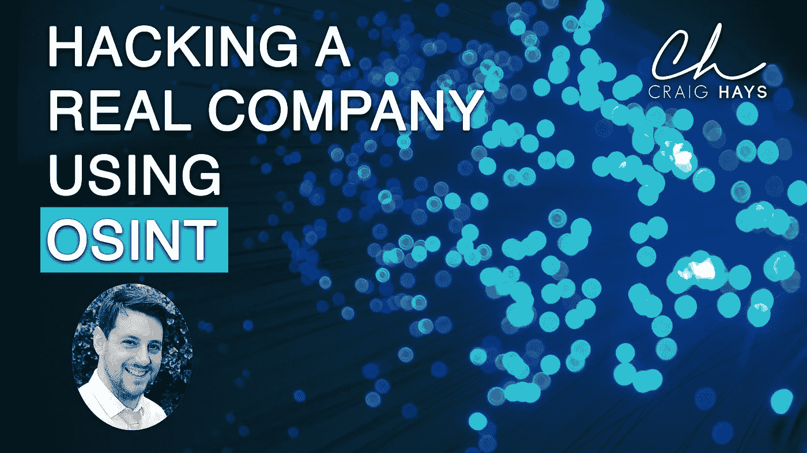

# 黑客如何利用开源情报勒索公司

> 原文：<https://infosecwriteups.com/how-hackers-use-open-source-intelligence-to-ransomware-companies-12946a8e6b04?source=collection_archive---------0----------------------->

向一家真实的公司展示黑客如何利用 OSINT 和社会工程在不到 2 小时的时间内攻破一个组织。

# 视频抄本

今天，我将演示网络犯罪分子如何使用开源智能创建有针对性的高效网络钓鱼电子邮件，从而为全公司范围的勒索软件攻击奠定基础。我将向您展示一个熟练的攻击者可以在不到两个小时的时间内获得什么样的信息，任何知道去哪里找的人都可以获得这些信息。

什么是开源智能？在我看来，只要你知道如何以及在哪里寻找，它就是你能在互联网上找到的任何东西。有很多工具和技术，但我最喜欢的是谷歌。

# 谷歌黑客

Google Dorking 或 Google hacking 是您使用精心设计的查询来查找特定信息的地方，这些信息永远不会出现在我们每天进行的标准搜索中。如您所见，添加搜索操作符(如 inurl 和 filetype)以及敏感关键字(如 password、secret 或 confidential ),可以返回各种有趣的结果。

在前两个例子中，我展示了亚马逊的 S3 简单存储服务和一个传统网站上泄露的密码文件。在那下面，我在代码托管网站 github.com 上搜索了短语“开始 RSA 私钥”和“AWS_SECRET”。您可以看到的凭证使您可以通过 VPN 访问某人的公司网络，并通过 API 访问某人的 Amazon web services 帐户。

在右下角，我用 Shodan 找到了可以从互联网上公开访问的 RDP 服务器。现在有人会暴力攻击所有这些。一旦他们进入，他们将在网络上有一个立足点，开始四处窥探，提升他们的访问级别，窃取数据，并在他们看到的任何东西上安装勒索软件。

但这实际上并不是大多数勒索软件攻击的开始。今天最常见的方法是用电子邮件。

# 通过网络钓鱼电子邮件进行勒索

电子邮件被设计成勾选所有正确的心理框，以确保收件人要么打开直接附加的文件，要么点击链接从网站下载文件。该文件包含恶意软件，最常见的形式是带有武器的 Office 宏。在 Office 文档中运行的 Visual basic 代码。

许多组织将 Office 配置为提示用户“启用内容”,以防止默认情况下运行宏。但是人们在每一个有宏的文档上都有这个按钮，所以他们每次看到它的时候就点击这个按钮。即使你把文本改成“执行恶意软件”，他们可能还是会点击它。

一旦他们点击该按钮，小型内置恶意软件就会执行，并从互联网上下载更大的恶意软件。这是一个后门程序，允许他们从互联网远程访问受损系统。从这里开始，他们还不如坐在电脑前。

# 钴罢工

Cobalt Strike 是一种工具，旨在让道德黑客模拟网络罪犯的攻击。它太棒了，以至于网络罪犯抛弃了他们的旧工具，开始自己使用它。

为了绕过您的公司保护，后门通过加密的 HTTP 请求 DNS 查询与命令和控制服务器通信。除非你使用安全的网络代理和 DNS 解决方案，否则这些会直接通过你的防火墙进入互联网。

安装了后门程序后，他们开始探查您网络，寻找提高他们访问全公司管理员权限的方法。然后，他们窃取您的数据，加密您的备份，最后加密他们能得到的一切。

# 黑掉一家真正的公司

不久前，一家名为 Tessian 的公司找到了我。他们让我向他们的客户演示网络罪犯如何使用开源情报来实施网络钓鱼和社会工程攻击。最终导致整个组织爆发勒索病毒的攻击。

我说“当然！只要我能把你当靶子。”

他们一开始有些犹豫…但是我答应在和任何人分享之前让他们看看结果。

# 对付目标的第一步——他们是谁？

当我接近任何目标时，不管是为了 bug 奖金还是其他，我做的第一件事就是看他们的公司网站，试图了解他们是谁，他们在做什么。

在他们的网站上，有一个非常有用的页面，上面有他们最资深的人的名字和照片。不仅仅是这三个人，而是所有人，包括他们的投资者。

我找到了一个页面，上面列出了他们所有的办公地点、联系电话以及支持和媒体的电子邮件地址。然后我看了一下他们的公共 DNS 记录。从这一点上，我可以看出他们在 Cloudflare 后面托管他们的网站。他们的电子邮件指向 Google Workplace，这很好，因为它告诉我他们可能会采取的控制类型。

然后我去了 accounts.google.com，在用户名栏里输入了 admin@tessian.com。当我点击“下一步”时，它将我重定向到一个品牌化的单点登录页面。这太神奇了。现在我有了一个品牌钓鱼网页的源代码，它与 Tessian 用户每天看到的网页一模一样。

然后我用一个叫做 Harvester 的开源工具在互联网上搜索电子邮件地址。它找到了几个地址，其中大部分是“无名氏”或用于客户支持和媒体咨询的公共地址，但其中一个是真实的人。它证实了该公司对员工邮箱使用 firstname.surname 格式。这是另一个伟大的发现。

有了这些信息，我所需要做的就是得到一份员工名单，我有每个人的电子邮件地址。LinkedIn 在这方面很棒，但如果你将搜索结果限制在“site: linkedin.com”并添加公司名称，谷歌会做得更好

我给营销团队的某个人发了一个愚蠢的问题，他们回复了，给了我一份官方邮件签名的复印件。

# 在公司内部寻找目标

有了这个关于公司如何运作的基本信息，我开始寻找目标个人和几乎可以保证成功攻击的方法。

Tessian 有一个 Instagram 账户。关注者不多，但照片很多。当我翻阅它们时，我了解到它们是狗的忠实粉丝。还有 Macbooks。

没有一台运行 Windows 的机器。我早就知道他们使用 Google Workplace。这意味着武器化的 Office 宏的传统攻击途径已经不存在了。

然后我看了看他们的职业页面，这个页面是从他们的 Instagram 个人资料链接过来的。在那里我找到了大量有用的信息。我了解到他们主要运行在 Amazon AWS 上，但他们刚刚开始了一个迁移项目，从 docker 迁移到运行在 Microsoft Azure 上的 Kubernetes。他们用 python 3 编写后端代码，用 React JavaScript 框架编写前端代码。

和往常一样，我在 Github 上查看了它们。我发现他们只有一个单一的代码库，在他们的组织中没有成员。但当我点击进入回购时，我可以看到 8 个人一直在做这件事，其中两个被标记为泰森的员工。

# 把所有的放在一起

我做的第一件事就是注册了一个看起来很像的域名。谢天谢地，Tessiam.com 是可用的，改变 n 到一个 m，乍看起来很不明显。然后，我注册了一个 Google workplace 账户，以便从与他们相同的基础设施上发送电子邮件。

我收到的第一封钓鱼邮件来自首席技术官艾德·毕肖普。

“你好，John，我知道你最近一直在开发 catapult AWS 部署工具。我一直在尝试运行一些部署审计工具，但我无法让它们工作。你能不能用你的账户试试这个，让我知道它对你是否有效？”

然后有一个链接指向一个 python 工具，该工具抛出一个奇怪的错误，并从他的本地机器上窃取他的 AWS 凭证。

第 2 封网络钓鱼电子邮件，由 John 发送给 Jane，同样使用带有 M 基础架构的 Tessiam。

“嗨，简，我觉得我快疯了..我整个早上都在尝试运行这个脚本，但没有成功。我的 Macbook 上没有需要安装的依赖项，python 3 也是最新的…我甚至尝试在新的虚拟机上全新安装…

你能帮我一下吗？在 Mac 上运行时会发生什么？"

然后是一个 python 脚本的链接，在她的 Macbook 上安装了 Cobalt Strike 后门后，该脚本抛出了一个随机错误。

总投资，不到两个小时，比麦当劳的两人晚餐还便宜。

# 那么我们能做什么呢？

首先，把基础打好。修补一切，设置强密码，启用 MFA，从域管理或其他公司范围的管理组中删除所有人。运行网络钓鱼模拟测试并提供安全意识培训。创建不能被在线系统更改的离线备份，并定期测试它们。安装防病毒和端点检测及响应工具。防火墙关闭一切，使攻击面尽可能小，甚至在您的网络内部。

网络安全是 80%做正确的事，20%做聪明的事。如果你没有把基本的东西做好，做花哨的东西是没有意义的。

永远假设你会妥协。将更多精力放在检测问题上，最大限度地减少单台受损 PC 或笔记本电脑可能造成的损害。尽可能长时间地控制疫情。即使你所做的只是拖延时间，你也在为自己争取更多的时间做出反应，在事情变得太严重之前停止一切。据我所知，在不到一个小时的时间里，从网络钓鱼邮件到一个完全勒索软件的公司，攻击已经发展到了[。](https://medium.com/swlh/phishing-email-to-company-devastating-ransomware-in-5-hours-c914687ecbbc)

最后，勒索你自己。嗯……不尽然。我做的一项练习是浏览最近发布的已披露违规事件报告，看看我的控制措施能承受多长时间的攻击。最近泄露的孔蒂集团攻击战术手册是这种桌面演习的一个很好的资源。我利用这些攻击的反馈来加强控制，然后再做一遍。

真正的勒索软件攻击是你所能得到的最准确的测试。自己动手，小心翼翼(不要真的弄坏东西——确保你在动手之前明白自己在做什么)，这是最接近真相的方法，而不需要最终真的花掉比特币。

# 摘要

总结一下，这些攻击是会发生的，所以最好做好准备。最重要的是做好基础工作，防止容易的攻击危及你的安全。并尽可能地使其难以获得第一个立足点。

但是，期待有一天这个立足点会出现，当它出现时，准备好遏制它，发现它，并做出适当和迅速的反应，以尽量减少它造成的损害。来阻止它的蔓延和失控。

[加入我私人邮件列表中的其他人，了解我的最新文章、视频、想法等等。](https://craighays.com/newsletter-medium-signup)