# 我如何滥用文件上传功能来获取 Bug Bounty 中的高严重性漏洞

> 原文：<https://infosecwriteups.com/how-i-abused-the-file-upload-function-to-get-a-high-severity-vulnerability-in-bug-bounty-7cdcf349080b?source=collection_archive---------0----------------------->

大家好，最有趣的功能之一是文件上传，文件上传中的漏洞通常会导致严重或高严重性，所以让我们从我在 bug bunting 时遇到的这个场景开始

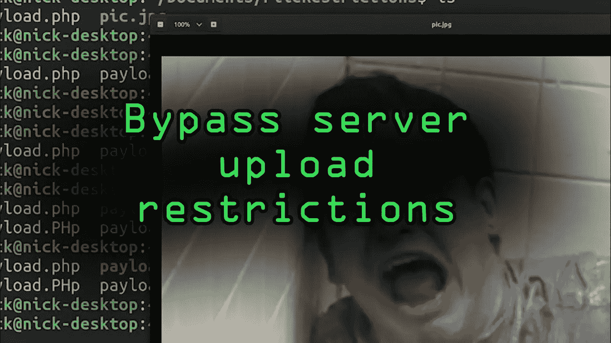

让我们考虑我们的目标领域是 target.com

在寻找我们的目标时，我偶然发现了子域 edu.target.com，该程序提供的服务是一个教学平台，因为有不同类型的用户，如学生和教师，他们旨在帮助学生学习技术相关的主题，如软件工程机器人等…

# 让我们开始我们的故事

我遇到了上传功能，试图上传一张图片来分析该功能是如何工作的

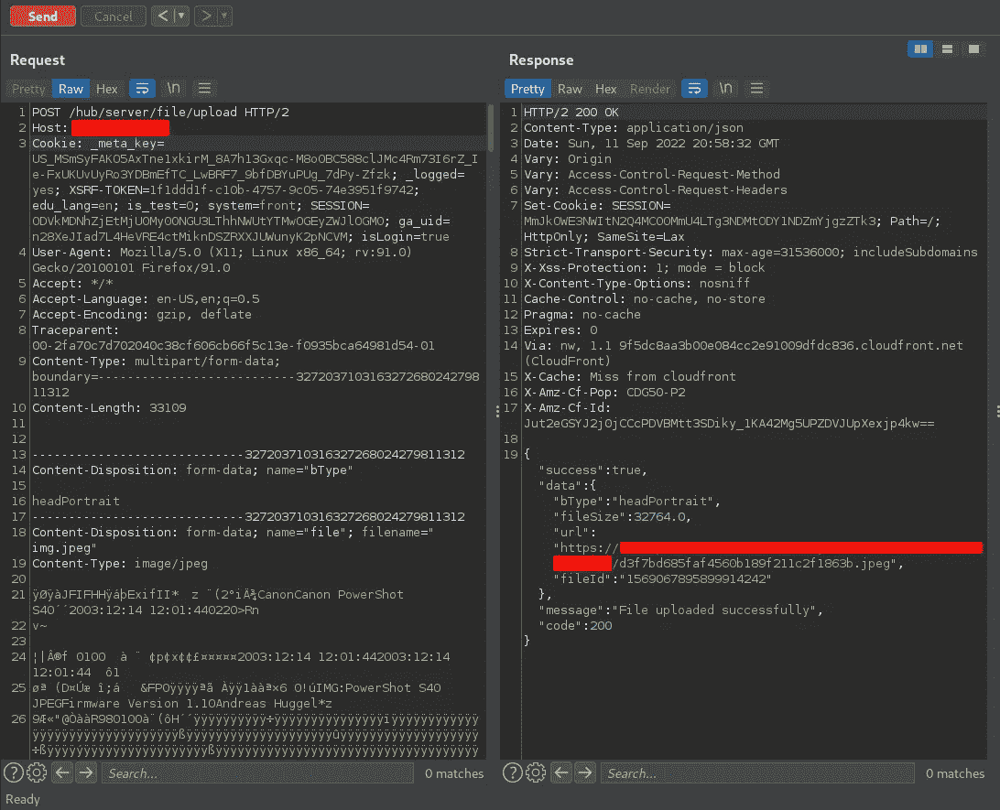

让我们试着上传 PHP 脚本

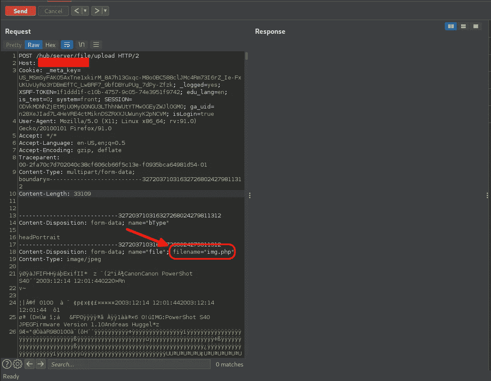

我发现服务器没有响应

在对应用程序的行为进行了一些分析之后，我发现如果请求没有通过验证，连接将被关闭，服务器将不会响应请求

现在让我们试着绕过 php 扩展的验证

让我们首先通过尝试上传随机扩展来判断应用程序是否正在进行白名单或黑名单验证。如果上传成功，则意味着应用程序正在进行黑名单验证。如果没有，则意味着应用程序正在对特定扩展进行白名单验证

我试着上传图片。奥马尔

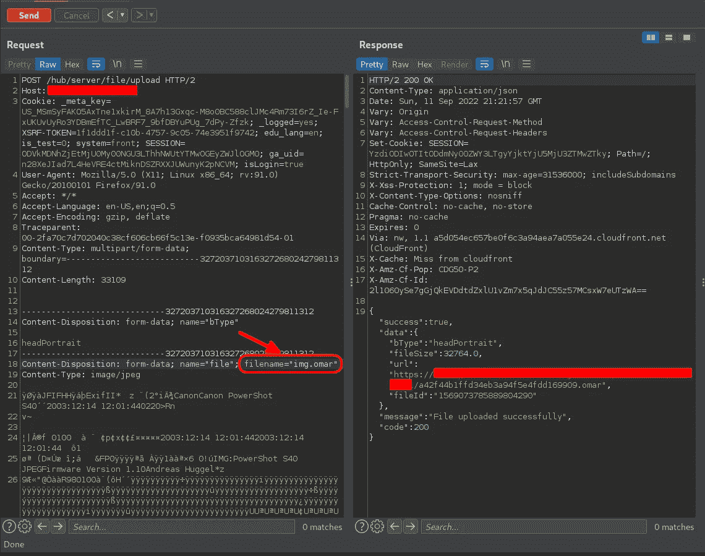

文件已成功上传，这意味着应用程序正在进行黑名单验证

所以我试图用 rce.pHp 绕过验证

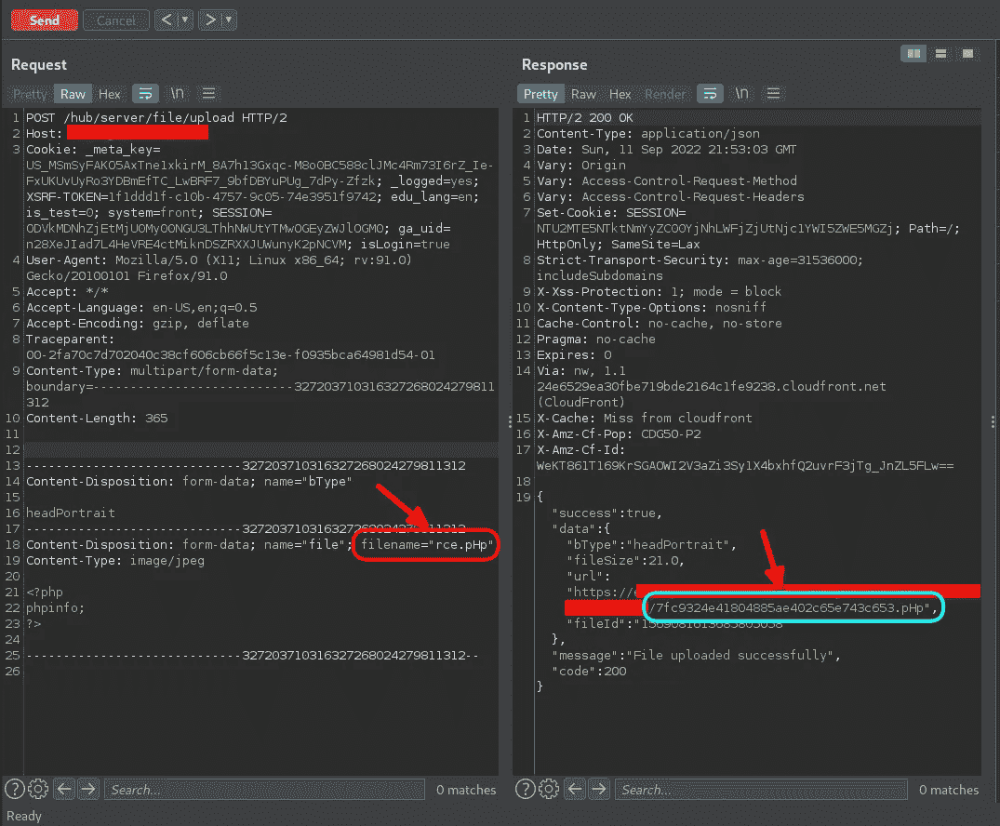

上传成功

此时，我正期待着几天后我的银行账户里会出现 5000 美元的奖金

因此，让我们请求我们的 PHP 脚本执行 phpinfo()函数

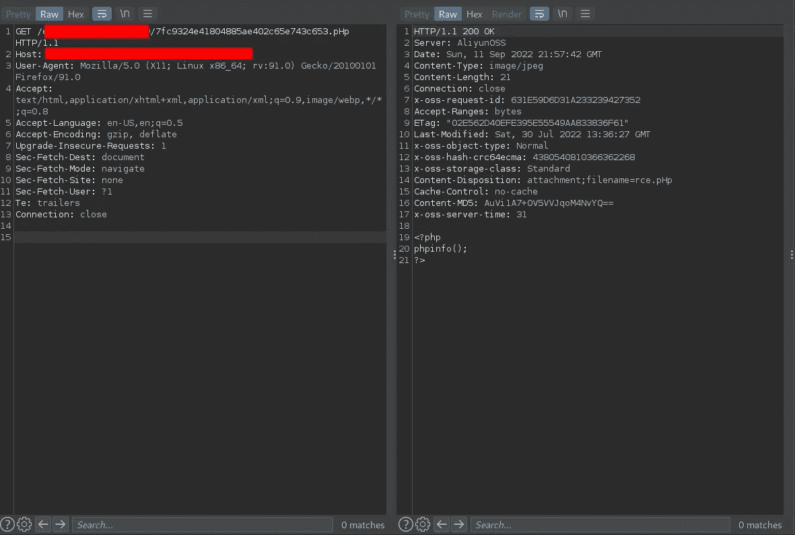

rce.pHp 没有被处决

因此，当时我想到的是，我们似乎能够绕过黑名单验证，但开发人员遵循安全设计，阻止我获得 RCE

这可以通过几种方式实现，其中之一是将此标志添加到。htaccess 文件，它将使服务器不执行图像上传目录中的 PHP 文件

> php_flag 引擎关闭

以防你不知道什么是。htaccess 文件

## 注意:

> 。htaccess 文件是分布式配置文件，它提供了一种在每个目录的基础上进行服务器配置更改的方法，我希望开发人员在图像上传目录中使用它来防止 RCE

根据这个，我想到了两个场景

# 重写配置和路径遍历:

## 第一种情况:

**注意:让我们假设我的图像的端点是:**

**https://target-domain . com/edu/sub-dir-1/sub-dir-2/sub-dir-3/our-image-此处**

## 1.1

> 可能开发者上传了他们的”。htaccess“文件在**子目录-1** /目录中，因此根据这个目录，**子目录-1** /目录和子目录(包括我上传 php 脚本的目录)无法运行 php 脚本，因此我们可以通过上传不同的文件来利用这种错误配置”。htaccess”文件在**子目录-1** / **子目录-2** / **子目录-3** /上。这种配置允许我更改子目录-3/上的配置，允许我执行 php 脚本

允许运行 php 脚本的配置

> php_flag 引擎开启

## 1.2

> 好吧，也许开发者没有做这种错误的配置，而且已经上传了。我的目录下的 htaccess 文件**子目录-1** / **子目录-2** / **子目录-3** /。htaccess 在这种情况下我会重写。通过上传文件名来访问文件。htaccess 与以前的配置，这将允许我执行 php 脚本

但不幸的是，我记得文件名被重写，以防我们上传。htaccess 将被重写为/sub-dir-1/sub-dir-2/sub-dir-3/32-random-characters . htaccess，这对服务器配置没有影响

## 第二种情况:

## 2.0

> 在第二个场景中，我们将通过对 filename 参数进行路径遍历来测试它，以防第一个场景失败。阻止我的 php 脚本执行的 htaccess 文件，所以我的文件将被上传到另一个目录，而不是在阻止 php 脚本执行的配置下[https://target-domain.com/edu/edu/32-random-chars.pHp](https://target-domain.com/edu/edu/32-random-chars.pHp)

众所周知，开发人员从文件名中提取一个扩展名，并将其放入端点扩展名中，因此开发人员可能会使用弱正则表达式，在点之后提取任何内容，并将其放入端点扩展名中，这样我们就可以通过添加一个点来绕过它。)然后使用路径遍历有效负载将我们的脚本上传到另一个目录

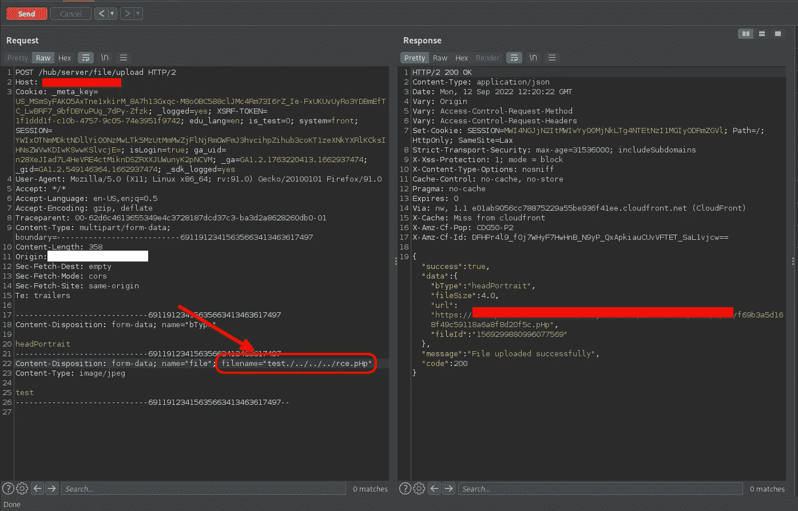

不起作用，因为正如你所看到的，开发人员似乎以正确的方式实现了正则表达式验证(如果他们使用了它，而没有使用内置函数，如 php 函数 pathinfo())

# SQL 注入:

开发人员在上传我们的图片时需要将每张图片与其用户联系起来

## 那么他们如何做到这一点呢？

正确，使用数据库

如你所见，开发人员也在某处保存了我们的文件名参数

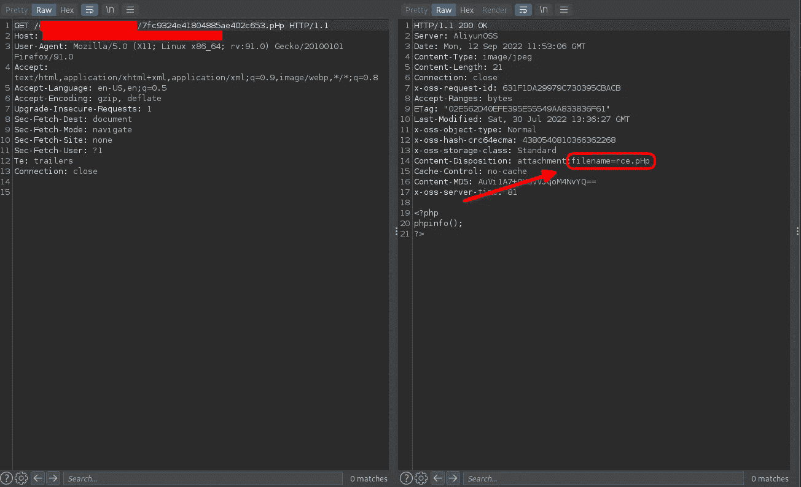

所以下一步测试 SQLI 的文件名参数，我使用了 burp 套件扫描仪

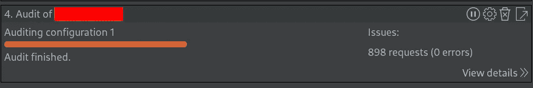

但是一无所获

# 公共利用:

但是也许开发者在上传功能中使用了一个库来处理上传的图像，这可能是易受攻击的

所以我开始测试一些常见库的漏洞，比如 image quarterly，它利用了 ImageMagick 库

CVE-2016–3714，CVE-2016–3718，CVE-2016–3715，CVE-2016–3716，CVE-2016–3717

你可以在这里找到功勋[【https://imagetragick.com/】T2](https://imagetragick.com/)

但也不太管用，所以如果我无法获得关键漏洞，那么让我们尝试获得高严重性漏洞

# 存储-XSS:

## **第一个场景:**

通过上传包含我们的 XSS 有效载荷的 SVG 图像，开始测试存储的 XSS

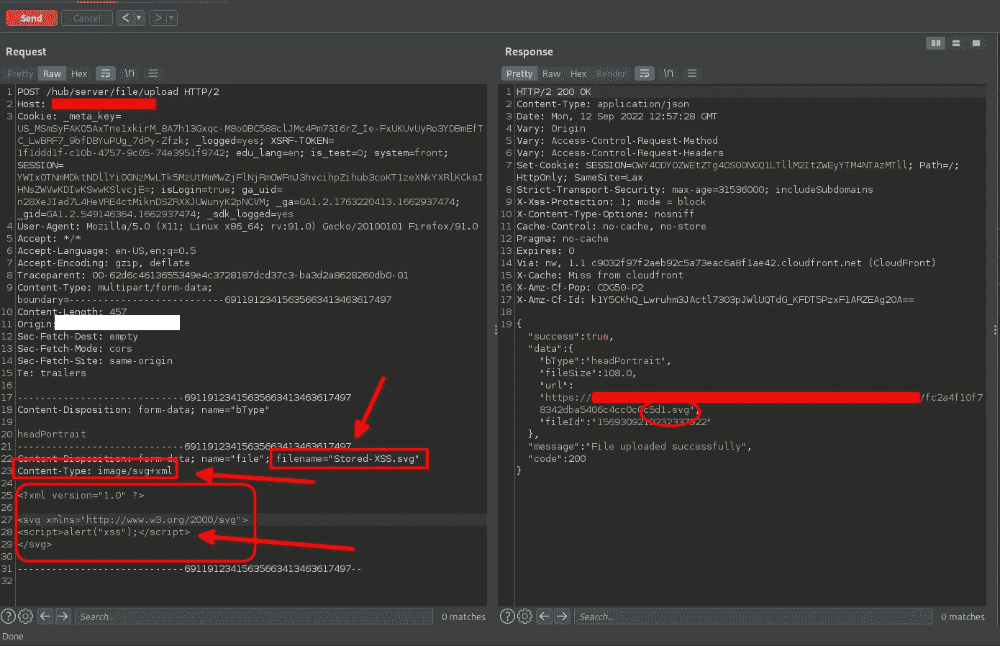

让我们请求我们的 svg XSS 有效载荷

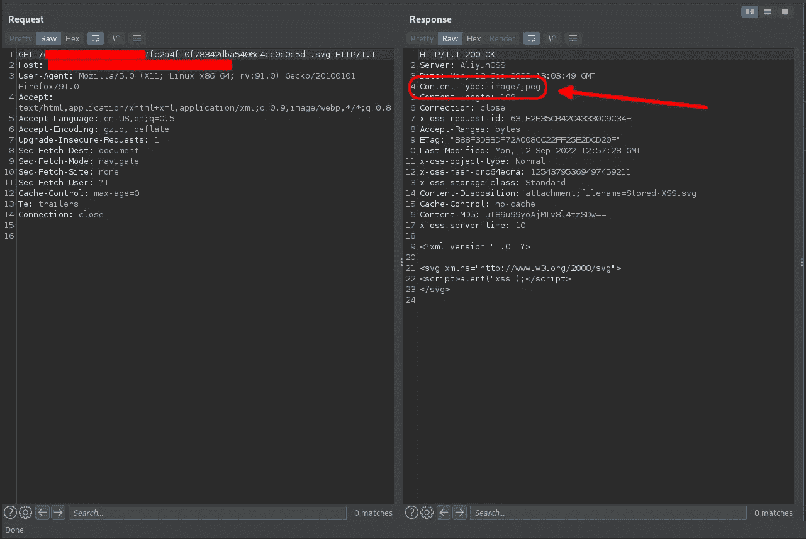

但不幸的是，应用程序响应强制内容类型:图像/jpeg，所以我们不能以这种方式实现 XSS

## 第二种情况:

**在**[**https://edu.target.com/teacher/profile-id**](https://target.com/techer/profile-id)

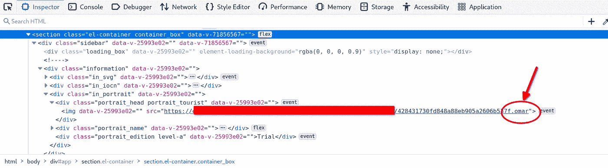

正如我之前告诉您的，服务器端将扩展名放在图像名称中

因此，似乎 filename 参数中的扩展名是注入 XSS 有效负载的最佳位置

`XSS.omar" onmouseover=alert(1)`

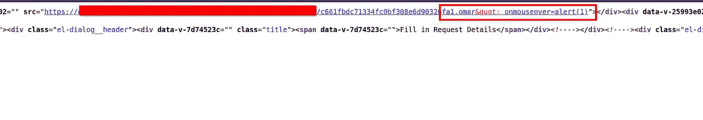

但是他们似乎在为我们的有效载荷做 HTML 实体编码，所以我们不能逃脱双引号

# 应用级 DOS 攻击:

该应用程序在客户端验证图像大小，只允许上传小于 1 MB 的图像

因此，我尝试通过上传一个大图像来获得 DOS，所以我只使用了一个大小超过 1 MB 的图像来测试服务器端是否有大小验证，但连接再次关闭，服务器没有响应，这意味着有一个图像大小验证来防止这种类型的攻击

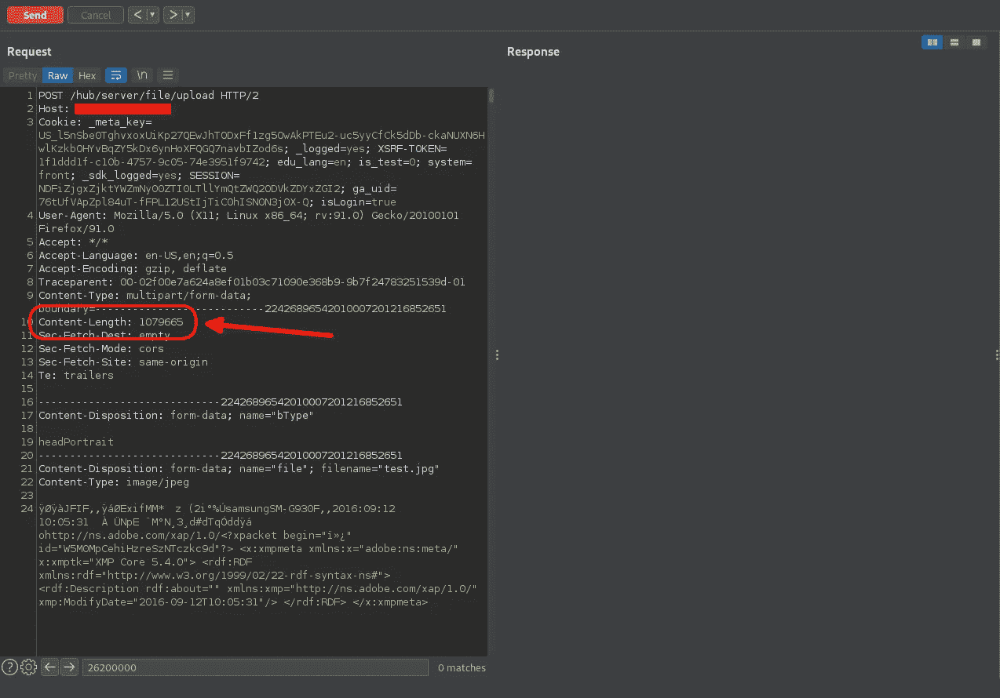

# 信息披露:

但是我注意到我的有效载荷没有改变，这意味着如果我上传一张图片，图片中的所有元数据都不会改变

好了，是时候射出最后一颗子弹了

所以我上传了包含 GPS 定位数据的图片

可以在这里找到[https://github . com/ianare/EXIF-samples/blob/master/jpg/tests/67-0 _ length _ string . jpg](https://github.com/ianare/exif-samples/blob/master/jpg/tests/67-0_length_string.jpg)

将图片上传到网络应用程序后，我再次下载它，检查地理位置数据是否有条纹

我们可以使用 ExifTool 提取元数据来进行检查

> ┌──(omar㉿kali)-[~/downloads]
> └─$ EXIF tool/downloads/EXIF-test . jpg

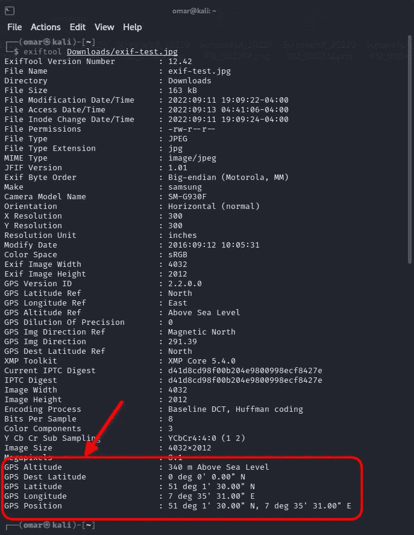

因为 web 应用程序似乎没有从图像中剥离地理位置数据

在报告这一情况后，由于教育平台的大多数用户是未成年学生，这种信息披露侵犯了他们的隐私，安全团队将其作为 P2 接受

# 建议的修复:

1-从 ImageMagick 下载最新版本

2-使用 stripImage()方法从图像中剥离元数据

> $imageFilePath = '上传的图像'；
> $ img = new imagick()；
> $ img->readImage($ imagefile path)；
> $ img->strip image()；
> $ img->write image($ imagefile path)；
> $img- >销毁()；
> ？>

希望你喜欢写文章的人

如有任何问题，请通过 Linkedin 或 Twitter 联系我

推特: [@OmarHashem666](https://twitter.com/OmarHashem666)

# 保持联系:

[**Linkedin**](https://www.linkedin.com/in/omar-1-hashem)**|**[**Youtube**](https://www.youtube.com/channel/UCJ1yNtgZP5LRO7ebZXSnAZQ/videos)**|**[**Twitter**](https://twitter.com/OmarHashem666)

## 来自 Infosec 的报道:Infosec 每天都有很多内容，很难跟上。[加入我们的每周简讯](https://weekly.infosecwriteups.com/)以 5 篇文章、4 个线程、3 个视频、2 个 Github Repos 和工具以及 1 个工作提醒的形式免费获取所有最新的 Infosec 趋势！