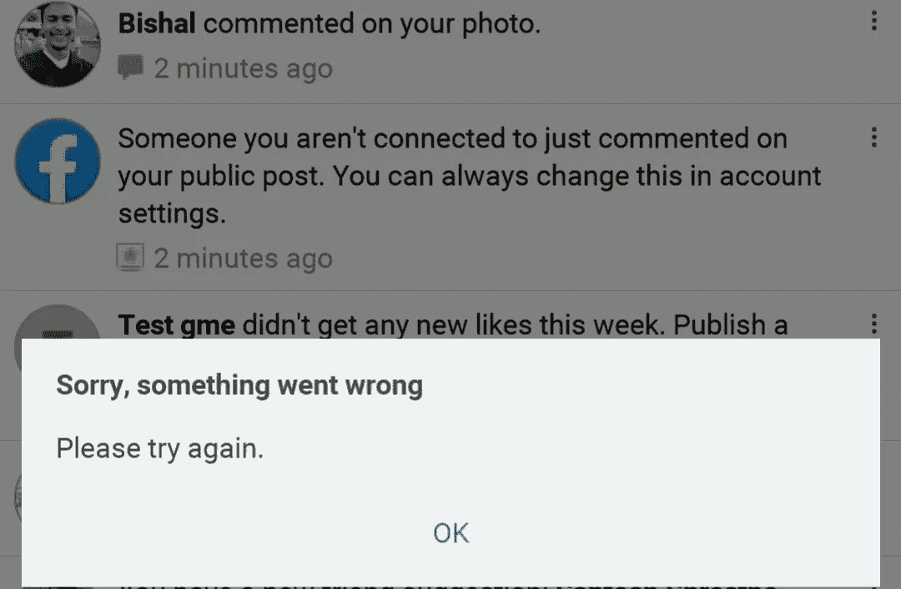
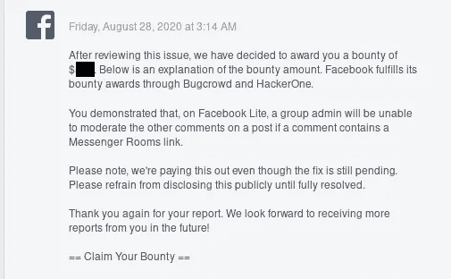
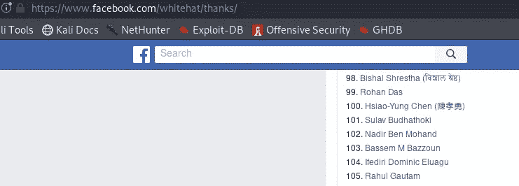

# 我是如何意外地从脸书那里得到我的第一笔赏金的

> 原文：<https://infosecwriteups.com/how-i-accidentally-got-my-first-bounty-from-facebook-facebook-bug-bounty-2020-c12bd2ad8575?source=collection_archive---------0----------------------->

## 脸书虫赏金 2020

读者们好，

过了很长时间，我带着一篇新的文章回来了。这篇文章讲述了我是如何因为报告了一个功能性安全问题而从脸书获得第一笔奖金的。所以我希望这篇文章不要太专业。**注意:**如果你没有太多时间阅读这篇文章，你可以跳到文章底部的视频！

**关于这是怎么发生的故事？**

我计划用“传达室”为一个小组做一次聚会。脸书推出了其最新的视频会议功能， **Messenger Rooms** ，允许多达 50 人同时进行视频聊天。你可以通话的时间没有限制，你甚至不需要一个脸书账号就可以加入一个房间。我已经发布了一个状态，另一天我评论说**“传达室”**加入链接，这样每个人都可以在会议中使用该链接加入。但是在我试着打开那个帖子的时候，我贴了那个链接。我得到了一个错误，无法查看该职位。

打开评论后，我得到了这个错误。

在那一刻，我没有意识到这是一个问题。第二天，我再次尝试缓和职位，但我仍然无法做些什么！所以我以为是**什么的**。然后，我请求我的一个朋友查看 FB Lite 的群组帖子。他试着打开 FB lite 上链接，他也得到同样的错误。然后我决定举报！

写的是什么？

这篇文章是关于我如何因为报道了一个安全问题而从脸书获得第一笔奖金的。

**什么是 Bug 赏金？**

**Bug bounty** 是一种奖励，支付给在公司应用程序或软件中发现安全缺陷的安全研究员或 Bug 赏金猎人。一些公司提供资金，一些公司通过在其网站上提及报告安全问题的研究人员的名字来给予认可和感谢。在脸书的案例中，他们提供奖励($$$)并通过[https://www.facebook.com/whitehat/thanks/](https://www.facebook.com/whitehat/thanks/)列出他们的名字

**我如何转载这一期:**

1.  首先，我在脸书和 FB lite 中分别以攻击者和用户[受害者]的身份登录了两个帐户。
2.  作为一名攻击者，我进入 messenger 应用程序，复制了**“messenger room”**join 链接，并进入另一个用户(受害者)的个人资料图片，使用脸书对该链接进行了评论。
3.  然后我打开了 FB Lite 作为一个受害者，当试图打开评论。受害者将得到一个错误！打开该评论以及其他人的评论！

当我报告这个问题时，我只在 FB lite 组的评论中发现了这个问题。但在进一步测试其**时，影响**到每一个**评论区**，包括任何用户帖子、页面帖子、事件帖子等。

**这个问题有什么影响？**

攻击者可以简单地评论 messenger **room join 链接**中的个人资料图片、FB 页面、群组、事件**管理员或任何用户都无法审核该评论！**

**这个问题的根本原因是什么？**

解决问题后，我向脸书安全团队询问。但是他们会回复“很遗憾，我们无法提供任何关于修复或根本原因的进一步信息。”

**如果您发现了这种问题，您应该怎么做？**

如果您发现任何涉及安全、隐私、影响用户或直接侵犯用户隐私的问题。然后，您可以前往[www.facebook.com/whitehat/report](http://www.facebook.com/whitehat/report)，在表格中填写您如何发现问题的步骤及其影响！脸书安全小组将进行审查，并将得到相应的答复！

有时我认为 FB Bug 赏金也完全是运气！虽然我们在搜索这个 bug 的时候没有找到或者得到大量的重复的、翔实的但是虽然我们在搜索它的时候不小心得来了:p :D 却没有意思 ***辛苦*** *不是* ***必要的*** *或者必需的！:):D*

> 这篇文章可能不是很有趣，但我希望这篇文章会有点帮助，并给初学者一些关于 bug bounty 的想法。我也希望你将来会发现一些有效的安全问题！祝你好运！

得到了脸书的慷慨回应！

他们还把我列入了他们的名人堂页面(最近是第 98 位)

**时间线:**

初步报告发送时间:-2020 年 7 月 13 日星期一下午 1:38

转载:-7 月 15 日星期三

分流:-2020 年 7 月 15 日星期三

奖励:-2020 年 8 月 28 日星期五下午 3:14

问题已修复:-9 月 2 日星期三

如果你对此有任何困惑，请写下来或与我联系。可以在[推特](https://twitter.com/bishal0x01)问或者关注我！

视频概念验证:[https://youtu.be/JP8AnDtO13o](https://youtu.be/JP8AnDtO13o)

谢谢你给我时间阅读我的文章！下次写起来见！

#停留安全#停留安全！