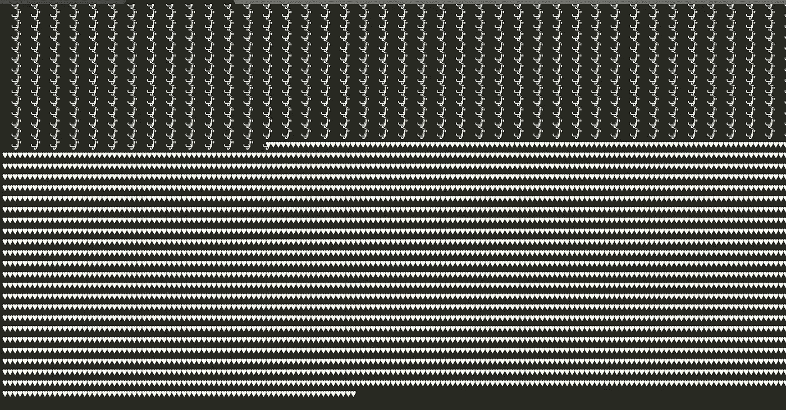
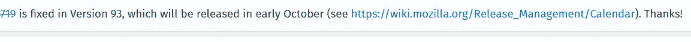

# 我是如何通过发送电子邮件让任何人的 MOZILLA FIREFOX 浏览器崩溃的

> 原文：<https://infosecwriteups.com/how-i-am-able-to-crash-anyones-mozilla-firefox-browser-by-sending-an-email-a12563cc8d79?source=collection_archive---------4----------------------->

嗨，希望你们都很好，这是我如何通过发送一封邮件就能让任何人的 Mozilla firefox 崩溃的故事..我们开始吧。

我在谷歌的 Gmail 上搜索，尝试了 3 天之后，我什么也没有找到，然后我就随机想到在一封电子邮件中放很多表情符号，然后发送给某人，看看会发生什么。我刚刚使用了大量的表情符号和特殊字符，就像这样:

你可以在这里下载有效载荷文件:

**

*起初，我认为谷歌可以处理这样的事情，但我还是试着去做了，*

*我在邮件标题和正文中添加了很多表情符号。*

*并把它发送到我的第二个账户，我一直使用火狐浏览器，所以我打开了第二封邮件，希望它会崩溃💥。我的 firefox 只是点击收到的邮件就崩溃了。所以我在 chrome 上测试了同样的东西，结果呢？它在 chrome 上不工作，一切都很顺利，然后我试了试 **duckduckgo** 然后嘣💥，把它撞了，然后在人们最喜欢的浏览器 **windows explorer、**和 **EDGE** 上试了试都也撞了，danggg。*

*我当时就想:*

*我已经向 firefox 报告了这一点，他们认为这是性能升级，而不是安全问题😥，但是他们在 firefox 版本 93 中将其作为新的升级进行了修复，耶！！！！！*

**

*正如他们所说，火狐正在加载每一个表情符号作为图像，所以据我所知，这是崩溃的主要原因。*

*我希望你们喜欢这篇文章！请继续关注更多报道。很快会出版许多。*

*感谢阅读，请忽略任何错误和我的语法😅，你们可以在 Twitter 上关注我: [@__sam0_0](https://twitter.com/__Sam0_0)*