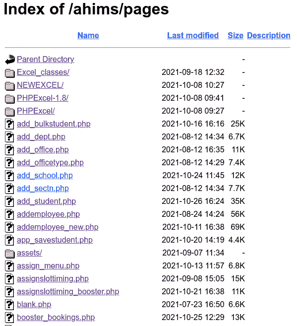
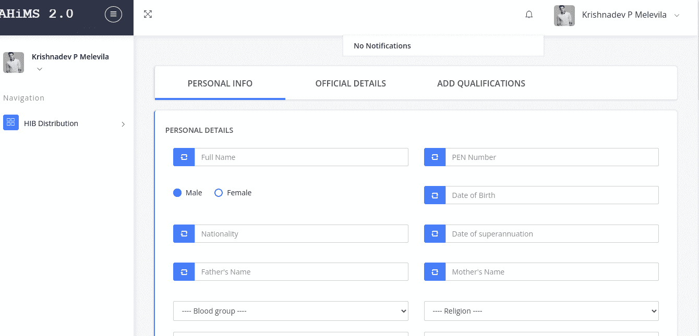
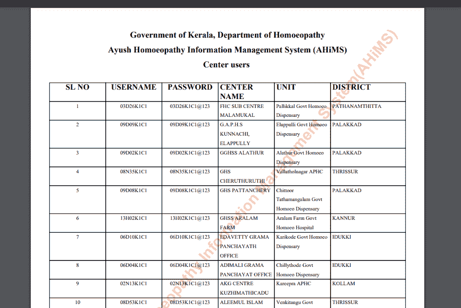
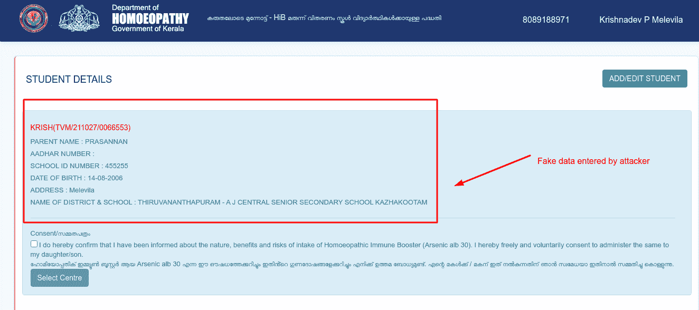
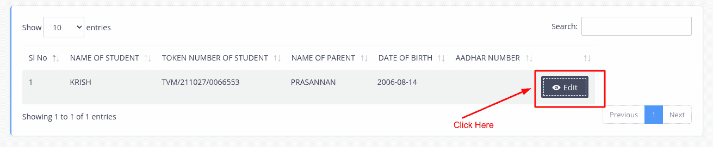
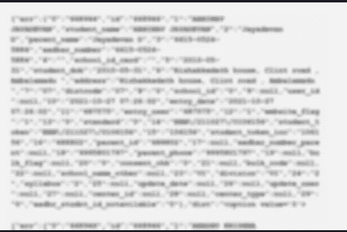

# 我如何利用漏洞成为政府官员？

> 原文：<https://infosecwriteups.com/how-i-become-a-government-official-using-a-vulnerability-4605a2db47f0?source=collection_archive---------1----------------------->

嘿伙计们！又是我克里希纳德夫·P·梅莱威拉！如果你不认识我，就去问你的谷歌助手“谁是克里希纳德夫·P·梅勒维拉”。

今天我带着一个新的喀拉拉邦政府门户网站的漏洞来到这里。它被称为 AHIMS 门户网站，这是喀拉拉邦政府的一项倡议，目的是在 covid 危机后学校开学前为儿童提供免疫增强片。

该站点容易受到不正确的目录访问，也很容易受到攻击

重现漏洞的步骤如下:

```
**Vulnerability: Improper Authentication + IDOR****Impact: CRITICAL****Risks: Attacker can visit restricted pages (Including administrator  and staff pages) and able to create, modify, delete data.****Priority: P1****Scope: Name, Aadhar Number, Address, Phone Number, Date of birth, etc.. are leaking.**
```

**从攻击者的角度重现不正确身份验证的步骤:**

1.  【https://www.ahims.kerala.gov.in/ahims/pages】拜访[T5](https://www.ahims.kerala.gov.in/ahims/pages)



这是第一个漏洞。在这里，公众可以访问所有模块。没有一个是经过适当认证的。因此，攻击者可以进入每个模块，改变每一个数据(实际上，所有这些功能只有管理员可以使用，但由于这个漏洞，每个人都可以这样做)

它还泄漏了一个名为报告的文件，其中存储了所有员工的登录详细信息。因此攻击者可以成功地以员工身份登录。



**从攻击者的角度重现 IDOR 的步骤:**

1.  **在**[**https://www.ahims.kerala.gov.in/ahims**](https://www.ahims.kerala.gov.in/ahims)上注册
2.  **登录它，然后我们会得到一个选项来添加学生那里攻击者输入假数据并提交。**



**3。现在打开任何网页拦截工具，如 burpsuite，点击编辑按钮**



现在攻击者会在 burpsuite 上收到一个帖子请求，如下:

```
**POST /ahims/pages/jqdir/jq_getsaved_students.php HTTP/1.1
Host:** [**www.ahims.kerala.gov.in**](http://www.ahims.kerala.gov.in) **Cookie: _ga=GA1.3.1639422503.1633161064; PHPSESSID=itb0aia4ilb5152d76j7bdbmq4
Content-Length: 9
Sec-Ch-Ua: “Chromium”;v=”94", “Google Chrome”;v=”94", “;Not A Brand”;v=”99"
Accept: application/json, text/javascript, */*; q=0.01
Content-Type: application/x-www-form-urlencoded; charset=UTF-8
X-Requested-With: XMLHttpRequest
Sec-Ch-Ua-Mobile: ?0
User-Agent: Mozilla/5.0 (X11; Linux x86_64) AppleWebKit/537.36 (KHTML, like Gecko) Chrome/94.0.4606.81 Safari/537.36
Sec-Ch-Ua-Platform: “Linux”
Origin:** [**https://www.ahims.kerala.gov.in**](https://www.ahims.kerala.gov.in) **Sec-Fetch-Site: same-origin
Sec-Fetch-Mode: cors
Sec-Fetch-Dest: empty
Referer:** [**https://www.ahims.kerala.gov.in/ahims/pages/add_student.php**](https://www.ahims.kerala.gov.in/ahims/pages/add_student.php) **Accept-Encoding: gzip, deflate
Accept-Language: en-US,en;q=0.9,ml;q=0.8,hi;q=0.7
Connection: close
id=668944     //IDOR VULNERABLE**
```

**5。在该请求中，id 参数容易受到 IDOR 的攻击。如果我们将 id 从 668944 更改为 668933，攻击者将获得 id 为 668933 的用户的详细信息，而不是 id 为 668944 的用户(下面是 3 个样本证明数据)**



学生敏感数据

很快又会有另一个弱点

根据我在 2021 年 10 月 27 日的报告，有关部门正在修复这个漏洞。

***别忘了在 medium 等社交媒体上关注我。***

*我的 Instagram 手柄:*[*https://instagram.com/krishnadev_p_melevila*](https://instagram.com/krishnadev_p_melevila)

*我的推特句柄:*[*https://twitter.com/Krishnadev_P_M*](https://twitter.com/Krishnadev_P_M)

*我的 LinkedIn 手柄:*[*【https://www.linkedin.com/in/krishnadevpmelevila/】*](https://www.linkedin.com/in/krishnadevpmelevila/)

*我的人事网站:*[*http://krishnadevpmelevila.com/*](http://krishnadevpmelevila.com/)