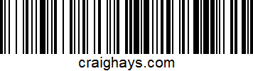

# 我是如何以 0.01 美元的价格购买 240.00 美元的年费的

> 原文：<https://infosecwriteups.com/how-i-bought-a-240-00-annual-subscription-for-bargain-0-01-7ccbc6776545?source=collection_archive---------2----------------------->

我发现了一种改变高级订阅服务价格的方法，并以一分钱的价格购买了它。我是这样做的。

照片由 [**波琳娜·坦基列维奇**](https://www.pexels.com/@polina-tankilevitch?utm_content=attributionCopyText&utm_medium=referral&utm_source=pexels) 发自 [**佩克斯**](https://www.pexels.com/photo/red-balloon-3905874/?utm_content=attributionCopyText&utm_medium=referral&utm_source=pexels)

每当我在一个接受支付的目标上寻找漏洞时，我总是试图使用一个测试信用卡号来买东西，就像我在关于[破解加密信用卡号](/cracking-encrypted-credit-card-numbers-exposed-by-api-977c6f7b996f)的文章中描述的那样。当支付失败(或者成功！)我查看了整个过程的所有请求和响应，寻找任何看起来有趣的东西。

# 注意数字

在入侵一个私人的 SaaS bug bounty 程序时，我进入了新用户注册通道，并在支付页面输入了一张测试卡。当然，支付失败了，所以我回头查看了 Burp 在这个过程中捕获的所有请求和响应。我试图通过网站购买的订阅是该平台的高级服务，每月 19.99 英镑。

我注意到用我的信用卡交易令牌购买的请求包括字符串“package _ id ”:“target:payments:packages:1205”。在响应中，我收到了字符串“term”:“monthly”，“price”:{“amount”:1999，“currency”:“GBP”}。金额是订阅的月价值，19.99 便士。它还证实订阅是按月进行的。引起我注意的是 package_id 参数中的数字 ID。我很好奇，想看看我是否能找到任何其他有效的包 id，如果是，它们与什么价格和支付条款相关联。

# 成千上万次失败的支付之后

使用 Burp Suite Intruder，我重复了 10，000 次失败的付款请求，从“target:payments:packages:1”开始，将 ID 递增到“target:payments:packages:10000”。虽然许多请求都以“没有找到包”的消息出错，但我能够找到数百个过去和未来的价格，它们仍然列在价格表中，

最贵的是每月 49.99 英镑。最便宜的是每月和每年 0.01 英镑。答对了。现在，我所需要做的就是确认付款确实有效，然后我就可以用确定的套餐号创建一个真正的订阅了。

# 付款

有了每年定价为 0.01 英镑的 package_id 号，我回到了基于网络的新用户注册流程，并在准备输入我的付款详细信息时启用了 Burp Suite proxy intercept。然而，这一次，我输入了我的真实信用卡信息，并手动转发产生的请求，直到我再次看到字符串“package _ id”:“target:payments:packages:1205”。在这一点上，我改变了 SKU 1205 年的 0.01 SKU 和点击前进，然后关闭打嗝套件代理拦截。

令我惊讶的是，它起作用了，我刚刚花一分钱买了 239.88 美元的年费。我回到我的帐户，并审查了我的订阅，并确认我是一个高级用户。我合同的截止日期是 12 个月后。

# 为什么公司使用测试 SKU

该 SaaS 的 package_id 是盒子侧面条形码 SKU(库存单位)的数字等价物。通过列出多个 SKU 并更改注册表单以在它们之间切换，目标公司可以随时更改价格，而不会失去以先前价格续订的能力。

在这种情况下，看起来目标公司创建了价格为 0.01 的月度和年度订阅 SKU，以允许员工在代码部署后测试实时支付系统。虽然这很常见，但这些廉价的 SKU 通常不公开可见，也不容易猜测，而是留给员工使用。

# 影响

就收入损失而言，这一缺陷有可能造成巨大的财务影响。如果这成为众所周知的事情，他们所有的现有客户都可以取消他们的订阅并续订 0.01 英镑，目标是每个客户每年花费 239.87 英镑。新客户可以注册一分钱，失去所有未来的收入，直到 SKU 被禁用。1p 的收费很可能连信用卡交易费都不够。

# 建议的补救措施

在保持测试人员测试他们的支付系统的能力的同时，解决这个问题的最好方法是为每个 SKU 添加第三个值:真或假。这样，团队可以启用 0.01 SKUs 进行测试，进行购买，然后在应用程序数据库中将它们设置回 False，这样它们就不会被像我这样的人滥用。

需要更新支付处理代码，以从数据库中读取启用属性的值，并取消任何试图使用禁用 SKU 的交易，建议 Stripe 不要完成对所提供令牌的支付。

与我私人电子邮件列表中的其他人一起关注我的最新文章、视频、想法等。

*原载于 2021 年 8 月 11 日*[*【https://craighays.com】*](https://craighays.com/how-i-bought-a-240-pound-annual-subscription-for-bargain-1-penny/)*。*