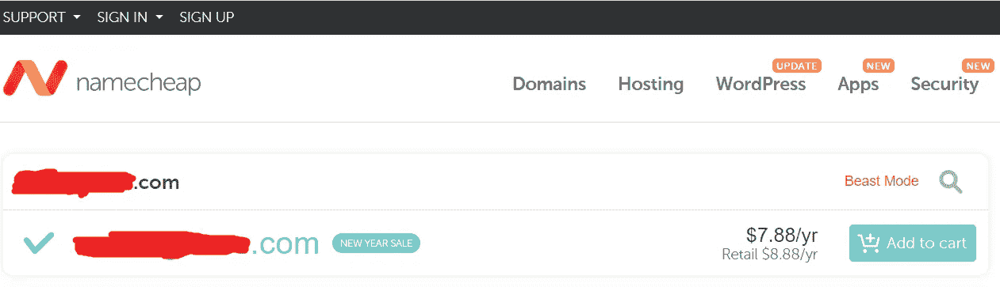
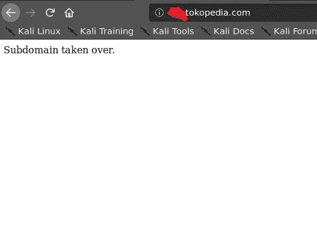
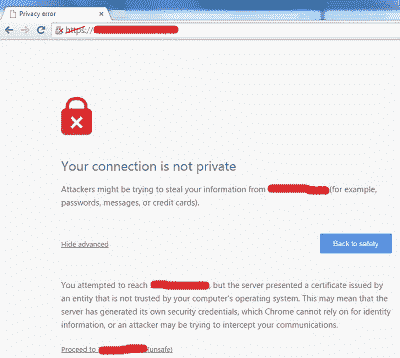
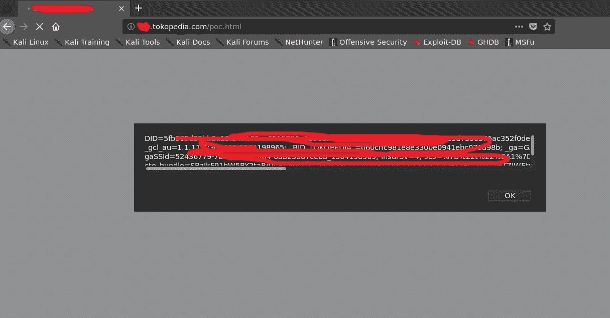

# 我如何购买 Tokopedia 网站的子域(是的，你没看错)

> 原文：<https://infosecwriteups.com/how-i-bought-my-way-to-subdomain-takeover-on-tokopedia-8c6697c85b4d?source=collection_archive---------0----------------------->

*Tl；dr:tokopedia 网站的一个子域指向一个可以购买的过期顶级域名，所以很明显我会去买。*

Assalamualaikum Wr。Wb。(亲爱的读者，愿你平安)

在挖掘一些旧邮件时，我发现了一个关于 tokopedia.com 的发现，我决定写一篇关于它的文章。Tokopedia 是我的祖国印度尼西亚为数不多的几个拥有自己的公共昆虫赏金项目的公司之一。你可以在这里阅读规则和细节:【https://github.com/tokopedia/Bug-Bounty】T2。

在阅读了他们的规则后，我注意到目标主要设置为通配符域(*.tokopedia.com 和*.tokopedia.net)。所以我开始使用一些开源工具，比如 sublist3r、knockpy、massdns 等来列举子域。

我发现了一些有趣的子域[，在那里我也发现了一些有趣的发现](https://medium.com/bugbountywriteup/information-disclosure-and-reflected-xss-on-tokopedia-1b3a00ec64c6)。但是引起我注意的是 REDACTED.tokopedia.com，因为当我访问子域时，我从浏览器得到一个 *ERR_NAME_NOT_RESOLVED* 错误页面。

在我的终端中使用 ***dig*** 命令，发现 CNAME 配置指向另一个顶级域名(REDACTED.com)。因此，REDACTED.tokopedia.com 实际上是另一个不同领域 REDACTED.com 的别名。

令人惊讶的是，当我检查 whois 记录时，该域名实际上已经过期。所以我直接去了 namecheap.com，看看是否可以买到，嗯，确实可以。

困境来了，我当时真的是一文不名(不，说真的)，我连一个 8 块钱的域名， ***加*** 都买不起，我还不确定这个子域到底是不是真的可以接管。我甚至考虑在不购买域名的情况下报告这个漏洞，但我不认为这是个好主意。

所以，我决定冒险，向我的朋友借了 8 美元(是的，不是开玩笑)，然后买下了这个域名。

在将它指向一个免费的托管服务后，我再次尝试打开子域，嗯，我成功地接管了子域，因为它现在指向我自己的服务器。

我决定为 XSS 做一些 PoC，但是偶然发现了一个问题，因为 cookies 设置了安全标志，所以网站需要托管在 https 中。在我为 REDACTED.com 设置了一个免费的 SSL 证书后，另一个问题出现了，浏览器抛出了一个隐私警告，因为网站是从 REDACTED.tokopedia.com 访问的，而证书是为 REDACTED.com 签名的。

我从 stackoverflow 那里得到这个，警告是不同的，但是你得到了这个想法。

他们不让我做*.tokopedia.com SSL 证书，我决定马上举报。如果用户决定点击*前进到……*按钮，我们仍然可以窃取 cookies，所以是的。

***注:*** *如果你发现一个子域被接管，我认为在首页展示一些不必要的东西是不明智的，公司不会喜欢，因为用户可能会看到它，这对他们的声誉不好。这份报告来自我早期作为一个 Bug 赏金猎人的经历，所以在首页显示“子域已被接管”可能不是个好主意。相反，我们可以在隐藏的 html 标签上写下我们的 PoC，也许在首页上显示“正在维护中”。并且不要忘记随机化我们在那个子域上托管的文件名，这样它就不会被用户偶然发现。*

嗯，安全团队验证了我的报告，这是一个严重程度很高的有效安全漏洞，他们决定奖励我$$$。

花 8 块钱买三位数的赏金？我认为这是一个绝对的胜利。

Wassalamualaikum Wr。Wb。

**时间线:**

*   **2019 年 7 月 27 日:**报告发送。
*   **2019 年 7 月 29 日:**安全团队验证了该报告，有效，严重性高。
*   **2019 年 7 月 31 日:** Bug 修复，他们让我重新测试 Bug。他们还询问了我发送奖励的银行信息。
*   **2019 年 11 月 20 日:** $$$获奖。

*关注* [*Infosec 报道*](https://medium.com/bugbountywriteup) *获取更多此类精彩报道。*

 [## 信息安全报道

### 收集了世界上最好的黑客的文章，主题从 bug 奖金和 CTF 到 vulnhub…

medium.com](https://medium.com/bugbountywriteup)