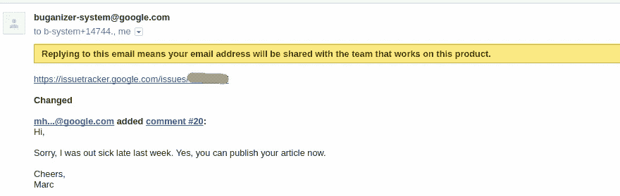
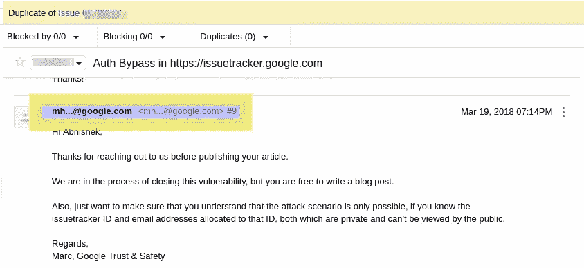

# 我是如何侵入谷歌问题跟踪系统的

> 原文：<https://infosecwriteups.com/how-i-broke-into-google-issue-tracker-667b9e33e931?source=collection_archive---------0----------------------->

嗨，朋友们，

最近，我发表了一篇[文章](https://medium.com/@abhishekbundela/hey-organisations-dont-underestimate-dmarc-policy-23f525df7b99)，其中我解释了 google groups 功能中的一个缺陷。当我将这个漏洞提交给谷歌时，我注意到研究人员可以通过回复 buganizer 系统的电子邮件在问题跟踪器中对这个问题进行评论。

在向谷歌提交了三份不适用的报告后，我终于提交了一份有效的报告，但不幸的是，它被标记为重复。感谢谷歌安全团队，他们非常积极，并允许我写关于漏洞。

为了了解谷歌问题跟踪器的功能，我浏览了问题跟踪器的文档。

> 问题跟踪器是谷歌内部使用的一个工具，用于在产品开发期间跟踪 bug 和功能请求。它在 Google 之外可供需要在特定项目上与 Google 团队合作的外部公众和合作伙伴用户使用。

用户也可以通过向 buganizer 系统发送电子邮件来创建问题。你可以在[这里](https://developers.google.com/issue-tracker/guides/create-issue-email)了解更多。

用户需要向`buganizer-system+*componentID*@google.com` 发送电子邮件以创建问题。

`componentID:`它是您要报告问题的组件的整数值。

如果他们想对某个问题发表评论，他们必须给`buganizer-system+*componentID+threadID*@google.com`发电子邮件。

`*threadID:*`也是针对某一期的整数值。

你可以在上面的图像中清楚地看到，如果你想使用电子邮件创建一个问题，那么你的域应该支持 SPF & DKIM。我在之前的帖子中已经谈到了 SPF & DKIM。现在，一个简单的问题出现了“问题跟踪器如何处理未验证的电子邮件(未通过 SPF & DKIM 验证的电子邮件)”。如果来自未验证电子邮件的内容直接发布在问题跟踪者中会怎样？这意味着，如果攻击者知道受害者的电子邮件地址，他可以代表受害者创建/评论问题。所以为了测试这个功能，我通过 smtp2go 服务发送了一封电子邮件，结果让我大吃一惊。是的，我可以在**公共问题跟踪器中代表任何用户创建问题！**我也可以通过给`buganizer-system+*componentID+threadID*@google.com.`发邮件来评论问题

我成功地在**公共问题跟踪者**、**、**中创建/评论了问题，所以我想我也可以在**私人问题跟踪者中评论任何问题。**我向我的一个问题(通过 smtp2gto)发送了一封电子邮件(随机电子邮件),但未能成功创建关于该问题的评论。然后，我尝试使用我的电子邮件地址(报告漏洞时使用的同一封电子邮件)对该问题进行评论(通过 smtp2gto ),并获得了成功。

# **冲击**

攻击者可以使用任何人的电子邮件地址在**公共问题跟踪器**中创建/评论问题。创建/评论问题不会泄露记者的电子邮件，因为只能看到电子邮件的前两个字符和域名。你可以在附上的图像中检查这一点。

攻击者可以在**公共问题追踪器**中看到这些字符和域名，并可以使用任何以这些字符开头并以该特定域结尾的电子邮件对该特定问题进行评论。攻击者还可以像 abc@googledev.com 一样使用随机电子邮件对某个问题进行评论，以欺骗公共研究人员并询问更多细节。

在评论**私人问题跟踪器**，时，攻击者必须知道 componentID、threadID 和位于该 ID 的电子邮件地址。谷歌的安全团队认为这是 p2(优先级)s2(严重性)级别。

**概念验证**

谢谢你的耐心。

学习、构建和突破！