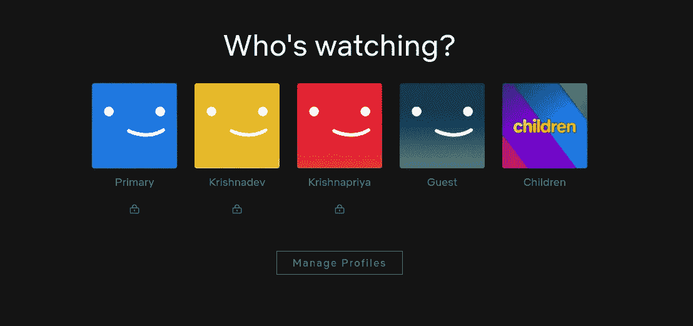

# 我是如何绕过网飞档案锁的？

> 原文：<https://infosecwriteups.com/how-i-bypassed-netflix-profile-lock-43901be1307c?source=collection_archive---------0----------------------->

嗨，黑客们，

我的名字是 Krishnadev P Melevila，要了解我的更多信息，只需在谷歌上搜索“谁是 Krishnadev P Melevila”或询问你的谷歌助理。

这次，是一条大鱼！！！是的，是网飞！！！！


该漏洞是一个可以很容易地绕过网飞配置文件锁定响应操作。

个人资料锁意味着，在网飞，有一个选项来添加多个用户到一个帐户，对于多个帐户，他们可以设置一个个人资料锁，每个个人资料有一个 4 位数的个人识别码。因此，当有人登录到主帐户时，他们会被询问“谁在看？”

*超链接->*[*https://drive . Google . com/file/d/1 hke 2 CD _ wtx 8 pvyp 6 zv-mi 4 wqoyfp 5 iw 0/view？usp=share_link*](https://docs.google.com/document/d/1JAQiAPFdt_Z_wVcsrjz_PW_iPhqX0Kh0EOJtsUcShC4/edit?usp=share_link) (与本文无关，游戏的一部分:)



因此，在单击个人资料后，他们需要输入个人资料 pin 才能访问浏览部分。但是该功能存在一个漏洞。复制步骤如下所示:

第一步:访问[https://www.netflix.com/](https://www.netflix.com/)并用你的账户登录，然后你会被问到“谁在看？”喜欢上面的截图

第二步:在这里，除了客人和孩子，所有用户都有个人资料锁。所以我们要绕过这个锁。

步骤 3:为此，我们需要知道至少一个配置文件 pin，比如 Krishnadev 的配置文件 pin 是 1704，然后我将输入该 pin 并在 burp 上截取该请求的响应，并复制整个成功响应。

```
HTTP/2 200 OK
X-Robots-Tag: noindex, nofollow
X-Frame-Options: DENY
X-Debug-Tz: GMT+5.50
X-Netflix.request.toplevel.uuid: 7d4b8b6b-fed5-44de-973b-1e14de56366f-422157414
X-Netflix.execution-Time: 6
Content-Type: application/json;charset=UTF-8
Date: Mon, 27 Dec 2021 03:48:33 GMT
Content-Length: 48
Via: 2 i-01d773509d78ec561 (us-west-2)
Server: api-prod-website i-00db4a31230d33cec
X-Xss-Protection: 1; mode=block; report=https://www.netflix.com/ichnaea/log/freeform/xssreport
X-Content-Type-Options: nosniff
Strict-Transport-Security: max-age=31536000; includeSubDomains
Access-Control-Allow-Credentials: true
Access-Control-Allow-Headers: Authorization,Content-Type,Content-Encoding,Accept,X-Netflix.application.name,X-Netflix.application.version,X-Netflix.esn,X-Netflix.device.type,X-Netflix.certification.version,X-Netflix.request.uuid,X-Netflix.originating.request.uuid,X-Netflix.user.id,X-Netflix.oauth.consumer.key,X-Netflix.oauth.token,X-Netflix.ichnaea.request.type,X-Netflix.Request.Routing,X-NETFLIX-PREAPP-PARTNER-ID, X-NETFLIX-PREAPP-INTEGRITY-VALUE, X-Netflix.Request.Priority,X-Netflix.Retry.Client.Policy,X-Netflix.Client.Request.Name,X-Netflix.Request.Retry.Policy,X-Netflix.Request.Retry.Policy.Default,X-Netflix.request.client.user.guid,X-Netflix.Request.NonJson.Headers,X-Netflix.esnPrefix,X-Netflix.browserName,X-Netflix.browserVersion,X-Netflix.osName,X-Netflix.osVersion,X-Netflix.uiVersion,X-Netflix.clientType,X-NETFLIX-PERSONALIZATION-ID,X-NETFLIX-DET-TOKEN,X-NETFLIX-DET-PARTNER-PAI,X-NETFLIX-RESPONSE-OVERRIDDEN,X-NETFLIX-DET-DEPRECATION
Access-Control-Expose-Headers: X-Netflix.Retry.Server.Policy,X-Netflix.Response.Tag,X-Netflix.Geo.Info,X-Netflix.request.inbound.identity.changed,Via,X-Netflix.Retry.Server.Policy.retryAfterSeconds,X-Netflix.Retry.Server.Policy.maxRetries,X-Ftl-Error,X-Netflix.uiVersion
Access-Control-Allow-Methods: GET, POST
Access-Control-Allow-Origin: https://www.netflix.com
X-Originating-Url: http://www.netflix.com/api/shakti/v5185b692/profileLock
X-Netflix.nfstatus: 1_1
Set-Cookie: <REDACTED>
X-Netflix.proxy.execution-Time: 16{"codeName":"S-Icarus-6.Alster","success":true}
```

步骤 4:现在让我们绕过任何其他用户的配置文件锁，首先为任何用户输入一个错误的 pin，截取该请求的响应，并用上面的成功响应替换该响应。然后嘣！！我们在没有任何认证的情况下获得了其他用户的资料。

我向网飞报告了这件事，但他们说:

```
Hi krishnadevpmelevila,The functionality is only intended as a barrier for children accessing mature content within an account. Local bypass, such as this one, is considered Won't Fix. Your effort is appreciated and we hope that you will continue to research and submit any future security issues you find.
```

但是，我的疑问是，那这个特性有什么用呢？

***别忘了在 medium 等社交媒体上关注我。也请为这篇文章鼓掌 50 次，这是我写更多的灵感！！***

*我的 Instagram 手柄:*[*https://instagram.com/krishnadev_p_melevila*](https://instagram.com/krishnadev_p_melevila)

*我的推特句柄:*[【https://twitter.com/Krishnadev_P_M】T21](https://twitter.com/Krishnadev_P_M)

*我的 LinkedIn 手柄:*[*https://www.linkedin.com/in/krishnadevpmelevila/*](https://www.linkedin.com/in/krishnadevpmelevila/)

*我的人事网站:*[*【http://krishnadevpmelevila.com/】*](http://krishnadevpmelevila.com/)