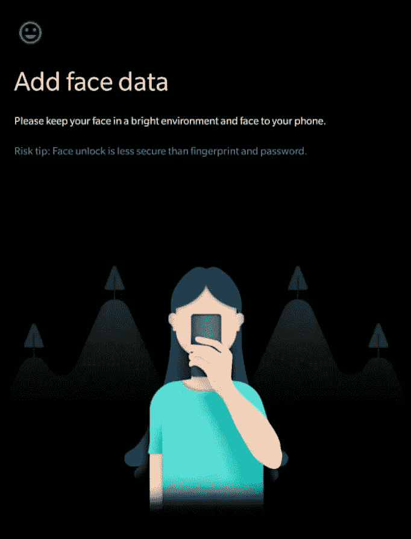
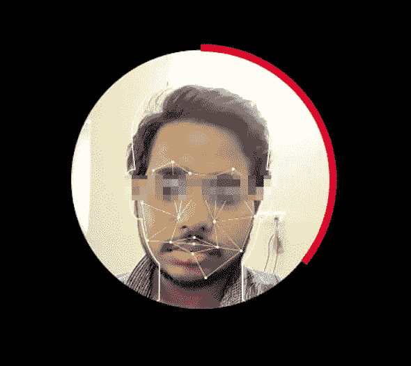
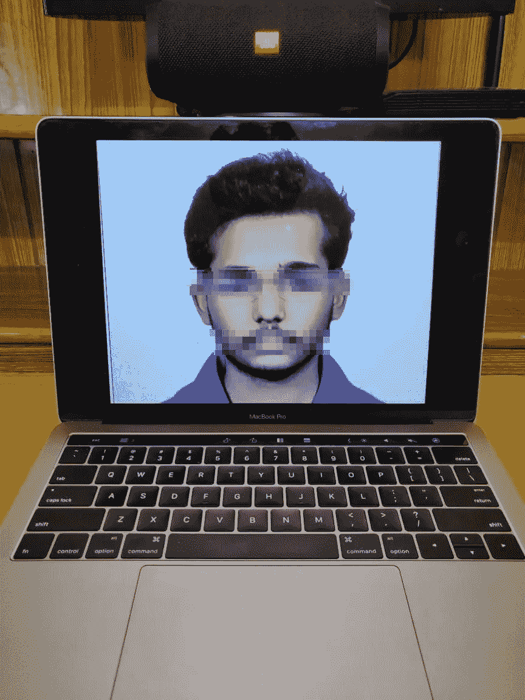

# 我是如何绕过 OnePlus 6 的面部解锁安全功能的？

> 原文：<https://infosecwriteups.com/how-i-bypassed-the-face-unlock-security-on-my-oneplus-6-6b59c9b1ecfb?source=collection_archive---------1----------------------->

我一直对在网上上传图片持批评态度。我和我的一个朋友讨论了一些人在社交网站如脸书、Instagram 和其他网站上盲目上传图片的问题。在一个我们每天都在使用面部识别功能的世界里，这可能非常危险。当我试图向他解释上传到网上的图像如何对我们的生活产生负面影响时，我萌生了写这篇文章的想法。

# 介绍

面部解锁功能一次又一次被证明是不安全的。有人声称安全研究人员已经找到了绕过安全的创造性方法，我总是对实现这些方法的复杂程度感到惊讶，但也有一些人找到了真正简单易行的方法来实现黑客攻击。这是我如何进行最简单但最有效的黑客攻击，使我绕过 OnePlus 6 的面部解锁功能的故事。

# 让我们开始吧！

因此，首先要绕过安全机制，我们需要了解这些面部识别功能是如何工作的。当我们扫描我们的面部识别功能时，手机会获取我们面部特征相互之间距离的线索，比如我们的眼睛到鼻子的距离或者嘴唇和下巴之间的距离，最重要的是，它会为我们的面部划出一条边界线。

让我告诉你我的意思。看到它用来绘制我的脸的线和点，并做一个结构笔记。

不要把重点放在脸上！

这给了我一个想法，它突然想到，这并没有考虑到我面部的三维深度，所以任何在二维表面上与我的面部大小和特征相同的东西也应该绕过我手机的面部识别安全。

# 黑客！

因此，我立即打开了我为官方目的保存的护照大小的照片，并将其指向我锁定的 OnePlus 6。让我给你看看背景

我放大了我的护照大小的照片，并在锁屏状态下将其放在我的 OnePlus 6 前面，然后是 viola！

我花了 1 次失败的尝试，在下一次尝试中，我能够打开我的手机。

# 道德的

面部解锁功能在安全领域一直存在争议，如果你真的关心安全，就不应该使用它。大多数手机都成了这种情况的牺牲品。

在安全方面，我会推荐使用 iPhone X，因为它是安全的。他们以优异的成绩超越了各种测试(截至目前！).

附言

如果你们想要一个视频演示我如何进行黑客攻击，然后让我知道，我会在下面提供一个视频链接。

如果你喜欢，请鼓掌&让我们合作吧。获取、设置、破解！

网址:[aditya12anand.com](https://www.aditya12anand.com/)|捐赠:[paypal.me/aditya12anand](https://paypal.me/aditya12anand)

电报:【https://t.me/aditya12anand 

推特:[twitter.com/aditya12anand](https://twitter.com/aditya12anand?source=post_page---------------------------)

领英:[linkedin.com/in/aditya12anand/](https://www.linkedin.com/in/aditya12anand/?source=post_page---------------------------)

电子邮件:aditya12anand@protonmail.com