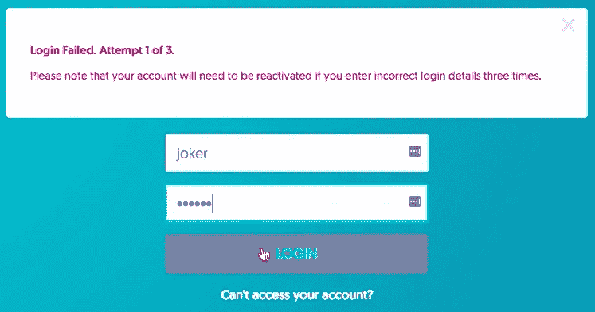
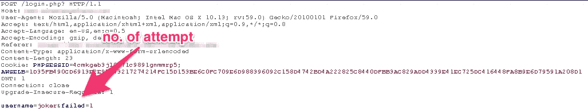

# 我是如何绕过“最多三次错误登录”策略的？

> 原文：<https://infosecwriteups.com/how-i-bypassed-the-maximum-three-incorrect-login-policy-b6682d1c988f?source=collection_archive---------0----------------------->

我们都有过这样的时刻，我们在各种网站上创建这些帐户，但很少使用它们，当我们试图登录这些网站时，他们有这样的规则，即你最多只能登录三到五次，如果这些登录是错误的，那么你的帐户就会被锁定。有时这有点令人沮丧，因为你知道，如果我能像六到七次一样，我会得到正确的密码，但不是这样，你必须经历“忘记我的密码”的整个过程，打开你的电子邮件，检查一次性密码等等。

如果它能让我的帐户免受恶意实体的攻击，我还是可以接受的，但最让我恼火的是，心怀不轨的人竟然轻而易举地绕过了这些规则，而日常用户却面临着这样的困难。当我在[www.example.com](http://www.vuln.com)的登录页面搜索一个 bug 时，发生了同样的事情

# 所以让我们黑进去吧

因此，【www.example.com】有一个惊人的功能，你不能一次进行超过三次的错误登录，如果你这样做，帐户就会被锁定，这是一个惊人的功能，可以阻止新手黑客进行暴力攻击，并找出用户的密码。

为了检查这个系统是否真的提供了它所说的安全性，我打开了 Burp Suite，并使用它作为代理来路由我的流量。所以我第一次用错误的凭证登录时，它给了我这个。

它在用户端给人留下了非常深刻的印象，但最糟糕的部分是在 Burp 套件上

# 寻找漏洞

当我检查它发送到服务器的请求时，我看到了这个。

失败的尝试次数就在发送到服务器的 post 请求中，现在我很好奇我是否可以改变尝试次数，并且该请求仍然被视为有效请求，瞧！

# 使用值进行测试

尝试次数的值就在我面前，我可以操作，当我更改 post 请求中的值并转发它时，它工作得非常好。所以在那之后，无论我想让服务器允许我做多少次尝试，我所要做的就是处理 post 请求，它无法识别我之前登录的次数。

# 道德和提示

web 开发人员犯了一个错误，那就是在 post 请求消息中包含登录次数，尽管这是一个隐藏的参数，但像 Burp Suite 这样的工具可以很容易地帮助您操作这些参数。

这种问题的解决方案可以是:-

I)区块链，可用于您可以轻松维护每次登录的日志，从而使此类攻击变得毫无意义

ii)关于安全检查的参数永远不应该在客户端执行，它是否是隐藏参数并不重要，客户端上的任何东西都可以被操纵，并且安全的整个目的很容易被破坏。

如果你喜欢，请鼓掌让我们合作吧。获取、设置、破解！

网址:【aditya12anand.com】T2|捐赠:【paypal.me/aditya12anand】T4

电报:[https://t.me/aditya12anand](https://t.me/aditya12anand)

推特:[twitter.com/aditya12anand](https://twitter.com/aditya12anand?source=post_page---------------------------)

领英:[linkedin.com/in/aditya12anand/](https://www.linkedin.com/in/aditya12anand/?source=post_page---------------------------)

电子邮件:aditya12anand@protonmail.com