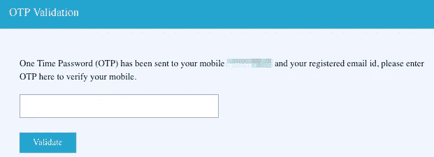
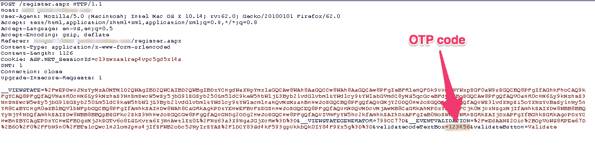
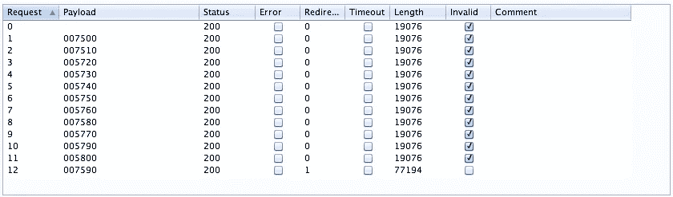

# 我是如何绕过 OTP 验证过程的？第一部分

> 原文：<https://infosecwriteups.com/how-i-bypassed-the-otp-verification-process-part-1-e5b333274ae9?source=collection_archive---------0----------------------->

我已经很久没有发表任何文章了，部分原因是我累了，正在享受一个愉快的暑假。我正在读这篇特别的文章

> [我是如何通过其他用户账户预订电影票的](https://medium.com/bugbountywriteup/responsible-disclosure-how-i-could-have-booked-movie-tickets-through-other-user-accounts-2db26a037b4c)作者[巴拉特瓦伊·加内桑](https://medium.com/@bharath95)

读完这篇文章后，我意识到我一直在尝试不同的方法来试图绕过登录凭证，但从来没有那些有 OTP 验证过程。所以这篇文章给了我这样一种感觉，内置 OTP 验证过程的在线配置文件并不是非常安全，从那以后，我试图对一个使用 OTP 验证过程的网站进行一些攻击。

# 让我们开始吧！

我开始攻击这个网站，比如说 example.com，在这里我分两个阶段进行攻击。

1.  我可以使用不属于我的手机号码创建个人资料吗？(身份盗窃)
2.  如果我只知道一个人的用户名或手机号码，我可以访问他的帐户吗？([我是如何绕过 OTP 验证过程的？Part — 2](https://medium.com/@aditya12anand/how-i-bypassed-the-otp-verification-process-part-2-c69f067216d)

# 第一次入侵

因此，为了了解如何创建个人资料以及 OTP 系统如何在该特定网站上工作，我创建了我的帐户。当我这么做的时候，我注意到了网站是如何工作的？。完成后，我又为我拥有的另一个号码进行了一次，但这一次的整个想法是创建一个帐户，而不必以任何方式触摸我的手机，sim 卡插入其中。

所以，这是我如何开始做黑客。我插入了所有应该插入的细节。现在，当我完成后，我立即在手机上收到了一个动态口令，以验证并完成创建帐户的过程。

# 打嗝组曲开始！

有人向我展示了这个，我必须输入我手机上刚刚收到的动态口令。我打开了拦截模式，并捕获了作为请求包发送到服务器的包。

我捕获的请求包

> 我已经知道 OTP 是一个 6 位数字的号码，因为我收到了我的第一个帐户。

因此，我将数据包传递给“入侵者”选项卡，以进行暴力攻击，并查看网站是否允许对 OTP 进行多次尝试。现在，为了解决这个问题，我进行了一次暴力攻击，第一次尝试时，我看到了我得到的 OTP，并制作了一个将近 150 个数字的长列表，并将其包含在最后，以了解该过程是否会成功。

暴力攻击

当蛮力攻击奏效时，我想我是幸运的。Burp Suite 能够检测出哪一个是正确的 OTP。

# 道德的

这是我在进行笔测试时遇到的最大错误之一，我们从来不检查输入 OTP 的次数，或者输入密码的次数等等。

防止这种暴力攻击的方法可以是禁止任何超过 3-5 次的尝试，或者在大约 5 次错误尝试后，OTP 不再有效。这种安全技术是可以实现的，它将有助于抑制大量的安全问题。

如果你喜欢，请鼓掌让我们合作吧。获取、设置、破解！

网址:【aditya12anand.com】T2|捐赠:【paypal.me/aditya12anand】T4

电报:[https://t.me/aditya12anand](https://t.me/aditya12anand)

推特:[twitter.com/aditya12anand](https://twitter.com/aditya12anand?source=post_page---------------------------)

领英:[linkedin.com/in/aditya12anand/](https://www.linkedin.com/in/aditya12anand/?source=post_page---------------------------)

电子邮件:aditya12anand@protonmail.com

> 我可以登录任何用户帐户的攻击将在另一篇文章中讨论，[我如何绕过 OTP 验证过程？第二部分](https://medium.com/@aditya12anand/how-i-bypassed-the-otp-verification-process-part-2-c69f067216d)。