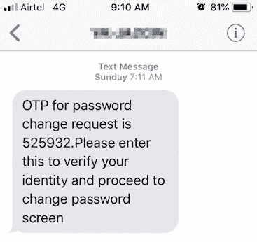
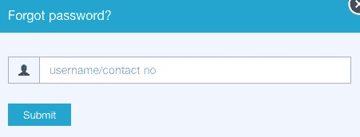
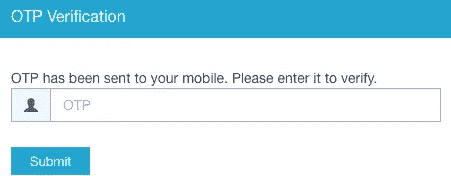
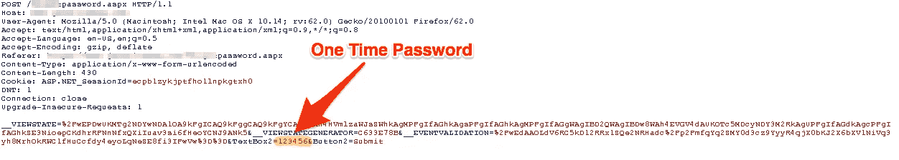
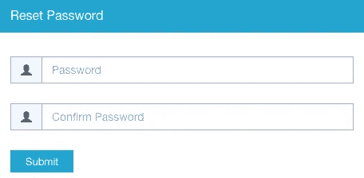

# 我是如何绕过 OTP 验证过程的？第二部分

> 原文：<https://infosecwriteups.com/how-i-bypassed-the-otp-verification-process-part-2-c69f067216d?source=collection_archive---------0----------------------->

我希望你已经阅读了第 1 部分的文章，如果没有，那么请访问下面的链接，并在那里查看，以正确理解这篇文章。

> [我是如何绕过 OTP 验证过程的？第一部](https://medium.com/bugbountywriteup/how-i-bypassed-the-otp-verification-process-part-1-e5b333274ae9)作者[阿迪雅·阿南德](https://medium.com/@aditya12anand)

动态口令验证消息

好吧，就算你没看也不用担心，我给你简单总结一下我之前的文章。我能够在一个未知的号码(可能属于任何人)下创建一个新帐户，因为我能够绕过他们的 OTP 验证过程，这一切都是可能的，因为我通过 Burp 套件进行了这种暴力攻击。

作为一个负责任的儿子，我和我爸爸讨论了我所有的黑客行为，当我告诉他这个黑客行为时，他给出了一个精彩的回答，“那么如果你可以在我的手机号码下创建一个帐户，如果我仍然需要支付我的门票，它对我有什么用呢？”。我给了他一个关于身份盗窃和基本安全特性“不可否认性”在这里不成立的小讲座，但对于一个门外汉来说，这实际上不是一个大的黑客。我决定给事情加点料。

# 让我们开始吧！

现在，我已经知道我曾经绕过他们的 OTP 系统，我必须找到一种免费获得门票的方法，即不要为我的门票付费。因为如果你像我爸爸一样，那么在别人的电话号码下创建账户绝对不是一件有趣的事情，真正有趣的是当你看那些别人付钱买的电影的时候。我的意思是，它有一种令人宽慰的东西，我甚至无法开始描述。

# 头脑风暴会议

问题是，要么我不得不黑掉支付网关，我以前已经黑过很多次了，要么进入某个已经付了票钱的人的账户，得到票和座位号。但是记住我有多懒，我坚持使用 OTP 旁路方法。就在那时，当我试图进入我的账户“忘记密码”时，这个奇妙的想法突然出现在我的脑海里。

忘记了我的密码

我是这个功能的粉丝，因为我在 6 -7 年前用它进入其他人的脸书账户，但现在从来没有真正关注过它。所以我决定看在过去的份上试一试，谁知道会成功。

# 忘记了我的密码

因此，我选择了忘记密码选项，系统提示我输入我的电话号码，我用这个号码创建了我的帐户(如上图)。当我输入手机号码时，我在动态口令验证页面上看到了以下内容，同时我在手机上收到了动态口令。

OTP 验证

所以，我求助于我的终极工具，打嗝套件。我拦截了这个数据包，并进行了暴力攻击。正如我在上一篇文章中提到的，我已经知道暴力是允许的。

打嗝套件数据包捕获

我知道动态口令是一个六位数，我让暴力攻击了一段时间，瞧！我可以选择重设密码。

我使用了重置密码功能，很快就进入了我的帐户。我有完全的权限，而且我肯定有我之前预订的票的详细信息。印象深刻吧。

# 道德的

正如我前面所讨论的，这整个黑客攻击和许多其他攻击都是可能的，因为安全人员缺乏光彩，他们没有应用任何最大重试限制。这允许攻击者尝试所有可能的组合，最终在这种情况下发现密码或 OTP。必须设置最大重试次数限制来阻止这类攻击。

如果你喜欢，请鼓掌让我们合作吧。获取、设置、破解！

网址:【aditya12anand.com】T2|捐赠:【paypal.me/aditya12anand】T4

电报:[https://t.me/aditya12anand](https://t.me/aditya12anand)

推特:[twitter.com/aditya12anand](https://twitter.com/aditya12anand?source=post_page---------------------------)

领英:[linkedin.com/in/aditya12anand/](https://www.linkedin.com/in/aditya12anand/?source=post_page---------------------------)

电子邮件:aditya12anand@protonmail.com

> 附注:请告诉我你可能正在开发的更有趣的黑客，让我们看看是否可以合作，评论如下。