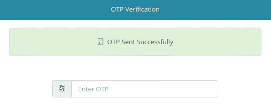
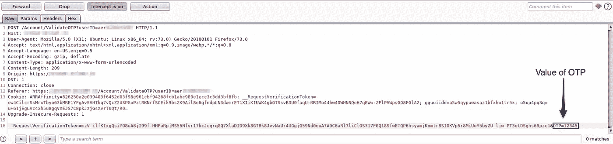
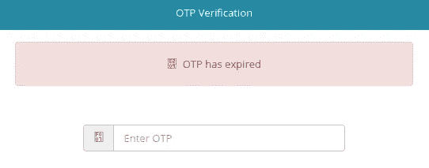
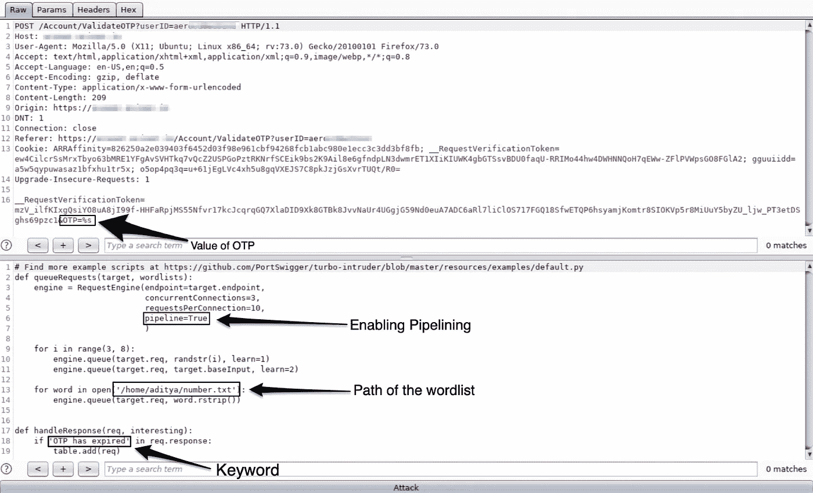

# 我是如何绕过 OTP 验证过程的？第三部分

> 原文：<https://infosecwriteups.com/how-i-bypassed-the-otp-verification-process-part-3-1bd49f8d76b9?source=collection_archive---------0----------------------->

## 涡轮入侵者-我爱上了打嗝扩展！

嗨，伙计们，在我完成 Docker 系列后，我还没能写好上个月的文章。对于所有最近开始关注我的人，我欢迎你们所有人。我一直忙于编写超级有用的脚本来监控 ubuntu 系统，以及如何从数百万行日志中获取最细微的安全细节，你们不会相信我，我从这些日志中剔除了机器的正常行为，只关注异常情况，从而将 12GB 的日志压缩到 40Kb。我以此为荣，并将无耻地向你们所有人提起。

好了，我已经说得够多了，让我们深入到 OTP 旁路这个主题，以及为什么这篇文章与我写的前两篇不同。你可以看看我的另外两篇文章，链接就在下面。

1.  [我是如何绕过 OTP 验证过程的？第一部分](https://medium.com/bugbountywriteup/how-i-bypassed-the-otp-verification-process-part-1-e5b333274ae9)
2.  [我是如何绕过 OTP 验证过程的？第二部分](https://medium.com/bugbountywriteup/how-i-bypassed-the-otp-verification-process-part-2-c69f067216d)

这两篇文章非常值得一读，给你这些文章的摘要是，我发现了一个电影预订网站，他们保存了用户的数量，然后将动态口令发送到用户的手机上，用户可以进入并登录网站。

这个网站的缺陷是没有检查一个人在 OTP 领域进行尝试的次数，并且 OTP 不会过期很长时间(不记得具体细节)。这使我能够证明暴力攻击可以在这样的网站上进行，以绕过登录。

# 让我们开始吧！

我进行攻击的网站也有同样的缺陷。让我解释一下整个场景。

## 第一阶段

在这一部分，一位客户找到我，他想测试网站的安全性，如果攻击者知道用户的凭据，他们就可以发起攻击，绕过 OTP 验证过程，直接登录网站。

现在，为了检查这种攻击是否可能，我对这种攻击尝试了不同的尝试，我想在最后尝试蛮力技术。我被提供了一个测试用户凭证来继续攻击。

我尝试的第一件事是测试他们对网站上的 cookie、它们的过期时间、这些 cookie 的唯一性实施的安全性如何，检查即使用户已经退出网站，cookie 是否仍然有效，用户在不同浏览器上登录的 cookie 是否可以用于登录另一个系统。该网站在所有这些测试中都屹立不倒，表现出了应有的水平。

我也尝试了一些不同的方法，但都不起作用。那些攻击可能起了作用，只是在加入我的工作后，我没有正确地关注红队和成为攻击者，这在这样的时刻真正表现出来。对不起，我不会再生气了，让我们开始第二部分的攻击。

## 第二阶段

现在，我几乎要放弃了，我尝试了我在以前的 OTP 验证旁路文章中所做的暴力攻击，作为我的最后一次尝试。如果失败了，我会向客户报告攻击失败，OTP 无法被脚本 kiddy 类型的攻击者绕过，但比我更有才华的人可能会找到这样做的方法。

因此，我从强力攻击开始，首先我获得了有效的动态口令，并在最后制作了一个包含 30 个数字的单词表，有效的动态口令在单词表的最后。只是为了检查它在理论上是否容易受到暴力攻击。

这是网站发送动态口令时给出的通知。现在是时候开始使用 BurpSuite 了。所以，当我拦截流量时，这是弹出的请求，在最后是 OTP 部分。

既然 30 个单词的单词表已经准备好了，我就在 OTP 旁路上运行了一次暴力攻击，正如我所希望的那样完美地工作了。即使正确的 OTP 在第 31 位，它仍然工作，但它给出了以下输出。

我心灰意冷，我输入了动态口令，网站一直弹出同样的“动态口令已过期”的消息。我回到页面，再次用同一个 OTP 登录，它工作了！

我非常高兴，我一次又一次地这样做，同一个 OTP 继续工作。这就是我如何意识到每个帐户的 OTP 在一整天后过期的，是的，开发团队中有人认为将 OTP 的过期时间保留一整天是个好主意。

有了这个结果，我让我的客户知道该网站很容易受到 OTP 旁路的攻击，并向他展示了如何进行攻击的理论证明，但他需要在一个帐户上进行攻击，并让我登录以向他展示这是可以做到的。

## 第三阶段

现在开始有趣的部分，这篇文章与我以前的文章有所不同。在我写的关于 OTP bypass 的所有文章中，它们都是一些概念的理论证明，即如果有人真的运行了暴力并且有时间这样做，攻击就可以完成。

这一次，我实际上不得不在 99999 个号码中寻找一个是 OTP 的号码。在这种情况下，OTP 是 5 位数，在我这边也是如此，因为使用 6 位数的 OTP 是正常的，它为我节省了计算的 9/10ᵗʰ，这是非常大的。与我的运气完全背道而驰的一件事是，我已经编写了社区版，强行通过 10 万个数字将花费我不止一天甚至两天的时间，如果我必须向我的客户证明这是可能的，那就不可能完成这项工作。

就在那时，我开始想办法通过 BurpSuite CE 进行更快的暴力攻击，而不是蜗牛速度的攻击。当时客户实际上也在旁边工作，他向我推荐了一个他认为可能有帮助的视频。

[涡轮入侵者:滥用 HTTP 错误功能加速攻击由詹姆斯](https://www.youtube.com/watch?v=vCpIAsxESFY&t=1328s)

这是我在 BurpSuite 社区版中遇到的最好的扩展之一。我请你们大家看一下视频上面的链接，这会让你们更好地理解我将要进行的整个攻击。

简而言之，Turbo Intruder 允许向网站发送管道请求，此外还有 [skipfish](https://tools.kali.org/web-applications/skipfish) 的功能，它允许以难以想象的速度向网站发送请求。

一旦我在我的 BurpSuite 中安装了扩展，我就开始工作，编写一个小的 bash 脚本来打印文件中所有可能的数字组合。现在是时候根据我的需要对涡轮入侵者进行微调，使其发挥最佳效果。

一旦你在你的系统上下载了 Turbo intruder，你就向它发送请求，就像你向 intrusor 发送请求一样。在你这样做之后，你会看到类似上面这样的内容，屏幕的上半部分是你想要进行暴力攻击的请求，下半部分是 python 脚本，它实际上可以帮助你提高暴力攻击的速度。

让我们来看看上面的图像，在图像的前半部分，我们需要暴力破解的值需要用“%s”来表示。让我们看看 python 脚本所在的图像的下半部分。如果你真的想利用这个工具，一定要启用`pipeline=True`。`concurrentConnection` & `requestsPerConnection`的值需要根据服务器可以承受的负载决定，您可能需要根据服务器进行微调。下一步是设置单词表的路径，然后在底部是微调过程中最重要的部分。

在这里，您需要输入脚本将在响应中查找的关键字。你可以发挥创造力，尝试找到满足你需求的最佳 if 语句。现在，一旦你准备好了所有这些，你就可以按下最底部的按钮开始攻击了。

这种暴力攻击是如此之快，即使网站几乎无法处理流量，涡轮入侵者在一个小时内就获得了正确的动态口令。原本需要一整天的工作被压缩到不到一个小时。我向客户演示了这种攻击，并展示了这种攻击是如何非常可能且容易实施的。

# 结论

这篇文章的要点是，无论攻击者有多好，如果您有适当的安全措施，您都可以挫败他的所有努力，至少通过基本的安全策略，您可以阻止 90%到 95%的坏人。

从蓝队的角度来看，这里需要注意的要点是，网站没有检查输入动态口令的次数，动态口令的到期时间只保留了一天，允许来自同一个 IP 的连续请求。如果这些安全特征被保留，这次攻击就不会发生。

对于红队队员来说，这里的关键点是使用 BurpSuite 的各种扩展，因为这些可以帮助你多倍提高你的技能，而且你不需要购买它的专业版本。

如果你喜欢，请鼓掌让我们合作吧。获取、设置、破解！

**网站**:[aditya12anand.com](https://www.aditya12anand.com/)|**捐款**:[paypal.me/aditya12anand](https://paypal.me/aditya12anand)
**电报**:[https://t.me/aditya12anand](https://t.me/aditya12anand)
**推特**:[twitter.com/aditya12anand](https://twitter.com/aditya12anand?source=post_page---------------------------)
**LinkedIn**:[linkedin.com/in/aditya12anand/](https://www.linkedin.com/in/aditya12anand/?source=post_page---------------------------)
**电子邮件**:aditya12anand@protonmail.com

*关注* [*Infosec 报道*](https://medium.com/bugbountywriteup) *获取更多此类精彩报道。*

 [## 信息安全报道

### 收集了世界上最好的黑客的文章，主题从 bug 奖金和 CTF 到 vulnhub…

medium.com](https://medium.com/bugbountywriteup)