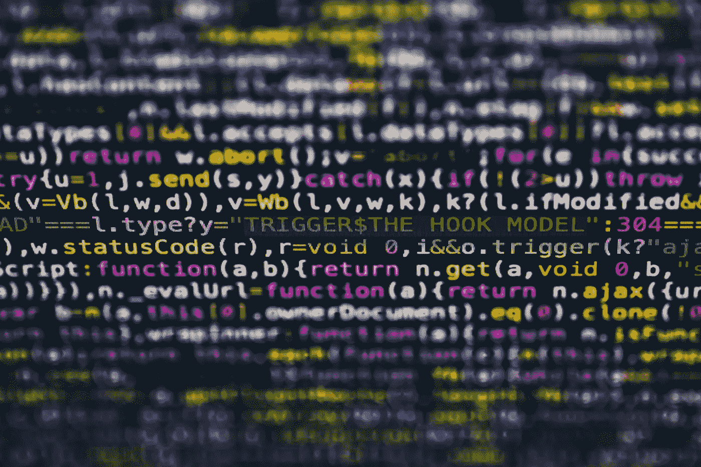
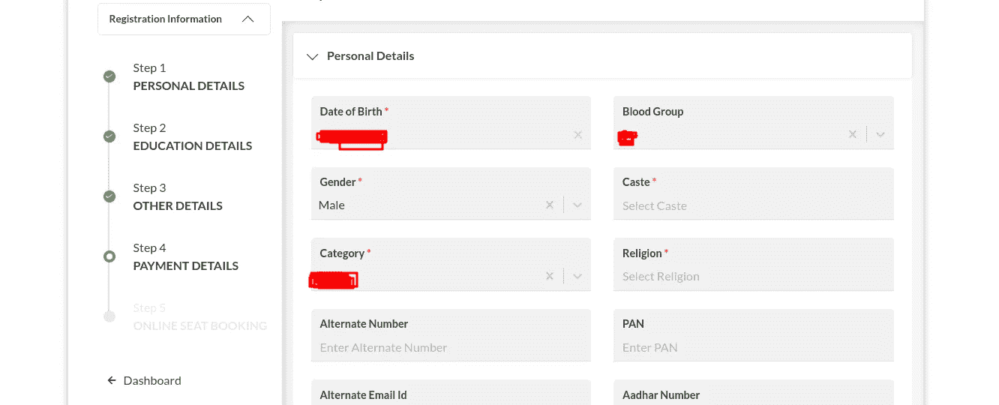
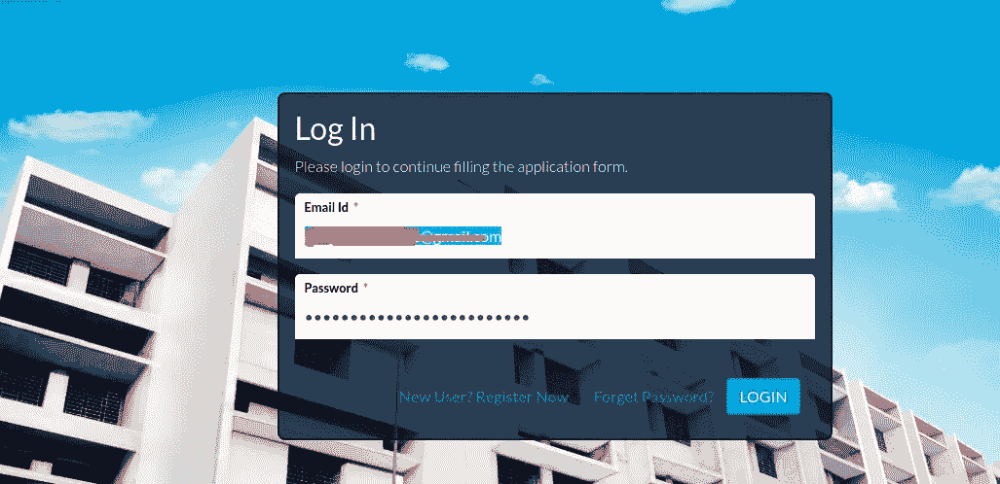
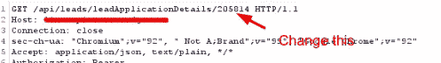
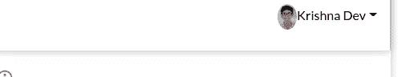
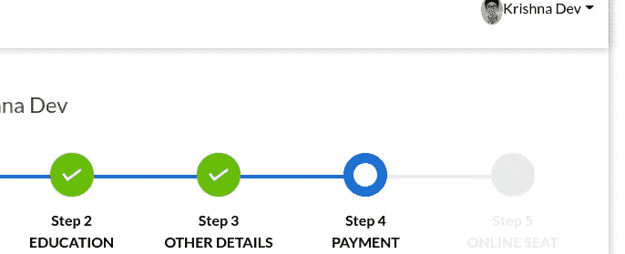
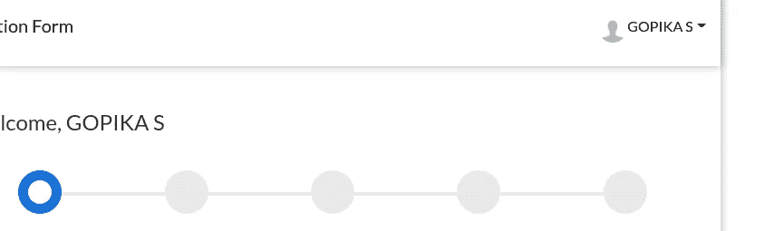
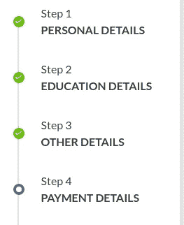

# 我是如何从大学录取软件中收集敏感数据的？

> 原文：<https://infosecwriteups.com/how-i-collected-sensitive-data-from-examination-software-f0795096af0e?source=collection_archive---------2----------------------->

嘿伙计们！我带着一个大学网站的新漏洞回来了。

马库斯·斯皮斯克在 [Unsplash](https://unsplash.com/s/photos/data-leak?utm_source=unsplash&utm_medium=referral&utm_content=creditCopyText) 上的照片

顺便说一句，我自己 Krishnadev P Melevila，你可以谷歌搜索我的名字或者点击[这里](https://instagram.com/krishnadev_p_melevila)在 Instagram 上关注我，以获得关于新漏洞的最快更新。

事实上，众所周知，在印度，这个季节我们会接到很多关于大学和学校招生的电话。但是我们大多数人都想知道“他们怎么会有我的号码？”是啊！这里我有一个答案。

我接到一个机构的电话，让我在他们的网站上填写一份申请管理职位的表格。所以我告诉他们发送链接，然后他们给了我一个像这样的 https://collegename.softwarename.com/form?链接 prn =[某个 _ 随机 _ 代码]。这个链接的作用是，我们可以直接访问预先填写好的入学申请表，无需任何身份验证。在那里，我们可以填写所有的细节，如姓名、电话、电子邮件、过去的分数、血型、地址(所有与入学相关的细节)。并支付 500 卢比的申请费-并提交表格。

因此，对于每个人来说，首先想到的是暴力破解 URL 中的代码。对吗？？？？

是的，暴力破解代码是可能的。但是这很耗时，因为代码是一个完整的随机字符串，范围从 4 到 6 个字母数字字符

然后我做的是，首先点击她给我的链接，并添加我的电子邮件和密码。然后我退出链接。

并遵循以下步骤。

1.  转到登录页面，输入我的 id，并通过我设置的链接

2.启动了 burp 套件并拦截了登录请求。很快我在请求中找到了一个参数。我只是更改了该值并转发了请求。

3.哇哦！我们得到了受害者的数据。现在，攻击者可以像这样窃取所有用户的数据，并用这些数据进行任何非法活动。(例:我的数据和我的受害者的数据通过这种方法采取如下所示。)

这是对我的发现的一个小小的总结。我相信你喜欢它。我很快会带着新的回来。

Btw:这个漏洞已经被报告给相关部门。

我不符合中等合作伙伴计划的资格，因为我来自印度。所以如果你们能把我捐赠出去，你们可以在 https://www.instamojo.com/@krishnadevpmelevila/做这件事

在 Instagram 和脸书上关注我，了解更多更新:

商标:[https://instagram.com/krishnadev_p_melevila](https://instagram.com/krishnadev_p_melevila)

https://facebook.com/krishnadevpmelevilaofficial[脸书](https://facebook.com/krishnadevpmelevilaofficial)