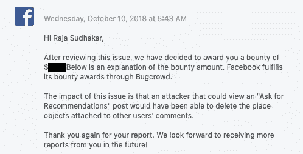

# 我如何删除脸书征求建议帖子的评论中的位置对象

> 原文：<https://infosecwriteups.com/how-i-could-delete-facebook-ask-for-recommendations-posts-place-objects-in-comments-b7c9bcdf1c92?source=collection_archive---------2----------------------->


**概要:**

这篇博文是关于脸书的一个不安全的直接对象引用漏洞的，求推荐。使用攻击者可以在注释中删除放置对象卡。

**漏洞类型:**

**IDOR** (不安全的直接对象引用)

参考:[https://www . owasp . org/index . PHP/Top _ 10 _ 2010-A4-unsecured _ Direct _ Object _ References](https://www.owasp.org/index.php/Top_10_2010-A4-Insecure_Direct_Object_References)

**复制步骤:**

1)访问任何受害者的脸书推荐帖子，并在评论中找到放置对象。

2)复制受害者位置对象的 **comment_id** 和 **rec_id** (在 inspect 中可用)。

3)现在转到你的推荐帖子的 place 对象。

4)现在在右上角点击“删除”选项。

5)现在，在发布之前，确保打开 Burp Suite 的拦截器来捕获请求。

现在点击“删除”,您将在 Burp suite 中看到以下类型的请求:

```
POST 
/async/place_list/remove_rec/?comment_fbid=1119570281585744&is_spotlight=false&map_state=1&rec_id=110535478973670&rec_type=place&av=100022637353520 HTTP/1.1Host: [www.facebook.com](http://www.facebook.com)Connection: closeContent-Length: 668Origin: [https://www.facebook.com](https://www.facebook.com)User-Agent: Mozilla/5.0 (Macintosh; Intel Mac OS X 10_14_0)
```

6)现在将 **comment_id** 参数值更改为受害者的 comment_id，并转发请求。

7)然后现在将 **rec_id** 参数值更改为受害者的 **rec_id** 并转发请求。

8)搞定。

**视频概念验证:**



**时间线:**

2018 年 9 月 20 日—初步报告

2018 年 9 月 20 日—报告已分类

2018 年 10 月 5 日—脸书修复了漏洞

2018 年 10 月 9 日—已确认修复

2018 年 10 月 10 日—脸书颁发的奖金