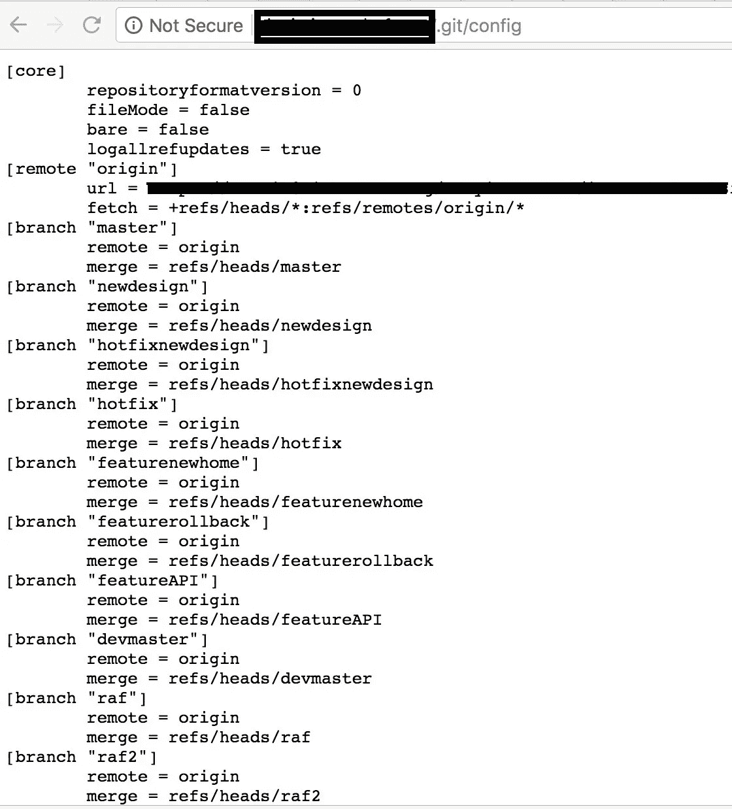
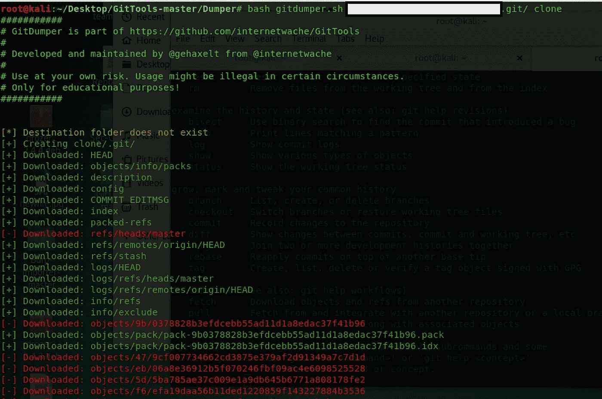
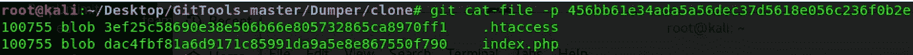

# 我怎么能下载一个印度电子商务网站的源代码！！

> 原文：<https://infosecwriteups.com/how-i-could-download-the-source-code-of-an-indian-e-commerce-website-30cb8310b6e4?source=collection_archive---------3----------------------->

嘿，大家好，我打算写下这篇文章来表达我对这个 bug 的方法，这个 bug 是我在一个网站上发现的，可以让我下载整个源代码。

所以像往常一样，我在这个网站上开始侦察，得到了 200 OK 响应代码的几个子域，但我选择了开发环境中的 dev.domain.com。对天选之子使用恐怖炸弹，我得到了。git 文件夹在其目录与 403 禁止错误代码。

我很好奇是否还有可能从这个 URL 恢复 git 库。一些开发人员托管他们的版本控制存储库(。git ),这会导致攻击者获得对应用程序源代码的完全访问权限，即使在。git 是 403 禁止的。现在我的意图是下载这个网站的代码库。为此，我阅读了 git-internals 来理解 git 如何管理存储库。Git 主要有 4 种类型的对象:

**blob:**blob 对象是单个文件或实际源代码的数据存储

**树:**将斑点分组在一起

提交:提交对象包含对另一个树对象的引用和一些其他信息(作者、提交者等)。)

**标签:**标签或标签对象只是提交对象的另一种引用，只是为了更容易引用。

我开始从浏览器上的 URL 访问 git 存储库中的一些标准文件，令我惊讶的是，我可以在浏览器中访问下面的文件。

*   头
*   对象/信息/包
*   描述
*   配置
*   提交 _ 编辑消息
*   指数
*   原木/头

在我可以访问他们的配置文件后，我想现在就下载代码回购。所以使用下面的命令，我将代码转储到我的本地机器上:

现在，git 文件夹已经在 repo 中创建好了，代码的目标文件也下载好了。为了分析这些目标文件，我使用了如下的哈希值:

我们还可以在`.git/objects/info/packs`中找到所有包文件的列表

最后，我使用 git reset — hard 命令来恢复所有未提交的更改。但是，由于这是一个潜在的危险命令，因此应该谨慎使用。

感谢阅读！！！

minali Arora([@ AroraMinali](https://twitter.com/aroraminali))