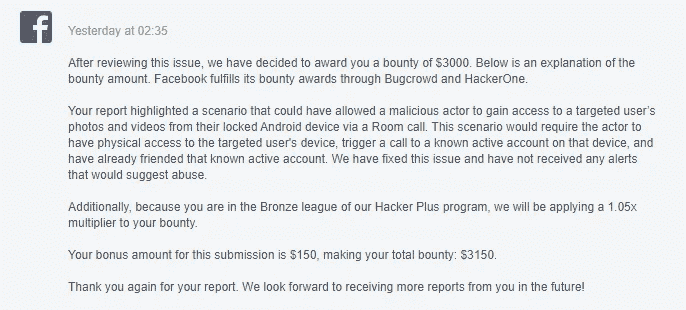

# 我怎么能在不解锁的情况下访问你手机里保存的所有私人视频/照片呢？

> 原文：<https://infosecwriteups.com/how-i-could-have-accessed-all-your-private-videos-photos-saved-inside-your-device-without-even-1a7e455ddcc8?source=collection_archive---------0----------------------->

…

> 这篇文章是关于用户保存在他/她的设备中的照片/视频等敏感隐私数据是如何通过脸书房间电话泄露出去的，即使是从一个锁定的 Android 设备上。

…

> 2020 年 10 月；我在脸书怀特哈特项目中提交了一份有效的漏洞报告，用户私人保存的视频/观看历史可能会从锁定的 Android 设备的 Messenger 调用中的“一起观看”功能中暴露出来。

 [## 用户的私人观看视频列表，保存的视频等。

### 这篇文章是关于一个暴露用户私人观看的视频列表、保存的视频、共享的视频等的漏洞…

infosecwriteups.com](/users-private-watched-videos-list-saved-videos-etc-30faa8610b33) 

简要总结一下，有；用户可以通过 messenger 呼叫受害者的帐户，然后从受害者锁定的 Android 手机接收呼叫，在不解锁手机的情况下使用呼叫屏幕上的“一起观看”功能，从而允许入侵者访问脸书用户的所有保存的视频和观看历史。所以，基本上；这里的漏洞是，脸书允许用户在设备锁定的状态下使用手表这样的敏感功能。脸书修补了这个漏洞以及类似的漏洞，要求在使用锁定的安卓手机上的敏感功能之前先解锁手机。

于是，有一天；当我突然想起那篇报道时，脑海中触发了一些想法:

> **1)如果，不是一个正常的信使呼叫；那是一个** [**的房间叫**](https://about.fb.com/news/2020/04/introducing-messenger-rooms/) **？**

,

> **2)房间呼叫中是否有类似的敏感功能，可以在不解锁手机的情况下从锁定屏幕外部访问**？

所以，没有任何延迟，

1.  我做了两个测试脸书账户；一个登录了我的 Android 手机(Let，UserA-受害者)，另一个登录了我的 PC(Let，UserB-攻击者)。
2.  在这里，UserA 的 Android 手机处于锁定状态。
3.  然后，从 UserB，我主持了一个 Messenger Room，并邀请 UserA 到这个房间&我自己也加入了这个房间。
4.  然后，从 UserB 我从“受邀用户”区给 UserA 打了电话。
5.  几秒钟后，电话在 UserA 锁定的 Android 手机上响起。
6.  然后，我拿起电话，尝试了所有已知的敏感功能，如“一起观看”、“添加联系人”等。但是他们都需要先解锁手机才能使用。
7.  然后，突然，我在呼叫的右上角看到这样的东西:

**“注意到了吗？”**

房间参与者之间形成的群组有一个聊天选项。

所以，兴奋之余，我立即点击了它。

然后，我一点击，一幅美丽的画面就像这样跳了出来:

我当时想:

不仅因为我知道我甚至不用解锁手机就可以给这个群组发消息，还因为文本框旁边有一个 **gallery** 选项。

所以，马上；我以最快的速度点击了那个选项。

看完那风景后，我就想:

我发现我可以访问该设备上的所有私人照片/视频，甚至不用解锁手机。而且；我可以通过点击任何媒体的“编辑”选项，从相同的锁定状态向受害者用户的登录脸书发布故事。

所以，我总结了所有的信息，很快向脸书做了报告。脸书安全团队在客户端快速修复了漏洞，并在服务器端进行了一些调整，以在之前易受攻击的版本中进行修补，在分流后不到一天的时间里，他们奖励了我一笔可观的奖金，这是我甚至没有想到的需要物理接触受害者设备的攻击场景。不过，我很欣赏他们基于这个漏洞会给 Android FB 用户带来的影响范围而做出的奖励决定。

最终奖励信息

> 如果你想查看我随报告一起发送的这个漏洞的 POC 视频，你可以在这里[找到它](https://drive.google.com/file/d/1UlQ_PVoXKvoJ7xn3ydezC0R2U68qVs1E/view?usp=sharing)。

…

## **感谢您阅读这篇关于具有高度影响力的漏洞的简单场景的文章。如果您有任何疑问/建议，我可以在******/**[**insta gram**](https://www.instagram.com/samiparyal_/)**上找到您。****

**…**

** [## Facebook Messenger Rooms 漏洞利用阻碍了 Android 屏幕锁定保护

### Adam Bannister 2021 年 6 月 14 日 12:40 UTC 更新时间:2021 年 6 月 14 日 13:27 UTC 研究人员获得 3000 美元的 bug 奖金

portswigger.net](https://portswigger.net/daily-swig/android-screen-lock-protection-thwarted-by-facebook-messenger-rooms-exploit)**