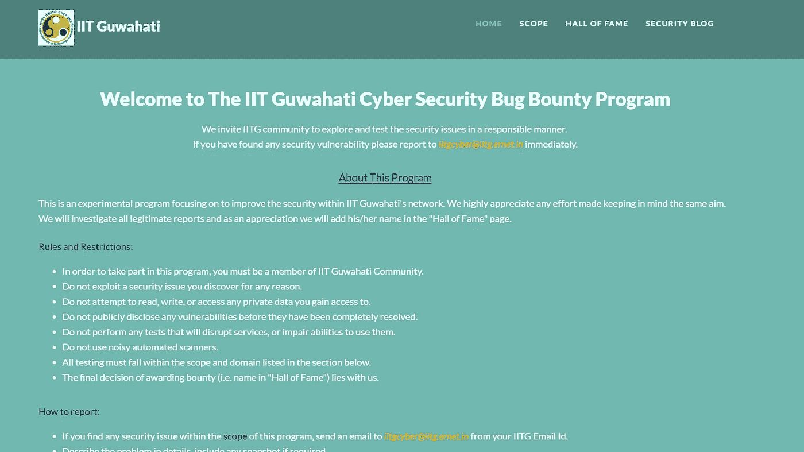

# 我怎么能黑进 IIT·古瓦哈蒂的网站。

> 原文：<https://infosecwriteups.com/how-i-could-have-hacked-iit-guwahatis-website-52dff319b056?source=collection_archive---------3----------------------->



这个故事是关于我是如何黑进 IIT·古瓦哈蒂网站的。

好吧，另一个吸引你们阅读我博客的标题。嗯，标题也不完全是假的。既然你已经打开了这个故事，让我以此为例，告诉你为什么一个臭虫奖励计划对你的大学或组织是必要的。

因此，IITG 有一个投诉预订门户网站，允许用户上传 JPG 或巴布亚新几内亚文件。然后它检查文件扩展名。这意味着，如果我试图上传一个. php 文件，它会发出警告，只允许 JPG 和 PNG 文件。但不幸的是，它也处理我认为很奇怪的请求。为了更好地理解这一点，您可以观看下面嵌入的视频。

POC 视频制作报告

```
if(!Image):
    Print Error
Process request
```

这就是弱点。你能看见它吗？不管有无错误，都会处理请求。这意味着我上传的 php 文件正在被写入服务器。修复很简单，他们只需要像这样做(添加一个 else 案例)。

```
if(!Image):
    Print Error
else:
    Process request
```

如你所见，任何脚本小子只要看到文件上传动作，就可以尝试上传一个 **php** shell。在这种情况下，网站管理员实际上是在检查上传的文件类型(如 JPG 或 PNG ),但代码中有一个小错误，这可能会导致有人关闭整个网站或损坏它。

由于 IIT·古瓦哈蒂有一个漏洞奖励计划，我用它提交了这个问题，并在其他人滥用它之前修复了它。

我还制作了另一个视频，在那里我可以把自己的名字加入名人堂。这篇文章是我于 2017 年 11 月 10 日在 **GCCS** 地区活动期间在 IIT 古瓦哈蒂演讲的一部分。

将我自己的名字添加到名人堂页面

感谢您的阅读。

和平:)