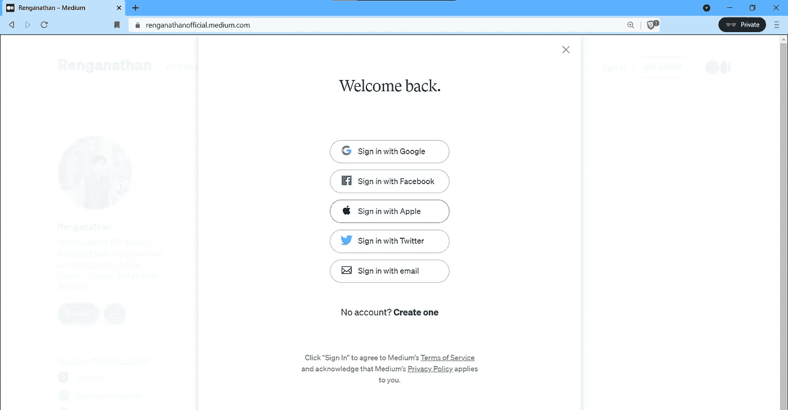
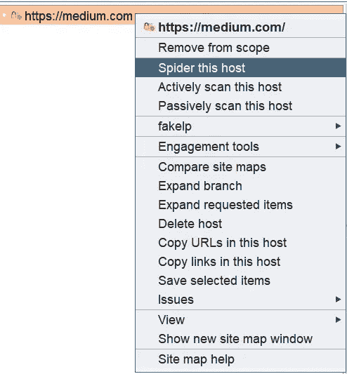
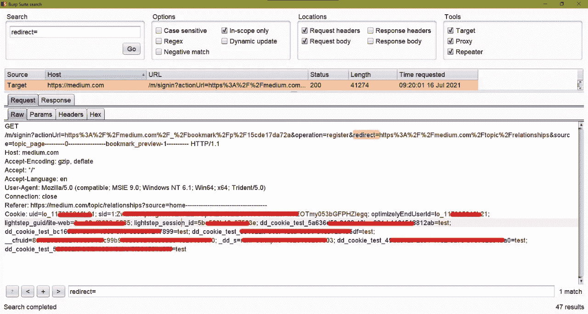
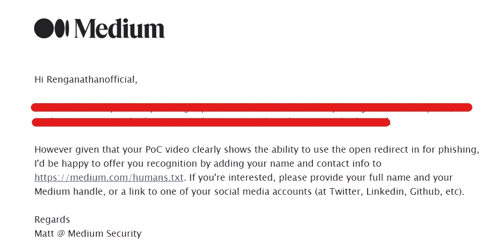
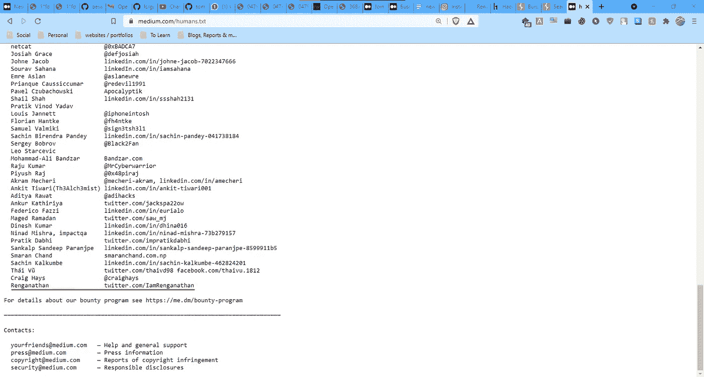

# 我是如何通过仿冒你的 FB，Twitter 和 Google 证书来入侵你的媒体账户的。

> 原文：<https://infosecwriteups.com/how-i-could-have-hacked-your-medium-account-by-phishing-your-fb-twitter-google-credentials-d53bf7096da7?source=collection_archive---------3----------------------->

你好，

我是伦加纳森。

这篇文章是关于我在 medium 上发现的一个漏洞，这个漏洞允许我通过仿冒你的 FB、Twitter 和 Google 证书来入侵你的 Medium 帐户。



中型登录

是:P

几个月前，我看到普拉蒂克·达比被列入了中等名人堂。所以我有动力在培养基上捕捉虫子。我列举了子域，并就此打住，因为我早期的方法论非常过时，而且我不擅长侦察。

所以我想再试一次。

我开始用 [Waybackurls](https://github.com/tomnomnom/waybackurls) 、[ParamSpider](https://github.com/devanshbatham/ParamSpider)&[Gau](https://github.com/lc/gau)收集有趣的参数。与此同时，我手动探索网站，也[蜘蛛](https://portswigger.net/blog/burp-2-0-where-are-the-spider-and-scanner)打嗝套件的媒介。



打嗝组曲蜘蛛网

然后过了一段时间，我开始搜索像下面这样的开放重定向参数。

```
?next=?url=?target=?rurl=?dest=?destination=?redir=redirect_uri=?redirect_url=?redirect=/redirect/cgi-bin/redirect.cgi?{}/out//out??view=/login?to=?image_url=?go=?return=?returnTo=?return_to=?checkout_url=
```

然后我注意到一个很棒的参数:

> 重定向=

我就像


打开重定向 vro



重定向=

但这不仅仅是一个开放的重定向。我改变了返回 attacker.com 的路线

当我点击用 Twitter 登录时，我被重定向到 attacker.com


这可能导致网络钓鱼社交媒体凭据。

时间线:

2021 年 7 月 15 日-报道

2021 年 7 月 18 日-由内部安全团队修补

2021 年 7 月 28 日——被问及如何在 [humans.txt](https://medium.com/humans.txt) (名人堂)中获得荣誉



被问及如何进入 [humans.txt](https://medium.com/humans.txt) (名人堂)

2021 年 7 月 29 日-入选[中等名人堂。](https://medium.com/humans.txt)



感谢阅读:)
注意安全。

[https://www.instagram.com/renganathanofficial/](https://www.instagram.com/renganathanofficial/)