# 我怎么能免费推广任何脸书网页。

> 原文：<https://infosecwriteups.com/how-i-could-have-promoted-any-facebook-page-for-free-70b0f4fc0feb?source=collection_archive---------0----------------------->

**问候大家！**

这篇博客是关于我如何免费推广我的脸书页面的。

**什么是脸书推广:**

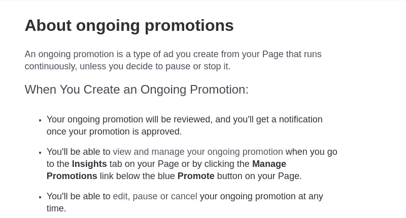

**工作原理:**

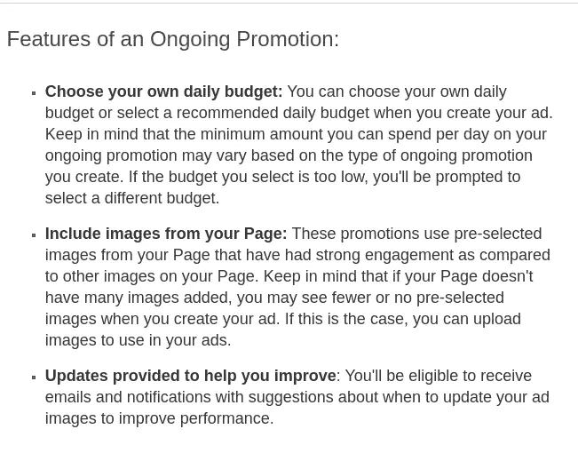

如果你想了解更多关于促销的信息，这里有链接:
[https://www.facebook.com/business/help/1189028774466371](https://www.facebook.com/business/help/1189028774466371)

所以让我们开始破解这个机制:)

我创建了一个新的 facebook 页面，并上传了一些图片。每张图片下方都有一个名为**“Boost Post”**的选项。

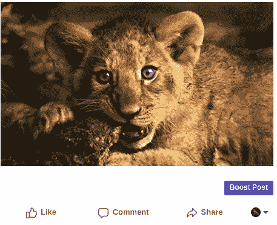

当我点击 Boost Post 时，我返回到一个新的页面，类似于:

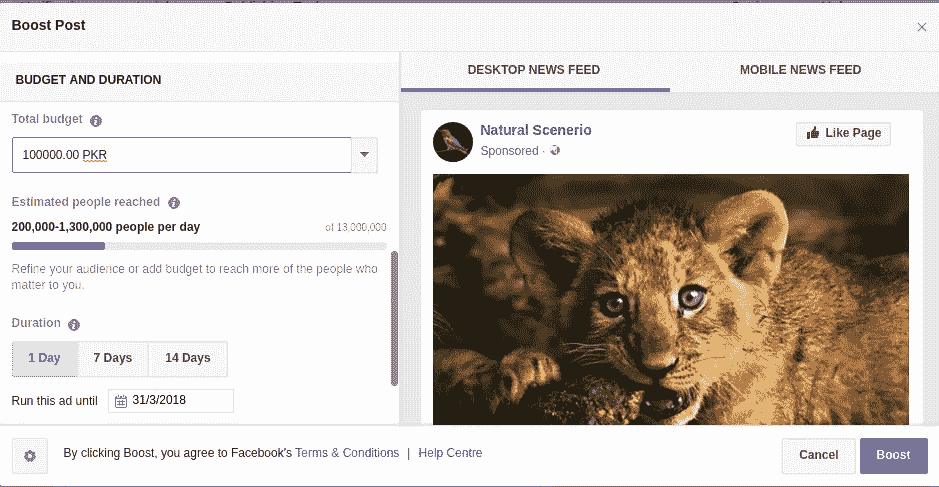

现在，我们必须在这里设置金额，以及必须投放广告的天数。于是我填好表格，点击了 Boost。facebook 要求我为交易添加有效的卡。

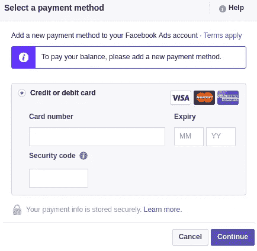

**注意:我的卡里只有 4 到 5 美元，但是我开始了一个 100000 PKR 的广告，差不多是 1000 美元。**

我添加了我的卡的详细信息，然后点击继续。它说帖子正在审核中:

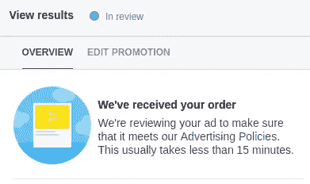

我在想，脸书可能会有一个手动检查或审查，我可能会在这之后被阻止。但是几分钟后，我收到一个通知，说你的广告已被批准。

**我就像:**

但是我不确定这个广告是否会完全播放。所以我等了几个小时，当我再次检查的时候。我和以前一样震惊。

我的帖子达到了 34792 人，获得了 7.1k 个赞。

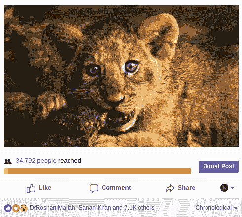

**我的反应:**

但是突然我的广告停了。我不确定它为什么会停止，以及我必须采取什么后续步骤。但是在阅读了博客和其他东西之后，我发现这是 facebook 的某种功能。

**那么它是如何工作的呢？**

当我们在脸书发布一个帖子时，它不会从我们的卡中扣钱，而是将钱存在我们的帐户中，我们需要稍后支付，它被命名为“**阈值金额**”。但是门槛是有限度的。因此，当我们的帖子达到 2500 卢比(20-25 美元)的上限时，广告将自动停止，并在支付该金额后再次开始。所以我们可以只推广 2500pkr 的广告。

**我必须支付的金额:**

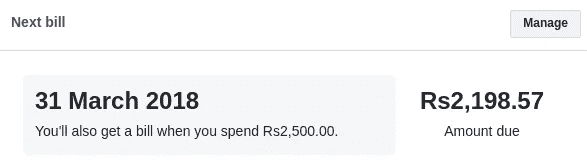

**阈值限制:**

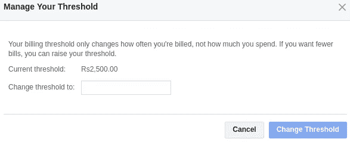

我试图改变阈值限制，但它没有发生:(
我尝试了许多不同的方法来绕过这种保护，但都是徒劳的。所以我把它留下了。但是几天后，我有了一个想法。我想如果我们改变网页的所有权呢？
那又怎样？我继续前进，改变了该页面的管理员，并删除了以前的管理员。

然后嘣！！！

这次没有显示到期金额，所以通过再次执行相同的过程，我可以尽可能多地增加帖子。

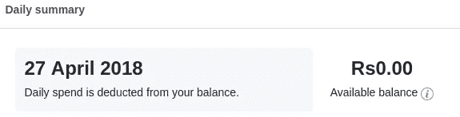

**复制步骤:**

1.  创建一个脸书页面并发布帖子。
2.  添加一张至少有 2-3 美元的有效卡。
3.  广告将启动并运行，直到达到其阈值限制。【https://www.facebook.com/ads/manager】

4.  一旦广告达到其阈值限制，改变页面的管理员，并删除以前的管理员。
5.  现在，通过提升其他或相同的帖子，再次开始整个过程:)

我没有浪费太多的时间，并报告给 facebook，但起初他们无法复制它。所以我尽可能多地向他们提供信息。事实上，facebook 的问题在于它没有验证卡中的金额。因此，在闲聊了几天后，他们终于转载了这篇文章，他们出色的回答让我觉得很有趣:

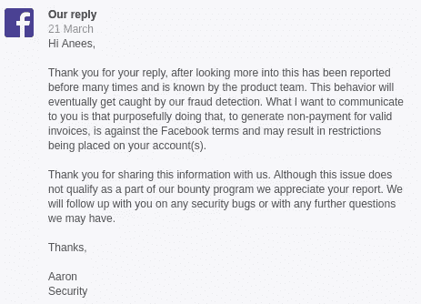

好的，所以当我第一次向他们报告时，他们已经意识到了这个问题，但无法重现:P(只有 Leets 能理解我的意思。我说如果你不想认真的话，没问题。

**注意:**他们的回复中有一点值得注意，那就是**“这种行为最终会被我们的欺诈检测发现。”**

我说为什么不挑战我自己，看看我是否会被抓住。所以我制作了一个全新的页面，上传了一段视频和一些图片，并一次又一次地使用相同的过程来增强它们。

结果如下:

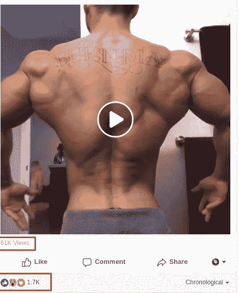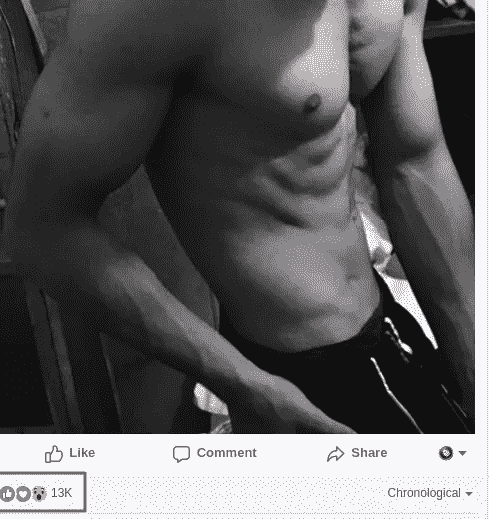

这不仅仅局限于帖子，脸书的页面也可以得到提升。

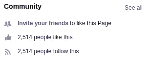

一天内获得 2，514 个页面赞+关注者:)

我向 facebook 展示了这些图片，他们现在已经实施了一些修复，但不幸的是“每个修复都有一个旁路”:D

我没有得到任何奖励，因为他们已经意识到了这个问题。

我希望你喜欢这篇文章。

最诚挚的问候，
阿尼斯·可汗