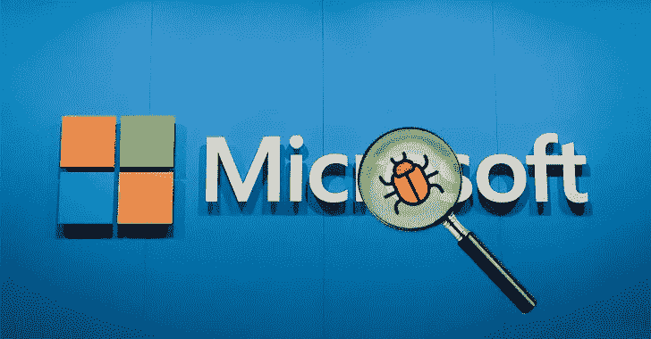

# 我怎么可能通过简单的邮件阅读你的机密错误报告？

> 原文：<https://infosecwriteups.com/how-i-could-have-read-your-confidential-bug-reports-by-simple-mail-cfd2e4f8e25c?source=collection_archive---------2----------------------->

来源:互联网

嘿，各位，希望你们平安无事。

我最近在微软研究门户网站上发现了一个 bug，它可能会让我阅读向微软报告的安全研究人员的 bug 报告更新，这是我在随机探索时发现的一个简单而有趣的事情。

## **什么是 bug？**

这是一个信息泄露错误，通过漏洞报告 ID 泄露报告更新的信息。

## **如何获取漏洞报告 ID？**

漏洞报告 ID 为 VULN- <some number="">。这是每个报告的唯一标识符。Microsoft 通过此 ID 验证错误报告。对于每一个错误报告，他们给出一个 ID，这个 ID 是一个 010001 后面跟着 010002 的数字，这个数字很容易被猜到。</some>

## 如何重现 bug？

1.  用户 a 报告了一个 bug。
2.  从用户 B 的邮件 ID 向微软的漏洞报告邮件 ID 发送一封邮件，说一些信息，主题行为 VULN-<the report="" number=""></the>
3.  现在，用户 B 被添加到微软的票务门户。

现在，用户 B 可以在他不知情的情况下接收用户 A 的错误报告的更新。

这个漏洞会如何影响微软？

如果攻击者通过将报告编号更改为 Microsoft 的邮件 ID 来发送自动邮件，那么他可能已经听到了错误报告更新。如果任何敏感信息通过邮件发送，那么攻击者可以出于任何恶意目的使用它。

来源:互联网

这个 bug 被微软指定为重要并修复了。这没有被授予奖金，因为它超出了微软条款的范围。

感谢阅读，日安！:-)

## 时间线:

2021 年 1 月 7 日**报告的错误**

在 **21/07/2021** 分配的错误

于 **16/09/2021** 发送给开发团队

修正了 2021 年 10 月 21 日**的错误**

`***Note: This blog was approved by Microsoft***`

跟我来:

> **insta gram**:[https://www.instagram.com/sudhakar_._m/](https://www.instagram.com/sudhakar_._m/)
> 
> 【https://www.facebook.com/sudhakarmuthumani00】脸书:[T21](https://www.facebook.com/sudhakarmuthumani00)
> 
> **推特**:[https://twitter.com/Sudhakarmuthu04](https://twitter.com/Sudhakarmuthu04)
> 
> **领英**:[https://www.linkedin.com/in/sudhakarmuthumani/](https://www.linkedin.com/in/sudhakarmuthumani/)

🔈🔈Infosec Writeups 正在组织其首次虚拟会议和网络活动。如果你对信息安全感兴趣，这是最酷的地方，有 16 个令人难以置信的演讲者和 10 多个小时充满力量的讨论会议。 [**查看更多详情并在此注册。**](https://iwcon.live/)

 [## IWCon2022 - Infosec 书面报告虚拟会议

### 与世界上最优秀的信息安全专家建立联系。了解网络安全专家如何取得成功。将新技能添加到您的…

iwcon.live](https://iwcon.live/)