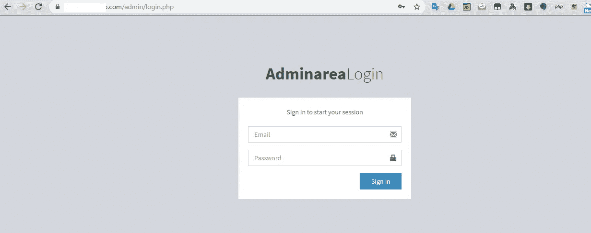
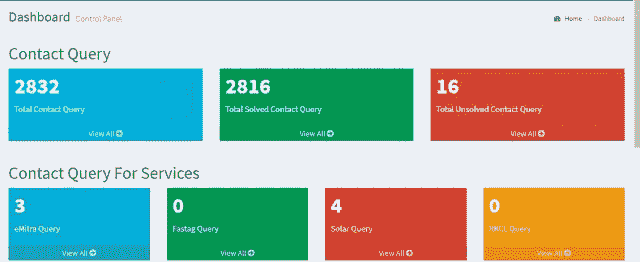
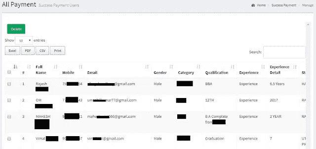

# 我是如何获取成千上万人的个人信息的

> 原文：<https://infosecwriteups.com/how-i-couldve-accessed-personal-details-of-tens-of-thousands-of-people-c20112f2548b?source=collection_archive---------0----------------------->

## 一家印度公司泄露了数万人的 PII 和私人信息。

菲利普·卡岑伯格在 [Unsplash](https://unsplash.com/s/photos/computer-security?utm_source=unsplash&utm_medium=referral&utm_content=creditCopyText) 上拍摄的照片

这是我在一家从事不同领域工作的公司中发现的安全问题。他们制造不同类型的电子设备，并为公众提供了一个简单的方法来注册和利用不同的政府计划的好处。假设公司名称是 xyz.com，域名是 XYZ。

他们为人们提供了一种通过他们的服务中心注册各种政府服务的方式，就像政府机构一样，公众可以注册/申请任何类型的政府服务、计划等。他们也是州政府政府计划的授权服务提供商。

我正在检查他们网站的功能，注意到在 */admin* 下有一个登录网址。我访问了 */admin/login.php* ，看到了一个登录页面。

我尝试了 5-10 种不同的用户密码组合，但没有一种有效。然后，我决定在登录表单中尝试 sqli。像 noooobs 创建的大多数 PHP 站点一样，这个站点也容易受到登录形式的 sqli 攻击。

*电子邮件:admin@example.com
密码:1 '或 1=1 -*

我进入了管理面板，我看到了身份证，PAN 卡，Aadhar 卡等扫描件，还有成千上万人的电子邮件，手机和其他详细信息。

# 采取的步骤

他们没有任何 VDP 或 BBP。我通过电子邮件联系了他们，14 天内没有得到他们的回复。

我威胁他们，如果他们不在 2 周内修复，我将清除他们的数据库，因为他们没有任何权利泄露公众的敏感信息。

这一次，他们用了 10 天修复了漏洞却没有回复我的邮件。

感谢阅读。

*关注* [*Infosec 报道*](https://medium.com/bugbountywriteup) *获取更多此类精彩报道。*

 [## 信息安全报道

### 收集了世界上最好的黑客的文章，主题从 bug 奖金和 CTF 到 vulnhub…

medium.com](https://medium.com/bugbountywriteup)