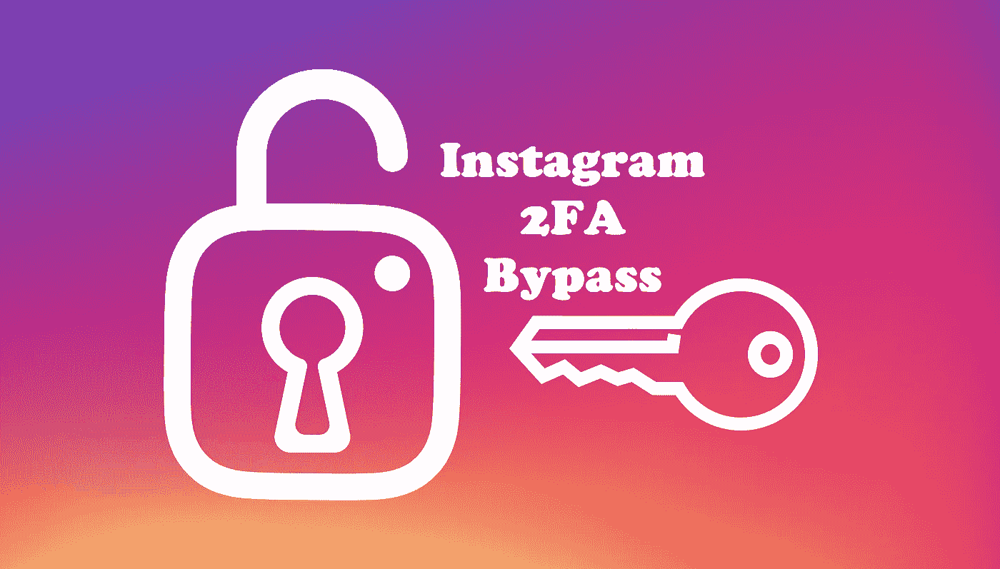
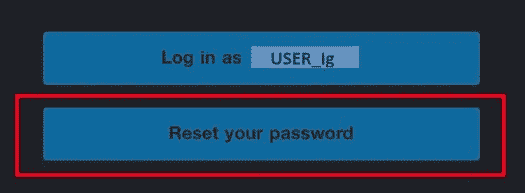
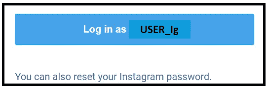
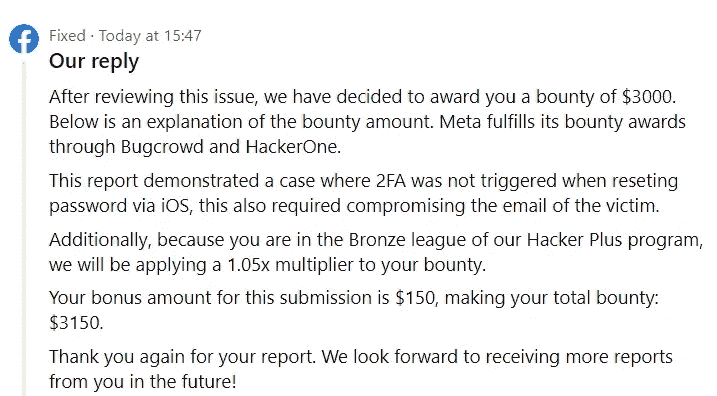

# 我怎么能再一次绕过 Instagram 的 2FA 安全系统呢？

> 原文：<https://infosecwriteups.com/how-i-couldve-bypassed-the-2fa-security-of-instagram-once-again-43c05cc9b755?source=collection_archive---------0----------------------->

…

> 这篇文章是关于我如何再次找到绕过 Instagram 的 2FA(双因素认证)安全性的方法，但这次任何人都可以通过受害者的电子邮件访问轻松做到这一点。看到这个非常简洁的易受攻击的端点，facebook 安全团队很方便地承认这个漏洞报告是有效的。

所以当我真的对使用 Instagram 连接的电子邮件帐户绕过 Instagram 的 2FA 安全性感兴趣时，这就开始了，因为我一直觉得，这种集成有点不太安全，可能有办法绕过它。**2020 年 11 月**，我发现了一种绕过 Instagram 中的 2FA 的方法，使用 Instagram 中的“***secure your account here***”选项，该选项带有“ ***Email Changed*** ”通知邮件。

 [## Instagram 上的 2FA 旁路通过易受攻击的端点

### 这份报告是关于用户在 Instagram 登录时使用“此处安全帐户”选项时丢失 2FA 检查的…

infosecwriteups.com](/2fa-bypass-on-instagram-through-a-vulnerable-endpoint-b092498af178) 

但是由于它对攻击的高度复杂性，脸书 Sec 团队关闭了它作为信息，并没有修复它。但是正如我在报告中提到的。

> “漏洞就是漏洞&如果不修复，它可能会在某一天以某种方式影响或打开更多场景的大门”

我仍然觉得可能有办法使用电子邮件绕过 2FA，但我当时并没有真的在那里测试，直到 **DMs** 开始在我的 Instagram 消息请求中泛滥，不同的人要求我绕过他们的 Instagram 账户的 **2FA** 。一些人需要真正的帮助，因为他们失去了验证 2FA 的方法，无法重新进入他们的 Instagram 个人/商业账户。但是，当然在很多情况下；我这边什么也做不了，只能告诉他们如何联系 Instagram 帮助恢复 2FA。但是，这种不满也促使我寻找绕过 2FA 的巧妙方法。

今年 1 月下旬，参考之前的报告，我开始寻找将用户 Instagram 账户的访问与电子邮件本身联系起来的不同端点。使用来自 Instagram 的关于密码更改、电子邮件更改、密码重置、2FA 启用、2FA 禁用等不同时间段的几封自动电子邮件；我开始比较它们和它们携带的端点，然后我注意到当前的重置邮件中有一个独特的按钮。

“**我们让回到 Instagram 变得很容易**”

## ***其实是的，由于这个容易多了；)***

所以，这些天；当用户使用'**忘记密码**'选项请求登录链接时，会出现两个按钮，一个；**直接登录按钮** &另一个**密码重置按钮**。但是，如果你在前几年已经注意到了。以前不是这样的。你只会得到一个按钮'**登录为…** '，下面还有一个重置令牌链接'**。你也可以像这样** [**重置你的 Instagram 密码**](https://www.instagram.com/accounts/password/reset/confirm/...) ':

从 Instagram 重置电子邮件:**之前**

因此，因为有一个新的按钮用于相同的重置功能；在手机上测试这个按钮 **让我很好奇，因为通常当包含一个可点击的按钮时，应用程序内部会设计一个新的界面，当点击时按钮会重定向到这个界面。正如我的 [**期望**](https://pastebin.com/CyP9w8C4) 一样，在点击上面的“**重置你的密码**”**按钮**后，我被重定向到 Instagram 应用程序，到了一个相对明显更新的界面，我猜是为了重置 Instagram 帐户的密码。**

因此，我毫不犹豫地使用以下程序启动了 2FA 旁路测试:

> **假设我的手机是攻击者的设备，我的电脑是受害者的设备**，
> 
> *1。我做了一个测试 Instagram 账号，使用 Instagram web 的账号* ***启用了 2FA 安全*** *。*
> 
> *2。然后，考虑到* ***攻击者泄露了受害者的邮箱账号*** *，攻击者在各自的邮箱 app 中登录受害者的邮箱账号。*
> 
> *3。之后，攻击者只需进入****Instagram>>忘记密码*** *并输入受害者的 insta gram 账户用户名，并在其电子邮件* *中要求一个* ***登录链接。***
> 
> *4。最后，攻击者获得了来自 Instagram 的“* ***”电子邮件，在受害者的电子邮件帐户中，点击易受攻击的“* ***重置您的密码*** *”按钮；获取* ***重定向至 Instagram app*** *至该密码重置界面，重置密码并***

> 你猜怎么着？

恭喜你！🥳，你没有经过任何 **2FA 验证/ 2FA 检查**就进入了 Instagram 账户。

更有趣的是，攻击者现在可以禁用受害者帐户的 2FA，前往**设置> >安全> >双因素认证，**完全接管受害者的“安全”Instagram 帐户。

> 如果你像“**一样好奇网络呢？”点击 Instagram web/PC 上的“重置密码”按钮后会发生什么？。嗯，在网络中；它不是易受攻击的，该按钮会将用户重定向到同一个旧的 Instagram 重置页面，在那里您可以重置密码，但由于正确的 2FA 检查，它会强制要求 OTP 以成功进入 Instagram 帐户。**

因此，我很快总结了这个漏洞，并尽快向脸书安全团队报告了这个漏洞。脸书安全团队的泰勒在一天之内迅速对漏洞进行了分类，并将其发送出去进行修复。几天后，产品开发团队正确地修复了它，并奖励了我一笔奖金。

来自脸书的奖励信息

> *如果你想查看我随报告发的这个漏洞的 POC 视频，可以在这里* *找到* [*。*](https://drive.google.com/file/d/1Q3MsA68jwYuuYnoVYs-gstA9yUz9yUZy/view?usp=sharing)

…

## 感谢您阅读这篇关于一个简单的易受攻击的按钮和界面如何让任何人绕过 Instagram 的 2FA 安全性的文章。如果你有任何疑问/建议，我可以在[脸书](https://www.facebook.com/samiparyalfb/) / [Instagram](https://www.instagram.com/samiparyal_/) 上找到你。

…