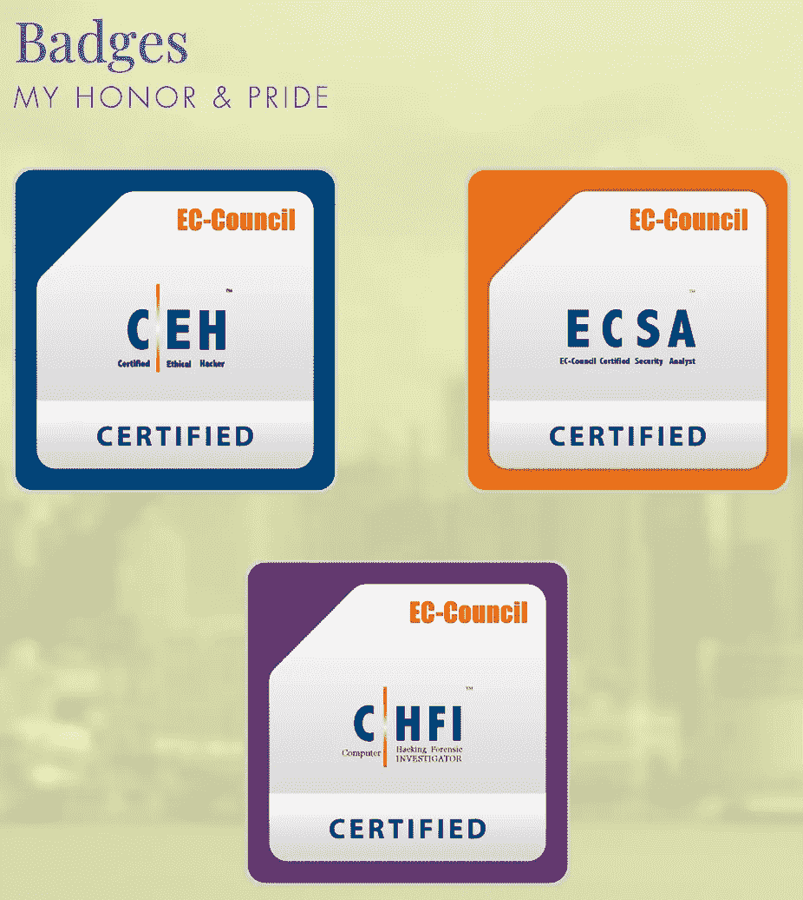
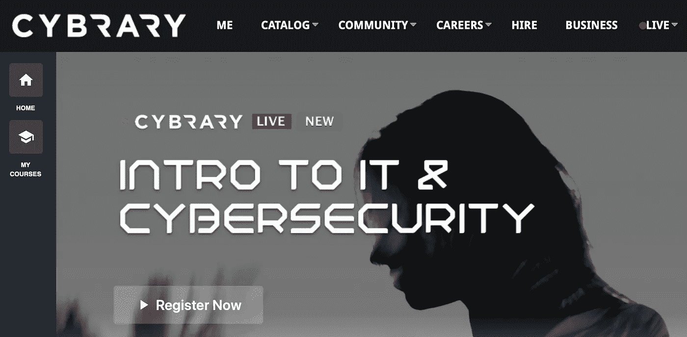

# 我如何在 20 天内获得 CEH、CHFI 和 ESCA 认证？

> 原文：<https://infosecwriteups.com/how-i-cracked-ceh-chfi-esca-certifications-within-20-days-b289a038a2cf?source=collection_archive---------1----------------------->

> 最近很多人问我，我是如何在这么短的时间内连续通过这些考试的，因为有太多的人要求我写这篇文章。

让我们从头开始，那是 2015 年，我刚刚结束为期两天的道德黑客课程回家，我想在网络安全领域认真指导我的职业生涯。就在那时，我决定我需要尽快完成认证，因为在印度，人们重视认证远远超过技能，所以这就是开始。不，这不是一夜之间发生的。

# 让我们开始吧！

我首先需要弄清楚的是，参加考试和拥有该领域的知识是不一样的。我见过在网络安全方面拥有惊人技能的杰出人士在通过这些考试时失败。所以，你需要做好相应的准备，并牢记在心。如果你和我一样对考试感到紧张，那就花点时间专门准备这些考试，如果需要的话，在参加考试前休息几天。

那么，现在我们已经清楚了，让我们进入真正的东西，如何实际准备考试。

1.  [电子图书馆](https://www.cybrary.it)

关于这些考试的准备，这是我能给你的最好的建议。为了准备这些考试，Cybrary 有你能得到的最好的视频收藏。他们有一个格式良好的课程结构和视频教程，这对那些不能坐下来读厚书的人很有帮助。

2.[帕斯捷潘](https://pastebin.com/mzzcgcPk)

这是我能找到的准备这些考试的第二好的视频教程，因为它们有惊人的视频，可以证明对全面发展你的道德黑客技能非常有帮助。它为你的理论知识打下了良好的基础，这对考试也很重要。

3.培训中心

你准备考试的培训中心也非常有帮助，因为他们将是你参加考试的人，并消除你的疑虑。尽可能地利用这一点，因为他们日复一日地帮助学生通过考试。他们也知道你在考试中可能会遇到的问题。

4.[技能组合](https://www.skillset.com)

为这些考试进行练习的最好方法之一是通过 skillset。他们有一大套练习题，可以让你为这些考试做好准备，并让你知道考试会是怎样的。他们有专门的课程材料，针对每一种考试，为你做好相应的准备。如果你没有通过考试，如果你在他们的网站上有 100 分，他们保证会退款。因此，正如你所看到的，这对你来说意义重大，一套考试的练习也可以帮助你应付其他各种考试。

5.[欠费](http://www.aoowe.com)(不推荐)

你们中的一些人仍然不确定自己是否准备好参加考试。对于那些需要接近 100%保证的人，你可以访问 aoowe 网站，浏览他们的一系列问题。他们有一个惊人的问题集，如果你浏览所有的问题，将近 50%-60%的问题将来自这里，这并不多。还有 2-3 个类似的网站，如果你浏览它们，几乎 100%的问题都会在考试中重复出现。

我真的不推荐它，但是因为考试真的很昂贵，不是我们所有人都能够负担得起一遍又一遍的考试，这可能是一个你可以用来破解这些考试的卑鄙伎俩。

# 破解密码！

如果你遵循上面的建议，我保证你可以毫不费力地通过这些考试。这些考试是判断你在网络安全领域的能力的一种方式，他们的问题是测试这一点的好方法。毫无疑问，理论测试不是最好的方法之一，但它仍然是一个被许多人认可的标准，并且在一定程度上是有效的。

有了适当的准备和一点点运气，你一定能轻松通过这些考试。我祝那些正在准备考试或打算考试的人好运。

**如果你喜欢，请鼓掌&让我们合作吧。获取、设置、破解！**

网址:【aditya12anand.com】T4|捐赠:[paypal.me/aditya12anand](https://paypal.me/aditya12anand)

电报:[https://t.me/aditya12anand](https://t.me/aditya12anand)

推特:[twitter.com/aditya12anand](https://twitter.com/aditya12anand?source=post_page---------------------------)

领英:[linkedin.com/in/aditya12anand/](https://www.linkedin.com/in/aditya12anand/?source=post_page---------------------------)

电子邮件:aditya12anand@protonmail.com