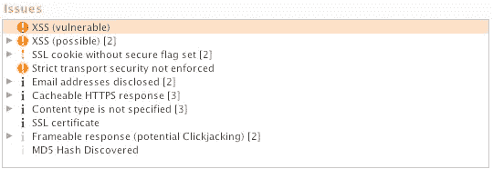
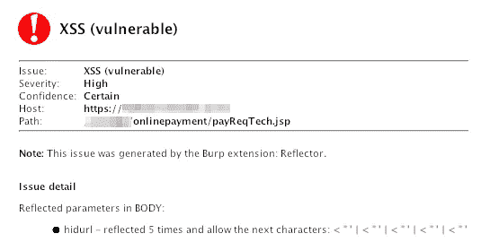
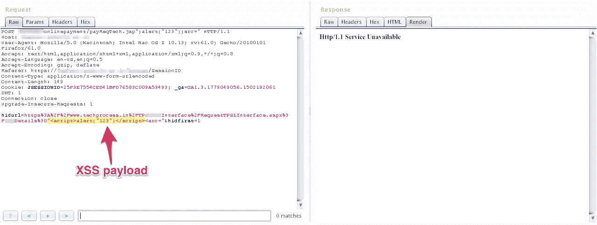
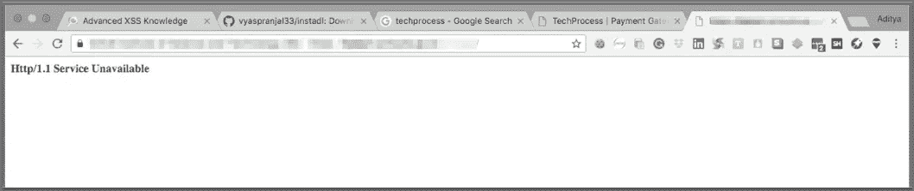

# 我是如何用一行命令就让一个网站崩溃的？

> 原文：<https://infosecwriteups.com/how-i-crashed-a-website-with-a-single-line-command-f39b2a805b62?source=collection_archive---------0----------------------->

首先，不要这样做，我自己也不完全明白为什么会这样，但它确实发生了，让我告诉你是如何发生的。因此，对我来说，这是一个正常无聊的一天，阅读随机的钢笔测试报告，像往常一样玩打嗝套件。就在那时，我遇到了我遇到过的最奇怪的 bug，如果那是一个 bug 或者是完全不同的东西。我对自己刚才的所作所为感到惊讶，但同时我也从内心感到恐惧。

# 让我们开始吧！

所以，我在阅读这些文章的同时，也在尝试看看我是否能在那个网站上进行虚假支付，比如说 example.com。现在 example.com/payment_login,是该网站支付入口的登录页面。无论什么时候做笔式测试，记住这一点，公司可能会同意你关闭他们的主页，但永远不会同意他们的支付门户。所以，我早些时候已经侵入了他们的系统，在那里我获得了他们所有用户的数据，还有登录凭证等等，我是如何做到的是一个不同时期的故事，只知道这是因为默认密码的使用而发生的。

使用其中一个账户，我登录了网站，并试图在不支付实际金额的情况下进行交易，或者以某种可能的方式操纵交易。我总是喜欢玩交易，因为我觉得这是网站最重要的部分之一。如果你做不到这一点，那么它会给你最大的打击。

对他们来说幸运的是，他们的交易页面非常安全，在一天中苦干 3 个小时后，我几乎找不到一个 bug。幸运的是，我一直打着饱嗝。

# 我很幸运还是不太幸运？

当我在那个网站的支付入口上进行笔测试时，打嗝套件一直开着。我太专注于试图在 Burp 的 Proxy 标签中查看通过 intercept 传输的数据包的每个部分，以至于我在整个时间内从未打开过 Burp 的 Target 标签。

沮丧和沮丧，当我要停止笔测试一段时间，我只是打开目标标签，看到一个大红点，表示某些漏洞存在于网页上，我正在笔测试。

很少能看到这些红点，因为现在大多数的网络开发者不会在他们的网站上留下这样的开口。我很兴奋终于找到了一些东西。说实话，我看到红点时有点惊讶，我阅读了 Burp 在下面的咨询部分记录的关于特定漏洞的所有内容。

# 创建有效负载

一旦我理解了 XSS 问题，然后我浏览了 html 源代码，给我一个想法，我应该在哪里插入 XSS 有效载荷，它应该是什么样子。这很简单，因为我不需要用大脑来编码它们。像

When I saw the response, I was actually confused as to what happened. I couldn’t understand why wasn’t it working properly in the repeater. So to check it out I immediately went over to the browser and refreshed the webpage and guess what do I see there.

# Phreak-ed out!

As soon as I saw this I knew I was in trouble, I thought they blocked my IP or traced me and have blacklisted me. Later on, I realised I crashed up their website. I couldn’t believe myself that an XSS attack ended up doing this ( I still don’t, feel free to explain why it happened in the comments ). The website remained down for half an hour before someone noticed it and told them. I was in total disarray that half an hour.

> Never, ever do the next steps that I carried out. Do not try this at home!

I did the dumbest thing ever in my pen-testing history. I had to be sure that it was my payload that caused the website to crash and not some coincidence. So, I sent that packet once again when the website was up and yes, it crashed again. This time around the website was up in 10 minutes or so.

# Moral

> Don’t tread in areas you don’t understand, ‘cause one small mistake can cost the corporation a lot of money which is surely gonna bite you back. Try to be as clear as possible about the outcomes of what you are trying to do.
> 
> Above all if something bad happens don’t try to carry it out again to check if it was you or a coincidence no matter how tempting it might be.
> 
> Never, try and crash a website as sometimes small things are overlooked by the devs but something this big is rarely missed and can have serious repercussions.

**这样的角色如果你喜欢，请鼓掌&让我们合作吧。获取、设置、破解！**

网址:【aditya12anand.com】T2|捐赠:【paypal.me/aditya12anand】T4

电报:[https://t.me/aditya12anand](https://t.me/aditya12anand)

推特:[twitter.com/aditya12anand](https://twitter.com/aditya12anand?source=post_page---------------------------)

领英:[linkedin.com/in/aditya12anand/](https://www.linkedin.com/in/aditya12anand/?source=post_page---------------------------)

电子邮件:aditya12anand@protonmail.com

# 注意:-

我需要特别指出的是，我之所以能够发现这个错误，是因为我在我的打嗝套件中安装了 XSS 反射器扩展。后来很少有人向我提到它，为了检查它，我在没有扩展的情况下进行了扫描，就像他们说的那样，我无法找到 bug。