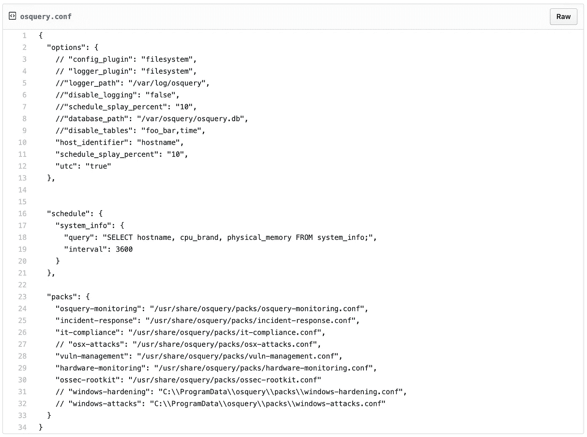
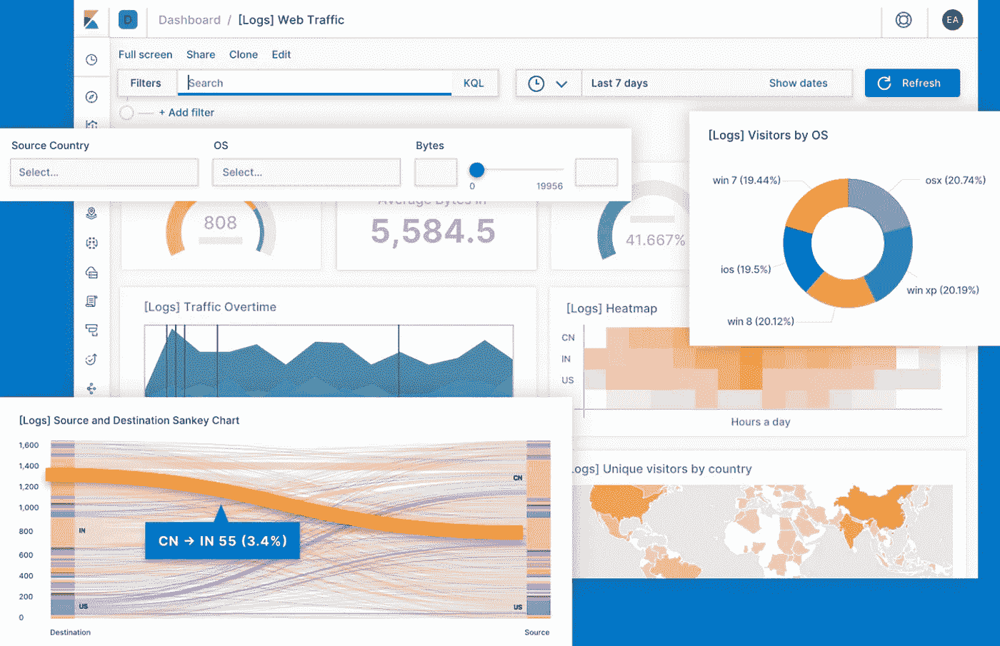

# 我如何使用 ELK Stack 开发一个成熟的安全运营中心？

> 原文：<https://infosecwriteups.com/how-i-developed-a-full-fledged-security-operations-centre-using-elk-stack-8dfaec821e23?source=collection_archive---------0----------------------->

> 在网络上检测到与恶意勒索软件签名匹配的数据包。安全行动中心的仪表盘上实时升起了一面红旗。安全团队已经找到哪个用户收到了该数据包，并立即联系了他们，并建议他们需要采取的步骤。

您是否意识到在上述场景中刚刚发生了什么？由于安全运营中心持续记录和高级监控，一个可能造成严重破坏的问题已经得到控制。这让我们了解了 SOC 在现实生活中的重要性。

现在，让我们深入了解如何创建您自己的安全运营中心，并帮助您的组织保持领先和安全。

# 我们开始吧！

我是看着各种科幻电影长大的，其中大部分都是基于网络安全的，在网络安全中，犯罪大师试图入侵组织，优秀的黑客试图阻止他们。他们在安全运营中心工作，发现黑客，然后进行反击，找到犯罪黑客，并将其逮捕。

开发一些更接近它的东西是我童年的梦想，但直到现在这似乎是一个不可能的任务。当我的同事让我开发这个时，我开始着手这项工作，他指导我研究[麋鹿栈](https://www.elastic.co)和 [OSquery](https://osquery.io)

因此，让我先向您解释一下安全运行中心是如何运作的。第一步是收集尽可能多的日志，尝试收集不同的日志，如网络日志、系统日志、命令行日志等。您收集的日志越多越好，请记住，您确实需要对它们进行解析才能理解它们。第二步是使用这些日志从中提取数据，并通过专门监控这些日志的某些参数来使用这些数据，然后在控制面板上实时显示这些数据。

## -日志记录( [OSquery](https://osquery.io) )

因此，第一步是生成日志并正确存储它们，以便您可以使用它们从中提取有意义的数据。为了完成这个过程，我们使用 OSquery，这个工具是由脸书的 devs 开发的。所以我们使用 OSquery 的原因是我们可以编写自己的配置文件，在 OSquery 守护进程的帮助下，我们开始记录数据并将它们存储在系统中。这些日志可以包含海量的信息，你可以在这里查看。根据您的需求，您可以获得大量的日志，然后将其存储起来以备将来使用。

您可以下载 osquery 并使用它来了解它给出了什么信息以及什么对您来说是重要的。下面提到了我一直使用的默认 osquery 配置，你可以根据自己的需要进行更改。您可以从[这里](https://gist.github.com/anand1996aditya/3a6ead64fe97c9529eeb76a518234f0f)为自己复制配置。

你可以在这里继续进行整个安装过程，深入了解 OSquery [。现在我们正在生成大量的日志，让我们找到一种方法来正确地记录它们，并将其显示在仪表板上，以便我们可以获得反馈并了解正在发生的事情。](https://osquery.readthedocs.io/en/stable/)

## -汇总和分析日志([麋鹿栈](https://www.elastic.co))

我们已经获得了大量的日志，但如果我们能弄清楚这意味着什么，这都是垃圾，为此我们需要搜索日志中我们认为是危险信号的详细信息，并将其显示给安全团队。一旦这些危险信号被展示给安全团队，他们就可以着手处理并尝试应对。

我用来将本地机器上保存的日志保存到仪表板的工具如下。

## 1.弹性搜索

这个工具是一个非常优化和快速的搜索引擎，它在后台使用 [Apache Lucene](https://lucene.apache.org) 。它是我们项目的首选工具，因为我们生成的日志数量巨大，如果我们不能快速轻松地从中提取数据，那么拥有这些精美日志的意义就变得毫无意义。ElasticSearch 需要 json 格式的数据日志来执行高效的搜索，幸运的是，OSquery 以 json 格式保存了他们的日志。

你可以在这里浏览设置 ElasticSearch [的细节，并通读详细的文档来更好地了解它。](https://www.elastic.co/guide/en/elasticsearch/reference/current/getting-started.html)

## 2.搜索

这些是默认情况下由 ELK 堆栈提供的监控选项，用于增强您的数据记录功能。Beats 可以看作是一堆工具，由 [Filebeat](https://www.elastic.co/guide/en/beats/filebeat/current/filebeat-getting-started.html) 、 [Auditbeat](https://www.elastic.co/guide/en/beats/auditbeat/current/auditbeat-getting-started.html) 、 [Packetbeat](https://www.elastic.co/guide/en/beats/packetbeat/current/packetbeat-getting-started.html) 、 [Heartbeat](https://www.elastic.co/guide/en/beats/heartbeat/current/heartbeat-getting-started.html) 等组成。

*   filebeat——它是转发和集中日志数据的运送器。
*   audit beat——安装在服务器上的一个发送器，用于审计系统上用户和进程的活动。
*   Packetbeat -实时网络数据包分析器，可与 ElasticSearch 一起使用，提供一个*应用程序监控和性能分析系统。*
*   Heartbeat -安装在远程服务器上的守护程序，用于定期检查服务的状态并确定它们是否可用

beats 下的 elastic stack 还提供了其他工具，您可以在这里找到并根据您的需求实现它们。

## 3.基巴纳

Kibana 是 ELK stack 提供的这套工具中我们需要的最后一个工具。它用于帮助系统管理员和安全专业人员可视化他们通过运行各种进程记录的数据。我们可以看看与 Kibana 同步使用的各种其他弹性堆栈特性。仪表板真的很神奇，可以根据我们的喜好通过传入查询和我们需要的输出进行更改。

基巴纳仪表板

你可以通过[文档](https://www.elastic.co/guide/en/kibana/current/getting-started.html)来正确配置 Kibana，然后你可以吹嘘你自己的安全操作中心。

# 道德的

安全运营中心是将安全放在首位的组织的必备设施。从本文中我们可以了解到，设置这些仪表板并不困难，您所需要做的只是根据您的需要更改配置文件，您可以在一个小时内设置自己的 SOC。这种 SOC 提供的控制量确实令人惊叹，您可以通过监视网络上发生的事情，用户正在执行 CPU/GPU 密集型工作等，使您的组织变得非常安全。

> 附言:如果你需要任何帮助来为你自己的家或你的组织设置这个，请随时联系我，让我们合作吧！

如果你喜欢，请鼓掌让我们合作吧。获取、设置、破解！

网址:【aditya12anand.com】T2|捐赠:【paypal.me/aditya12anand】T4

电报:[https://t.me/aditya12anand](https://t.me/aditya12anand)

推特:[twitter.com/aditya12anand](https://twitter.com/aditya12anand?source=post_page---------------------------)

领英:[linkedin.com/in/aditya12anand/](https://www.linkedin.com/in/aditya12anand/?source=post_page---------------------------)

电子邮件:aditya12anand@protonmail.com

*关注* [*Infosec 报道*](https://medium.com/bugbountywriteup) *获取更多此类精彩报道。*

 [## 信息安全报道

### 收集了世界上最好的黑客的文章，主题从 bug 奖金和 CTF 到 vulnhub…

medium.com](https://medium.com/bugbountywriteup)