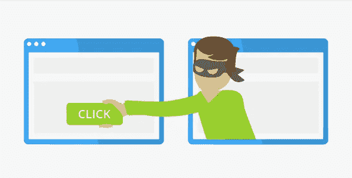

# 我是如何通过点击劫持来接管整个账户的

> 原文：<https://infosecwriteups.com/how-i-did-full-account-takeover-by-clickjacking-6f0873278d01?source=collection_archive---------0----------------------->

大家好，今天我要告诉你我是如何从点击劫持到完全接管帐户的，所以如果有人不知道什么是点击劫持，那么我简单地告诉你。

点击劫持是一种攻击，诱骗用户点击不可见或伪装成另一个元素的网页元素。这可能导致用户无意中下载恶意软件、访问恶意网页、提供凭据或敏感信息、转账或在线购买产品。

通常，Clickjacking 是通过在 iframe 中用户看到的页面顶部显示一个不可见的页面或 HTML 元素来执行的。用户认为他们点击的是可见的页面，但实际上他们点击的是一个不可见的元素，这个元素在附加页面上被调换了位置。

不可见页面可能是恶意页面，也可能是用户不想访问的合法页面，例如，用户银行网站上授权转账的页面。

所以我不能透露网站名称，就当是 target.com 吧，我在网站中发现了点击劫持漏洞。

要测试点击劫持漏洞，您可以使用这个在线工具

 [## 单击顶升工具|测试|用户界面调整

### 测试并学习点击劫持。制作点击劫持 PoC，截图并共享链接。可以测试 HTTPS，HTTP，内网…

clickjacker.io](https://clickjacker.io/) 

你也可以使用这个 html 代码

<head>
<title>Clickjack 测试页面</title>
</head>
<body>

网站易受 click jack 攻击！
T6<iframe src = " https://www . target . com/" width = " 500 " height = " 500 "></iframe>
</body>
</html>

我发现了漏洞，但我必须展示影响，所以当我登录网站时，我看到我们可以很容易地更改电子邮件地址，因为缺少密码确认，所以我做了一个概念验证并向网站报告。我没有得到奖金，因为他们没有他们的臭虫奖金计划，但我在他们的网站上得到了名人堂。

提示:如果你得到点击劫持漏洞，然后显示影响，如删除帐户，更改电子邮件地址，禁用 2 FA。

缓解点击劫持攻击的方法是使用 X 框架选项和内容安全策略，您可以从下面的链接中了解它们:

 [## x-框架-选项

### X-Frame-Options HTTP 响应标头可用于指示是否允许浏览器呈现…

developer.mozilla.org](https://developer.mozilla.org/en-US/docs/Web/HTTP/Headers/X-Frame-Options)  [## 内容安全政策(CSP)

### 内容安全策略(CSP)是一个附加的安全层，有助于检测和缓解某些类型的攻击…

developer.mozilla.org](https://developer.mozilla.org/en-US/docs/Web/HTTP/CSP) 

谢谢大家，祝大家有美好的一天。