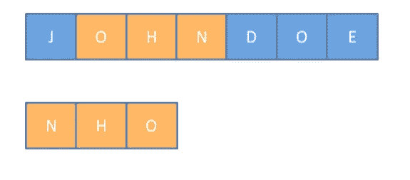
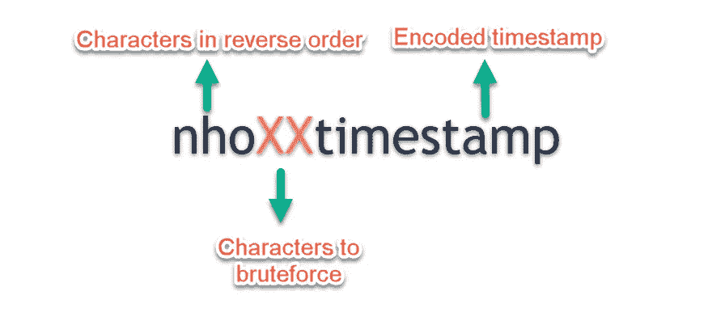
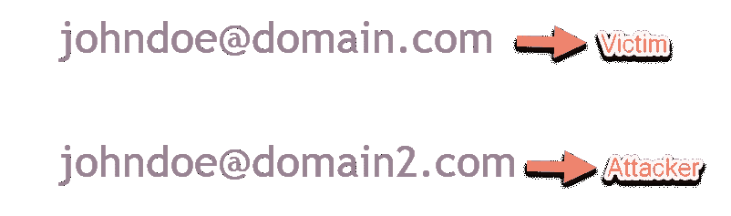
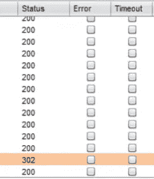

# 我如何发现一个有趣的帐户接管漏洞？

> 原文：<https://infosecwriteups.com/how-i-discovered-an-interesting-account-takeover-flaw-18a7fb1e5359?source=collection_archive---------0----------------------->

大家好，今天我将谈论一个有趣的帐户接管缺陷，这是我大约一年前发现的。此问题的根本原因在于生成密码重置令牌的算法。

让我们把这个应用程序看作是**program.com**

像网络上的其他应用程序一样，这个程序也有一个忘记密码的功能。我真的忘记了我的帐户的密码，并要求重置链接，奇怪的是，我注意到，每次我为这个帐户请求重置链接，令牌的前 3 个字符总是保持不变。这引起了我的注意，我开始挖掘。

```
https://program.com/forgot_password/<TOKEN-HERE>
```

几分钟后，我意识到这三个字符是我的电子邮件的第四封信到第二封信的倒序。例如，假设你有一个电子邮件地址 johndoe@domain.com，你要求一个密码重置链接。该帐户令牌的前 3 个字符将始终是“nho”(没有引号)，应用程序所做的是，它选择电子邮件的第四个字母(n)并以相反的顺序遍历到第二个字母(o)



发现这一点后，我想既然 token 的前 3 个字符不是随机的，那么剩下的字符可能也有意义。我用这个帐户和另一个测试帐户多次请求令牌，结果是，最后几个字符是时间戳。

现在唯一需要弄清楚的是“nho”和时间戳之间的两个字符的含义。我做了很多事情，试图分析所有令牌的模式，但一切都是徒劳的。我找不到那两个字的意思(也许它们是随机的？)



我想为什么不为这两个角色简单地使用暴力呢？幸运的是，这个应用程序没有速率限制。

我同时申请了两个相同的电子邮件地址(johndoe@domain.com 和 johndoe@domain2.com 的密码重置链接。由于我们同时发送了请求，并且电子邮件的用户名部分是相同的，因此发送到两个帐户的令牌将是相同的，除了这两个随机字符。



我检查了第二封邮件的收件箱，拦截了点击重置链接的请求。然后，我向打嗝的入侵者发出请求，并开始对这两个角色进行暴力攻击。在发送了一些请求后，我看到了 302 响应，这意味着我能够成功地找到第一个帐户的重置令牌，并最终可以接管该帐户。



它被标记为 P1/危急。我希望你喜欢这篇文章。

可以关注我 [@0xAkash](https://twitter.com/0xAkash)

*关注* [*Infosec 报道*](https://medium.com/bugbountywriteup) *获取更多此类精彩报道。*

[](https://medium.com/bugbountywriteup) [## 信息安全报道

### 收集了世界上最好的黑客的文章，主题从 bug 奖金和 CTF 到 vulnhub…

medium.com](https://medium.com/bugbountywriteup)