# 我是如何在 AWS 上发现数千个开放数据库的

> 原文：<https://infosecwriteups.com/how-i-discovered-thousands-of-open-databases-on-aws-764729aa7f32?source=collection_archive---------0----------------------->

我在尽职调查期间寻找和报告包含财富 500 强公司、医院、加密平台、初创公司等敏感数据的数据库的旅程。

***目录***

*   [*概述*](#e9d4)
*   [*背景*](#e257)
*   [*我的假设*](#ac13)
*   [*扫描*](#9ccc)
*   [*毕&自动化:从几千到几百*](#bfa8)
*   [*数据的例子我找到了*](#836b)
*   [*结论*](#776f)

# 概观

通过扫描托管服务的 [CIDR](https://en.wikipedia.org/wiki/Classless_Inter-Domain_Routing) 块(IP 范围),很容易找到云服务上配置错误的资产，因为它们是由托管服务知道并发布的。

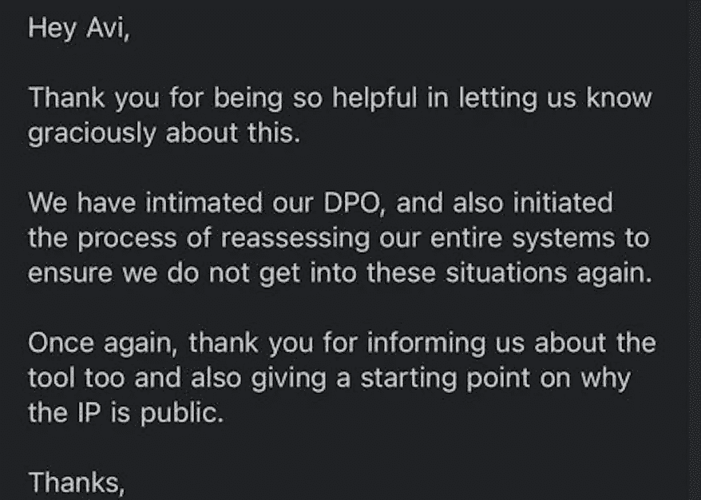

我举报的一家公司发来的邮件。

仅在一天之内，我就发现数千个 [ElasticSearch](https://www.elastic.co/) 数据库和 K [ibana](https://www.elastic.co/) 仪表盘暴露了敏感信息，很可能是误操作:

*   关于**客户的敏感信息** : **电子邮件、地址、当前职业、工资、私人钱包地址、位置、银行账户**以及其他敏感信息。
*   **生产** **日志**由 Kubernetes 集群编写——从应用程序日志到内核和系统日志。
    在一个地方，从所有节点、pod 和运行在其上的应用程序收集的日志对世界开放。我只是先到那里。
*   一些数据库已经被勒索软件破坏了。

我发现一家公司妥协了，为这些公司提供服务。图片取自他们的网站。

# 背景

那里一定有大量的资产，在他们的范围之外监听，等待被发现。
已发布的 [CIDR](https://en.wikipedia.org/wiki/Classless_Inter-Domain_Routing) 屏蔽让攻击者更容易找到这些资产，传播所有类型的恶意软件，或者接触真实公司的敏感数据。

开发人员、开发人员和 IT 从业人员通常会错误配置以下一些内容:

*   将套接字绑定在错误的网络接口上。
    例如，侦听来自 0.0.0.0/*的连接—因此它对所有网络接口可见，而不仅仅是内网接口 IP 地址(172.x.x.x)
*   群集的安全组配置错误(允许来自 broad [的所有 TCP 和所有 UDP，CIDR 阻止](https://en.wikipedia.org/wiki/Classless_Inter-Domain_Routing))。
*   有时，安全组被不知道后果的其他人改变了。
*   使用默认网络或子网，派生子网设置，并静默分配公共 IPv4 地址。

# 假设

我假设**我可以很容易地找到错误配置的资产，**主要是由于人为错误**如果我将扫描特定的******块从云运营商(一个实例/ VPS)内部。****

****关键是要聪明地扫描**，利用预先知道的网络基础设施(已知的[CIDR](https://en.wikipedia.org/wiki/Classless_Inter-Domain_Routing)-我们喜欢扫描的软件的块)来找到我能到达的活动服务器。**

**如果你稍微搜索一下，你可以找到每个云提供商的相关 [CIDR 区块。](https://docs.aws.amazon.com/general/latest/gr/aws-ip-ranges.html)
假设我是一名 IT 技术人员或安全工程师，需要允许来自特定云服务的连接，比如 [WS 的弹性容器服务(ECS)](https://aws.amazon.com/ecs/) 。这可以通过将服务的 CIDR 块添加到安全组规则来实现，允许来自这些 [CIDR](https://en.wikipedia.org/wiki/Classless_Inter-Domain_Routing) 块的连接。**

**所有的云提供商都会公布他们的服务列表，以及每项服务的 [CIDR](https://en.wikipedia.org/wiki/Classless_Inter-Domain_Routing) 块(IP 地址范围)。**

 **[## AWS IP 地址范围

### 亚马逊网络服务(AWS)以 JSON 格式发布其当前的 IP 地址范围。要查看当前范围，请下载…

docs.aws.amazon.com](https://docs.aws.amazon.com/general/latest/gr/aws-ip-ranges.html)** 

**从 AWS 获得弹性搜索服务的 CIDR 块**

**一些 [CIDR](https://en.wikipedia.org/wiki/Classless_Inter-Domain_Routing) 区块的 [**只能从云提供商**](https://en.wikipedia.org/wiki/Private_network) 内部访问。您所要做的就是在您想要扫描的云提供商内部启动一个具有互联网连接的 VPS /实例。**

## **找到他们需要什么？**

*   **对网络、IP 堆栈和路由以及云基础设施有基本的了解。**
*   **一个轻量级的端口扫描工具(比如 [**MasScan**](https://github.com/robertdavidgraham/masscan) ，或者 [NMap](https://nmap.org/)**
*   **要扫描的 [CIDR 阻塞](https://docs.aws.amazon.com/general/latest/gr/aws-ip-ranges.html)列表(托管服务，如 [Kubernetes](https://kubernetes.io/) 或 [ElasticSearch](https://www.elastic.co/) )以及在这些 IP 范围内的实例上最有可能打开的端口。**
*   **一个可视化我们收集的所有数据的工具(比如[elastic search](https://www.elastic.co/)+[Kibana](https://www.elastic.co/what-is/kibana)**

# **端口扫描—收集关于资产的数据**

**我已经使用 [**MasScan**](https://github.com/robertdavidgraham/masscan) 扫描我选择的 CIDR 模块上的开放端口。MasScan 是一个 TCP 端口扫描器，它异步地抛出 SYN 数据包。在正确的情况下，它可以在 5 分钟内扫描整个互联网。**

**输入是 CIDR 块(例如 *50.60.0.0/16 或 118.23.1.0/24)* 和我们想要扫描的端口(9200、5600、80、443 等)。).**

**我使用 Docker 映像在我的实例上启动了一个 **ELK** 堆栈。
我在同一台机器上启动 **MasScan** ，它开始扫描 CIDR 块。它使用 **LogStash** 将MasScan 的输出(响应日志)流式传输到 ElasticSearch，并通过 **Kibana** 可视化所有内容。
扫描期间，TCP 响应被记录并编入[弹性搜索](https://www.elastic.co/)中。**

**我让它运行了一会儿，很快我就扫描到了 337K **+ IP 和端口组合**。
许多都被打开了。
这是我的仪表盘的样子:**

**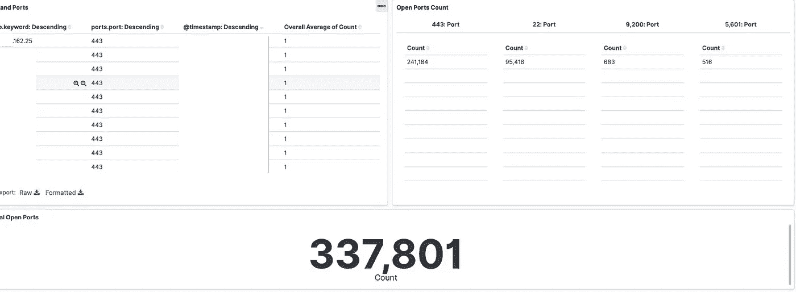**

**在几个小时内，AWS 的弹性搜索服务 CIDR 区块(客户群)的 337K 个开放端口。**

# **分析和可视化数据**

> **照片是经过审查的。
> 我已经向当事人和 AWS 报告了这些事件。我得到了他们的许可，可以继续写这篇文章。**
> 
> **大多数政党在一两天内解决了这个问题。他们中的一些人至今仍忽视这些报道。**

**感谢我创建的管道——我有实时日志，我可以立即开始查看服务，因为它会扫描更多。**

*   **我使用 Kibana 的 export 按钮将来自 Kibana 的资产导出到一个 CSV 文件中。然后我用熊猫(python)加载了它。**

****

*   **对于每个 IP，我发出一个 HTTP HEAD 请求，并得到一个带有资产指纹的 HTTP 响应。**

**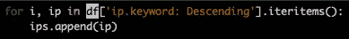****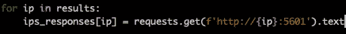**

*   **我排除了需要认证的响应。**

**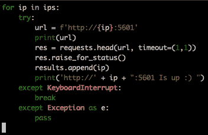**

*   **然后我从 HTTP 响应中打印出他们的网页标题。**

**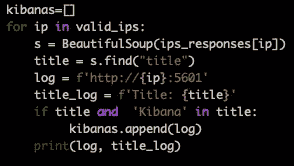**

**我们可以为 ElasticSearch port 或任何服务做同样的事情。IPs 已经被 MasScan 扫描过了，所以我想他们已经启动了。**

**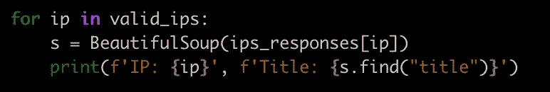**

**打印来自我找到的端点的响应的 HTML 文档的标题。也可以使用 nmap 的 HTTP 脚本来完成。**

**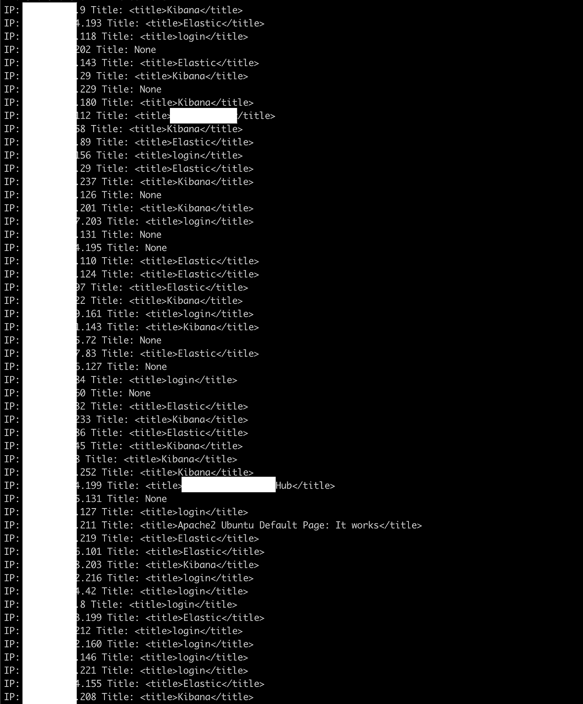**

**获取我认为相关的服务器名称**

**所以，现在我有了所有资产的列表，以及它们的网页名称。
我通过在导航栏中输入地址来浏览浏览器。**

**然后，我仔细研究了这些资产，一次一个。
我搜索了以下内容:**

*   *****/_ 别名*****
*   ****/*/<索引>/_ 搜索*/****

**这个 [ElasticSearch](https://www.elastic.co/) REST API 非常方便。很容易获得元数据、文档数以及您想了解的关于 ES 集群的所有信息。**

**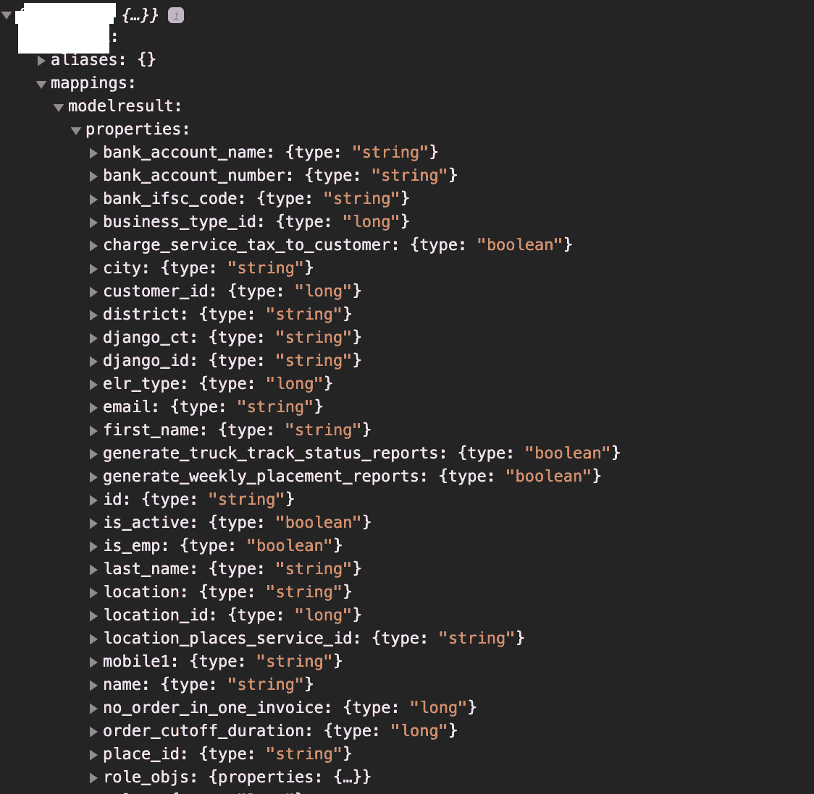**

**通过/_aliases REST 调用的弹性搜索指数摘要**

# **我找到的数据示例**

*   ****整个生产集群的 Kubernetes 日志**(通过日志收集器收集)**

**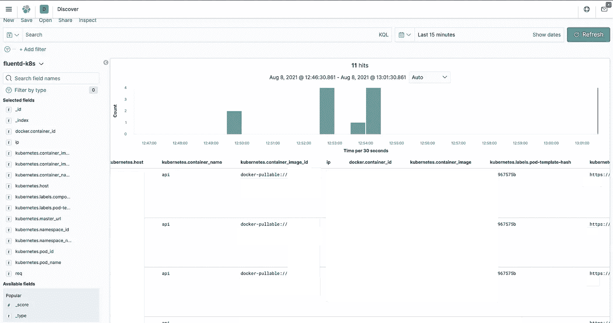**

**K8 集群日志，通过 fluentd 传输，带有实时 URL 和内核日志。**

**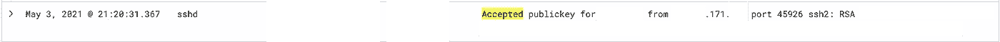**

**使用私钥成功登录 SSH**

****

**SSH 守护程序日志—集群的机器。实时日志。**

**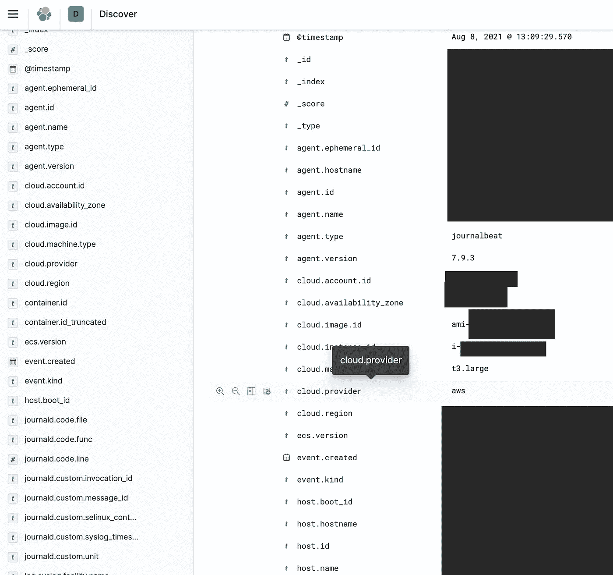**

**完全的云可见性——实例类型、AMI、帐户 ID 对全世界可见，这要归功于 K8 和 ElasticSearch 的错误配置集群**

*   ****私人仪表盘****

**一些公司已经将吉拉任务流式传输并发布到他们的弹性搜索仪表板上)——包括客户数据、代码示例、账户名称等。这个 Kibana 仪表板包含了公司 R&D 的所有信息。该公司正处于尽职调查过程的中期(或高峰期),在我报告这一事件后几周，他们就筹集了相当多的资金。如果被别人发现，这对他们来说可能是致命的。我已经报告了他们的副总裁，他们在同一天内解决了这个问题。**

*   ****医院/医疗用品-个人疫苗接种信息。****

**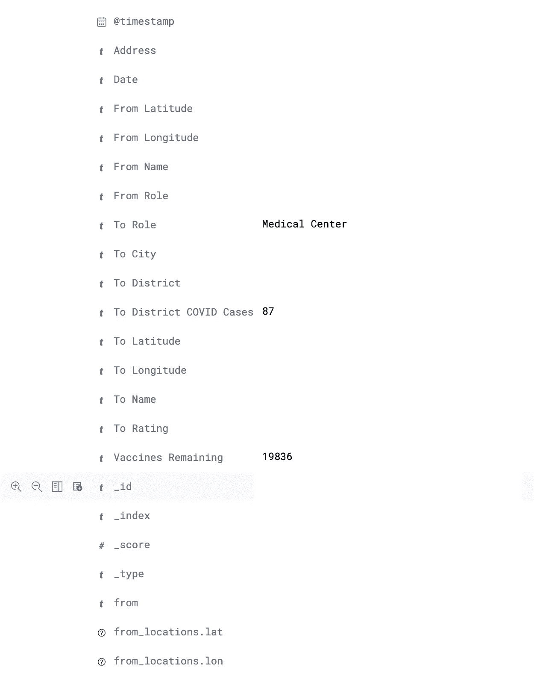****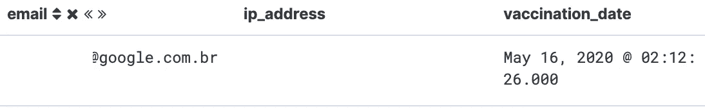**

**疫苗接种日期和电子邮件地址**

*   ****密码交易平台****

**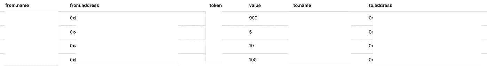**

**加密令牌交换**

*   ****银行业务** 银行转账连同全名和银行账户详情。**

**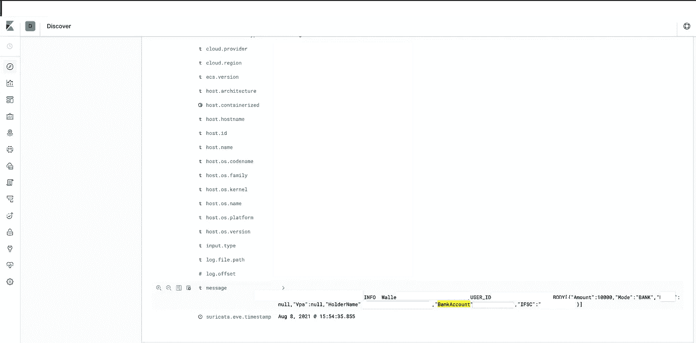**

**银行转帐连同全名和银行帐户细节。**

*   ****实时车队指标(关于每辆车):** - IMEI(唯一蜂窝标识符)
    -位置(坐标)
    -GSM _ 强度
    -燃料状态
    -错误代码
    -电池状态**

**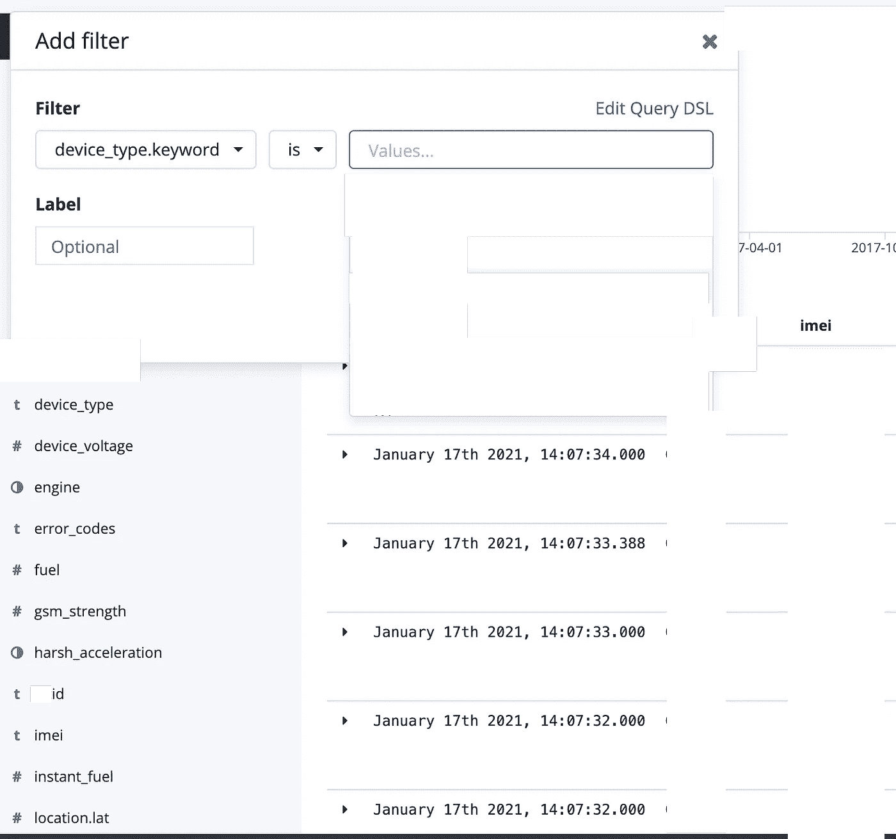**

# **是真的吗？**

**有时我很难理解数据库是真实的还是一个蜜罐。因此，我在数据库里搜索了我能找到的任何东西。
平时发现真实的网站，知道该这样举报谁。**

***弹性搜索中的文档:***

****

***制作网站中的文档，在线:***

**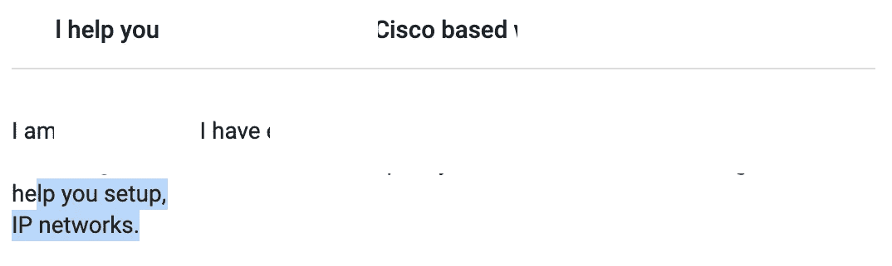**

## **已经被勒索软件入侵的服务器**

**如果你的集群是对外开放的，就没有必要 0 天运行勒索软件。除此之外，如果没有身份验证，任何人都可以访问任何内容。**

**如你所见，我发现的一些资产已经被勒索软件“黑”了(不是黑，更多的是畸形的。像 [elasticsearch-dump](https://github.com/elasticsearch-dump/elasticsearch-dump) 这样的工具可以用来备份(和恢复)数据库。备份后，他们删除了集群中的所有内容，留下了这样的消息:“*您的所有数据都是* ***备份的*** *备份的。你必须支付 0.16BTC 给…* "**

**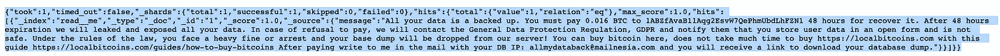**

# **安全和隐私政策**

**可以想象，我发现的许多组织都符合 GDPR 标准。这意味着他们对数据泄露非常敏感，他们有一名 DPO(数据保护官)积极搜索和处理这类事件。**

**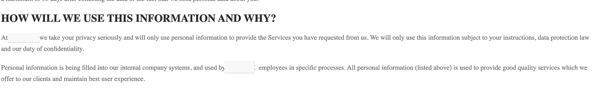**

**我读过的隐私政策的一个例子(寻找 DPO)**

**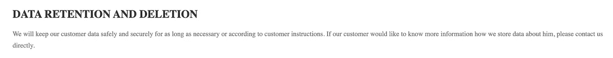**

**“如果您想知道您的数据是如何存储的，请联系我们”。**

**一些 DPO 没有回复，DPO 的一些邮箱拒绝了我的电子邮件，出现了权限错误(他们不允许接收公司以外的电子邮件)。**

**对于一些公司来说， **DMARC** 和 **SPF** 记录不允许他们的邮件服务器接收来自公司外部的电子邮件。真是一团糟，根本无法通过电子邮件联系到他们。**

**我也给双胞胎公司和其他子公司发了邮件。我试图通过他们网站上的联系表格联系他们。
没有任何反应。我必须通过首席执行官、首席技术官和副总裁展开对话。**

**至于忽略的公司——他们的资产和数据暴露至今，他们也不在乎。**

# **结论**

**当涉及到端口扫描时，发布每个服务的 CIDR 块是一个逻辑问题。我们出于许多原因需要它，但同时它也给云提供商带来了巨大的风险，使他们的客户可以轻松地扫描。**

**错误配置时有发生，而且一直存在，在不知不觉中给公司的安全造成了许多漏洞。在配置实例时，我们经常使用默认的 VPC 子网。因此，许多实例会自动分配一个公共 IP 地址。
问题始于缺乏可见性。
据我所知，AWS 内部目前没有人主动搜索错误配置的数据库或托管服务。这超出了他们的范围。**

****我把找到的公司**都报了，一直到一定限度(太多了)**我一个人都联系不到**。
在与 **AWS 的电子邮件对话中，**他们声称配置和保护他们的资产是公司的责任，他们不会主动搜索这种错误配置。这很有道理，但是我发现这出奇的简单，他们可以毫不费力地解决它。我利用业余时间独立完成了这项工作，做得相当不错。**

**点击此处了解更多关于 AWS 共享责任模式的信息。**

**目前，我们所能做的就是假设错误的配置总是可能的，不管公司的规模有多大——并且有人总是从网络上看到你。如果你向全世界开放一个服务，至少**使用体面的授权和认证**。**

**对了，我在业余时间做这个。我也非常喜欢咖啡！**

** [## Avi 在业余时间让互联网变得更安全

### 我是一个业务型的工程师，热爱安全和 AI，有很深的安全见解。我喜欢 pwn 云…

www.buymeacoffee.com](https://www.buymeacoffee.com/avilum) 

谢谢你读到这里。

如果你喜欢我的作品，或者你提供了一个臭虫奖励计划，请告诉我。如有任何问题，欢迎联系我或发表评论。

查看我以前的版本:

 [## 10 分钟后谷歌钓鱼的概念验证:ɢoogletranslate.com

### 回到 2016 年，我看到一篇关于有人购买ɢoogle.com 的帖子。它被用于网络钓鱼建议(注意第一个…

infosecwriteups.com](/poc-for-google-phishing-in-10-minutes-ɢoogletranslate-com-dcd0d2c32d91)  [## 脸书知道你吃什么:一步一步地发现脸书收集的关于你的全部数据。

### 一个我如何通过编程探索 https://facebook.com/dyi 的故事。

medium.com](https://medium.com/digital-diplomacy/facebook-knows-what-you-eat-how-to-visualize-all-the-data-facebook-knows-about-us-c89fe3cb4f89)  [## 通过客户端端口扫描识别网站用户—使用 WebAssembly And Go

### 网站倾向于从浏览器扫描其用户的开放端口，以更好地识别新用户/回头客。可以…

infosecwriteups.com](/identify-website-users-by-client-port-scanning-using-webassembly-and-go-e9798b4aa05c) 

🔈 🔈Infosec Writeups 正在组织其首次虚拟会议和网络活动。如果你对信息安全感兴趣，这是最酷的地方，有 16 个令人难以置信的演讲者和 10 多个小时充满力量的讨论会议。 [**查看更多详情并在此注册。**](https://iwcon.live/)

 [## IWCon2022 - Infosec 书面报告虚拟会议

### 与世界上最优秀的信息安全专家建立联系。了解网络安全专家如何取得成功。将新技能添加到您的…

iwcon.live](https://iwcon.live/)**