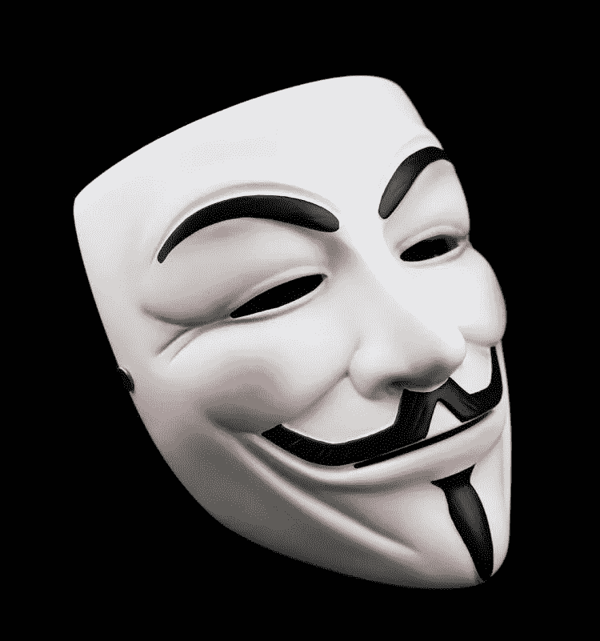
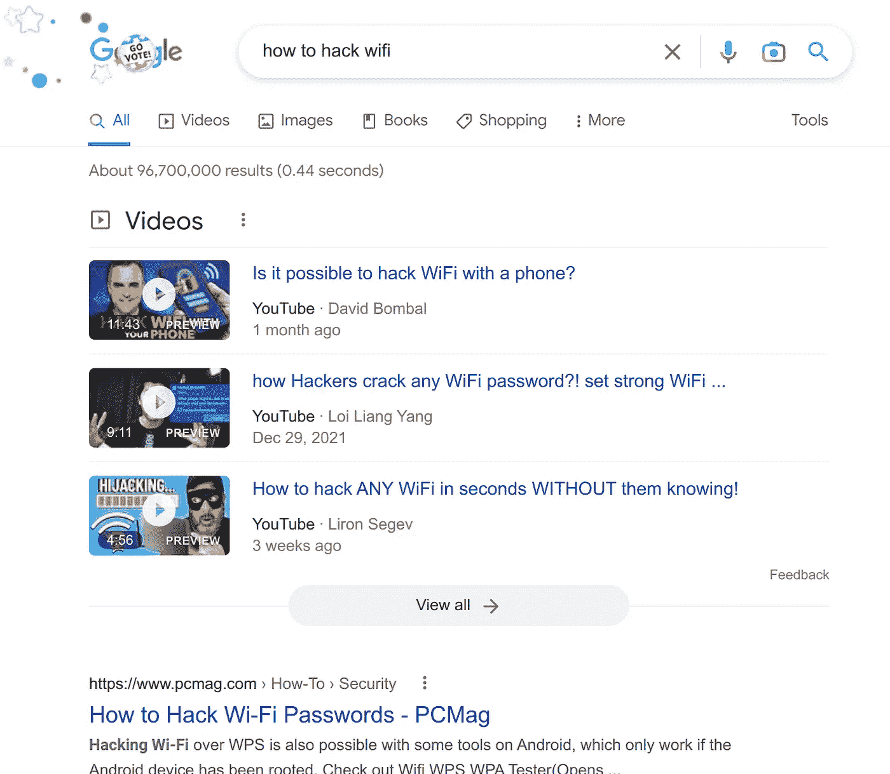
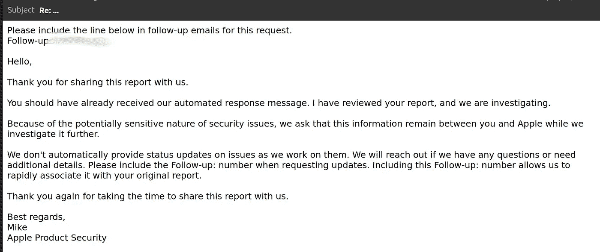
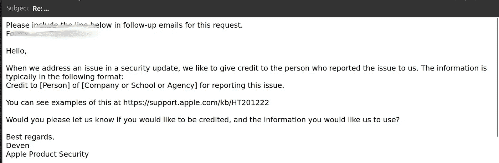
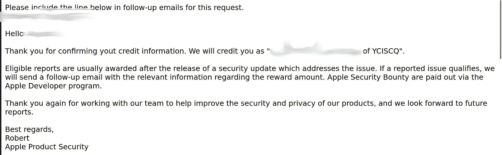
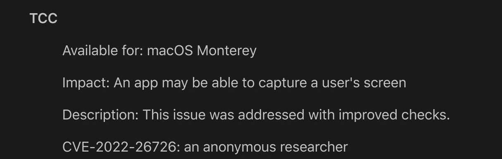
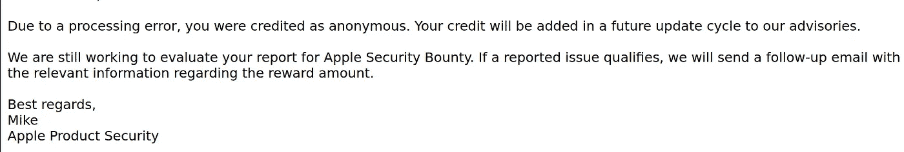
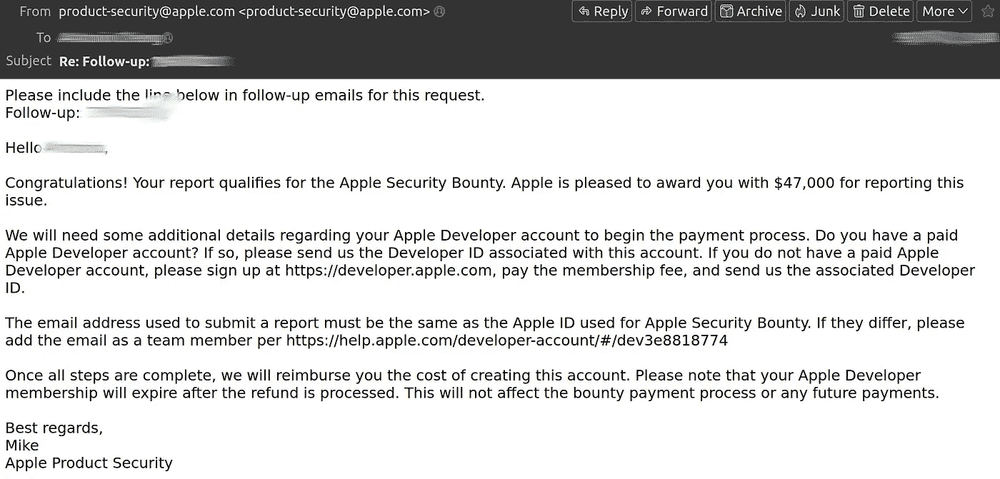
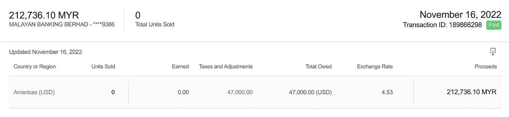
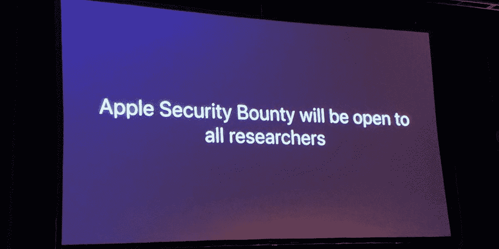

# 作为一名高中生，我是如何赚到 47000 美元的

> 原文：<https://infosecwriteups.com/how-i-earned-47000-usd-as-a-high-school-student-a9a68896b3a3?source=collection_archive---------0----------------------->

无视我蹩脚的英语。这不是我的第一语言。

# 无聊背景(我的人生故事)

Chū nibyō:日本口语术语，指有夸大妄想的青少年。*也是一部伟大的动漫。*

我就是其中之一，幻想着成为一名“黑客”，穿着黑色帽衫，戴着盖伊·福克斯的面具。电影中的天才反派。

我在谷歌上找到的随机图片

然而，尽管我有梦想，**我从来没有真正知道什么。我最多能做的就是检查 Chrome 中的元素，修改一些文本，或者在 Cookie Clicker 中获得无限的 Cookie。**

然后是 2020 年的祝福:这是中国的新年，我已经回到了马来西亚的家乡。就在我的家人预订返校航班时，疫情来袭。航班被取消，我们被封锁了。整整 6 个月，我都被困在室内。

无聊到极点，我开始学习“黑客技术”。我不会写代码，我的网络也是垃圾，但除此之外还能做什么呢？

用一台旧 Macbook 和谷歌，我开始搜索:

我从无线网络开始:破解 WPA、嗅探数据包和使用 ettercap 的 MITM。为什么？因为我有糟糕的网络，想向邻居“借”网络。嗯，我失败了。他们有很强的密码什么的。

我的第一次谷歌搜索(重演)

研究进行了几周后，我才刚刚接触到虚拟机和 ParrotOS(我直到很久以后才知道 Kali Linux)。

然后，开学了。当我被困在国外的时候，我的学校已经开放了，很快，电子学习成为了一种规范，而我的其他同学已经在那里了。国界关闭了，我回不去了。

由于远离任何影响，我放松了下来，专注于学习“黑客”而不是学术。正是在这段时间里，我从一个全优学生变成了在 IGCSE 模拟考试中获得 1%的数学成绩(时间在这里略过。失败是在 2021 年的某个时候)。

尽管我的成绩很糟糕，但我还是取得了进步。曾经只是错觉的东西变成了现实。我开始习惯使用 Metasploit，并且刚刚完成了我的第一个编码项目，一个用 Python 套接字编写的简单反向 shell。一个月后，我写了一个 PHP 网站，可以从任何地址发送假邮件(已修补和失效)。

就在我达到“脚本小子”的水平时，旅行限制取消了，我开始忙于学校的工作。虽然我偶尔会用来自中情局的电子邮件来捉弄老师，但我并没有学到什么新东西。

# 发现漏洞

2021 年 8 月:IGCSE 结束了，又是一个假期。我不记得确切的原因，但我在玩一个新工具，我发现了蛋壳(一只老鼠)的名字。蛋壳的外壳有一个错误:做^c (control+c)偶尔会终止一个冻结的远程进程或杀死外壳本身。然而，如果我足够快地重新运行 shell，连接将会持续。(我后来发现了这个漏洞，但这无关紧要)

奇怪的是，当我在重新连接后试图拍摄远程截图时，我能够立即检索图像，似乎没有提示许可。然而，我无法始终如一地复制这一点

2021 年 12 月:又一个假期。这次是圣诞节。我已经厌倦了蛋壳的不一致性，又开始使用 Meterpreter。这一次，我试图在戏弄一个朋友时保持独立(我知道这是违法的。请不要逮捕我。我是哑巴)并' rm -rf '了丢弃的木马可执行文件。然而，我可以在未经许可的情况下截图…而且是可复制的。在注意到我发现了一个真正的漏洞后，我立即谷歌了一下我如何为此赚钱。

# 苹果过山车

你猜怎么着？苹果有一个慷慨的 bug 赏金系统。基于他们的例子，我被设定为 50，000 美元！！！

我没有告诉任何人，我以前曾让家人失望过。我激动得心都要跳出嗓子眼了，但我保持沉默。

我写了一份低质量的报告，然后把它发给了苹果公司。

一个月过去了:没有回应。

我学了 Objective-C，写了一个一键 POC。再次发送给苹果。

一个月过去了。一个回应。

他们给我的邮件

我的心脏差点爆炸

一个月过去了

没有更多的细节。我要求更新的请求没有得到答复。我失去了希望。

两个月过去了

我放弃了网络安全作为我的职业道路。还不如做个普通的程序员。

一个月过去了

第二封电子邮件

我又一次拒绝了。也许它没有被遗忘。我回答道。

确认

我通知了父母。也许真的会发生一次…

匿名？他妈的…

我没有被记入贷方。我不知道为什么。

你在开玩笑吗？

收到这封邮件已经六个月了。学分还没给。

我删除了所有与“黑客攻击”相关的内容。我的梦想不复存在了。

六个月过去了。

我得奖了？

我遵循了提供的流程。由于我的未成年身份，这很麻烦，但在我父母的帮助下，我获得了这个奖。银行里有 47000 美元。

还是没有信用。

# 后果

什么都没变。我已经放弃了网络安全和我年轻的 Chū nibyō错觉。我将支付我大学第一年的学费。否则我父母会付钱的。没有区别。

# 教训？

我不知道。

我讨厌苹果反应慢。但我从中赚了钱。我有什么资格抱怨呢？

感谢你阅读这篇慷慨激昂的文章。我在拖延，不想做我的传记。

预览图像，这样看起来更好

## 来自 Infosec 的报道:Infosec 每天都有很多内容，很难跟上。[加入我们的每周简讯](https://weekly.infosecwriteups.com/)以 5 篇文章、4 条线索、3 个视频、2 个 GitHub Repos 和工具以及 1 个工作提醒的形式免费获取所有最新的 Infosec 趋势！