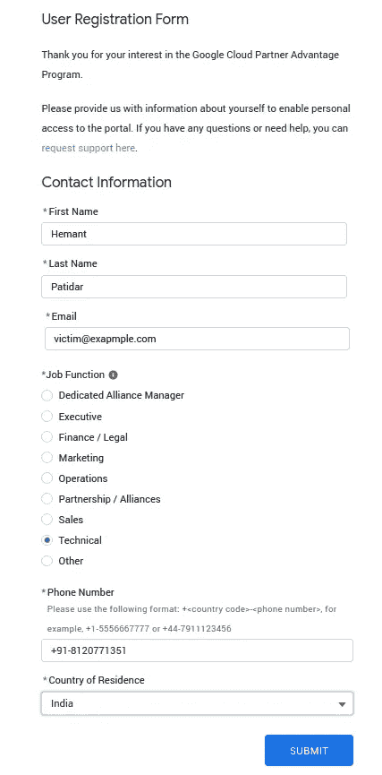
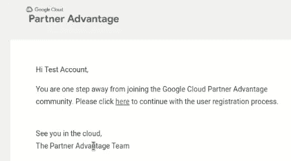
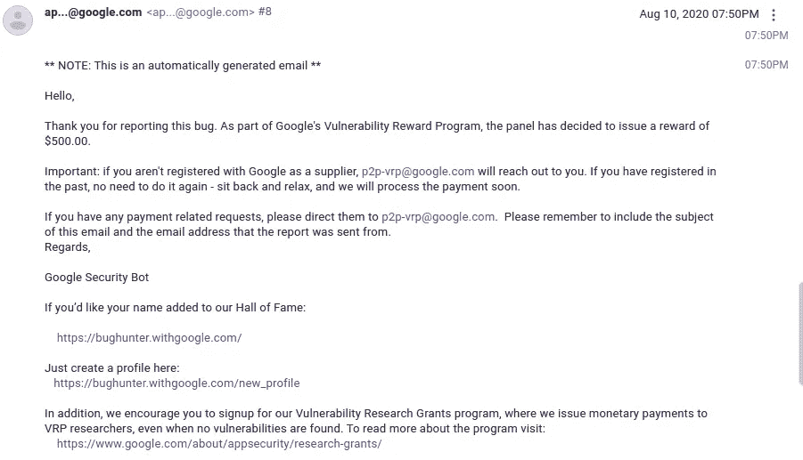
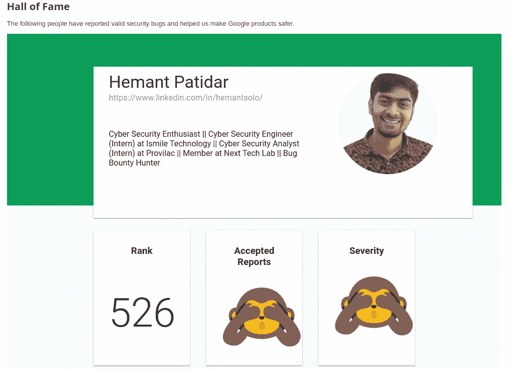

# 我如何从谷歌赚了 500 美元-认证的缺陷

> 原文：<https://infosecwriteups.com/how-i-earned-500-from-google-flaw-in-authentication-a40018c05616?source=collection_archive---------1----------------------->

# **大家好！**

这是我的第一篇文章。

今天，我将分享我在谷歌第一次被接受的 bug 的记录，这是在“**谷歌云合作伙伴优势门户**”中，我能够通过中断的身份验证修改受害者帐户的个人信息。

# “被破坏的认证”是什么意思？

如果您的应用程序的登录功能可以以某种方式被破坏或绕过，这就是所谓的破坏身份验证。这是一个非常常见的问题，以至于身份认证被列入了开放 web 应用程序安全项目(OWASP)的十大 Web 应用程序漏洞列表。

# 让我们从**开始**...

让我们直奔主题吧。当我试图使用用户注册表单进行注册时，我注意到**当有人进行注册时，系统不会验证注册的电子邮件**。此外，当我们这样做时，用户将收到一封验证电子邮件进行验证，如果受害者点击验证，那么新的详细信息将被更新到受害者帐户中。

**摘要:**安全可配置性不足|认证中的缺陷

## **复制步骤:**

1.  转到[https://www.partneradvantage.goog/](https://www.partneradvantage.goog/)并点击[注册为新的合作伙伴门户用户](https://www.partneradvantage.goog/GCPPRM/s/partnerselfregistration?language=en_US)。
2.  现在填写所有细节。(即**已经注册的受害者电子邮件**以及你想在受害者账户中更新的其他详细信息。)并点击**提交**。

3.现在，受害者将收到一封电子邮件进行验证，如果他点击验证，那么上面输入的详细信息将在受害者帐户中发生变化。

4.**轰！**您已经更改了其他人账户的详细信息。

## **攻击场景:**

当其他人输入注册的电子邮件时，系统不会对其进行验证。考虑一下如果数据可以被修改并且假设控制了帐户，那么业务会受到什么影响，除此之外，攻击者可以在原始帐户所有者进入系统之前先填写数据。

**时间线:**

> 2020 年 7 月 20 日*——向谷歌报告的错误*
> 
> 2020 年 7 月 21 日 *-状态更改为无法修复(不可重现)|解释了如何重现错误和影响*
> 
> 2020 年 8 月 3 日*——接受(重新开放)❤*
> 
> 2020 年 8 月 10 日 *-奖励 500 美元*

这是我从谷歌得到的第一笔奖金。我报道了其他小问题，并获得名人堂。

**感谢阅读:)**

快乐黑客；)

你可以看到许多文章即将发表…

> 赫曼特·帕蒂达尔
> 
> 领英:【linkedin.com/in/HemantSolo 
> 
> 网址:- [hemantpatidar.me](http://hemantpatidar.me/)
> 
> 推特:-[twitter.com/HemantSolo](https://twitter.com/HemantSolo)
> 
> insta gram:-[instagram.com/hemant_solo](https://www.instagram.com/hemant_solo/)