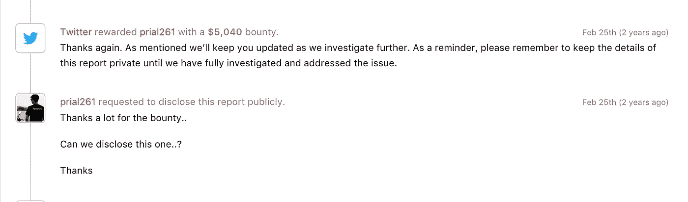

# 我是如何通过展示一种获取其他用户 IP 地址的方法从 Twitter 上赚到 5040 美元的

> 原文：<https://infosecwriteups.com/how-i-earned-5040-from-twitter-by-showing-a-way-to-harvest-other-users-ip-address-e9f43c931e9a?source=collection_archive---------0----------------------->

嗨伙计们，

这位是来自孟加拉国的安全研究员 [**Prial Islam**](https://www.facebook.com/prial261) 。这是我的一个老发现，添加到我的博客中。最近，我披露了一个 **POC** ，关于我如何能够获得所有 vine 用户的敏感信息，包括**电话号码/ IP 地址/电子邮件**以及更多被报告给 twitter 的信息，他们修补了它并奖励了我 **7560 美元**。那些错过了它的人，你可以在这里得到最初的[报告。](https://hackerone.com/reports/202823)

今天，我将披露另一个信息泄露漏洞，这是我在 Hackerone 的 [Bug Bounty 计划中向 Twitter 安全团队报告的，他们奖励了我一笔 **5040 美元**的金额，以换取](https://hackerone.com/twitter)[这份报告](https://hackerone.com/reports/201300)。

当我测试 vine API 端点时，我注意到在 Vine **Repost** 机制中使用的一个端点有一个名为“ **ipAddress** 的参数，该参数带有一些普通的数值，如:- 2130706433。我们都知道 Ip 地址看起来像:- 127.0.0.1。但是**“IP address”**的值看起来无效。然后，当我试图在谷歌上搜索它时，我知道这个值是有效的。实际上，它被转换为长/十进制格式的 IP 地址。所以我使用了在线转换工具，并能够获得真正的 Ip。([在线转换器我用了](https://www.smartconversion.com/unit_conversion/IP_Address_Converter.aspx))

**易受攻击的端点:**https://vine.co/api/timelines/users/<帖子 ID >

**重现:**

*   为了重现这个问题，受害者用户必须**转发**他时间线中的任何 vine，许多 vine 用户**转发**他们时间线中的许多 Vine 帖子。
*   因此，复制一个**转发的** Vine 帖子 ID，并将其放在端点中并访问它。**例子:**https://vine.co/api/timelines/users/1293308695089926144
*   现在，当我访问该链接时，我得到了如下回复(敏感内容已被 twitter 安全团队删除):-

```
“repost”: { “username”: “██████”, “verified”: 0, “vanityUrls”: [], “created”: “█████”, “repostId”: ████████, “avatarUrl”: “██████”, “userId”: ████, “user”: { “username”: “█████████”, “verified”: 0, “vanityUrls”: [], “avatarUrl”: “█████████”, “userId”: ████, “private”: 0, “location”: █████████ }, “flags|platform_lo”: 1, “postId”: ███, **“ipAddress”: 2130706433 ,** “flags|platform_hi”: 1 }
```

*   正如你所看到的, **ipAddress** 参数值现在被转换，只需使用我的 give online 工具再次将其转换为有效的 ip 地址值。

我在 1 月 26 日的**报告了这个问题，他们在 2 月 25 日**的**支付给我 **5040 美元**。**



$$$$ 👊

感谢阅读。狩猎愉快。