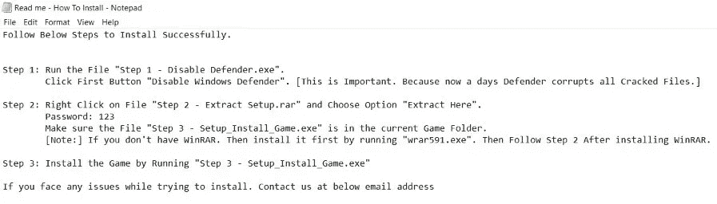
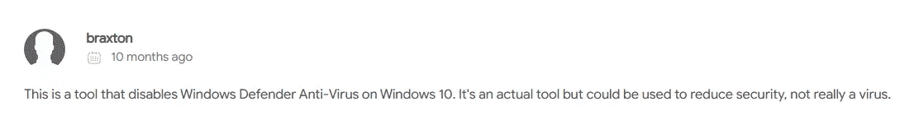
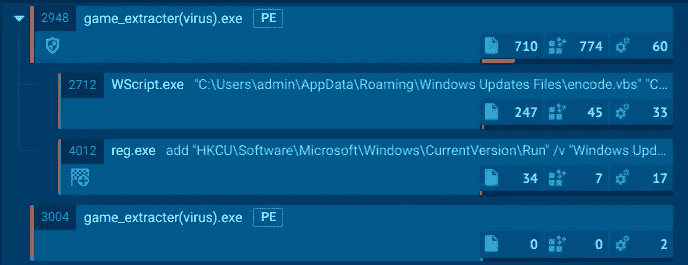
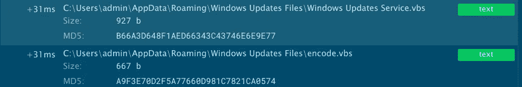
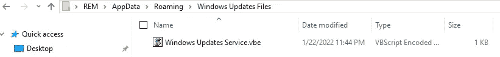
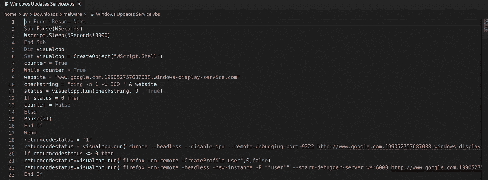
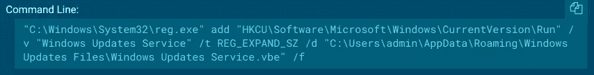

# 我是如何下载恶意软件的

> 原文：<https://infosecwriteups.com/how-i-ended-up-downloading-a-malware-c5aa93742ce4?source=collection_archive---------3----------------------->

大家好！！！这个周末我和弟弟无聊，决定玩个游戏，他就下载了游戏。精彩的部分来了:在他的电脑上解压游戏时，他发现了一些可疑的文件，并推测道:“也许是病毒，”所以我决定试一试。以下是提取游戏和恶意软件到你的电脑的步骤。

**第一步——禁用 Defender.exe:** 这不过是一个工具，用来在 windows 10 中禁用 windows defender。

如果你想知道更多关于这个软件的信息，你可以参考下面的链接。

 [## 防守队员控制

### Defender Control 是一个我们在各种入侵中遇到的免费软件工具。虽然我们还没有看到…

thedfirreport.com](https://thedfirreport.com/2020/12/13/defender-control/) 

**步骤 2 —提取 Setup.rar:** 根据文本文件中的说明，现在我们需要运行步骤 2。

第二步是一个密码保护的 rar 文件。

> **密码:123**

**步骤 3 — Setup_Install_Game.exe:** 在提取 rar 文件时，我们得到了步骤 3 的文件，这是一个 exe 文件。为了方便起见，我把名字改成了 **game_extracter(病毒)。exe** 。这是将提取游戏和恶意软件的文件。

让我们将这个示例上传到 any.run

从上面的图片中，我们可以看到恶意软件正在利用 wscript.exe 和 reg.exe 来完成一些任务。我们稍后会谈到这一点。但在此之前，让我们检查一下**游戏提取器(病毒)。exe** 稍微深入一点。

嗯…所以这个示例在这个位置创建了一个名为 **Windows Update Files** 的文件夹。

> **位置:C:\ Users \ admin \ Appdata \ Roaming \ Windows Update Files**

此外，它将两个文件放在这个位置。
1)Windows Update Service.vbs
2)encode.vbs
顾名思义 encode . VBS 会对 Windows Update service . VBS 进行编码，然后自己删除。

现在，在目标文件夹中，我们可以看到名为 Windows Update Service.vbe 的文件

> **是什么。vbe 文件？**
> VBS 脚本的编码形式是 vbe 脚本

现在我们有两个选择。我们可以对其进行解码，也可以在编码之前使用该文件(即 Windows Update Service.vbs)

> **注意:**如果你想解码文件，请使用下面链接中的程序。
> [https://github.com/JohnHammond/vbe-decoder](https://github.com/JohnHammond/vbe-decoder)

查看解码后的脚本，我们可以理解，它正在使用**“ping”**命令(在第 10 行)检查互联网连接。如果不存在，它将使用**“pause()”**功能等待一段时间，然后再次 using。

它还在端口 9222 上以无头模式打开 Chrome 进程，并导航到这个网站(在第 19 行)。

> [http://www . Google . com . 199052757687038 . windows-display-service . com/](http://www.google.com.199052757687038.windows-display-service.com/)

如果 Chrome 不存在，它会检查 Firefox 浏览器并重复相同的操作(第 21 & 22 行)。

另一方面，恶意软件打开**“reg . exe”**使用下面的命令修改注册表项。

该恶意软件修改的密钥是**“自动运行”**密钥。通常，威胁参与者使用此密钥来实现持久性。因此，将会发生什么意味着，每当受影响的用户启动到他的系统，这将自动启动和运行。

到达这个[网站](http://www.google.com.199052757687038.windows-display-service.com/)后，还不清楚这个恶意软件试图做什么。一些消息来源称**“当浏览器打开这个页面时，它将执行嵌入式 JavaScript，该 JavaScript 将启动浏览器内矿工脚本来挖掘加密货币”**。

还有一些其他消息来源称**“远程调试也** **允许观察用户活动和敏感的个人信息(又名监视用户)并从远程计算机控制浏览器”**。

**最终想法:**

小心你正在下载和安装在你的电脑上的东西。不要盲目相信盗版软件。

黑客快乐！！！

**样本:**

 [## 主 UVvirus/malware _ samples/game _ malware

### 在 GitHub 上创建一个帐户，为 UVvirus/malware_samples 的开发做贡献。

github.com](https://github.com/UVvirus/malware_samples/tree/main/game_malware) 

**参考文献:**

 [## 防守队员控制

### Defender Control 是一个我们在各种入侵中遇到的免费软件工具。虽然我们还没有看到…

thedfirreport.com](https://thedfirreport.com/2020/12/13/defender-control/)  [## 广告软件推出伪装成 Cloudflare 的浏览器内挖掘网站

### 一个广告软件捆绑包已经开始创建一个 Windows autorun 来自动启动 Chrome，这样它就可以连接到一个

www.bleepingcomputer.com](https://www.bleepingcomputer.com/news/security/adware-launches-in-browser-mining-sites-pretending-to-be-cloudflare/) 

# 🔈 🔈Infosec Writeups 正在组织其首次虚拟会议和网络活动。如果你对信息安全感兴趣，这是最酷的地方，有 16 个令人难以置信的演讲者和 10 多个小时充满力量的讨论会议。查看更多详情并在此注册。

 [## IWCon2022 - Infosec 书面报告虚拟会议

### 与世界上最优秀的信息安全专家建立联系。了解网络安全专家如何取得成功。将新技能添加到您的…

iwcon.live](https://iwcon.live/)