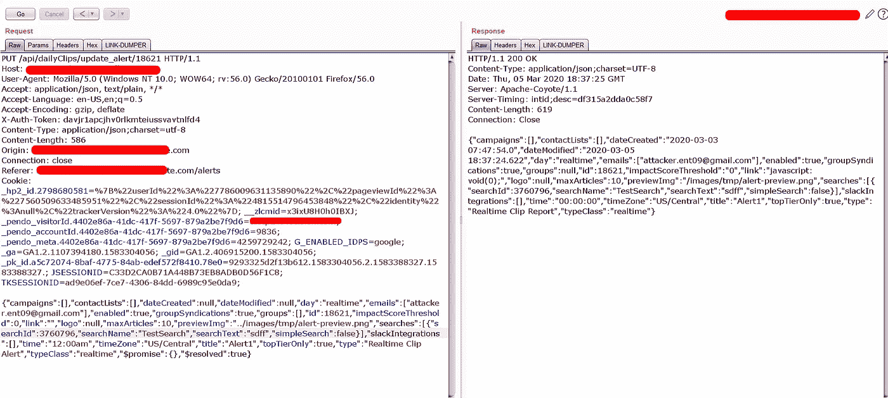
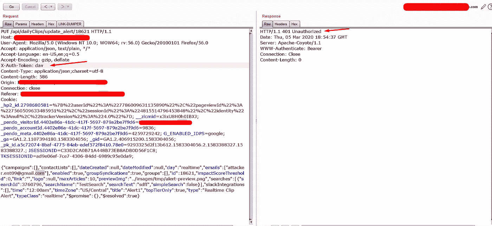
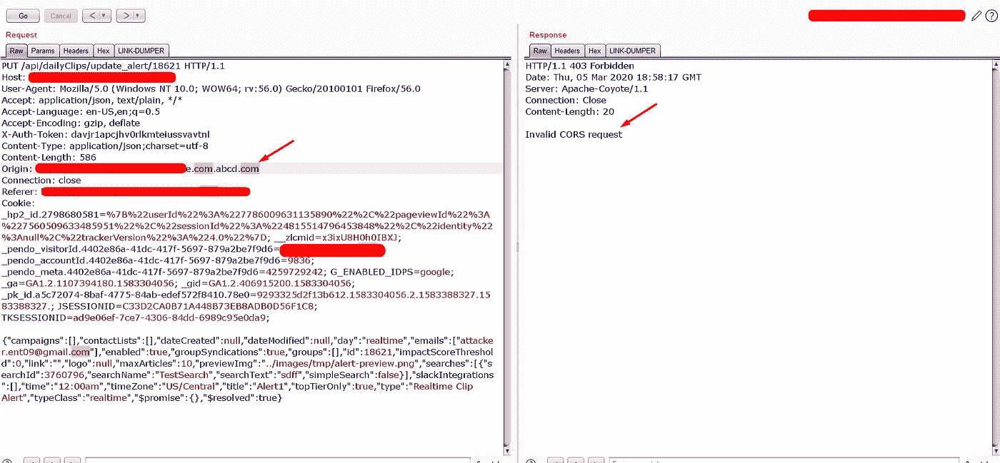
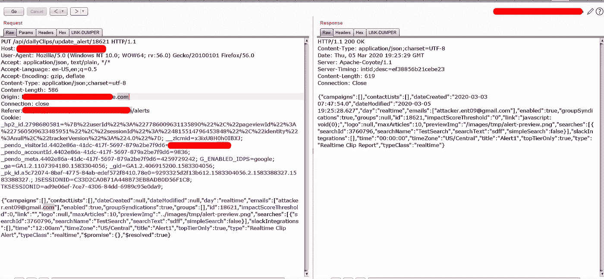
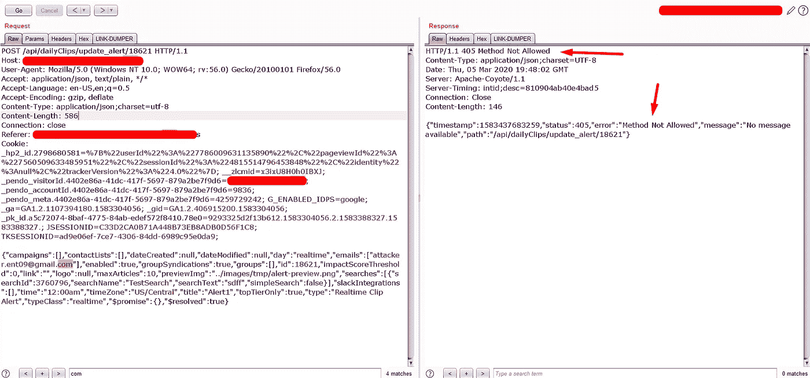
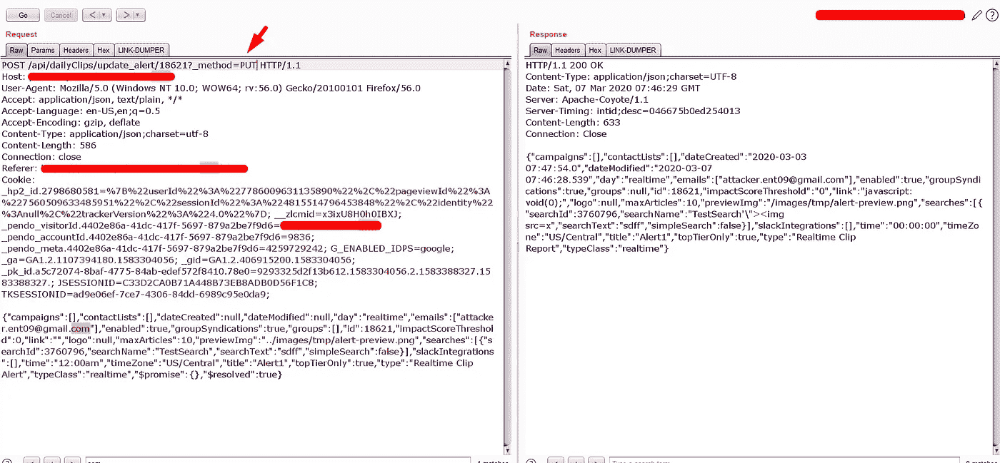

# 我如何利用方法覆盖技术开发 JSON CSRF

> 原文：<https://infosecwriteups.com/how-i-exploit-the-json-csrf-with-method-override-technique-71c0a9a7f3b0?source=collection_archive---------1----------------------->

# 简介——CSRF:

**CSRF(跨站请求伪造)**是一种 web 应用漏洞，利用这一点恶意用户可以在用户不知情的情况下伪造 HTTP 请求。这将导致 web 应用程序中出现严重的安全缺陷。

在这篇文章中，我将解释如何识别 JSON CSRF 漏洞，以及我在最近的一个项目中升级这个漏洞所面临的挑战。

一般来说，JSON CSRF 并不总是能够在每个使用 JSON 主体的 web 应用程序中实现。这主要取决于认证机制。为了识别这一点，我们必须确保 HTTP 请求满足以下条件。

1.  身份验证机制应该是基于 cookie 的模型。(默认情况下，基于 cookie 的身份验证容易受到 CSRF 攻击)
2.  HTTP 请求不应该在消息头和消息体中使用自定义的随机标记来增强。
3.  HTTP 请求不应该被 [**同源策略加强。**](https://www.netsparker.com/whitepaper-same-origin-policy/)

> “如果满足上述条件，我们可以通过简单地从另一个**源发出 Ajax 请求来直接伪造 JSON 请求。**”

**注:**这些是实现 JSON 中 CSRF 的首要条件。但是有可能利用 **JSON CSRF** 即使**第二点和第三点**不满足。

# 我在最近的 Bug Bounty 中利用 JSON CSRF 所面临的挑战:

## **观察:**

每当我测试 web 应用程序时，我都会仔细观察应用程序的身份验证机制。如果这是基于 cookie 的认证，那么我直接寻找 CSRF 漏洞。

如上所述，第一点满足了以下要求。但是第二个和第三个不满意。请求通过由' **X-Auth-Token** '标头指定的自定义令牌得到加强，并且还验证了[来源](https://www.netsparker.com/whitepaper-same-origin-policy/)标头。请仔细观察下面的图片。

一般来说，我会在推特上关注 **bug 赏金提示**。因此，我有一些其他的测试案例来检查请求的强化机制。

这些提示是:

*   将请求方法更改为 GET append body 作为查询参数。
*   在没有**定制令牌和报头的情况下测试请求。**
*   用完全相同的长度但不同的令牌测试请求。

> 幸运的是，第二个建议对我有效:)

应用程序正在接受请求，但请求中没有“X-Auth-Token:”标头。

授权令牌验证

即使应用程序有**令牌头验证**缺陷。我们不能利用这个漏洞，因为请求在 **PUT 方法**中，并且服务器验证了请求中的 **Origin 报头**。

> “如果服务器接受另一个源头，我们可以用另一个源的 PUT 方法用 JSON 主体发出一个 Ajax 请求。”

***现在我们要寻找另一个漏洞来利用这个漏洞*** *。*

经过一些分析，我得到了下面的问题

1.  如果我将此作为 POST 请求而不使用 **Origin 头，会发生什么情况。？**

过帐方法检查

服务器不允许使用 **POST** 方法。

他妈的…

没问题，有一种技术可以通过**方法覆盖函数来观察服务器的行为。**

> 雅虎！服务器接受了方法覆盖功能

现在是时候为 POC 创建**漏洞脚本了**

csrfjson html 脚本

**结论:**

发生这种情况是因为 anti-csrf 令牌的验证不佳，并且内容类型报头的验证也不佳。所以要确保测试人员在测试的时候不会遗漏任何一个测试用例。理解 CORS 的基础知识，学习不同的滥用浏览器行为的覆盖技术。

感谢阅读。如果你喜欢这篇**文章**，请关注我，关注更多**黑客技术。**

寻求支持